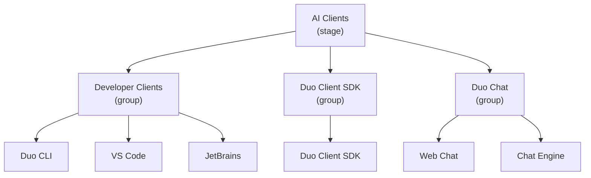

## 🚀 Mission

The AI Clients stage owns the surfaces where customers experience GitLab Duo. We bring GitLab's AI capabilities directly into the tools customers already use — their IDE, terminal, and the GitLab web interface — and we provide the shared client SDK that powers those experiences across platforms.

---

## Organizational Structure

The AI Clients stage is organised into three groups, each with functional teams:

| Group | Engineering Manager | Product Manager | UX | Functional Teams |
|---|---|---|---|---|
| [Developer Clients](developer-clients/) | Amr Elhusseiny | James Casey | Yi-Ann Chen | Duo CLI, VS Code, JetBrains |
| [Duo Client SDK](duo-client-sdk/) | Donald Cook | James Casey | Yi-Ann Chen | Duo Client SDK |
| [Duo Chat](duo-chat/) | Donald Cook | Dasha Adushkina | Nick Leonard | Web Chat, Chat Engine |

---

## 👥 Leadership

| Person | Role |
|---|---|
|  | Engineering Manager — AI Clients Stage (Duo Client SDK & Duo Chat) |
| ↳  | Engineering Manager — Developer Clients |

---

## 🤝 Stable Counterparts

The following people are [stable counterparts](/handbook/leadership/#stable-counterparts) of the AI Clients stage:



---

## Groups

### Developer Clients

Owns the editor extension integrations and the Duo CLI. See the [Developer Clients group page](developer-clients/). Functional teams:

- [Duo CLI](developer-clients/duo-cli/)
- [VS Code](developer-clients/vscode/)
- [JetBrains](developer-clients/jetbrains/)

### Duo Client SDK

Owns the shared language server and client SDK that powers AI features across all editor extensions. See the [Duo Client SDK group page](duo-client-sdk/). Functional teams:

- [Duo Client SDK](duo-client-sdk/duo-client-sdk/)

### Duo Chat

Owns the Duo Chat experience across all surfaces. See the [Duo Chat group page](duo-chat/). Functional teams:

- [Web Chat](duo-chat/web-chat/)
- [Chat Engine](duo-chat/chat-engine/)

---

## 🏷️ How we label issues and merge requests

Labels power triage-ops automation, reporting, and Technical Writing planning. Every issue and MR should carry `section::ai`, exactly one stage label (`devops::*`), exactly one group label (`group::*`), and the relevant category label(s) — use the combinations below as the default:

| Area | Labels |
|---|---|
| Duo CLI (terminal client) | `section::ai`, `devops::ai clients`, `group::developer clients`, `category: duo cli` |
| VS Code extension | `section::ai`, `devops::ai clients`, `group::developer clients`, `category: vs code` |
| JetBrains plugin | `section::ai`, `devops::ai clients`, `group::developer clients`, `category: jetbrains` |
| Duo Client SDK / Language Server | `section::ai`, `devops::ai clients`, `group::duo client sdk`, `category: duo client sdk` |
| Duo Chat (UI and in-GitLab chat experiences) | `section::ai`, `devops::ai clients`, `group::duo chat`, `category: web chat` |
| Duo Chat (backend / chat-engine capability work) | `section::ai`, `devops::ai clients`, `group::duo chat`, `category: chat engine` |
| Duo Developer (end-to-end flow, Agent Foundations) | `section::ai`, `devops::agent foundations`, `group::agent developer`, `category: duo developer` |
| Flow Components (reusable flow / orchestration components) | `section::ai`, `devops::agent foundations`, `group::agent developer`, `category: flow components` |

If a change genuinely spans multiple product areas, attach multiple category labels but keep the stage and group labels aligned to the primary owner.

Legacy `Editor Extensions::*` labels are not part of this taxonomy — don't rely on them as ownership signals, and remove them from templates over time.

---

## 💬 Where to find us

### Slack

We follow the [GitLab Slack channel prefix conventions](/handbook/communication/chat/#channel-categories): `s_` for the cross-team stage channel, `f_` for functional-team channels.

| Channel | Purpose |
|---|---|
| [`#s_ai-clients-questions`](https://gitlab.enterprise.slack.com/archives/C058YCHP17C) | Public-facing AI Clients stage channel for questions and outreach |
| [`#s_ai-clients`](https://gitlab.slack.com/archives/C0BFY0ZRR7W/p1785161570031899?thread_ts=1784037442.282119&cid=C0BFY0ZRR7W) | Internal stage channel for team syncs only |
| [`#s_ai-clients-social`](https://gitlab.enterprise.slack.com/archives/C062W19B8NR) | Stage social channel |
| [`#f_duo_cli`](https://gitlab.enterprise.slack.com/archives/C09GLR7UK0D) | Duo CLI functional team |
| [`#f_vscode_extension`](https://gitlab.enterprise.slack.com/archives/C013QJ9NEPL)  | VS Code extension functional team |
| [`#f_jetbrains_plugin`](https://gitlab.enterprise.slack.com/archives/C02UY9XKABH) | JetBrains plugin functional team |
| [`#f_duo-client-sdk`](https://gitlab.enterprise.slack.com/archives/C05B1PFHRPU) | Duo Client SDK functional team (renamed from `#f_language_server`) |
| [`#duo-chat-lounge`](https://gitlab.enterprise.slack.com/archives/C06LWENL58F) | Duo Chat lounge |

### Shared Calendar

AI Clients Shared Calendar (Calendar ID: c_673d889354d021f7fa9f20a003b5867185a9bf12989b5eaacbc8b537cc9ef27c@group.calendar.google.com)

### Time off setup

[Workday](https://www.myworkday.com/gitlab/d/home.htmld) is the single source of truth for absences. Set these integrations up once, and your time off shows up in Slack and on the AI Clients Shared Calendar automatically.

When going OOO, set your GitLab profile status to `:palm_tree:`, and optionally change your
profile name to something like `John Doe (OOO back on 2030-01-01)`.

#### 1. Connect Workday to Slack

1. In Slack, go to **Apps → Browse/Manage apps → Workday for Slack**.
1. Open the app **Home** tab and select **Connect to Workday → Allow**.
1. Use **Take time off**, follow the prompts, and submit. The request is recorded in Workday.

See [How to Use the Slack Workday App to Request Time Off](https://docs.google.com/document/d/1co0-_8YEV2iS7YIFsDdsSqw7ohCd1nNd3HCQU7jTQMo) (internal) and [Time Off Types](/handbook/people-group/time-off-and-absence/time-off-types/).

#### 2. Sync your time off to Slack and Google Calendar

Time-off data flows from Workday to Time Off by Deel, which updates your Slack status and your calendars.

1. In Slack, open **Time Off by Deel → Home → Your events → Calendar Sync**.
1. Under **Additional calendars to include**, select **Add calendar**.
1. Add the AI Clients Shared Calendar ID: `c_673d889354d021f7fa9f20a003b5867185a9bf12989b5eaacbc8b537cc9ef27c@group.calendar.google.com`

Subscribe to the same calendar in Google Calendar so you can see the rest of the stage's time off.

### Product categories

Each AI Clients group owns product categories, documented on the [product categories page](/handbook/product/categories/):

- [Developer Clients group](/handbook/product/categories/#developer-clients-group) — Duo CLI, VS Code, JetBrains
- [Duo Chat group](/handbook/product/categories/#duo-chat-group) — Web Chat, Chat Engine
- [Duo Client SDK group](/handbook/product/categories/#duo-client-sdk-group) — Duo Client SDK
