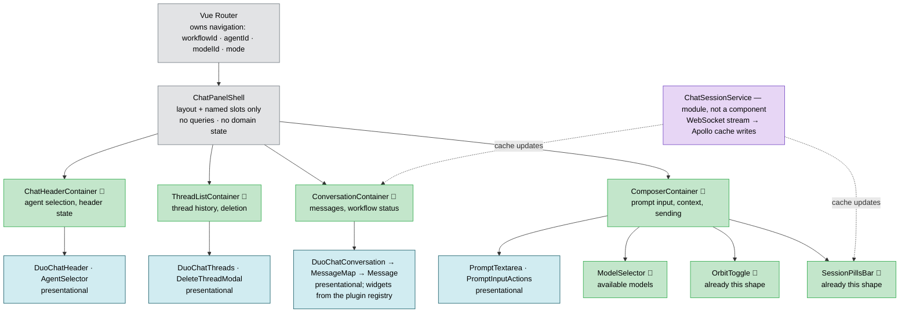
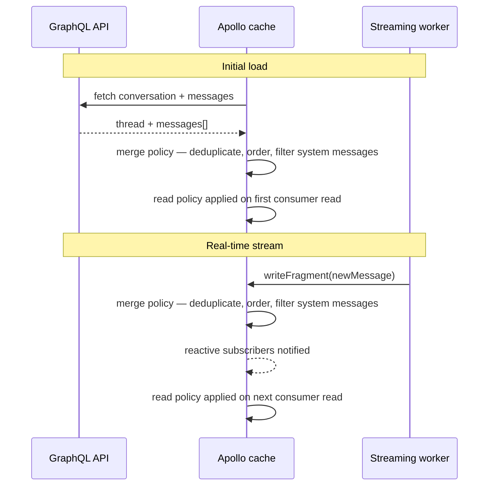
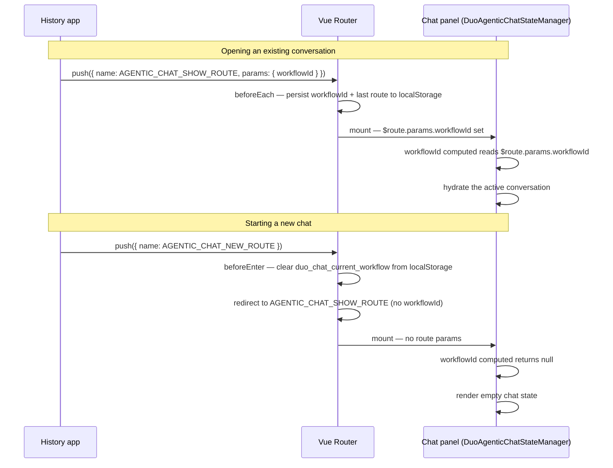
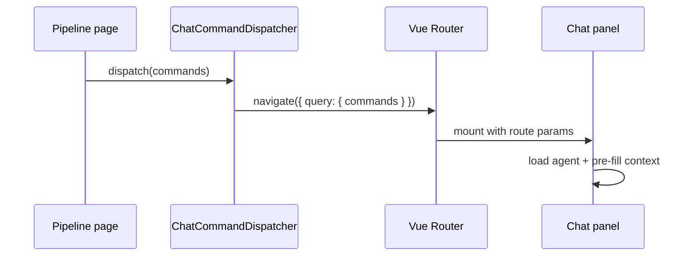



> [!NOTE]
> This blueprint focuses exclusively on the **[Duo Agentic Chat](https://docs.gitlab.com/user/gitlab_duo_chat/agentic_chat/) web client frontend**. [Classic (non-agentic) chat](https://docs.gitlab.com/user/gitlab_duo_chat/) is being deprecated separately and is out of scope. The Editor Extensions chat client is also out of scope — this document covers the web client only.

## Motivation

This blueprint exists to align the team and set guardrails: to stabilize chat, make it more reliable, and make future work faster to build. This document sets that shared direction: one agreed target architecture everyone can align on, so individual issues and epics can be scoped against a coherent plan instead of in isolation.

## Key Problems

> [!NOTE]
> These problems aren't new. We've fixed individual symptoms through regular issues over time, but those fixes were piecemeal — often patching one symptom while leaving the underlying cause in place, or creating a new inconsistency elsewhere. Because many engineers work on Duo Chat at once, without a shared direction their efforts can diverge or duplicate.

1. **Fragmented State Management.** Chat state is spread across many storage systems with no single source of truth. When they disagree, users see inconsistent behavior — a message showing in one view but not another, settings resetting, or duplicate and conflicting messages. Because data flows in unpredictable ways, bugs are hard to reproduce: for example, a "no available credits" message once flashed up and disappeared because two data streams updated the same part of the UI in the wrong order. Without a clear data-flow pattern, issues like this are nearly impossible to catch in tests.

2. **Testing & Observability Gaps.** There aren't enough automated tests to catch regressions, and bugs are hard to trace across layers. Many engineers work on Duo Chat, but there are few guardrails to stop a change from breaking something else. Because data moves through many disconnected paths, what looks like a small display glitch can involve a chain of events across several state sources, which makes finding the root cause slow. Users end up finding bugs in production — broken scrolling, unresponsive inputs, missing messages — that tests should have caught. Observability is thin too: error monitoring, usage tracking, and log aggregation aren't consistently in place, so failures and usage patterns in production are hard to see.

3. **Limited UI Extensibility.** Teams across GitLab can't easily add their own agents, tools, or custom UI to chat. There are no clear extension points, so they either hack around the core code or wait for the chat team to make changes — which slows Duo Chat's growth as a platform.

## Goals

1. **Unified State Management.** Limit chat state to two deliberate stores: the Apollo cache, the single source of truth for all server-originated and streamed data, and Vue Router, the single source of truth for navigation and state shared across views. Browser storage persists only the minimum needed to restore router state across a page reload. Data flow is predictable and bugs are reproducible.
2. **Extensible Plugin Architecture.** Establish Duo Agentic Chat as a platform that other GitLab teams can extend without modifying core chat code. Teams register message widgets, empty states, slash commands, and alerts through a shared registry outside of Duo Chat's responsibility, and open the chat from anywhere in GitLab through typed commands — their self-contained extensions should not destabilize core chat.
3. **Observability.** Make production failures and usage of the chat frontend visible through error monitoring, product analytics, and log aggregation — each with a clearly defined role. New features ship with instrumentation. LLM-level tracing (LangSmith in AI Gateway) is a backend concern and out of scope for this document.
4. **Comprehensive Test Coverage.** Add testing guardrails with clear guidance on which test type belongs where. Integration tests are the primary regression guardrail; unit tests cover isolated logic; end-to-end tests confirm the core flow in CI.

> [!NOTE]
> Success is measurable: fewer regression bugs reaching production, reduced time to implement new features, and a growing count of independently-contributed plugins and widgets. Regression rates are not consistently tracked today, so the first deliverable is recording a baseline once instrumentation is in place — later progress is measured against that recorded baseline, not against a number this document could only guess at. A dashboard covering key chat health metrics — error rates, streaming reliability, and feature engagement — is a concrete target outcome.

## Terminology

| Term | Definition |
| ------ | ------------ |
| **Streaming** | The process of receiving an AI response in real-time chunks over a WebSocket connection, displayed progressively to the user. |
| **Thread** | A single conversation consisting of a sequence of messages between the user and the AI assistant. |
| **Command** | A typed instruction dispatched from anywhere in GitLab (such as a troubleshoot button on a pipeline page) that opens and pre-fills Duo Chat from outside the chat component. |
| **Plugin** | A self-contained bundle of extensions — message widgets, empty states, slash commands, alerts — registered by a team through the plugin registry. |
| **Message Widget** | A self-contained component that renders custom UI for a specific message or tool type, registered through the plugin system. |
| **Slash Command** | An action registered by a plugin that appears in the suggestions menu when the user types `/` in the chat input. |
| **Agent** | An AI persona or capability set that determines how the chat responds and what tools it can use. |
| **Model** | The underlying AI model, for example, Claude or GPT, used to generate responses. |

## Design and Implementation Details

### Unified State Management (Goal 1)

Each piece of chat state lives in exactly one place, with no secondary copies: Vue Router is the source of truth for navigation, the Apollo cache owns all server-originated shared state — Vuex is not used — and browser storage persists only the minimum needed to restore a session across restarts. Initialization data from the Rails view reaches the chat as typed Vue props via the router, giving backend configuration a single, type-safe entry point.

#### State layers recap

| Layer | Technology | Scope | Persists across restarts? |
| --- | --- | --- | --- |
| 1 — Server data | Apollo normalized cache | Page | No (re-fetched) |
| 2 — Navigation | Vue Router (`$route`) | Page | Last route persisted to `localStorage` by a router guard |
| 3 — User preferences & session | `localStorage` | Device | Yes |
| 4 — Initialization data & transient UI | Vue props (via router) + component `data()` | Component lifetime | No |
| 5 — Real-time stream | WebSocket / streaming worker | Component lifetime | No |

#### Apollo Cache State

Two problems stand in the way. Chat state is split across Apollo and Vuex at the same time, and both live inside a single god component: `duo_agentic_chat_state_manager.vue`, 1,938 lines owning eight Apollo queries, the Vuex bindings, the WebSocket manager, and 41 `data()` entries. Everything below it is fed by prop chains.

Consolidating on Apollo removes the split. The Apollo cache is the single source of truth for all server-originated and streamed chat data: messages, threads, and agents. There is no competition between systems for this data.

Breaking the god component into **connected components** — one per feature boundary, each owning its feature's queries and mutations and nothing else — removes long prop chains and testing complexity. Everything below them stays presentational: props in, events out, no `$apollo`.

##### Connected Component Boundaries

`duo_agentic_chat_state_manager.vue` is broken down into connected components along its feature boundaries, each replacing a slice of the god component's responsibilities:

1. `ChatHeaderContainer` — agent selection and header state
1. `ThreadListContainer` — thread history and deletion
1. `ConversationContainer` — messages and workflow status
1. `ComposerContainer` — prompt input, context, model selection, and sending

A `ChatPanelShell` does layout and named slots only — no queries, no domain state — so it can't grow into the next god component. The router (`ai_panel_router.js`) owns cross-cutting navigation state, as described in Vue Router State below. A `ChatSessionService` module, not a component, owns the WebSocket stream and writes incoming messages into the Apollo cache — the same cache the connected components query, so siblings stay in sync without talking to each other directly.



##### Cache Read/Write Flow

Vuex is removed entirely; Apollo takes over its last remaining job. The transformation logic that Vuex mutations perform today — message deduplication, ordering, and display-shaping — moves to Apollo field policies on the `messages` field. `ConversationContainer` and any other connected component that queries messages then receives a consistent, already-transformed list without calling utility functions explicitly. After this migration, no server-originated chat data lives outside the GraphQL cache.



#### Message streaming

Message streaming happens in `WorkflowStream` service, a background process that runs independently of the UI. Incoming messages flow from the WebSocket connection through this service directly into the cache. If the user navigates away mid-response, the reply keeps coming. When they return, they see the complete, up-to-date conversation — including everything that streamed in while they were away. No lost messages.

#### Vue Router State

Vue Router owns navigation state: which panel is open, which mode is active, which conversation, agent, and model are selected. Switching agents, loading a conversation, or starting a new chat are all router navigations — not mutations to shared variables. A router guard persists the current route to browser storage so users return to the same state after a page reload, replacing the cookies currently used for this purpose.

The router is shared infrastructure across chat modes; the Classic Chat and Agents Platform rows below are included for completeness even though those experiences are out of scope for this blueprint.

| Route constant | Path | Renders |
| --- | --- | --- |
| `AGENTIC_CHAT_SHOW_ROUTE` | `/agentic-chat/:workflowId?` | Chat panel (`DuoAgenticChatStateManager`) |
| `AGENTIC_CHAT_NEW_ROUTE` | `/agentic-chat/new` | Redirect only — routes to `AGENTIC_CHAT_SHOW_ROUTE` with no `workflowId` |
| `AGENTIC_CHAT_HISTORY_ROUTE` | `/agentic-chat/history` | History app (independent component) |
| `CLASSIC_CHAT_SHOW_ROUTE` | `/classic-chat` | Classic `DuoChat` component |
| `CLASSIC_CHAT_NEW_ROUTE` | `/classic-chat/new` | Redirect only |
| `AGENTS_PLATFORM_SHOW_ROUTE` | `/agent-sessions/:id` | `AgentsPlatformShow` |
| `CLOSED_ROUTE` | `/closed` | Nothing — panel closed |

| Parameter | Kind | Set by | Consumed by | Purpose |
| --- | --- | --- | --- | --- |
| `workflowId` | Route param | History app | `workflowId` computed in the chat panel | Identifies the conversation to load; absent means a new chat |
| `resourceId` | Query param | AI panel, when the active work item changes | `resourceId` computed in the chat panel | Scopes context queries to the current work item |
| `agentId` | Query param | New-chat entry point | `currentAgent` computed in the chat panel | Pre-selects an agent for a new conversation |
| `modelId` | Query param | Model selector | `selectedModel` computed in the chat panel | Identifies the AI model to use for the conversation |
| `focus` | Query param | Tab-toggle handler | Chat panel's `mounted()` | Focuses the chat input; cleared after handling |

Every question about panel state is answered by reading the route directly, with no separate signal required: which mode is active is the path prefix (`/agentic-chat` vs. `/classic-chat`); whether the panel is open is any route other than `CLOSED_ROUTE`; and which conversation, agent, model, and work-item context are loaded come straight from the parameters above. State changes follow the same pattern — switching mode, loading a conversation, starting a new chat, and focusing the input are all router navigations, not writes to a shared variable. The component's `mounted()` lifecycle is the panel's own "opened" signal, firing exactly when the route makes it visible.



#### Initialization Data

`DuoAgenticChatStateManager` receives its initialization data as typed Vue props, not through router query strings or ad hoc global lookups. Configuration parameters rendered by the Rails view into the DOM dataset are parsed once by `init_duo_panel.js` and passed to the component via the router's `props` option on the route definition:

```js
// ai_panel_router.js
{
  name: AGENTIC_CHAT_SHOW_ROUTE,
  path: '/agentic-chat/:workflowId?',
  component: DuoAgenticChatStateManager,
  props: chatConfiguration.defaultProps,
}
```

Declaring these as props gives the component a typed, self-documenting interface and makes the router the single mechanism responsible for passing backend configuration into the chat. Dynamic navigation values — the conversation, agent, model, and work-item context — are read directly from `$route`, as described above, not from these initialization props.

Transient UI state that never leaves the component — for example, whether a specific dropdown is open — stays in the component's own `data()`. It's local to that instance, never shared, and is created and discarded with the component's own lifecycle.

#### Persisted Client State

`localStorage` exists solely to restore router state after a page refresh, since the router's in-memory state doesn't survive one. Route guards own the write path; the chat panel's computed properties own the read path, falling back to `localStorage` when the corresponding route param is absent on boot.

| Key | Written when | Read when |
| --- | --- | --- |
| `duo_chat_last_route` | Any navigation | Boot — restores the last active route, including mode and tab |
| `duo_chat_current_workflow` | `workflowId` route param changes | Boot — falls back to this if the route param is absent |
| `duo_chat_model` | `modelId` query param changes | Boot — falls back to this if the route param is absent |

#### Enforcement

A target architecture that relies on discipline alone will drift, so the rules above are enforced mechanically in CI — violations fail the pipeline before they reach review:

- **Lint rules block banned patterns.** ESLint `no-restricted-imports` rules scoped to the chat directories reject new imports of Vuex, event-bus utilities, and direct browser-storage access outside the approved persistence module. Each migration lands its lint rule in the same MR that establishes the pattern.
- **A shrink-only allowlist tracks the migration.** Files that still contain legacy patterns are enumerated in the lint configuration. The list can only shrink: CI fails any MR that adds a new entry, following the same approach GitLab uses for other codebase-wide migrations. This is how the migration happens gradually, module by module, rather than as a single rewrite — the allowlist's size is the real-time measure of progress.
- **Ownership gates the core.** State management, the streaming worker, and the plugin registry are covered by `CODEOWNERS`, so changes to them require review by a chat maintainer.

### Extensible Plugin Architecture (Goal 2)

Duo Chat is a platform other teams build on, not a codebase they have to modify.

Teams contribute through a plugin registry. For example, a plugin contributes a message widget to customize how to render a specific type of message.
Another plugin registers a custom empty state component for a specific agent and suggested prompts. Everything the user sees when they open that agent is owned by the team who built it. The key motivation of a plugin
architecture is decoupling the chat's core component from individual features.

Each extension is self-contained. It manages its own data, handles its own errors, and cannot break unrelated parts of the chat.

#### Commands

Other parts of GitLab open and pre-fill the chat without knowing its internals. A "Troubleshoot" button on a failed pipeline, a "Summarize" link on an issue — each dispatches a typed command through a standard interface.
Chat picks it up, loads the right agent, and presents the right context. Duo Chat will implement several built-in commands that will be documented in the GitLab developer docs.

```typescript
interface ChatCommand<Name extends string, Params extends object> {
    name: Name;
    params?: Params;
}

interface NewChatCommandParams {
    selectedAgent?: string;
    selectedModel?: string;
    autoSend?: boolean;
    resourceId?: string;
    prompt?: string;
    suggestedPrompts?: Array<string>;
    welcomeMessage?: string;
    emptyStateComponentName?: string;
    additionalContext?: ChatContext;
}

type NewChatCommand = ChatCommand<'newChat', NewChatCommandParams>;

type AnyChatCommand = NewChatCommand;

interface DuoChatCommandDispatcher {
    dispatch(commands: Array<AnyChatCommand>): Promise<void>;
}

// Usage from any GitLab page:
ChatCommandDispatcher.dispatch([
    {
        name: 'newChat',
        params: {
            selectedAgent: 'explain-code',
            prompt: "Explain this function"
        },
    },
]);
```



#### Plugin registry

Plugins are the foundational mechanism to extend Duo Chat web. Just like commands, Duo Chat exposes a standard interface to define and register plugins. Each plugin, can
contribute different types of capabilities.

```typescript
interface DuoChatPlugin {
    messageWidgets?: Array<MessageWidget>;
    emptyStates?: Array<EmptyState>;
    slashCommands?: Array<SlashCommand>;
    alerts?: Array<ChatAlert>;
    // Shape to be defined alongside ChatContext, see below.
    additionalContext?: Array<AdditionalContext>;
}

interface DuoChatPluginRegistry {
    registerPlugin(plugin: DuoChatPlugin): void;
}
```

##### Plugin registration context

Sometimes Duo Chat functionality is only relevant in a specific context, for example, when the user has opened a work item. An engineer
can import the `duoChatPluginRegistry` object in the target context to limit the availability of a capability:

```typescript
import { duoChatPluginRegistry } from 'ee/ai/duo_agentic_chat';

duoChatPluginRegistry.registerPlugin({
    emptyStates: [
        {
            when: (chatContext) => chatContext.selectedAgent.name === 'Planner',
            component: PlannerEmptyState,
        },
    ],
});
```

Other capabilities should be available in every context in the GitLab application. For this scenario, register a plugin
in the `global_plugin_registry.ts` module:

```typescript
// ee/ai/duo_agentic_chat/global_plugin_registry.ts
import { duoChatPluginRegistry } from 'ee/ai/duo_agentic_chat';

duoChatPluginRegistry.registerPlugin({
    slashCommands: [
        {
            name: 'new',
            description: s_('DuoAgenticChat|Starts a new chat conversation while preserving selected model and agent'),
            async onRun(commandDispatcher: DuoChatCommandDispatcher) {
                await commandDispatcher.dispatch([{
                    name: 'newChat',
                    params: {}
                }])
            }
        }
    ]
})
```

##### Message Widgets

A message widget is a component that renders custom UI for a specific message. Registering one is a single declaration: which type it handles, which component renders it. The chat resolves the right widget at render time — no `if/else` chains in core code.

```typescript
interface MessageWidget {
    component: Component;
    matchMessage: (message: Message) => boolean;
}

// Registration:
duoChatPluginRegistry.registerPlugin({
    messageWidgets: [
        {
            matchMessage: (message) => message.message_type === 'tool' && message.tool_info?.name === 'pipeline_summary',
            component: PipelineSummaryWidget,
        }
    ]
});
```

##### Empty States & Suggested Prompts

An empty state plugin allows to customize the initial view of Duo Chat based on the current context. For example, when a user opens a planner agent for the first time,
the chat renders an empty state tailored for this agent along with one or more suggested prompts.

```typescript
interface EmptyState {
  when: (chatContext: ChatContext) => boolean;
  component: Component;
  suggestedPrompts?: string[];
}

// Example
duoChatPluginRegistry.registerPlugin({
    emptyStates: [
        {
            when: (chatContext) => chatContext.selectedAgent.name === 'Planner Agent',
            component: PlannerAgentEmptyState,
        },
    ],
});
```

##### Slash commands

Slash commands register an action in the suggestions menu that appears when a user enters the `/` character in the chat prompt textarea. Each slash command exposes an `onRun` callback that
allows the plugin to run custom operations or invoke a chat command using the command dispatcher.

```typescript
interface SlashCommandParam {
    value: string;
    label: string;
}

interface SlashCommand {
    name: string;
    description: string;
    params?: () => Promise<Array<SlashCommandParam>>;
    onRun: (commandDispatcher: DuoChatCommandDispatcher, selectedParam?: SlashCommandParam) => Promise<void>;
}
```

##### Alerts & Announcements

The chat surfaces several kinds of system messages: informational notices, warnings, errors, and feature announcements. Without a shared system, each one gets implemented differently — different styles, different placement, different lifecycle logic.

A single alert registry fixes this. A team registers an alert component with a severity level and a condition. The chat evaluates conditions and renders matching alerts in a consistent location with consistent styling. Adding a new notice means registering it — not finding the right place to wedge it into core UI code.

```typescript
interface ChatAlert {
  id: string;
  severity: 'info' | 'warning' | 'error';
  component: Component;
  condition: () => boolean | Ref<boolean>;
}

// Registration:
duoChatPluginRegistry.registerPlugin({
    alerts: [
        {
            id: 'no-credits',
            severity: 'warning',
            component: NoCreditsAlert,
            condition: () => useCredits().isExhausted,
        }
    ]
});
```

##### Chat Context

[To be defined in upcoming iterations]

#### Future Extension Points

The plugin system is designed to grow. Two directions already on the horizon:

**Generative UI.** The AI can return structured data that the frontend renders as interactive components — not just text. A future extension point will let teams register renderers for AI-generated UI payloads, so the chat can display dynamic, context-specific interfaces returned directly from the model.

**Multimodal input.** Today users communicate through text. Future extension points will allow teams to contribute alternative input methods — images, voice, file attachments — each following the same registry pattern and remaining independent of core chat input handling.

#### Security

Duo Chat's extensions are contributed by GitLab engineering teams, not external or public developers, so this isn't a hardened multi-tenant sandbox — but a shared platform still needs baseline guardrails against a faulty or compromised extension, not just malicious intent:

- **Widgets that enrich messages with additional data must check authorization on that data.** Access to chat itself already implies access to the conversation's own messages — that's not a new risk. The risk is narrower: a widget that enriches a message by pulling in related GitLab data (for example, details from a linked pipeline or issue) must verify the current user is authorized to see that additional data before rendering it. A widget is never implicitly trusted to display data it fetched on its own.
- **AI-generated content is sanitized before rendering.** Message widgets and, once shipped, Generative UI payloads render model output, which is untrusted input regardless of intent — a prompt injection can still cause a model to emit content that isn't safe to render as-is. Widgets render sanitized text and structured data through the framework's standard escaping; raw HTML from a model or a widget is never injected unsanitized.
- **Plugin contracts are typed.** Extensions integrate exclusively through the TypeScript interfaces defined in this document. There is no other supported API surface, so bypassing the registry fails type checking rather than review vigilance.
- **Plugin contracts are versioned.** The TypeScript interfaces in this document are the platform's public API. Breaking changes ship as a new contract version with a deprecation window, rather than mutating an interface that other teams' already-registered extensions depend on.

### Observability (Goal 3)

Three tools give visibility into what the chat is doing in production. Each captures different data, lands in a different destination, and serves a different audience — none of them feeds the others automatically:

| Tool | Captures | Destination | Audience |
|------|----------|-------------|----------|
| **Sentry** | Frontend JS errors and performance — broken connections, failed requests, unhandled exceptions | Sentry UI | Engineers debugging production issues |
| **Snowplow** | User behavior events — which agents users choose, how often they send messages, where they drop off | Snowflake → Tableau | Product and data analysts |

A single pane of glass does not exist out of the box: Sentry and Snowplow are separate systems with separate destinations, and neither feeds the other automatically. Bringing error rates, streaming reliability, and feature engagement into one health view therefore requires explicit integration work — for example, exporting selected aggregates from both into a shared reporting layer. That unified view remains a target outcome, but it is a deliverable to be built, not something this document assumes comes for free. Until it exists, the defined roles keep every question answerable in one known place: "is chat throwing errors?" — Sentry; "how do people use it?" — Snowplow via Tableau.

#### Automatic Instrumentation, In General

Core chat code carries the same requirement as plugins: instrumentation should not depend on an engineer remembering to add it. A shared instrumentation layer, exposed as a small set of methods that core features call into, sits underneath the entire chat frontend rather than being wired up path by path:

- **All unhandled errors and promise rejections are captured into Sentry automatically**, not only the ones an engineer thought to wrap in a `try/catch`. Given the resulting volume, raw capture alone isn't enough to see what matters — AI-powered filtering and classification runs on top of captured errors to group duplicates, surface novel failures, and separate real regressions from noise.
- **Basic performance data is collected automatically**, focused specifically on chat message processing and rendering: time from a message arriving to it being rendered, time to first streamed token, and render duration per message. This is where user-perceived slowness actually shows up, so it's instrumented by default rather than added after a complaint.

#### Automatic Instrumentation for Plugins

The same requirement extends to plugins: registering a message widget, empty state, slash command, or alert through the plugin registry should instrument it by default, without the plugin author writing tracking code.

Concretely, the registry is the natural place to attach this: each `duoChatPluginRegistry.registerPlugin` call can wrap the plugin's contributed components and their lifecycles in the same shared instrumentation layer described above — reporting render errors to Sentry with the plugin's identity attached, and emitting a standard set of Snowplow events (registered, rendered, interacted with, errored) automatically.

Detection needs a response: when a plugin's errors in Sentry cross a threshold, or a widget is otherwise found to be faulty or compromised, it needs to come down without a monolith deploy. Each registry entry carries a kill switch — a remotely toggleable flag, checked at registration and render time — that lets a chat maintainer disable a single extension in place while the owning team fixes it, without touching unrelated plugins or shipping code.

> [!NOTE]
> The exact shape of this instrumentation layer — the methods it exposes, which performance metrics it tracks and at what granularity, the AI-based error classification approach, and how plugin errors are scoped per plugin — is out of scope for this document and will be defined in a future addition. Until it exists, the interim expectation is unchanged from today: engineers manually add the relevant Snowplow events and Sentry error handling for both core features and plugins.

<!-- -->

> [!NOTE]
> Backend log aggregation (correlation IDs, request tracing) is a dependency for full end-to-end traceability. The right approach here is to be defined in coordination with the backend team.

### Comprehensive Test Coverage (Goal 4)

The problem today is not only the number of tests — it's where they sit. Most existing chat tests are shallow unit tests that mock away the exact layers where production bugs actually occur: cache synchronization, streaming updates, and the interaction between components. A regression like "duplicate messages appear when two data streams race" passes every unit test, because each unit is correct in isolation — the failure lives in the assembly. This document shifts the testing emphasis to match where the bugs are.

**Integration tests become the primary regression guardrail.** They mount the assembled chat panel with real components, a real Apollo cache, and realistic GraphQL responses served through mocked resolvers (`createMockApollo` in the monolith, Jest + Vue Test Utils in `duo-ui`). A scripted WebSocket fixture replays recorded streaming sequences — chunked replies, out-of-order updates, mid-stream disconnects — so streaming behavior is tested deterministically instead of being mocked out. The initial scenario list comes directly from the Key Problems section: duplicate messages from racing data streams, state surviving navigation away and back mid-stream, and alerts appearing and clearing on cache changes. From then on, every bug fixed in production must land with a reproducing integration test.

**Unit tests cover isolated logic only**: utilities, Apollo field-policy transformations (deduplication, ordering), and the streaming service's message buffering. If a test needs to mock more than one collaborator to run, the behavior belongs in an integration test instead.

**End-to-end tests stay deliberately thin.** A small GitLab QA smoke suite runs in CI against a live environment and confirms the one flow that must never break: open chat, send a message, receive a streamed response. E2E tests are expensive and flaky at scale, so they guard only this critical path — everything else is covered at the integration level.

**The plugin architecture carries its own testing contract.** Every registry entry — message widget, empty state, slash command, alert — must ship with integration tests covering its rendering and its error handling. Because extensions are self-contained, their tests run in their owners' pipelines without depending on the core chat suite, and a failing extension test never blocks core chat CI.

#### Testing Tooling

Building the mocked GraphQL resolvers and the WebSocket streaming fixture from scratch in every test file doesn't scale any better than manual instrumentation does for observability. A shared testing library — exposing helpers to mock the Apollo cache with sensible defaults, replay streaming fixtures, and assert against the initial scenario list — is the right way to make writing a new integration test the easy path rather than the effortful one.

> [!NOTE]
> The exact shape of this testing library — what helpers it exposes, how streaming fixtures are authored and shared, and how much of the mocked-resolver setup is generated versus hand-written — is out of scope for this document and will be defined in a future addition, the same as the instrumentation tooling described in the Observability section above.

## Iterations

The work lands in four phases, and within each phase the migration itself moves module by module rather than as a single cutover — this is not a big-bang rewrite. Each phase delivers value on its own and unblocks the next; concrete work items are derived from these phases in the [implementation epic](https://gitlab.com/groups/gitlab-org/-/work_items/21423).

1. **Observability first.** Instrument errors (Sentry) and usage (Snowplow) for the existing flows, and record the baseline that all later phases are measured against.
2. **State unification.** Move streaming into the background worker that writes to the Apollo cache, migrate Vuex transformation logic to Apollo field policies, move navigation state to Vue Router, and land the enforcement lint rules with the initial shrink-only allowlist.
3. **Test guardrails.** Build the integration-test harness (mocked GraphQL resolvers plus the streaming fixture) and backfill the scenarios listed in the Key Problems section; wire the GitLab QA smoke flow into CI.
4. **Plugin platform.** Ship the command dispatcher and the registry with the four plugin contracts defined above (message widgets, empty states, slash commands, alerts), migrate one existing internal feature onto each contract as proof, then open registration to other teams.

## Related projects

The split between the `duo-ui` npm library and the GitLab monolith adds friction: every change needs a library update, publish, and version bump before it can ship — no matter how small. Solving this split is out of scope for this blueprint.

The Duo Chat Micro Frontend project is a [proposal](https://gitlab.com/gitlab-com/content-sites/handbook/-/merge_requests/20055) to solve this split. This direction depends on the company-wide frontend modularization approach, which has not been decided yet. This document deliberately does not depend on any particular outcome: the architecture described here applies whether chat ships as a Micro Frontend, stays a monolith-owned application, or adopts another packaging model.
