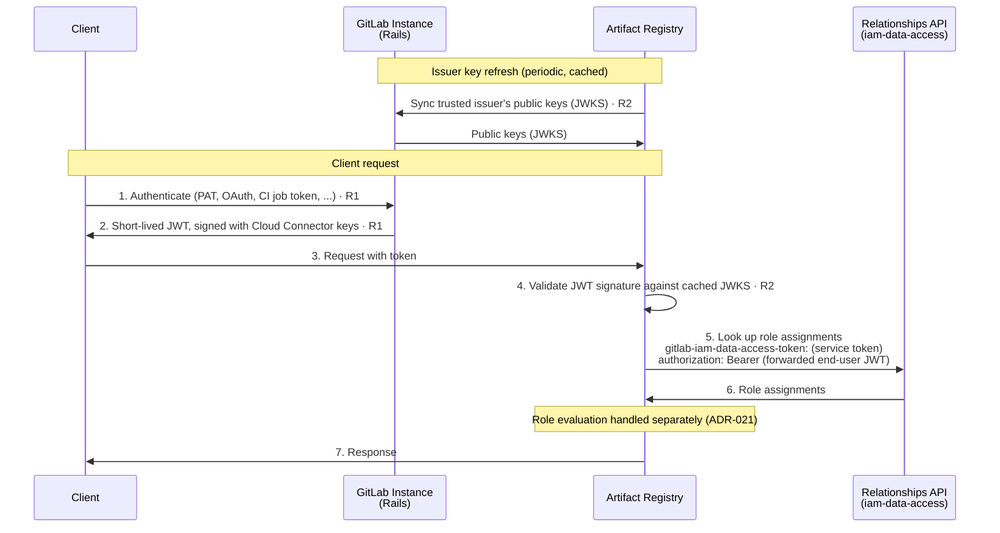

<!-- Design Documents often contain forward-looking statements -->
<!-- vale gitlab.FutureTense = NO -->

## Status

**Proposed**

This ADR covers **authentication** only — how a caller's identity is established. **Authorization** (roles, policy evaluation, role assignments) is covered separately by ADR-021: Authorization.
<!-- TODO: link to ADR-021 once merged — https://gitlab.com/gitlab-com/content-sites/handbook/-/merge_requests/18717 -->

## Context

Clients authenticate to the Artifact Registry with short-lived tokens issued by their GitLab Rails instance through a dedicated API endpoint. The Artifact Registry validates these tokens locally and is not involved in issuing them.

The contract with the Auth Platform team is the [Artifact Registry and Auth Platform interface agreement](../agreements/auth.md), which defines what the Artifact Registry requires across six requirements (R1–R6). This ADR consumes its authentication requirements — R1 (token exchange), R2 (token validation), and R3 (token payload).

## Decision

**The Artifact Registry authenticates clients by locally validating short-lived tokens issued by GitLab Rails through a dedicated token-exchange API endpoint.**

### Iteration scope

The first iteration targets same-boundary topologies (`.com ↔ .com`, `SM ↔ SM`), where a single instance has a single trust anchor: Rails signs the token with the Cloud Connector v1 key, and `gitlab_instance_uid` is omitted from the payload. The cross-boundary topology (multiple Self-Managed instances sharing one SaaS Artifact Registry) is a follow-up iteration.

### Non-production development mode

The decision above governs every deployment that serves real artifacts. The Artifact Registry also supports a **non-production development mode**, so it can run where no GitLab instance is available to issue or sign tokens: a local checkout, or a test rig. It is off by default and mutually exclusive with token-exchange configuration, which is rejected when configuration loads.

Here the Artifact Registry authenticates against a purpose-built development credential rather than a Rails-issued token. Two of its properties cut against the decision above:

1. **It establishes no principal.** It carries none of the [R3 payload claims](#token-payload-r3) — no `sub`, no `gitlab` context — so a request it authenticates resolves to an identity with no subject.
1. **It is long-lived and static, not short-lived and issued.** It is configured once for the deployment's lifetime, so the short-TTL reasoning that bounds a leaked token's exposure under [Consequences](#consequences) does not apply to it.

Those consequences hold as written, because the mode admits no real principal and holds no production data: the exposure a short TTL bounds does not arise where there is nothing to impersonate and nothing of value to reach. The topologies this ADR governs never run the mode, and the decision is unchanged for them.

The same credential also serves as the service token on the [GitLab Rails to the Artifact Registry internal API](#gitlab-rails-to-the-artifact-registry-internal-api) edge, in the header a production deployment uses there, so in this mode it is not the deployment credential [The two layers](#the-two-layers) records as never visible to end users: the developer presenting it as a client credential holds the edge's credential too. It is admissible on the same grounds as the two properties above — with no real principal and no production data, there is no end user to withhold it from and nothing of value behind the edge — and the edge is otherwise unchanged: the service-token layer still applies, with the same constant-time comparison and the same opaque `401`, and only the credential's source differs between postures.

The mode is coupled to the unenforced authorization posture in [ADR-021](021_authorization.md#non-production-development-mode), and the two are not independently selectable. [ADR-021](021_authorization.md#authorization-flow) denies a principal-less request ahead of any relationship lookup, admitting no "exists but forbidden" outcome for a caller it cannot name. Pairing this credential with enforced authorization would therefore deny every request on every surface while health probes stayed green and configuration validated ([artifact-registry#982](https://gitlab.com/gitlab-org/ops/artifact-registry/-/work_items/982)). One switch selecting both ([artifact-registry#692](https://gitlab.com/gitlab-org/ops/artifact-registry/-/work_items/692)) makes that state inexpressible rather than merely guarded against.

The guard bounds coexistence, not deployment: a deployment configuring neither token exchange nor IAM can run the mode, and the Artifact Registry's own end-to-end test cluster does. What keeps that safe is the absence of a real principal, the absence of enforcement, and the warning logged at boot.

## Architectural constraint

One constraint from the [interface agreement](../agreements/auth.md#no-callbacks-during-request-processing) shapes this decision:

**No callbacks during request processing.** The Artifact Registry never calls back to the GitLab instance **while processing a request**. The constraint targets that instance; it does not target the dependencies the Artifact Registry is itself deployed and provisioned with. It does have one remote dependency for authentication — the periodic, out-of-band sync of its trusted issuer's public keys (see [Token validation](#token-validation-r2)) — but that happens outside request handling, not per request. This matters most in cross-boundary setups — a Self-Managed instance connecting to a SaaS Artifact Registry — where that instance may be unreachable due to network conditions (firewalls, air-gapped environments). Everything needed to verify a request token MUST be in the token itself or already cached locally. This is what makes local, stateless validation a hard requirement rather than an optimization.

## Authentication flow

The token is issued by Rails (R1) and validated locally by the Artifact Registry against its trusted issuer's public keys, which it syncs periodically and caches (R2). The diagram below shows the first-iteration flow; the role lookup appears only because of the credentials it carries, and what it returns and how those roles are evaluated belong to ADR-021.



**Legend:**

| Step | Description |
|------|-------------|
| **Issuer key refresh** | The Artifact Registry syncs its pre-configured trusted issuer's public keys (JWKS) and caches them. This is authentication's only remote dependency, and it happens out of band — never during request processing. |
| **1-2** | The client obtains a short-lived JWT from its GitLab instance directly (not through the Artifact Registry). The Artifact Registry never sees the client's long-lived credentials. |
| **3-4** | The client presents the token to the Artifact Registry, which validates the signature against its cached JWKS. No callback to Rails occurs. |
| **5-6** | The Artifact Registry calls the relationships API to resolve the caller's role assignments. This call carries two credentials, not one: the Artifact Registry's own service token and the end-user JWT forwarded unchanged. See [Service-to-service authentication](#service-to-service-authentication). |
| **7** | The Artifact Registry serves the response. |

## Token issuance (R1)

Rails exposes a dedicated token-exchange API endpoint that accepts client credentials and returns a short-lived token usable against the Artifact Registry.

1. **Supported credential types.** The endpoint authenticates the caller with standard GitLab API credentials, each of which resolves to a `User`: personal access tokens (legacy or granular), OAuth tokens, CI job tokens, and project/group access tokens. **Deploy tokens are not supported in the first iteration**: a deploy token is not a `User`, the only principal type the first iteration issues tokens for. The typed `sub` claim (see [Token payload](#token-payload-r3)) is designed to admit other principal types later, so deploy tokens — listed as an [R1](../agreements/auth.md#r1--token-exchange-service) target — are tracked as a follow-up.
1. **Client-side exchange.** The token exchange happens client-side: the client obtains the token from its GitLab instance and presents it to the Artifact Registry — the Artifact Registry never performs the exchange. The endpoint can be driven by `curl`, the `glab` CLI, or automatically by CI jobs. Because the token is short-lived, native package tooling that expects a static credential (for example Maven's `settings.xml` or npm's `.npmrc`) needs helper tooling to fetch and refresh it; the client-tooling design across Docker, Maven, and npm is tracked in the [client credential management work item](https://gitlab.com/gitlab-org/gitlab/-/work_items/595150).
1. **Token duration.** Tokens have a 5-minute default lifetime and a 12-hour maximum. A client may request any lifetime from 1 second up to that 12-hour cap, including one longer than the default; client-requestable TTL requires AppSec sign-off ([token-exchange TTL decision](https://gitlab.com/gitlab-org/gitlab/-/work_items/601469)). The bounds follow industry precedent for delegated-auth registries, documented in the [client credential management work item](https://gitlab.com/gitlab-org/gitlab/-/work_items/595150), so long as Maven/Gradle builds do not expire mid-flight.
1. **Enablement enforcement.** Token exchange should fail for organizations that have not enabled the Artifact Registry (R1, a SHOULD). This is an availability gate only; per-repository authorization stays with the Artifact Registry. The check runs at token issuance on the Rails side, which owns the organization-level enablement setting. Access does not rely on Unit Primitives or add-ons, since no Artifact Registry add-on exists under the credit-based billing model. On its side, the Artifact Registry enforces access at the namespace level: the token's `gitlab.origin_id` claim, an organization UUID, must match the `entity_id` of the namespace's owner anchor ([ADR-001](001_organizations_as_anchor_point.md)), an opaque comparison that requires no organization awareness. Enablement gates token *issuance* rather than evaluating a permission, so it is recorded here rather than in [ADR-021](021_authorization.md).

## Token validation (R2)

The token is a JWT signed with the GitLab instance's existing Cloud Connector keys (`CloudConnector::Keys`). The Artifact Registry is configured at startup with a **trusted issuer** (its GitLab instance) and syncs that issuer's public keys (JWKS) out of band. It validates each incoming token's signature against those pre-fetched keys. The validator also pins the signature algorithm and rejects tokens with the wrong audience or a past `exp`.

Key caching and refresh follow the existing Cloud Connector approach (per [R2](../agreements/auth.md#r2--token-validation)): keys are cached and refreshed periodically, and a stale key is retained briefly if a refresh fails, so a key-provider blip does not reject otherwise-valid tokens. See [Future work / open debates](#future-work--open-debates) for open items on key refresh.

Reusing Cloud Connector v1 machinery keeps the first iteration simple: no new key-distribution infrastructure is required. The target state moves key serving to GATE, but the Artifact Registry-side action — verify the signature against cached trusted keys — is unchanged.

## Token payload (R3)

The token carries enough information to authenticate the request without callbacks. This example shows a token minted from a CI job token; the nested `gitlab.job` object appears only in that case. The authentication-relevant claims are:

```json
{
  "jti": "5d250d2f-0e6c-4f7d-987b-222973bfb6af",
  "iss": "https://gitlab.example.com",
  "aud": ["gitlab-artifact-registry", "gitlab-iam-data-access"],
  "sub": "gid://gitlab/User/42",
  "iat": 1779870540,
  "nbf": 1779870540,
  "exp": 1779870840,
  "ver": 1,
  "gitlab": {
    "origin": "organization",
    "origin_id": "6f1a9c02-4b7e-4a3d-9f21-1c8b0d5e77a4",
    "local_id": 42,
    "identity_kind": "user",
    "organization_role": "owner",
    "job": {
      "project_id": 278964,
      "git_commit_sha": "e705c64cf239a2f3b0c6d1e8a9b4f5c6d7e8f9a0",
      "pipeline_id": 2870712707
    }
  }
}
```

1. `sub` — the principal identity (R3), expressed as a GitLab GlobalID (for example `gid://gitlab/User/42`) rather than a bare numeric ID. Encoding the principal *type* in the value keeps it unambiguous and lets the claim extend to non-`User` principals (for example deploy tokens) without changing its meaning.
1. `iss` — the issuing instance's OIDC issuer URL. It is informational only (logged); the Artifact Registry does **not** use it to select verification keys (see [Token validation](#token-validation-r2)).
1. `aud` — carries two values: `gitlab-artifact-registry`, the audience the client requested, and `gitlab-iam-data-access`. The second value is what lets the Artifact Registry forward this same token, unchanged, to the relationships API — see [Service-to-service authentication](#service-to-service-authentication).
1. `ver` — the schema version of the token payload. It is `1` today and is bumped only on breaking changes to the payload shape; IAM's verifier rejects any other value.
1. `gitlab` — a nested object carrying the caller's context: `origin` (`organization`; the only value at launch), `origin_id` (the organization's UUID), `local_id` (the user's id), `identity_kind` (`user`), and `organization_role` (`owner` or `member`). A nested `job` object appears only when the exchanged credential was a CI job token.
1. `gitlab.organization_role` is the one exception to the rule below that authorization-bearing claims live in ADR-021: it is read before any role assignments exist, so it cannot be resolved through the relationships API. See [ADR-021](021_authorization.md) for what it authorizes — its R6 bootstrapping requirement.
1. `gitlab.job` — present only when the exchanged credential was a CI job token. It carries `project_id` (the numeric id of the project the job belongs to), `git_commit_sha` (the full commit SHA it ran against), and `pipeline_id` (the numeric id of the pipeline the job ran in). They exist to populate the build-provenance fields on Artifact Registry versions and container manifests, which today read null because the token carries nothing to fill them; they carry no authorization meaning. A job-token exchange authenticates as the job's user (whoever ran that build, which for a played or retried job can differ from the pipeline's triggering user), so `local_id` still names a real person alongside this build context. The change is additive — `ver` stays 1 — and a verifier that does not yet know these claims ignores them harmlessly; any consumer must treat a missing or malformed value as "no provenance" and never fail the request over it. See the [token payload CI context work item](https://gitlab.com/gitlab-org/gitlab/-/work_items/629690). The values must be present in the credential being exchanged, because the target-state `iam-sts` (ADR-016 / ADR-019) can only copy claims from the presented token, not read arbitrary GitLab database records. Today's interim Rails endpoint reads them off the authenticated job record, but the CI job token itself only carries the project id (as the `p` routing claim) — it lacks the commit SHA and pipeline id. Adding those to the CI job token needs its own follow-up with the team that owns that token.
1. `jti`, `iat`, `nbf`, `exp` — standard JWT claims; `exp = iat + ttl`.
1. `gitlab_instance_uid` is **omitted for now**. In the same-boundary topologies of the first iteration there is a single trust anchor, so an instance identifier is not needed; it becomes relevant only for the cross-boundary follow-up.
1. **Role and other authorization-bearing claims are described in ADR-021, not here.** The Artifact Registry uses this token to establish *who* the caller is; *what they may do* is evaluated separately. Whether authorization must also consider the *source credential type* (for example a PAT versus a CI job token) is likewise an ADR-021 concern.
<!-- TODO: link to ADR-021 once merged — https://gitlab.com/gitlab-com/content-sites/handbook/-/merge_requests/18717 -->

## Service-to-service authentication

The sections above cover a client's request arriving at the Artifact Registry. Calls between GitLab's own services need their own answer, and there is more than one such edge. This section gives the shared pattern first, then what each edge carries.

### The two layers

1. **Service token.** Answers "is the calling process a trusted peer service?" A static, symmetric shared secret, checked with a SHA-512 hash and a constant-time compare. It carries no identity, so the result is only accept or reject.
1. **Caller identity.** Answers "who does the call act for?" Present only when the call acts for someone. Today that is the end user's JWT: RS256, verified against the issuer's JWKS, with issuer, audience, and expiry checks.

Which layers apply depends on the edge. A call made on behalf of an end user carries both. A call that is not user-initiated has no identity for the second layer to carry, so the service token alone authenticates the caller. Whichever layers apply, all of them are required: failing any one returns `Unauthenticated` (gRPC) or `401 Unauthorized` (HTTP), and there is no anonymous mode. The service token never authorizes anything on its own; where an end-user identity is present, authorization derives from that principal (see [ADR-021](021_authorization.md)).

1. **Credential names are per service.** Each service defines its own name for the service-token credential it accepts. The relationships API reads `gitlab-iam-data-access-token`; the IAM auth service reads `gitlab-iam-auth-token`. Distinct names let request logs show which caller hit which service.
1. **Rejection is opaque for one layer, structured for the other.** A rejected service token gives no detail — missing and wrong look identical. A rejected JWT carries a reason: audience mismatch, expired, key not found.
1. **Rotation needs no downtime.** The validator accepts a current and a next token at the same time, so the secret can be rotated without coordinating a cutover.
1. **The service token is a deployment credential.** It is provisioned as a secret to the calling service and is never visible to end users. The [non-production development mode](#non-production-development-mode) is the one exception.
1. **Health checks skip both layers**, so Kubernetes probes work without credentials.

### Artifact Registry to the relationships API

Both layers apply. This is steps 5-6 of the flow above. It is gRPC: the service token travels in the `gitlab-iam-data-access-token` metadata header, the JWT in the `authorization` header as a Bearer token.

Each side verifies the JWT independently. The Artifact Registry verifies it on ingress against its own expected audience, and the relationships API verifies it again on its own — both services embed the same verification library. Forwarding the token is not delegating the check; it is a full, independent check on each side.

On the data path, the Artifact Registry calls `ReadRelationships` and `LookupResources` and forwards the client's own token unchanged, so the user's identity flows end to end. This works because Rails' token-exchange endpoint adds `gitlab-iam-data-access` to every token's `aud` array alongside the requested audience (`gitlab-artifact-registry`). `LookupResources` is on this path because the Artifact Registry drains it per request to bound repository-list visibility by the caller's own grants; IAM admits that call only for an `organization`-origin subject in the caller's own organization, matched against the forwarded token's `gitlab.origin_id` and `gitlab.local_id`.

The admin and UI flows differ: `LookupSubjects`, `LookupRelationships`, `WriteRelationships`, `DeleteRelationships`, and `DeleteRelationshipsByFilter` are called by a Rails GraphQL wrapper, which requests its own `gitlab-iam-data-access`-scoped token from the Rails token issuer.

The exempt health RPCs on this edge are `grpc.health.v1.Health/Check`, `Watch`, `List`, and each service's own `Health` RPC.

### GitLab Rails to the Artifact Registry internal API

The service token alone applies. The internal API is the Rails-facing HTTP surface defined in [ADR-009](009_api_design.md): namespace creation, which returns the UUID Rails persists, and UUID-keyed namespace resolution, among others. These calls are not made on behalf of an end user, so there is no identity for the second layer to carry.

This edge is HTTP rather than gRPC, so the credential travels in a request header rather than gRPC metadata; the pattern is otherwise the same. The service token is an interim mechanism here — see [Future work / open debates](#future-work--open-debates) for the direction.

## Alternatives considered

This ADR does not weigh alternative authentication architectures. The Artifact Registry-side design follows from the [Artifact Registry and Auth Platform interface agreement](../agreements/auth.md): the Artifact Registry consumes the R1–R3 requirements, and the mechanism is driven by the Authentication team's decisions on how to implement them. Alternatives were evaluated on the platform side (see the [authentication and authorization direction for the modular service model](https://gitlab.com/gitlab-org/gitlab/-/work_items/595148)) and are out of scope here.

## Consequences

### Positive

1. **Independent of Rails availability during request processing**: because validation is local and stateless, the Artifact Registry can authenticate requests even when the originating GitLab instance is unreachable.
1. **Short-lived tokens limit blast radius**: the Artifact Registry never handles the client's long-lived GitLab credentials, only short-lived tokens — so a leaked token expires quickly and exposes far less than a leaked long-lived credential such as a PAT.
1. **Aligned with platform direction**: the Artifact Registry consumes the platform's token-exchange and validation primitives rather than maintaining a bespoke flow, per the [authentication and authorization direction for the modular service model](https://gitlab.com/gitlab-org/gitlab/-/work_items/595148).

### Negative

1. **Interim requires a callback to the GitLab instance**: to validate tokens the Artifact Registry must sync issuer keys from the GitLab instance's OIDC endpoint (out of band, not per request). The end-state goal is for the Artifact Registry to depend on no GitLab-instance connectivity at all; the target state achieves this by serving keys from GATE.
1. **Reuses Cloud Connector v1 machinery**: the interim relies on the existing Cloud Connector v1 keys and OIDC endpoint rather than target GATE-issued keys.
1. **Issued tokens cannot be revoked before expiry**: because validation is local with no callback or blocklist, a token stays valid until `exp` even if the originating credential is revoked moments after issuance (for example a phished PAT exchanged for a 12-hour token). This is mitigated by the short *default* TTL and is an accepted trade-off for the beta; stronger sender binding (such as DPoP) and key rotation are possible future hardening.

### Mitigations

- The Artifact Registry-side validation logic is identical across the interim and target issuers — only the issuer-key source changes — which limits the blast radius of the migration.

## Future work / open debates

These are unresolved authentication questions, out of scope for the first iteration but recorded so they are not lost. Most cluster around the cross-boundary follow-up and the target (GATE) state.

1. **GATE deployment topology.** In the target state the issuer keys are served by GATE rather than the issuing instance's own OIDC/JWKS endpoint. Depending on how GATE is deployed, the Artifact Registry fetches the issuer key from the corresponding GATE component. The deployment topology is not yet finalized.
1. **Cross-boundary issuer key and `gitlab_instance_uid`.** The first iteration omits `gitlab_instance_uid` because there is a single trust anchor. The cross-boundary follow-up has many Self-Managed instances behind one trust anchor, so a token must identify its issuing instance. Reintroducing `gitlab_instance_uid` (or an equivalent) and the resulting change to the validation model are open. The CI-specific case — automatic `CI_JOB_TOKEN` exchange for remote runners connecting to a SaaS Artifact Registry — falls under this follow-up and is tracked in the [CI_JOB_TOKEN exchange for remote runners work item](https://gitlab.com/gitlab-org/gitlab/-/work_items/599087).
1. **Periodic JWKS refresh is not implemented yet.** [Token validation (R2)](#token-validation-r2) describes the desired state; today the shared verification library fetches the JWKS once at startup, with no periodic refresh and no stale-key retention, so an issuer signing-key rotation rejects newly signed tokens until the process restarts. Tracked in the [JWKS refresh work item](https://gitlab.com/gitlab-org/gitlab/-/work_items/616174); this entry disappears when it ships.
1. **CI job token claims for provenance.** The `gitlab.job` claims (`project_id`, `git_commit_sha`, `pipeline_id`) must all come from the presented credential once `iam-sts` serves the exchange, since it cannot query GitLab's database. The CI job token today carries only the project id; adding the commit SHA and pipeline id requires a separate follow-up with the CI job token's owning team.
1. **Target-state service credentials.** The service token is an interim mechanism. The direction is to replace shared secrets with mutual TLS and workload identity, using SPIFFE-style caller identifiers, and to carry caller identity in a GitLab Unified Request Token ([URT](https://gitlab.com/gitlab-org/architecture/auth-architecture/design-doc/-/blob/main/glossary.md)). Neither direction is decided, and the URT does not exist yet. In-cluster transport security, including the terms for revisiting mutual TLS, is recorded in [ADR-024](024_infrastructure_delivery.md#transport-security).

## References

1. [ADR-001: Organizations as Anchor Point](001_organizations_as_anchor_point.md)
1. ADR-021: Authorization — companion ADR for authorization
<!-- TODO: link to ADR-021 once merged — https://gitlab.com/gitlab-com/content-sites/handbook/-/merge_requests/18717 -->
1. [ADR-022: Namespace Decoupling](022_namespace_decoupling.md)
1. [Artifact Registry and Auth Platform interface agreement](../agreements/auth.md) — the R1–R3 (authentication) requirements consumed here
1. [Authentication and authorization direction work item](https://gitlab.com/gitlab-org/gitlab/-/work_items/595148)
1. [Client credential management for remote artifact clients](https://gitlab.com/gitlab-org/gitlab/-/work_items/595150)
1. [Token-exchange endpoint work item](https://gitlab.com/gitlab-org/gitlab/-/work_items/601475)
1. [GATE identity federation design doc (cross-boundary auth)](https://gitlab.com/gitlab-org/architecture/auth-architecture/design-doc/-/blob/main/decisions/019-gate-identity-federation.md)
1. [RFC 2119](https://www.rfc-editor.org/rfc/rfc2119) — requirement-level keywords used in the interface agreement
1. [OCI Distribution Spec - Authentication](https://github.com/opencontainers/distribution-spec/blob/main/spec.md#authentication)
1. [Container Registry Token Authentication](https://docs.docker.com/registry/spec/auth/token/)
1. [IAM service access documentation](https://gitlab.com/gitlab-org/auth/iam/-/blob/main/docs/service-access.md) — the two authentication layers IAM services enforce
1. [IAM relationships API](https://gitlab.com/gitlab-org/auth/iam/-/blob/main/docs/relationships-api.md) — the contract and per-RPC token requirements
