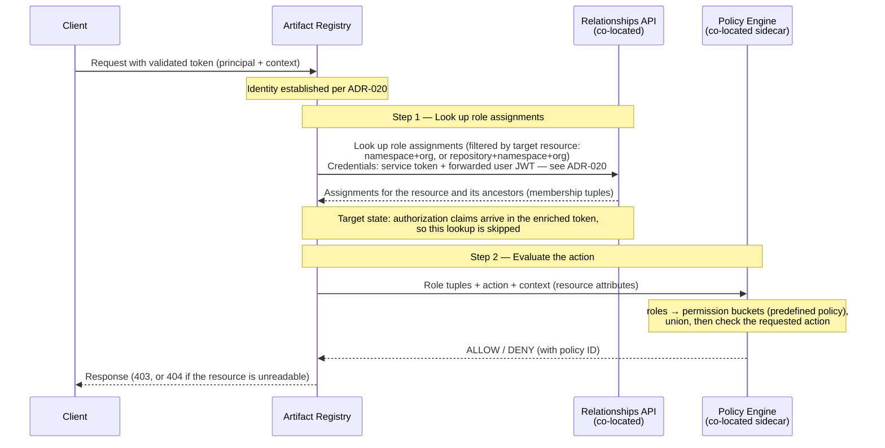

<!-- Design Documents often contain forward-looking statements -->
<!-- vale gitlab.FutureTense = NO -->

## Status

**Proposed**

This ADR covers **authorization** only — what an authenticated caller may do. **Authentication** (how the caller's identity is established, and how the token is issued and validated) is covered separately by [ADR-020: Authentication Flow](020_authentication_flow.md).

## Context

The Artifact Registry runs on a satellite service separate from the GitLab Rails monolith. [ADR-020](020_authentication_flow.md) establishes how a caller's identity is established: the client presents a short-lived token that the Artifact Registry validates locally, and the Artifact Registry never calls back to the GitLab instance during request processing.

This ADR addresses the next question: **what can that caller do?**

The contract with the Auth Platform team is the [Artifact Registry and Auth Platform interface agreement](../agreements/auth.md), which defines what the Artifact Registry requires across six requirements (R1–R6). ADR-020 consumes the authentication requirements (R1–R3). This ADR consumes the authorization requirements: **R4 (policy evaluation engine)**, **R5 (relationships API)**, and **R6 (bootstrapping)**.

### The permission model

To grant or deny an operation, the Artifact Registry evaluates three parts:

- **Principal**: the authenticated user or token holder, established by [ADR-020](020_authentication_flow.md). It is identified by the token's `sub` claim; the token payload shape is described in [ADR-020](020_authentication_flow.md#token-payload-r3). Every credential type (personal, OAuth, CI job, group, or project access token) resolves to the same `User` principal, so **closed beta authorizes by principal alone, independent of which credential was used**. A leaked CI job token therefore carries the user's full permissions; this is a deliberate trade-off for closed beta (tokens are short-lived by default — see [ADR-020](020_authentication_flow.md)). Differentiating authorization by credential type is an [open question](#open-questions).
- **Operation**: there are two types — repository management operations and artifact operations. [ADR-009](009_api_design.md) describes them in detail.
- **Resource**: resources live at two levels — the namespace (the registry as a whole; see [ADR-022](022_namespace_decoupling.md)) or an individual repository. Roles are assigned at these levels (see [Role assignment](#role-assignment)); the namespace maps one-to-one to the organization in closed beta.

The Artifact Registry uses a **roles and permissions** model:

- **Roles** define _who the principal is_ in the context of a resource. A principal is assigned a role through the [relationships API](#role-assignment) (R5). In closed beta the Artifact Registry fetches these role assignments and the policy engine resolves the effective permissions from them; in the target state, the authorization claims arrive in an enriched token.
- **Permissions** define _what the principal can do_. Each role maps to a fixed set of permissions (a "permission bucket"), defined by the [built-in defaults](#default-permission-buckets).

An operation is granted when the required permission is present in the principal's effective permission set.

For example:

- **Management operation**: creating a repository requires the `create_repository` permission, held by the Artifact Admin role.
- **Artifact operation**: publishing an artifact requires the `create_artifact` permission, held by the Artifact Contributor, Artifact Manager, and Artifact Admin roles.

In closed beta these role-to-permission mappings are fixed. A later iteration adds [access rules](#access-rules) that can tighten the artifact permissions (for example, removing Artifact Contributor from the roles allowed to publish to a production repository).

### Constraints

Three constraints shape the decision:

- **Closed-by-default.** Membership in the organization (or its groups and projects) does not grant any Artifact Registry access. A principal has no permissions until an Artifact Registry role is explicitly assigned. This is a deliberate move to secure-by-default, aligned with the cross-team direction in the [roles management work item](https://gitlab.com/gitlab-org/gitlab/-/work_items/593455).
- **No inheritance from platform membership.** Top-level group and project roles do not map to Artifact Registry roles. Artifact Registry roles are a distinct, product-specific concept and are assigned independently.
- **No callbacks to the GitLab instance during request processing.** Everything needed to authorize a request must be available without reaching the GitLab instance, which may be unreachable. The constraint targets _that instance_ — not the dependencies the Artifact Registry is itself deployed and provisioned with, among them the relationships API, the GLAZ policy-engine sidecar, the key-value store, and the relational database, which share its failure domain (see the [interface agreement](../agreements/auth.md#no-callbacks-during-request-processing)). In closed beta the Artifact Registry calls the relationships API to resolve roles and the sidecar to evaluate them on each request. If a dependency the decision needs an answer from is unavailable, authorization fails closed, though the fail-open/fail-closed policy is still an [open question](#open-questions); a cache is not that case, and losing one degrades to resolving the answer directly.

## Decision

**Define product-specific Artifact Registry roles. Assign them to the namespace and to individual repositories through the auth platform's relationships API. Evaluate permissions through the co-located policy evaluation engine (GLAZ, a sidecar) using built-in role-to-permission defaults. Access is closed-by-default; Organization Administrators are bootstrapped with full access.**

In closed beta, authorization uses two mechanisms:

1. **Namespace role assignment** ([details](#role-assignment)) — a principal is assigned a role on the namespace, granting a baseline set of permissions that inherits to every repository in the registry.
2. **Repository role assignment (additive)** ([details](#role-assignment)) — a principal is assigned a role directly on an individual repository, granting its permissions there. This is a direct membership association: it does not require any namespace-level assignment. Repository-level assignments are additive in closed beta; restricting access on a specific repository is [deferred](#reductive-repository-overrides).

This separates concerns cleanly. The auth platform stores role assignments (relationships) and provides the policy evaluation engine. The Artifact Registry owns the role definitions and the permission model, and drives every decision through the co-located engine.

### Roles

The Artifact Registry defines four product-specific roles, scoped to the Artifact Registry and distinct from platform roles:

| Role | Intended for |
|---|---|
| **Artifact Viewer** | Consumers who pull artifacts and browse the registry. |
| **Artifact Contributor** | Producers who also publish artifacts (for example, CI jobs). |
| **Artifact Manager** | Repository owners who manage artifacts and repository configuration. They do not manage access. |
| **Artifact Admin** | Registry administrators who manage registry-wide configuration. The only role that manages access. |

These are **user roles**, distinct from the platform **user types** (for example, Organization Administrator or Organization Member). A user type does not imply any Artifact Registry role; the two are assigned independently. See the [roles management work item](https://gitlab.com/gitlab-org/gitlab/-/work_items/593455) for the cross-team alignment behind this distinction.

A principal with no assigned role has no access (closed-by-default). In closed beta every repository is private, so nothing is readable without an assignment — see [Repository visibility](#repository-visibility).

Organization Administrators are **bootstrapped** with full access equivalent to Artifact Admin (R6). They hold an organization-level owner relationship — a tuple binding the owner to the organization — maintained continuously as ownership changes ([owner role assignments work item](https://gitlab.com/gitlab-org/gitlab/-/work_items/601665)); the policy engine treats that tuple as implicit access to the organization's Artifact Registry namespace and every repository under it. The grant is implicit and irrevocable — it cannot be revoked or downgraded while they remain an owner. Because it flows through ordinary relationship records evaluated like any other assignment, it needs no special-case handling in the Artifact Registry. This guarantees that at activation, before any assignments exist, an Organization Administrator can create repositories and assign roles to other users.

Custom roles are out of scope for closed beta; see [Custom roles](#custom-roles).

### Permissions

The Artifact Registry defines a fixed set of permissions:

| Permission | Description | Operation type |
|---|---|---|
| `read_artifact` | Browse and download artifacts (files, blobs, manifests, container image tags, npm dist-tags) | Artifact operations (client APIs) |
| `create_artifact` | Publish an artifact (Docker push, Maven deploy, npm publish), including re-publishing where the protocol permits it, and create or retarget a container image tag or npm dist-tag | Artifact operations (client APIs) |
| `delete_artifact` | Delete artifacts (images, packages, versions, container image tags, npm dist-tags, files) | Artifact operations (client APIs) |
| `read_repository` | List and view repositories, statistics, and virtual-repository upstream lists | Management operations |
| `create_repository` | Create hosted, remote, or virtual repositories | Management operations |
| `update_repository` | Update repository settings; test remote connections | Management operations |
| `delete_repository` | Delete repositories | Management operations |
| `create_repository_upstream` | Associate a hosted or remote repository as an upstream of a virtual repository | Management operations |
| `update_repository_upstream` | Reorder a virtual repository's upstreams | Management operations |
| `delete_repository_upstream` | Remove a hosted or remote repository from a virtual repository's upstreams | Management operations |

Permissions follow GitLab's [permission conventions](https://docs.gitlab.com/ee/development/permissions/conventions.html): every permission names an action and a `resource(_subresource)`, and the action is one of `read`, `create`, `update`, or `delete`. Three consequences of applying that convention here:

- **Reversible relationships are modeled as resources**, not bespoke verbs. A virtual repository's upstream is a `repository_upstream` — created to associate a hosted or remote repository, deleted to disassociate it.
- **Caching reuses the artifact permissions** — there are no separate cache permissions. Remote repositories cache artifacts in tables that mirror the hosted schema ([ADR-007](007_database_schema.md)) and serve them through the same endpoints ([ADR-009](009_api_design.md)).
- **`read_repository` also exposes a virtual repository's upstream list**, since the resolution order is relevant to anyone using the repository.

### Default permission buckets

Each role maps to a fixed set of permissions, shown below (✓ = the role holds it). A role holds the same permissions wherever it is assigned; what changes is _reach_ — a namespace assignment applies them across the registry, a repository assignment only to that repository.

| Permission | Viewer | Contributor | Manager | Admin |
|---|:---:|:---:|:---:|:---:|
| `read_artifact` | ✓ | ✓ | ✓ | ✓ |
| `create_artifact` | | ✓ | ✓ | ✓ |
| `delete_artifact` | | | ✓ | ✓ |
| `read_repository` | ✓ | ✓ | ✓ | ✓ |
| `create_repository` | | | | ✓ |
| `update_repository` | | | ✓ | ✓ |
| `delete_repository` | | | | ✓ |
| `create_repository_upstream` | | | ✓ | ✓ |
| `update_repository_upstream` | | | ✓ | ✓ |
| `delete_repository_upstream` | | | ✓ | ✓ |

Each role is an independent permission bucket: it grants exactly the permissions marked in its column, with no hierarchy or inheritance between roles.

Managing role assignments does not appear in the table above, because it is not an Artifact Registry permission (see [Role assignment](#role-assignment)). Only Artifact Admin holds it.

### Repository visibility

Each repository has a visibility level stored in the Artifact Registry database (see [ADR-007: Database Schema](007_database_schema.md)). Visibility is an Artifact Registry-native attribute; it is not synced to any external entity.

**Closed beta supports `private` only**: no access without an assigned role. Every repository is closed-by-default — read, like every other operation, requires an explicit role assignment.

Both `internal` (readable by organization members) and `public` (readable by anyone, including unauthenticated callers) are descoped from closed beta, because each grants read without a role — `internal` through organization membership, `public` to everyone. Either would break the closed-by-default constraint: membership is the gate that determines who _can_ be granted access, not the grant itself. Both are deferred to GA — see [Public and internal visibility](#public-and-internal-visibility).

Write and management operations always require the corresponding permission from an assigned role, regardless of visibility.

### Namespace-level and repository-level resources

#### Namespace-level resources

All namespace-level resources are management operations with fixed permission requirements:

| Resource | Operations | Required permission |
|---|---|---|
| Repository listing | List all repositories, list by format | `read_repository` |
| Registry statistics | View storage and download statistics | `read_repository` |
| Repository management | Create, update, delete hosted, remote, or virtual repositories | `create_repository`, `update_repository`, `delete_repository` |
| Virtual repository upstream listing | List remote and hosted upstreams | `read_repository` |
| Virtual repository upstream management | Associate, reorder, disassociate remote and hosted upstreams | `create_repository_upstream`, `update_repository_upstream`, `delete_repository_upstream` |

#### Repository-level resources

**Management operations** (fixed permission requirements):

| Resource | Operations | Required permission |
|---|---|---|
| Repository details | View repository details | `read_repository` |
| Repository configuration | Update repository settings; test remote connection | `update_repository` |
| Repository deletion | Delete the repository | `delete_repository` |
| Repository statistics | View storage and download statistics | `read_repository` |
| Repository-upstream associations | Associate, reorder, disassociate upstreams with virtual repositories | `create_repository_upstream`, `update_repository_upstream`, `delete_repository_upstream` |
| Cached artifacts (remote repositories) | View and evict cached rows — served through the artifact endpoints ([ADR-009](009_api_design.md)) on a `kind=remote` repository | `read_artifact`, `delete_artifact` |
| Artifacts | Browse the artifacts of a repository | `read_artifact` |

How listing is authorized — across the namespace and within a repository — is described under [List operations](#list-operations).

**Artifact operations** (default permission buckets):

| Operation | Required permission | Default allowed roles |
|---|---|---|
| Read (browse, download files and blobs, security audits) | `read_artifact` | Artifact Viewer, Artifact Contributor, Artifact Manager, Artifact Admin |
| Publish (Docker push, Maven deploy, npm publish) | `create_artifact` | Artifact Contributor, Artifact Manager, Artifact Admin |
| Create or retarget a tag (OCI tag push, `npm dist-tag add`) | `create_artifact` | Artifact Contributor, Artifact Manager, Artifact Admin |
| Delete (images, packages, versions, files, bulk deletes) | `delete_artifact` | Artifact Manager, Artifact Admin |
| Remove a tag (OCI untag, `npm dist-tag rm`) | `delete_artifact` | Artifact Manager, Artifact Admin |

Publishing covers re-publishing where the format's protocol permits it (Maven `SNAPSHOT` redeploys, OCI tag re-pushes); immutable artifacts such as a published npm version cannot be overwritten by protocol. There is no separate overwrite permission: preventing overwrites of existing artifacts is an [access-rule](#access-rules) capability (the `overwrite` action), deferred from closed beta.

In closed beta these defaults are fixed. A later iteration adds [access rules](#access-rules) that can tighten them.

### Role assignment

Roles are assigned through the auth platform's [relationships API](../agreements/auth.md#r5--relationships-api) (R5) as `(subject, role, resource)` tuples, where the subject is the relationships-API [`Identity`](https://gitlab.com/gitlab-org/auth/iam/-/blob/main/docs/relationships-api.md#subject-and-identity) type (`origin`, `origin_id`, `local_id`) resolved from the token, and the resource is an Artifact Registry namespace or repository. A role assignment binds the subject to a resource within that subject's organization.

Managing role assignments is reserved for the **Artifact Admin** role: Artifact Manager, Artifact Contributor, and Artifact Viewer cannot create, update, or delete them ([Roles and Permissions work item](https://gitlab.com/groups/gitlab-org/-/work_items/22246)). Artifact Manager manages repositories, not access — it grants no roles, sets no repository overrides, and writes no access rules. The capability is identical wherever Artifact Admin is held — only its scope differs: a namespace-level Artifact Admin manages assignments across the registry, a repository-level Artifact Admin manages assignments on that repository. This is done through the GitLab UI, where Rails provides the frontend and API (R5); the relationships API authorizes the write itself ([relationships-API write authorization](https://gitlab.com/gitlab-org/gitlab/-/work_items/599078)). The relationships API itself is gRPC, so this Rails surface is a GraphQL-over-gRPC wrapper ([GraphQL wrapper work item](https://gitlab.com/gitlab-org/gitlab/-/work_items/602144)). Because the namespace maps one-to-one to the organization, this surfaces through the organization's access-management experience.

A role operates at one of **two resource levels** — the namespace or a repository — and any of the four roles can be assigned at either level:

- **Namespace (top level)**: the role applies across the entire registry — every repository. A namespace-level Artifact Manager, for example, is a manager of every repository; a namespace-level Artifact Viewer can read every repository. This is the baseline that lets administrators grant access to thousands of users at scale. Organization Administrators are bootstrapped as namespace-level Artifact Admins (R6).
- **Repository (direct, additive)**: a role assigned on a single repository grants its permissions on that repository. This is a direct membership association in its own right — it does not require any namespace-level assignment, so a principal can be granted access to a single repository and nothing else. When the principal holds roles at both levels, the effective permissions on the repository are the **union** of the two — a repository-level assignment can only grant more, never less. Restricting access on a specific repository (a reductive override) is [deferred from closed beta](#reductive-repository-overrides).

Because `create_repository` acts on the registry as a whole, it has no repository-level meaning. Assigned at the repository level, Artifact Admin adds two capabilities over Artifact Manager: `delete_repository` — full control of that repository, including deleting it — and managing role assignments on that repository.

**Each request resolves against one resource.** A request is authorized against the single resource it addresses; the relationships lookup is filtered to that resource and its ancestors (repository → namespace → organization), so an assignment on a _different_ repository never enters the decision. Because overrides only raise, the effective role is the highest applicable one — there is no "most restrictive" resolution. This includes virtual repositories: a request served **through a virtual repository** resolves against the **virtual repository's** own role, while the role assigned on a **contained hosted or remote repository** governs requests addressed **directly** to that contained repository. A role on the virtual repository therefore grants access to the content it aggregates _as served through it_ — by design, not a bypass of a contained repository's assignment.

How role assignments reach the Artifact Registry depends on the iteration:

- **Closed beta**: the token carries identity and context only (no authorization claims). The Artifact Registry queries the co-located relationships API, **filtering by the target resource** — for a namespace operation it passes the namespace id and the organization id; for a repository operation it passes the repository id, the namespace id, and the organization id — and the API returns the principal's role assignments for that resource and its ancestors as membership tuples. The Artifact Registry passes all of those tuples to the policy engine, which resolves the effective permissions; because repository-level assignments are additive, the permissions are the union of the namespace-level and repository-level assignments (the engine's native most-permissive evaluation). The Artifact Registry caches the relationships API response for a short duration configured in the Artifact Registry (default 30 seconds, maximum 60 seconds). That cache is backed by the [key-value store the Artifact Registry is provisioned](../agreements/infrastructure.md#isolation-levels) rather than held in process: one entry with one expiry serves the whole fleet, so a lookup is not repeated once per instance and an entry does not expire independently on each. The cost is a dependency on that store while authorizing; it shares the Artifact Registry's failure domain, and losing it degrades the cache to resolving through the relationships API directly rather than failing the decision. The cache is keyed on the inputs sent to the relationships API: the principal, the target resources, and the relationship kinds filter. A cached result is never reused across a different principal or resource. As a consequence, a recent role-assignment change, a revocation included, is not observed immediately. That duration bounds only the Artifact Registry's share of the delay: whichever instance meets a cache miss fills the shared entry from whatever the relationships API returns at that moment, so a fill landing after the assignment is written but before that write is readable serves the pre-change answer for a further full duration. The write-to-read lag inside the relationships API is not yet measured, so no total window can be stated today ([artifact-registry#1025](https://gitlab.com/gitlab-org/ops/artifact-registry/-/work_items/1025)). Entries expire per key rather than per role change, and the key names the target resources, so a caller holding entries for several resources loses them at different moments. A denial on one resource therefore does not establish that the revocation has taken hold on the others.
- **Target state**: the auth platform's enrichment layer resolves role assignments and includes the authorization claims in the enriched token, so no lookup is needed. The shape of those claims, which ADR-020 defers to this ADR, is defined when the enrichment layer ships.

### Authorization flow

Authorization begins after authentication: the Artifact Registry has already validated the token and established the principal ([ADR-020](020_authentication_flow.md)). It then fetches the principal's role assignments from the relationships API and asks the co-located policy-engine sidecar to evaluate the requested action, returning a decision — without calling back to the GitLab instance.

The flow below assumes an authenticated principal. An unauthenticated request carries no token and is denied: closed beta has no public repositories (see [repository visibility](#repository-visibility)).



When an operation is denied, the status code depends on whether the principal may even see that the resource exists, mirroring the metadata-leakage prevention applied to list and browse operations:

- **The principal cannot read the resource** (for example, a private repository on which they hold no role): the Artifact Registry returns **404 Not Found** on direct access, so it does not confirm the resource exists. This matches the filtering of list results.
- **The principal can read the resource but lacks the specific operation** (for example, they hold a role but not `delete_repository`): the Artifact Registry returns **403 Forbidden**, since the resource's existence is already known to them.

In neither case does the response reveal the permission or policy that caused the denial, to avoid leaking authorization policy details. The policy engine returns the policy ID that determined the decision (R4) for audit logging and debugging.

### List operations

A list spans many resources at once, so it does not fit the single-resource evaluation above.

**Listing repositories (namespace-scoped).** The Artifact Registry decides this from the principal's role assignments rather than one policy check per repository:

- A principal holding **any namespace-level role** can list **all** repositories in the namespace. Every role includes `read_repository`, so this reduces to "does the principal hold a role at the namespace?"; the Artifact Registry then enumerates the repositories from its own database.
- A principal with **no namespace-level role** sees only the repositories where they hold a **repository-level assignment** — closed beta has no visibility level that grants read without a role ([Repository visibility](#repository-visibility)). Direct assignments resolve through per-repository evaluation: the Artifact Registry fetches the repository tuples from the relationships API, and the policy engine grants `read_repository` wherever an assignment provides it.

Viewing registry-wide statistics works the same way: they summarize the whole registry rather than a single repository, so they require a namespace-level role.

**Listing within a repository (repository-scoped).** Browsing a repository's contents or sub-resources targets a single repository, so it is an ordinary point check on that repository: artifact/content listing (tags, versions, files) requires `read_artifact`; repository details, per-repository statistics, and the upstream list require `read_repository`.

A list of a namespace's repositories omits the resources the principal cannot read rather than rejecting the request — an empty or partial list, with no error and no indication that hidden resources exist, preventing metadata leakage. A sub-resource list whose rows the addressed resource already names keeps them, with deny on every action ([Permission checks for UI gating](#permission-checks-for-ui-gating)). This is also the landing experience: the registry's navigation entry is not gated on any permission check ([ADR-014](014_frontend_to_artifact_registry.md)) — other gates, such as the Artifact Registry being enabled for the organization, still apply — so a principal with no access lands on the repository list and sees it empty.

### Permission checks for UI gating

The frontend must know which actions to render — buttons, tabs, routes — before the user attempts any, and only the Artifact Registry can answer. It exposes **permission checks**: an allow or deny verdict per action for the calling principal. Checks name actions rather than enumerate permissions: the permission-to-action mapping belongs to the registry.

Verdicts **embed in the management API's domain responses**, opt-in: the repository detail response carries that repository's verdicts, and the repository list response carries an envelope with the namespace verdicts and each row's — one call per page. **An embedded element can carry verdicts of its own**, answering for the resource that element represents.

The namespace's verdicts embed the same way, in a namespace details response created for them: `GET /api/v1/:slug/namespace` ([ADR-009](009_api_design.md#management-apis) lists the route). The spec fixes its initial fields; the response grows additively as the namespace becomes a user-facing entity — organization migrations can place several namespaces under one organization. It serves the namespace-scoped affordances on pages with no other domain call.

Each surface's action set is fixed by its resource level — the bindings under [Namespace-level and repository-level resources](#namespace-level-and-repository-level-resources) — and published in the OpenAPI contract; the frontend takes its actions from there rather than inventing them. The same name asks a different question at each level: against the namespace, `update_repository` gates registry-wide settings; against a repository, that repository's own configuration.

```mermaid
sequenceDiagram
    participant FE as Frontend
    participant Rails
    participant AR as Artifact Registry
    participant Rel as Relationships API<br/>(co-located)
    participant PE as Policy Engine<br/>(co-located sidecar)

    FE->>Rails: page render
    Rails->>AR: GET domain endpoint<br/>(user token, verdicts requested)
    Note over AR: principal established per ADR-020,<br/>like any management API request
    AR->>Rel: Look up role assignments<br/>(resource + ancestors)
    Rel-->>AR: membership tuples
    AR->>PE: BatchCheck (resource, action set, tuples)
    PE-->>AR: allow / deny per action
    AR-->>Rails: domain data + permissions<br/>(404 when the repository is unreadable)
    Rails-->>FE: abilities per action

    Note over Rails,AR: The repository list response carries the namespace verdicts and each row's;<br/>a sub-resource list carries each embedded element's, for the resource that element represents.<br/>Pages with no other domain call use the namespace details endpoint
```

Four rules govern the contract:

- **Advisory only.** Verdicts pre-gate UI affordances; the registry still authorizes every real request ([authorization flow](#authorization-flow)), so a stale verdict can mis-render a control, never grant access — which is why consumers may cache verdicts on top of the resolution cache under [Role assignment](#role-assignment). Verdicts cover authorization only: rendering also requires the namespace status the platform caches ([ADR-022](022_namespace_decoupling.md)), and the registry enforces both on the real request.
- **The caller is the end user.** The surface uses the management API's end-user authentication ([ADR-020](020_authentication_flow.md)): the platform obtains a token for the current user and calls as that user. The registry never accepts a service caller asserting a user identity, and verdicts stay off the GitLab API surface, which authenticates services, never end users ([ADR-009](009_api_design.md#gitlab-api)). No permission is needed beyond authentication: existence-hiding plus deny-by-default means a caller with no access learns nothing the gated endpoints would not reveal.
- **Existence-hiding.** A repository the principal cannot read gets the domain response's own **404 Not Found**, indistinguishable from a missing one. The namespace endpoint answers any authenticated principal of the owning organization — the landing experience above already concedes the namespace exists to them — with deny on every action when nothing is assigned; a caller from another organization, like an unknown slug, gets 404, so the namespace route leaks nothing the list route does not. **Embedded verdicts never change a row set.** A resource the principal cannot read stays listed, with deny on every action, wherever the addressed resource's response already names it: a virtual repository's upstream list names the sibling repositories it resolves through with or without verdicts, so embedding their verdicts discloses no resource the list did not. This does not loosen the omission rule under [List operations](#list-operations), which still governs every list whose rows are not already named. Responses carry allow or deny only, never the deciding policy or reason.
- **Embedded and opt-in.** Verdicts ride the response of the data they gate, only when requested, so the two cannot disagree and a consumer that renders nothing pays nothing.

The **repository** list envelope's verdicts are a by-product of serving it: for a caller without a namespace role, filtering the rows they may see already evaluates every repository, and the namespace verdicts come from the same tuples. A namespace role settles only visibility — repository assignments are additive, so requested verdicts still evaluate every returned row.

A sub-resource list has **no such by-product**: it gates on the addressed resource and evaluates none of the resources its rows name, so its verdicts are evaluation the route would not otherwise do — a cost that is bounded and opt-in. [ADR-004](004_data_and_application_limits.md#entity-count-limits) caps upstream sources per virtual repository at 20 — a write-time cap, adjustable per instance on Self-Managed — so an upstream list's verdicts are one `BatchCheck` per page, and a consumer rendering no per-upstream control asks for none.

A row's verdicts come from that row's own evaluation, and a failed row evaluation fails the whole request instead of dropping out silently; consistency across a request's lookups is bounded by the resolution cache's TTL, not atomic. Every list request already depends on the relationships service and the policy engine — visibility filtering is itself a verdict, and a sub-resource list's own gate is a point check — so opting in adds per-row evaluation cost, not the dependency. An unreachable dependency the decision needs an answer from fails the whole request; the fail-open policy and the caching of the per-namespace evaluation remain [open questions](#open-questions).

The shape follows [proposal 016](https://gitlab.com/gitlab-org/architecture/auth-architecture/design-doc/-/blob/main/proposals/016-batchcheck-ar-ui-authorization.md): verdicts embedded in the domain responses, resolved through its AR-GLAZ [`BatchCheck` contract](https://gitlab.com/gitlab-org/architecture/auth-architecture/design-doc/-/blob/main/proposals/016-batchcheck-ar-ui-authorization.md#interface). Even the namespace matches: 016 assumed a namespace detail endpoint, which this decision creates.

### Non-production development mode

The decision above governs every deployment that serves real artifacts. The Artifact Registry also supports a **non-production development mode**, for local development and test rigs. Its authorization half is an explicit operator opt-in that serves with authorization unenforced: nothing calls the relationships API or the policy engine, and no decision derives from a role assignment. That takes two forms by surface: the client APIs serving artifact operations interpose no authorization check, while the management API keeps its evaluation seam and is handed an all-allow evaluator. Either way every check a caller could reach — the point checks of the [authorization flow](#authorization-flow), the filtering of [list operations](#list-operations), and the [UI gating verdicts](#permission-checks-for-ui-gating) — answers allow. The opt-in is off by default: an omitted, empty, or explicitly disabled setting all yield the enforcing posture.

Three guards bound it:

1. **It is rejected alongside a configured IAM block** when configuration loads, so a deployment provisioned to enforce cannot also opt out.
1. **A boot with neither it nor an IAM block configured fails**, rather than inferring a posture from incomplete configuration. Serving without authorization is therefore always something an operator asked for.
1. **A boot under it logs the posture once at WARN**, so the posture is visible in the log stream rather than inferable from configuration. The enforcing posture is logged too, so an unenforced boot is evidenced by a record of its own rather than by the absence of one.

**Unenforced is not anonymous access.** The opt-in makes no authorization decision; it does not widen one to admit callers without a role. A request presenting no credential is still rejected, though by authentication rather than by the anonymous denial in the [authorization flow](#authorization-flow) above, which is not reached either. So the opt-in does not reopen the `public` and `internal` visibility levels [deferred to GA](#public-and-internal-visibility): those grant read to a caller holding no role while authorization is still evaluated, which is a different thing from declining to evaluate it.

The opt-in is coupled to the [non-production development mode](020_authentication_flow.md#non-production-development-mode) ADR-020 records for authentication. That mode's credential establishes no principal, and the [authorization flow](#authorization-flow) above denies a principal-less request ahead of any relationship lookup, admitting no "exists but forbidden" outcome for a caller it cannot name. Pairing the two therefore denies every request on every surface — as the 404 the existence-hiding rule above returns — while health probes stay green and configuration validates ([artifact-registry#982](https://gitlab.com/gitlab-org/ops/artifact-registry/-/work_items/982)). One switch selecting both ([artifact-registry#692](https://gitlab.com/gitlab-org/ops/artifact-registry/-/work_items/692)) makes that state inexpressible rather than merely guarded against.

This subsection records what the decision does not cover. The decision is unchanged for every deployment that enforces.

## Deferred to later iterations

The following capabilities are intentionally out of scope for closed beta. They are documented here so the design is on record, and will be revisited based on closed-beta customer demand.

### Public and internal visibility

Closed beta supports only `private` visibility (see [Repository visibility](#repository-visibility)). Reintroducing `public` (read for anyone, including unauthenticated callers) and `internal` (read for organization members) requires additional discussion — how to grant broad read access while remaining closed-by-default is not yet decided — so both are deferred to GA.

### Reductive repository overrides

Closed beta repository-level assignments are **additive (raise-only)**: they only add permissions on that repository, and the Artifact Registry grants the union of the namespace-level and repository-level assignments (see [Role assignment](#role-assignment)).

Lowering a principal's access on a specific repository (a reductive override) is out of scope, because it conflicts with role inheritance as it works across GitLab — a namespace-level assignment carries down to every repository. When this is added, the Artifact Registry will resolve precedence by reading the principal's permissions at both the namespace and repository levels and letting the repository level win outright — raising _or_ lowering access — instead of taking their union.

### Access rules

Access rules let an Artifact Admin tighten _which roles hold an artifact permission_ — on the namespace, a repository, or artifacts matching a pattern — without naming a principal. They cover two customer use cases: protecting specific artifacts, and allowing or preventing duplicate uploads. Modeled as user-defined policies for the policy engine (R4), they can only tighten — never widen — the built-in defaults, and would be managed through a dedicated set of `*_access_rule` permissions introduced with the feature. Because they are deferred, closed beta cannot tighten any permission per repository.

### Custom roles

Custom roles are deferred from closed beta. See the [custom roles roadmap work item](https://gitlab.com/gitlab-org/gitlab/-/work_items/590721).

The permission model accommodates custom roles naturally: a custom role is a new role with its own permission bucket. Because roles are independent permission buckets, a custom role can contain any combination of Artifact Registry permissions (for example, a "CI Publisher" role with `read_artifact` and `create_artifact` but not `read_repository`). A custom role defined through the auth platform is assigned through the same relationships API and can be referenced in access rules just like a built-in role.

### Grant-bounded repository-list evaluation

IAM's `LookupResources` endpoint returns the caller's role-filtered grants ([gitlab#626615](https://gitlab.com/gitlab-org/gitlab/-/work_items/626615), closed); intersected with the namespace's own repositories, it bounds the list evaluation by the caller's grants instead of the namespace size. It shipped in time for the .com closed beta, and the Artifact Registry adopts it ([artifact-registry#969](https://gitlab.com/gitlab-org/ops/artifact-registry/-/work_items/969)); the mechanism is the [_Repository listing_ section of S09 (Authorization)](https://gitlab.com/gitlab-org/ops/artifact-registry/-/blob/main/docs/specs/S09-authorization.md#repository-listing).

The adoption narrows the scan [open question](#open-questions) rather than retiring it. On the arm where the lookup returns no grant on the namespace or its organization ancestor, the evaluation is bounded by the caller's grants and the question does not apply. On the arm where it does return one, the namespace-sized walk still runs, so the question stands there. The bound on the first arm is the caller's grant count across the IAM instance, not their grants in this namespace, because the lookup takes no namespace scope.

## Consequences

### Positive

1. **Aligned with the platform direction.** The Artifact Registry consumes the auth platform's relationships API and policy evaluation engine (R4, R5) rather than building a bespoke authorization system, matching the consolidation direction.
1. **Self-contained evaluation.** Once role assignments are available (resolved in closed beta, or carried in the enriched token in the target state), permission decisions are made through the dependencies the Artifact Registry is itself deployed and provisioned with, without calling back to the GitLab instance.
1. **Clean separation of concerns.** Identity is established by ADR-020; this ADR answers what the principal may do. The auth platform stores assignments; the Artifact Registry owns the role and permission model.
1. **Permission model preserved and portable.** Roles as independent permission buckets match the policy engine's "deny overrides" model, minimizing future migration effort.

### Negative

1. **Closed-beta role resolution.** Until the enrichment layer ships, the Artifact Registry resolves role assignments itself by querying the relationships API, which is more involved than reading a claim from the token.
1. **Onboarding overhead.** Closed-by-default requires explicit role assignment, which adds management effort. This is mitigated by bulk assignment workflows in the Organizations UI.
1. **Potential role proliferation.** Product-specific roles can grow into a large list over time. This is mitigated by Teams and group templates as the scaling mechanism, per the [roles management work item](https://gitlab.com/gitlab-org/gitlab/-/work_items/593455) north star.
1. **No per-repository tightening in closed beta.** Without access rules or reductive overrides, a principal's access can only be raised on a repository, never lowered — a namespace-level assignment reaches every repository with no way to carve out exceptions. Both are [deferred](#deferred-to-later-iterations) and revisited on customer demand.

## Alternatives considered

### Organization Teams

[Organization Teams](https://gitlab.com/gitlab-com/content-sites/handbook/-/merge_requests/17975) introduce Teams as a first-class entity that assigns users a base role plus optional permission modifiers, with explicit inheritance controls. The Artifact Registry could use a Team per organization for baseline access, with per-repository granularity handled through sub-teams.

**Why not adopted now**: Organization Teams are in `proposed` status and not available in the Artifact Registry timeline. Teams remain the likely future scaling mechanism for role assignment (per the [roles management work item](https://gitlab.com/gitlab-org/gitlab/-/work_items/593455) north star), and role assignments made through the relationships API are compatible with that direction.

### Artifact Registry-native authorization

The Artifact Registry could maintain its own user-resource relationships and permission logic without relying on the auth platform.

**Why not adopted**: it would introduce another authorization system alongside the platform's, adding fragmentation — the opposite of the consolidation direction. It would require building user management from scratch, produce an inconsistent user experience, and be harder to converge with the platform later. The relationships API (R5) provides the per-resource role assignment that this ADR needs without those downsides.

## Open questions

1. **Behavior when the relationships service is unavailable.** Closed beta fails closed (the request is denied), but the fail-open versus fail-closed policy is still being finalized ([infrastructure discussion](https://gitlab.com/gitlab-org/gitlab/-/work_items/602298)).
1. **Organization-to-namespace resolution at scale.** Role assignments attach to the Artifact Registry namespace, which maps one-to-one to the organization in closed beta ([ADR-022](022_namespace_decoupling.md)). If a future organization merge places multiple namespaces under one organization, define how organization-wide concerns — owner bootstrapping and the org-scoping invariant on assignments — resolve across them.
1. **Credential-type-aware authorization.** Closed beta authorizes by the `User` principal alone; all credential types resolve to the same principal (ADR-020), so a leaked CI job token carries the user's full permissions. Whether to constrain authorization by credential type — for example, limiting CI job tokens to publish-only — is deferred. It would require ADR-020 to carry the credential type in the token first, so it is a joint ADR-020/ADR-021 follow-up.
1. **Interface agreement alignment.** The [interface agreement](../agreements/auth.md#gitlab-role-vocabulary) currently states that the Artifact Registry uses the five built-in GitLab roles and "does not define its own roles." That section needs a companion update, coordinated with the Auth Platform team, to reflect the product-specific roles decided here. The [no-callbacks constraint](../agreements/auth.md#no-callbacks-during-request-processing) needs the same treatment: it names co-located platform services as its example of what the constraint does not target, and the dependencies the Artifact Registry is itself provisioned with are out of scope on the reachability rationale it states rather than on that example.
1. **Caching the repository-list authorization scan.** At go-live the repository list shows edit and delete controls on each row, so the list endpoint must both hide the rows a caller cannot read and return allow or deny per row for those controls. For a caller with no namespace role, that means checking every repository in the namespace to find the ones a repository-level role makes visible — a few thousand rows at closed-beta sizes ([ADR-004](004_data_and_application_limits.md) caps repositories per namespace per artifact type), reachable by any authenticated caller, and repeated on every page load. How to cache and rate-bound that scan is unresolved ([proposal 016's open question](https://gitlab.com/gitlab-org/architecture/auth-architecture/design-doc/-/blob/main/proposals/016-batchcheck-ar-ui-authorization.md#open-questions)). [Grant-bounded repository-list evaluation](#grant-bounded-repository-list-evaluation) narrows the question to one arm: it no longer applies where the caller holds no grant on the namespace or its organization ancestor, and it stands where they do, because the namespace-sized walk still runs there.

## References

- [ADR-001: Organizations as Anchor Point](001_organizations_as_anchor_point.md)
- [ADR-007: Database Schema](007_database_schema.md) — access rules
- [ADR-009: API Design](009_api_design.md) — management API and client API endpoints
- [ADR-020: Authentication Flow](020_authentication_flow.md) — identity establishment and token validation
- [ADR-022: Namespace Decoupling](022_namespace_decoupling.md)
- [Artifact Registry and Auth Platform interface agreement](../agreements/auth.md) — the R4–R6 (authorization) requirements consumed here
- [Relationships API](https://gitlab.com/gitlab-org/auth/iam/-/blob/main/docs/relationships-api.md) — the IAM relationships API contract; in closed beta it returns direct relationship tuples for a resource and its ancestors, which the policy engine evaluates as a union (additive repository-level assignments)
- [GitLab permission conventions](https://docs.gitlab.com/ee/development/permissions/conventions.html) — the naming and CRUD-decomposition rules these permissions follow
- [Roles management and Artifact Registry onboarding](https://gitlab.com/gitlab-org/gitlab/-/work_items/593455) — product-specific roles, closed-by-default, three-part model
- [Proposal 016: BatchCheck](https://gitlab.com/gitlab-org/architecture/auth-architecture/design-doc/-/blob/main/proposals/016-batchcheck-ar-ui-authorization.md) — the AR-GLAZ batch evaluation contract behind the permission checks, and its UI flows
- [UI gating direction (gitlab#602144)](https://gitlab.com/gitlab-org/gitlab/-/work_items/602144#note_3532439195) — the agreement that UI gating uses action-based checks answered by the registry
- [GATE Design Document](https://gitlab.com/gitlab-org/architecture/auth-architecture/design-doc/-/blob/main/design.md) — GitLab Adaptive Trust Environment
- [Organization Teams Blueprint](https://gitlab.com/gitlab-com/content-sites/handbook/-/merge_requests/17975)
- [ADR-012: Organizations, Roles, and Permissions in Artifact Registry](https://gitlab.com/gitlab-com/content-sites/handbook/-/merge_requests/20030)
- [Custom roles roadmap](https://gitlab.com/gitlab-org/gitlab/-/work_items/590721)
