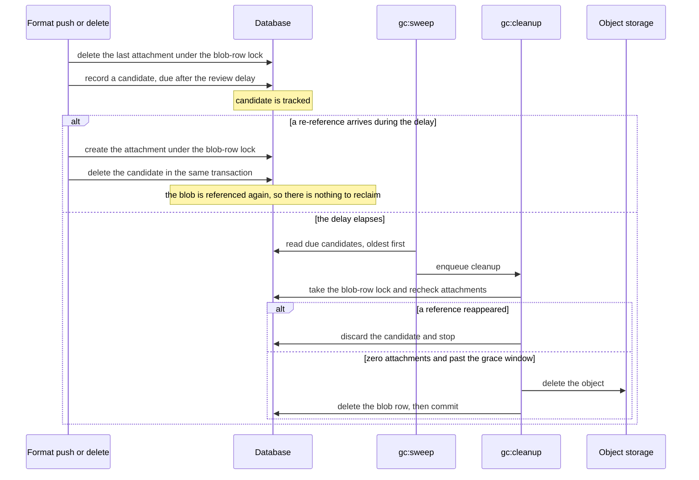
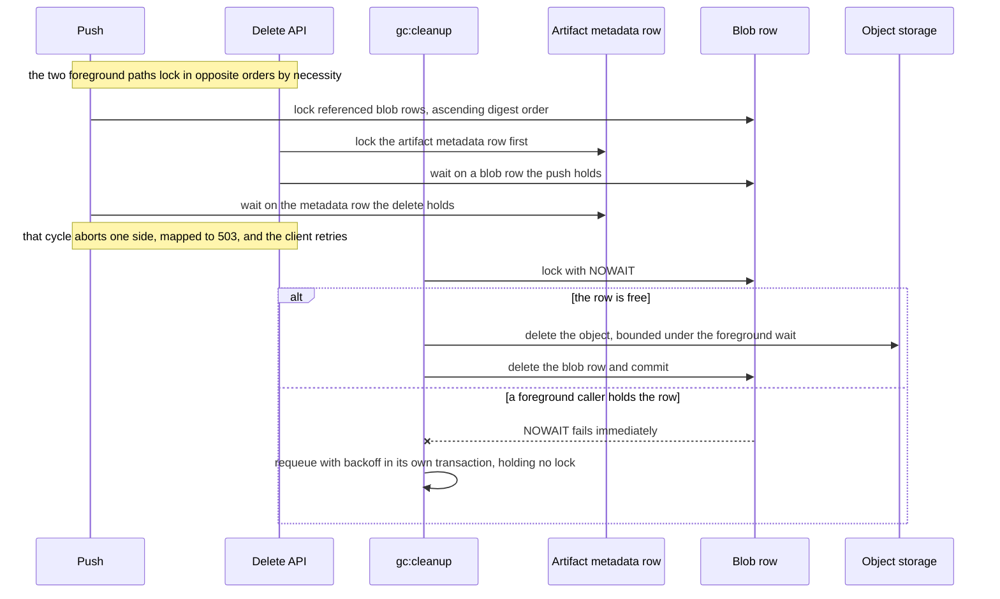

<!-- Design Documents often contain forward-looking statements -->
<!-- vale gitlab.FutureTense = NO -->

## Status

**Proposed.**

## Context

The Artifact Registry stores artifacts as content-addressed blobs ([ADR-008](008_content_addressable_storage.md)), deduplicated within a namespace ([ADR-002](002_storage_deduplication_scope.md), kept namespace-keyed across organization merges by [ADR-022](022_namespace_decoupling.md)). When a client deletes a tag, a manifest, or a package version, the referencing metadata goes away, but the blob and its storage object remain. Unreferenced blobs accumulate and storage grows without bound.

Garbage collection (GC) is that reclamation process. [ADR-010](010_data_retention.md) fixes its contract: GC reclaims blobs no artifact references, and never decides an artifact's fate. Which tags, manifests, or versions to keep is the job of retention, lifecycle policies, and the format layer. GC reclaims what those layers leave unreferenced, whether a delete removes attachments at once or only after a soft-delete window elapses. This ADR decides *how*.

Two properties make GC hard, and both are correctness properties rather than scale problems:

1. **A reclaim must never break a live pull.** Deleting a blob an artifact still references, or one a concurrent push is about to reference, produces a broken artifact and permanent data loss.
1. **Deletion is irreversible.** Once an object leaves storage it is gone. A GC bug does not corrupt a recoverable record. It destroys bytes.

The GitLab Container Registry is the production precedent. Its first GC was offline mark-and-sweep, which cannot run safely while writes continue (the drawbacks are recorded under Alternatives). It later moved to an online model: a review queue with a delay, so a blob dereferenced now is reclaimed only after a window in which a re-push can rescue it. The online model is proven in production, and the Artifact Registry adopts its shape. See the Container Registry's [online garbage collection design](https://gitlab.com/gitlab-org/container-registry/-/blob/master/docs/spec/gitlab/online-garbage-collection.md).

The Artifact Registry's narrower deduplication boundary changes the coordination model. The Container Registry deduplicates instance-wide, which forces cross-namespace reference counting and global coordination. That breadth made the delete-time lock it would need to close its worst push-versus-GC race too costly to adopt, so the Container Registry deferred that lock. [ADR-002](002_storage_deduplication_scope.md) and [ADR-022](022_namespace_decoupling.md) already settled that the Artifact Registry deduplicates within one namespace, so every reference count and reclaim is intra-namespace. That boundary is why the Artifact Registry designs its own protocol rather than porting the Container Registry's, and every departure from the precedent is recorded below.

## Decision

**The Artifact Registry uses per-namespace online deferred garbage collection.** A blob becomes a candidate for reclamation when its last reference within its namespace is removed. The candidate waits in a review queue for a delay, is rechecked at dequeue, and only then has its object deleted from storage, before its metadata row. Candidates come from database queries, not storage enumeration. GC runs as a family of background jobs on the River job backend ([S27](https://gitlab.com/gitlab-org/ops/artifact-registry/-/blob/main/docs/specs/S27-background-jobs-foundation.md)) and the periodic scheduler ([S27-A](https://gitlab.com/gitlab-org/ops/artifact-registry/-/blob/main/docs/specs/S27-a-periodic-scheduling-foundation.md)). The full mechanism is specified in [S28](https://gitlab.com/gitlab-org/ops/artifact-registry/-/merge_requests/728). This ADR records the model and its rationale.

The review queue is a dedicated candidate table, not River's job table. The queue needs a delay, and River enqueues jobs for immediate execution, so the review due time lives in a database column and a periodic job promotes candidates that come due. The candidate row is also what makes a repeated attempt safe, and it is the crash-recovery marker (see Storage-first deletion is crash-safe), so it has to outlive the job that acts on it to serve either role. A River job row does not. It spans that job's own retries, but River prunes finalized rows after a retention period, including the discard that follows exhausted attempts. An unfinished reclaim has to stay visible past that point. Keeping the queue in its own table separates the durable intent to reclaim from the disposable attempt to execute.

### The three properties of the model

**Per-namespace.** The reclaimability test is one query: does any attachment remain for this `(namespace_id, sha256)`? Because deduplication is scoped to the namespace, that query needs no cross-namespace coordination, no global reference count, and no cross-partition scan. The namespace boundary lets the Artifact Registry afford a delete-time blob lock (below), which the Container Registry's instance-wide model deferred as too costly.

**Online.** GC learns a blob is unreferenced from the database when the last reference is deleted, not by walking storage. The application captures a candidate on the same code path that removes the attachment. A low-frequency scan over blob rows backs that path up, and it too reads the database rather than storage.

**Deferred.** Reclamation is never synchronous with the delete. A synchronous reclaim races a near-simultaneous re-push that relies on the object still existing. That race is a correctness property independent of scale: a single-tenant registry with one push per day still has it. A review delay (default 24 hours), a recheck at dequeue, and a row lock close the race.

### Reference counting is the reachability model

A blob's reference count is its attachment count within the namespace. GC reclaims a blob when that count reaches zero. It builds no reachability graph and computes no artifact liveness, because which artifacts to keep is settled before GC ever sees a blob ([ADR-010](010_data_retention.md)).

This is the central simplification. In the Artifact Registry an OCI config or layer blob, a Maven file, and an npm tarball are all the same to GC: a content-addressed blob with an attachment count. When a delete or a soft-delete expiry removes an artifact's attachments, GC reclaims the blobs left at zero attachments and leaves the rest, because a blob another artifact still references keeps a non-zero count. The Container Registry maintains dedicated tables and multiple triggers to track manifest-to-blob references. The Artifact Registry needs neither, because the attachment row is itself the reference.

Deciding *which* attachments a delete removes belongs to the format layer and to soft-delete expiry (S20, Planned), not to GC. The one format-specific consequence worth naming here is OCI. An untagged manifest stays a retained, listable artifact, and per [ADR-010](010_data_retention.md) only the deletion triggers that ADR names remove it. Being untagged is therefore never a reason for GC to delete a manifest.

### The candidate lifecycle

| Stage | What happens |
|---|---|
| **Capture** | A format deletes the last attachment for a blob. In the same transaction, GC records a candidate whose review comes due after the review delay plus jitter. |
| **Tracked** | The candidate waits out the delay. A re-reference during this window deletes the candidate in the same transaction that creates the attachment, so the blob is not reclaimed. |
| **Due** | The delay has elapsed. GC re-runs the attachment check under the blob-row lock, and re-tests the blob's age against the grace window. If a reference reappeared, GC discards the candidate and stops. A blob still inside the grace window is requeued past it rather than reclaimed. |
| **Reclaimed** | Still unreferenced and past the grace window, so GC deletes the object from storage first, then the metadata row, in one transaction. |

Two mechanisms clear a candidate, and they cover different windows. A re-reference during the delay deletes the candidate eagerly, on the push path, inside the transaction that creates the attachment. The recheck at dequeue is the backstop for everything the eager clear cannot see, including a re-reference that commits while the sweep is already in flight. A candidate is a *proposal* to reclaim, confirmed only at the last moment under the lock, so the recheck is what makes the delay safe rather than cosmetic.

The eager clear is not merely tidiness. A live candidate row is the signal that a blob row may be untrustworthy (see Storage-first deletion is crash-safe), so leaving stale candidates on re-referenced blobs would make every later deduplication skip on those digests perform a pointless storage existence check. It also keeps the queue proportional to real garbage, which is what lets the queue-depth and oldest-age metrics mean what they say. The cost is one extra partition-pruned delete inside a transaction that already holds the blob-row lock.

### The job family

GC is six job kinds, all on River. Naming them here is what makes the rest of this document readable, because several controls and failure modes below are scoped to one specific job.

| Job | Cadence | Responsibility | Phase |
|---|---|---|---|
| `gc:sweep` | Periodic, leader-elected | Read candidates that have come due, oldest first, and enqueue cleanup for them. Takes no row locks, because one leader sweeps and a duplicate enqueue is a safe no-op. | 1 (skeleton), 2 |
| `gc:cleanup` | Per candidate, or per batch | Take the blob-row lock, recheck attachments and the blob's age against the grace window, and run the storage-first delete. The only job that destroys blob bytes. | 2, 3 |
| `gc:reconcile-scan` | Periodic, low frequency | The backstop. Find zero-attachment blobs older than the grace window whose namespace holds no in-flight upload, and enqueue any candidate the event path missed. | 1 |
| `gc:expiry-sweep` | Periodic, per namespace | Unlink attachments for package files whose soft-delete window has elapsed. Produces attachment removals, which capture candidates. | 4+ |
| `gc:cache-evict` | Periodic, per namespace | Size-cap-triggered cache eviction. Unlinks the cache attachment and never deletes an object directly. | 4+ |
| `gc:staging-sweep` | Periodic | Delete the staging object and row for each expired upload session. No review delay, because an abandoned upload has no reference to rescue. | 4+ |

Only `gc:cleanup` destroys blob bytes. The other five either feed it or act on things that are not shared content: `gc:expiry-sweep` and `gc:cache-evict` unlink attachments, which produces candidates for the reclamation path to weigh, and `gc:staging-sweep` deletes staging objects that never became blobs. That keeps the contract above intact. An expiry sweep enacts a retention threshold decided by policy rather than deciding an artifact's fate itself, and the blobs its unlinks strand are reclaimed only through the same zero-attachment path as every other blob.

`gc:reconcile-scan` scans blob rows in the database, not objects in storage, and it exists to recover a *missed capture*, not to purge abandoned uploads. Purging abandoned uploads is `gc:staging-sweep`, a different job with a different trigger. The distinction matters because the two are often conflated: a missed capture leaves a real blob with real bytes that nothing references, while an abandoned upload never became a blob at all.

Because the scan reads blob rows, it bounds two leak classes and misses a third. It finds a blob row nothing references, which is the missed capture. It does not find an orphaned *attachment* row, because that leaves the blob with a non-zero count. It also cannot find an object present in storage with no blob row at all, since it never enumerates storage. Both of those belong to the deferred data-reconciliation service ([ADR-011](011_data_reconciliation.md)), which compares storage against the database directly.

### What GC takes from River, and what it owns

GC uses River's own reliability primitives wherever they fit, because a hand-rolled equivalent is another thing to get wrong on an irreversible path:

1. **Retry on failure.** A cleanup that hits lock contention, a storage timeout, or a backend error rolls back and requeues rather than losing the work. The backoff schedule itself is GC's, held on the candidate row so it survives the job attempt that set it.
1. **A maximum attempt count.** A candidate that can never succeed stops consuming job rows instead of retrying forever.
1. **Enqueue uniqueness.** A candidate still due on the next sweep collapses into its in-flight job rather than multiplying job rows.
1. **Periodic scheduling with leader election** ([S27-A](https://gitlab.com/gitlab-org/ops/artifact-registry/-/blob/main/docs/specs/S27-a-periodic-scheduling-foundation.md)), so exactly one replica sweeps.

Three things GC keeps for itself. The backoff schedule above is the first. The review delay is the second, and it lives in the candidate table rather than in a scheduled job, because the delay has to be re-evaluated against live attachment state at dequeue rather than merely waited out. Third, uniqueness is scoped to in-flight states only, because River's default set includes completed jobs, and a blob dereferenced twice inside one review delay must not have its second cleanup suppressed.

### The blob-row lock serializes every race GC can lose

Every operation that adds or removes an attachment, and the GC delete itself, first acquires `SELECT ... FOR UPDATE` on the `blob_storage_blobs` row for that `(namespace_id, sha256)`. This one lock serializes the three races that could corrupt blob state: two deletes racing to capture the same candidate, a push racing the GC delete, and a deduplication skip trusting a row whose object GC is removing.

Each caller chooses its acquisition mode, so GC never makes a client wait:

| Caller | Acquisition | On contention |
|---|---|---|
| Foreground push or delete | Plain `FOR UPDATE`, no `NOWAIT` and no `SKIP LOCKED`, so the caller queues behind the current holder for up to a five second lock timeout | Return HTTP 503, which clients retry |
| Background GC worker | `FOR UPDATE ... NOWAIT`, or a very short timeout | Requeue the candidate with backoff |

The foreground path deliberately waits rather than skipping. `SKIP LOCKED` would let a push proceed without the serialization the protocol depends on, and `NOWAIT` would turn every brush with a concurrent reclaim into a client-visible error. Waiting is correct there because every holder bounds the storage work it does under the lock, with the one exception described below.

Two locks nest on the foreground delete path, and the order is fixed. A delete takes the artifact-metadata row first, then the blob rows it dereferences. A push cannot use that order, because it is creating the metadata row and has nothing to lock until its references validate, so it takes the blob rows first, in ascending digest order to keep two concurrent pushes from cycling against each other. Those two orders can genuinely deadlock against each other. PostgreSQL's deadlock detector aborts one side, and both foreground paths map that abort to the same 503 as a lock timeout, which clients retry, so no caller receives an unmapped 500. A GC requeue is not part of this ordering. It runs in its own transaction, separate from the work transaction that rolled back, and it writes the candidate and job rows rather than the blob row. That is why a worker can requeue a candidate whose blob row it failed to lock: it needs no lock on the blob it just walked away from.

Contention resolves the same way whichever process holds the lock, because the protocol is defined by acquisition mode rather than by caller identity. A background worker that finds the row held gives up at once and requeues, whether the holder is an API request or another GC worker.

The Artifact Registry locks the blob row, where the Container Registry locked its review-queue row, a choice weighed under Alternatives. The cost is that the lock sits on the push path: two pushes that share a blob serialize briefly during the deduplication existence check. The per-namespace boundary bounds that contention to one tenant.

Two operations hold the lock across a storage round-trip, and both bound it at two seconds, inside the foreground caller's five second patience. `gc:cleanup` holds it across the object delete. A push holds it across the existence check that validates a deduplication skip, which it runs only when it finds a live candidate on the blob row. On either timeout the transaction rolls back and the lock releases with nothing deleted or attached, but the two outcomes differ: a slow backend delays reclamation on the GC side, while on the push side it returns a 503 for the client to retry. The push path has one unbounded case left. A push whose existence check finds the object gone re-uploads it inside the same transaction, so that hold lasts as long as the upload. Only a delete that has already removed an object can put a blob row into the state that reaches this path, so Phase 3 is what first exposes it, and bounding the hold is one of that phase's entry-gate criteria (see Operational controls).

### Storage-first deletion is crash-safe

GC deletes the storage object before the database row. A zero-attachment blob is unreachable, so no pull can reach it during the delete. If GC crashes after the storage delete but before the commit, the transaction rolls back and the blob row survives with its object gone.

The candidate row is what makes that survivable. It was written in an earlier transaction, so the rollback that restores the blob row leaves the candidate in place, and a live candidate on a blob row is precisely the marker that the row may no longer describe a present object. Any later push that would skip re-uploading because the row exists sees that candidate, re-validates the object against storage under the lock, and re-uploads if it is gone. The next `gc:cleanup` retries the delete, which is idempotent because a missing object counts as success. This is what makes [ADR-008](008_content_addressable_storage.md)'s guarantee hold under concurrency: the worst case is briefly orphaned storage, never a live reference to a deleted object.

### The grace window, and the one publish it cannot cover

A freshly committed blob is briefly attachment-less between its row being written and the format attaching it. Nothing on the event path can reclaim it, because capture fires on the transition from referenced to unreferenced, and a blob that never had an attachment never makes that transition. `gc:reconcile-scan` is the only path that could enqueue such a blob, since it works from blob rows rather than from attachment deletions. Two filters stop it: it skips any blob younger than a fixed 24-hour grace window, measured from the blob row's creation, and it skips any blob whose namespace holds an in-flight upload. The window is a compile-time constant rather than a configuration knob, shared as one symbol by every path that tests it, so a retune cannot leave the two paths disagreeing. `gc:cleanup` applies the same age test before it deletes, so the window guards the reclaim as well as the enqueue.

Moving capture earlier, to the moment the blob row is written, would not help. Such a candidate would be discarded at recheck once the attachment landed, which is what the backstop already does off the hot path, and it would add a candidate write and delete to every blob of every push. It also would not close the gap below, because a publish slower than the window is collected either way.

The blob's own upload session is deleted when it commits, before the window opens, so the in-flight-upload filter never shields the blob that is actually at risk. It shields only against an unrelated long-held session in the same namespace. That leaves the age window as a committed-but-unattached blob's only real shield, and the window has to exceed the gap between commit and the first attachment. A publish that runs longer has to hold some upload session open in the namespace for its full duration.

A publish that outlasts any session lifetime is the residual the age window cannot cover. It can be reclaimed mid-flight. Closing it needs a storage-layer follow-up that lets a format mark a blob as protected until a deadline it chooses, which is not yet built. This is the model's one unmitigated data-loss path, and it is tracked, not silently accepted.

### A blob in active use is never reclaimed, by design

A blob whose last reference is removed and recreated before every review deadline is postponed forever. Each re-reference clears the candidate, and the next dereference captures a fresh one with a full delay ahead of it, so a heavily reused blob can cycle indefinitely without ever being reclaimed.

That is the intended outcome, not a starvation bug. A blob being referenced again on a sub-24-hour cadence is a blob in active use, and reclaiming it would delete an object the next push has to upload again. The cost is one deduplicated blob's storage for as long as the churn continues, bounded by the blob's own size, and no correctness property depends on that blob ever being collected. The eager clear keeps the queue metrics honest under the pattern, and the cycle's one real cost sits on the push path: the first re-reference after each capture finds a live candidate, so a churning blob pays one existence check under the lock per capture-clear cycle. Whether to narrow that is an open question below.

### Failure handling separates a bad backend from a bad candidate

A storage delete fails for one of two reasons, and GC treats them differently, because the response to persistent failure is permanent exclusion and that must never trap a healthy candidate:

1. **An environmental failure** is a fault in the backend, not in the candidate: a timeout, a network error, a backend 5xx, or throttling. It is correlated by nature, so a degraded backend fails many in-flight deletes at once. A broad rate of these pauses the sweep. The pause is time-boxed and self-resuming, so a backend outage delays reclamation and recovers without a probe.
1. **A candidate-specific failure** is a fault tied to one blob that recurs while the backend serves other deletes normally. Each occurrence accrues a strike, with backoff widening as strikes accumulate. After a bounded number of strikes the candidate is set aside for an operator.

GC does not classify backend error strings, which are brittle and backend-specific. The observed failure *rate* is what separates the two cases: broad means environmental, isolated means candidate-specific. A strike is therefore only recorded when the sweep pause is not already armed, so an outage cannot march the whole queue toward exclusion. This keeps the Container Registry's postpone-on-failure resilience and adds the bound it lacked, so a genuinely stuck candidate is not retried forever.

Setting a candidate aside is exclusion, not deletion. The row stays, kept out of the dequeue by a partial index, and kept out of the queue-drain signals so one stuck candidate cannot inflate the queue age or the due count. A metric surfaces the count for an operator to investigate, and GC never retries it on its own. Recovering such a blob systematically belongs to the deferred data-reconciliation service ([ADR-011](011_data_reconciliation.md)), which can re-derive it from storage-versus-database ground truth. This state is internal to GC's queue and unrelated to the artifact quarantine capability the product roadmap carries, which acts on artifacts a user can see.

### Operational controls

1. **A runtime kill-switch** halts blob reclamation without a deploy. It is a feature flag, evaluated through the Flipt-backed client in LabKit, so an operator flips it the way they flip any other flag rather than by writing to a database row. Two properties matter for a switch guarding an irreversible delete. It fails closed, so a flag service GC cannot reach resolves to reclamation disabled: an outage stalls reclamation rather than removing the control, which trades a recoverable leak for the guarantee. And `gc:cleanup` re-evaluates it before each candidate's delete rather than once per batch, so the stop latency does not grow with the batch size. This is distinct from the deploy-time configuration that wires GC in at all, and from the sweep-pause state, which stays in the database because workers coordinate on it rather than an operator setting it.
1. **Metrics and structured events are the operator surface.** Queue gauges report candidates tracked, candidates due, the oldest candidate's age, and the count set aside. A large tracked count is the healthy steady state, because those candidates are waiting out a delay that has not elapsed. Two push-path instruments sit alongside the queue gauges: a histogram of blob-row lock waits and a count of deduplication existence checks. Both are live from Phase 1, which is what gives the delete-attempt marker question (see Open questions) its deciding data before Phase 3 begins. Every irreversible delete also emits an event carrying its digest and namespace, so each one has a forensic trace.
1. **Five alarms cover the failure modes.** A rising due count means GC is draining slower than the workload produces garbage. A sweep pause stuck on across consecutive scrapes means the storage backend has been failing deletes long enough to keep the pause armed, so reclamation has stalled. A non-zero set-aside count means a candidate needs an operator. An over-deletion tripwire fires when the reclaim rate, in objects or bytes, exceeds a multiple of its trailing baseline, which is the pre-loss signal for a capture bug or an upstream over-dereference and the one failure the others do not catch. The fifth reports that reclamation is halted, and separates an operator's intentional stop from a halt the fail-closed flag produced on its own, so neither is misdiagnosed as a drain failure.
1. **The per-namespace admin status route arrives in Phase 4.** It reports that namespace's candidate counts, the oldest candidate's age, the set-aside count, and the timestamp of the last completed reclamation, which answers per-namespace support questions a fleet-wide metric cannot. Metrics and events cover the operator questions in the earlier phases, and Phases 1 and 2 delete nothing.
1. **A phased rollout** concentrates all data-loss risk at one gated step. Phase 1 ships the schema, candidate capture, and the backstop scan, with no deletion. Phase 2 adds the recheck-and-discard path, still deleting no objects. Phase 3 enables the irreversible object delete behind one entry gate: the two-sided push lock landed on both sides with a race test proving it, the grace-window property tests, a review delay validated against observed re-push timing, and a bound on the re-upload hold (see The blob-row lock serializes every race GC can lose), which Phase 3 is the first phase to expose. Phase 4 and later add soft-delete expiry sweeps for the package formats, cache eviction for virtual and remote repositories, and abandoned-upload cleanup.

### Where this departs from the Container Registry, and why

The Artifact Registry adopts the Container Registry's shape, so each deliberate difference carries its own reason:

1. **Per-namespace rather than instance-wide.** Settled by [ADR-002](002_storage_deduplication_scope.md) and [ADR-022](022_namespace_decoupling.md). Every reference count is intra-namespace, which sheds the cross-namespace coordination that made the Container Registry's delete-time lock unaffordable.
1. **The blob row is locked, not the review-queue row.** The blob row is the durable invariant, so one lock serves the capture race, the push race, and crash recovery. The accepted cost is brief serialization on the push path.
1. **Attachment count is the reference count.** No dedicated reference tables and no triggers, because the attachment row is itself the reference.
1. **The review queue is its own table, not the job backend's.** The delay has to be re-evaluated at dequeue, and the candidate row has to outlive any single attempt to serve as the crash-recovery marker.
1. **Capture fires only at the zero transition.** A dereference that leaves other references in place writes nothing. The Container Registry enqueues on every dereference regardless of what remains, so its queue carries blobs that are still referenced, where the Artifact Registry's holds one row per blob per garbage episode and stays proportional to real garbage.
1. **A re-reference clears its candidate eagerly, rather than waiting for the recheck.** The candidate row doubles as the untrustworthy-row marker, so stale candidates would tax later deduplication skips, and the queue metrics stay meaningful.
1. **Persistent failure is bounded.** The Container Registry postponed a failing candidate indefinitely. Setting one aside after a bounded number of strikes keeps a genuinely stuck candidate from being retried forever, and the rate-based split keeps an outage from tripping it.

## Consequences

### Positive

1. **No stop-the-world.** Online GC reclaims continuously without blocking writes, unlike offline mark-and-sweep.
1. **One mechanism for correctness.** The blob-row lock closes the capture race, the push-versus-GC race, and the crash-recovery case.
1. **A simple reachability model.** The attachment count is the reference count, so blob reclamation needs no artifact-liveness graph, no per-format reference tables, and no triggers.
1. **A bounded blast radius.** The per-namespace boundary sheds all cross-namespace coordination. The review delay and recheck make a wrong dereference recoverable up until the delete.
1. **Recoverable capture.** A missed capture is a storage leak `gc:reconcile-scan` collects, never a premature delete: capture errs toward leaking, not losing. The one path that can lose is the committed-but-unattached residual, recorded under Negative.
1. **Operable under incident.** The runtime kill-switch stops reclamation without a deploy and fails closed when its flag service is unreachable, and the phased rollout isolates irreversible risk behind one gate.

### Negative

1. **Reclamation is deferred, not immediate.** A blob dereferenced now is reclaimed only after the review delay. Operators and users see storage logically deleted but not yet physically freed, so the queue metrics and byte accounting have to make pending reclamation visible to avoid the "nothing happened" confusion that deferred reclamation invites.
1. **One unmitigated data-loss path.** A publish whose commit-to-first-attachment gap outlasts both the grace window and any in-flight namespace upload session can have its blob reclaimed mid-flight (see The grace window, and the one publish it cannot cover). It is rare and tracked, and until the storage-layer follow-up that section names lands, the Phase 3 delete stays behind its entry gate (see Operational controls), so a format ships the irreversible delete only once its publishes fit the window.
1. **A lock on the hot path.** Two pushes sharing a blob serialize briefly on the blob-row lock. The magnitude under real same-namespace push concurrency across formats is unmeasured, because the Artifact Registry has no production traffic yet and the Container Registry locked a different row. A load test must quantify it before it is treated as a bottleneck.
1. **A cross-spec handshake.** Safe deletion depends on the format push paths acquiring the same lock. GC ships the queue side first, and the two-sided lock is the first item in the Phase 3 entry gate (see Operational controls).
1. **Deferred coverage for caches and orphaned attachments.** Cache eviction is capacity-driven rather than zero-reference and arrives with the cache tables. Certain orphaned-attachment leaks, and any object in storage with no blob row at all, are collected only when the deferred data-reconciliation service ([ADR-011](011_data_reconciliation.md)) ships. All of these are recoverable leaks, not data loss.
1. **The backstop scan is the only safety net at launch.** [ADR-011](011_data_reconciliation.md) defers the storage-versus-database reconciliation service, so `gc:reconcile-scan` carries recovery duty alone until then, and it covers blob leaks rather than every leak class.

## Alternatives

### Offline mark-and-sweep

Enumerate all storage, mark everything reachable from live metadata, and sweep the unmarked remainder. This is the Container Registry's original model.

**Why rejected.** It requires stopping writes or risks deleting a blob a concurrent push references, it scans all storage regardless of how little changed, and a large sweep cannot resume cleanly after an interruption. Online GC does work proportional to churn and never blocks writes.

### Synchronous reference-counted deletion

Delete the object the moment its last reference is removed.

**Why rejected.** It races a near-simultaneous re-push that relies on the object still existing, and that race exists at any scale. The review delay, the recheck, and the lock close it. Immediate deletion cannot.

### Database triggers for candidate capture

Capture and clear candidates with `AFTER INSERT` and `AFTER DELETE` triggers on the attachment table.

**Why rejected for launch.** Every attachment-delete site already routes through one shared store, so capturing in application code there is unit-testable, emits an observability event on the same path, and a missed capture is a recoverable leak the backstop collects. Triggers carry the same read-committed race (closed by the row lock, not by triggers) without those benefits. A `forbidigo` lint bans raw deletes on the table to protect the funnel. This is revisited if a future format deletes attachments outside the store.

### Locking the review-queue row instead of the blob row

Lock the candidate row on the GC path and keep the hot blob path lock-free, as the Container Registry does.

**Why rejected.** The blob row is the durable content-addressable invariant, so locking it gives the lock referential meaning and lets one mechanism serve all three races. Locking a queue row would need a separate mechanism for the push-versus-GC race and the crash-recovery case. The accepted cost is the brief push-path serialization above.

### A distributed lock keyed on the digest

Serialize on an advisory lock or a Redis lock keyed on `(namespace_id, sha256)`, leaving the blob row itself unlocked.

**Why rejected.** The row lock costs no extra round-trip, because every path that needs it already reads or writes that row and can take the lock in the same statement. An advisory or external lock is a separate acquisition against a separate subsystem, and it protects nothing on its own: the blob row remains writable by any path that forgets to take it, whereas a row lock is enforced by the row. An advisory key is also a 64-bit hash of the pair, so unrelated digests can collide onto one key and serialize against each other. A Redis lock adds a second failure domain to the irreversible path, and its correctness then rests on lease expiry rather than on transaction boundaries. This is worth revisiting only if a load test shows blob-row lock waits are a real bottleneck (see Consequences).

### Out-of-band object deletion

Commit the metadata change first, then delete the object from storage in a separate job, so no transaction holds the blob-row lock across a storage call.

**Why rejected for launch.** It inverts the ordering that makes crash recovery safe. Storage-first delete guarantees that a surviving blob row with a missing object always carries a live candidate to mark it untrustworthy. Deleting the row first would leave the object with nothing pointing at it, so a crash between the two steps produces a leak nothing in GC can find, because GC scans blob rows and this leak has none. Only the deferred reconciliation service could. The lock-hold cost this would avoid is already bounded at two seconds, well inside the foreground caller's patience, and the timeout releases the lock without deleting anything. If measurement shows that hold time hurts push latency, this is the leading candidate, because it needs a tombstone state rather than a change to the reachability model.

### Materialized manifest-to-layer edges

Write a per-manifest layer table at push time, making OCI layer reachability a pure database set-difference.

**Why rejected.** Reachability is not GC's to compute. The attachment count is the reference count, and which config and layer attachments a manifest delete removes is the format layer's cascade, so GC never needs a manifest-to-layer edge and never reads a manifest payload. Keeping it that way is also a security property: a crafted or malformed manifest cannot influence which blobs GC reclaims. An edge table might still earn its place as a format-layer optimization for computing that cascade, which is a decision for the OCI format rather than for this ADR.

## Open questions

1. **Whether to gate the deduplication existence check on a delete-attempt marker.** A live candidate is the untrustworthy-row marker (see Storage-first deletion is crash-safe), so a deduplication skip that finds one re-validates against storage under the lock. That proxy is conservative. The object can only be absent if `gc:cleanup` issued its storage delete and then failed to commit, which is rare, while candidates are common, so a blob in active use pays an existence check per capture-clear cycle to guard a window it is almost never in (see A blob in active use is never reclaimed, by design). The alternative is a nullable timestamp on the candidate row, written in its own committed transaction immediately before the storage delete is issued, so that it survives the rollback that restores the blob row. A skip that finds a candidate without that marker could then skip the storage round-trip.

   In favor: it removes the only per-cycle cost that crosses the network, and moves it from the foreground push path to the background GC path at one committed write per cleanup attempt. It also makes the no-delete phases free of the check, because no delete exists there to guard against.

   Against: it adds a second piece of state to an irreversible path, and the safety argument weakens from one that holds by construction, where a candidate means the object may be gone, to one that depends on every object delete being preceded by a committed marker. Out-of-band deletion breaks that, although it equally breaks the proxy in use today. The cost being removed is also unmeasured, because the Artifact Registry carries no production traffic yet.

   The re-reference rate and the lock-wait distribution observed in Phases 1 and 2 are what should decide this. Adopting the marker amends S28 rather than changing the model this ADR records.

## References

1. [ADR-002: Storage Deduplication Scope](002_storage_deduplication_scope.md) - the namespace boundary GC operates within
1. [ADR-008: Content-Addressable Storage](008_content_addressable_storage.md) - CAS keys and storage-before-database delete ordering
1. [ADR-009: API Design](009_api_design.md) - the manifests list endpoint, which surfaces manifests independently of their tags
1. [ADR-010: Data Retention](010_data_retention.md) - GC's contract: reclaim zero-reference blobs, decide no artifact fate
1. [ADR-011: Data Reconciliation Feature Timing](011_data_reconciliation.md) - reconciliation service deferred, so the backstop scan carries recovery duty at launch
1. [ADR-022: Namespace Decoupling](022_namespace_decoupling.md) - deduplication stays keyed by namespace across organization merges
1. [S28: Garbage Collection](https://gitlab.com/gitlab-org/ops/artifact-registry/-/merge_requests/728) - the full mechanism, schema, and coordination protocol, in review
1. [Container Registry online garbage collection](https://gitlab.com/gitlab-org/container-registry/-/blob/master/docs/spec/gitlab/online-garbage-collection.md) - the production precedent for the review-queue-with-delay model
