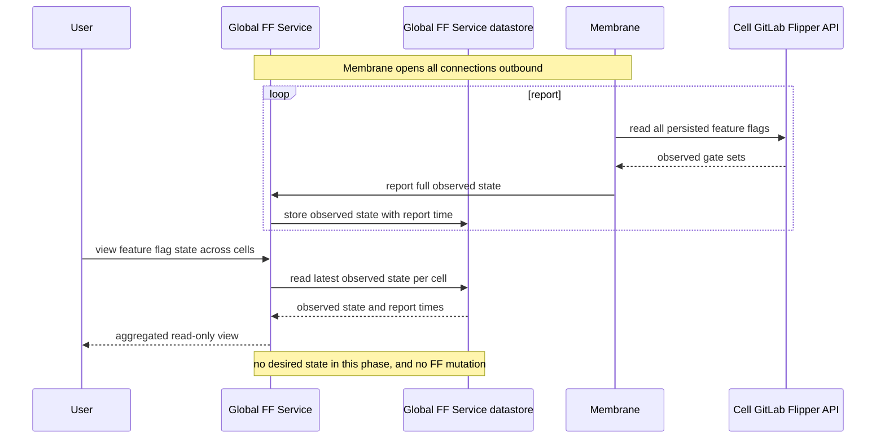
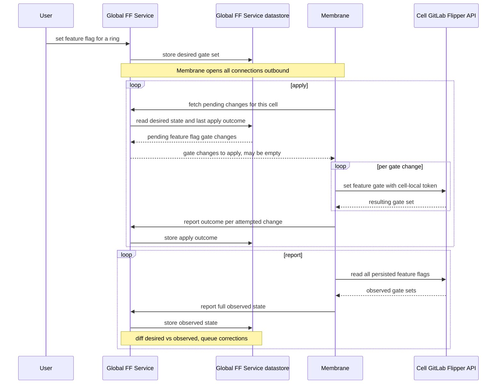
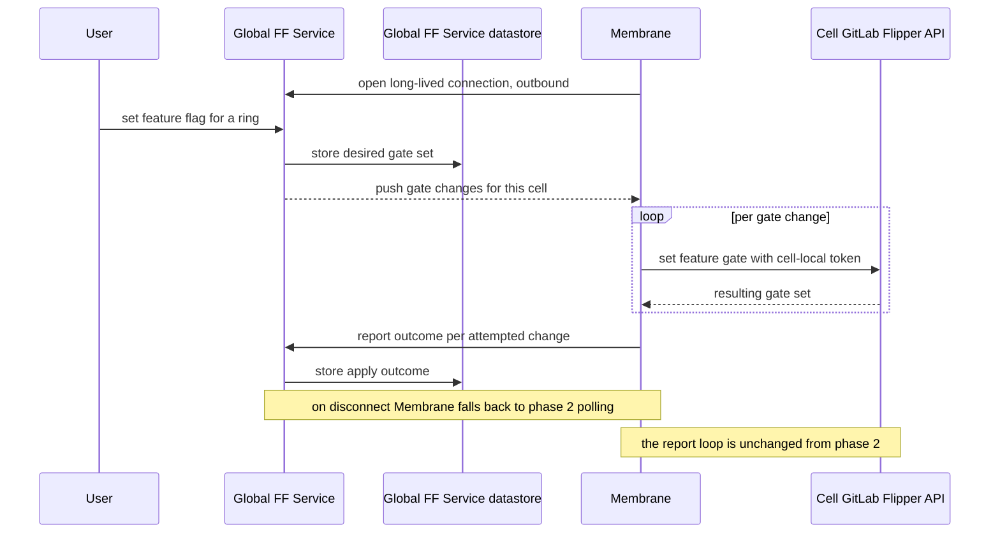

## Context

Feature flags are needed on cells before the first customers are migrated over. They are used to roll out
risky features and to mitigate incidents, so engineers must be able to set and query flags on cells
much as they do on the Legacy Cell today. This work is tracked in [epic &1423](https://gitlab.com/groups/gitlab-com/gl-infra/-/work_items/1423),
and builds on the prior high-level design [Setting feature flags in Cells](../infrastructure/feature_flags.md).

A hard constraint shapes the design: each cell's GitLab API token is a cell-local credential that
must never leave the cell boundary. A central service cannot hold per-cell tokens and call each cell's API directly.

To satisfy that constraint, `@ayufan` suggested introducing a cell local service that acts as a control plane for cell
operations. [Membrane](https://gitlab.com/gitlab-org/cells/membrane) was introduced (tracked in child [epic &2055](https://gitlab.com/groups/gitlab-com/gl-infra/-/work_items/2055)) as a small cell-local control plane service,
one instance per cell, that holds the cell's `flipper_feature`-scoped token (stored in-cell from AWS Secrets Manager)
and translates that into calls against the cell's own GitLab Flipper API.

Membrane's first feature flag implementation was an inbound byte-for-byte proxy of the GitLab `/api/v4/features` API over
its `/v1` API, intended to be called from outside the cell. This ADR redirects the direction away from that inbound model
toward one where Membrane connects outbound to a global feature flag service (see [Decision](#decision) and
[Alternatives considered](#alternatives-considered)). The global feature flag service (a dashboard UI with cross-cell
aggregation) that will front Membrane does not exist yet.

## Decision

### Phased delivery

We will deliver feature flag management on cells in three phases, building the global feature flag service iteratively and
keeping Membrane an outbound-connecting service in every phase. Each phase avoids the work and platform dependencies that
are not yet needed, so we can deliver and use parts of the system as they become ready.

### No inbound connections to the cell

There are two main reasons for outbound-only traffic from Membrane:

1. Dedicated tenants are behind private networking and may not be reachable inbound at all. Network reachability is asymmetric: a cell
   the global service cannot reach inbound, can still reach out to the global service.

1. Pull vs push (who initiates and owns the transfer): With push, the global service has to hold per-cell retry queues and
   backoff timers per cell. With pull, each Membrane tracks only its own failed fetches and retries on its own schedule.
   With a growing number of cells, a push model will keep adding pressure on the global service, while
   a pull model will scale better.

### Phase 1: Minimal read-only global service

We build the smallest useful global service first: a read-only service that aggregates and displays the observed feature flag
state of every cell.

Each cell's Membrane service polls its cell's Flipper API for the current feature flag state of all feature flags and reports it
outbound to the global service. The global service aggregates these reports and displays them, giving a cross-cell and per-ring
view of feature flag state (including where cells within a ring disagree with each other). The global service persists the
aggregated observed state it receives from each cell so it can serve that view; this is the global service's own storage and is
separate from the cell.

The global service requires users to log in, and attributes access to the logged-in user. There is no desired-state storage, no
feature flag mutation, no reconciliation, and no long-lived streaming in this phase. Membrane only ever connects outbound, so
there is no inbound-to-cell path to solve.

### Phase 2: Desired state, mutation and reconciliation

We add desired-state storage to the global service, feature flag mutation through the global service, feature flag side effects (for example,
feature-flag-log issues and rollout annotations), and a reconciliation loop.

The global service owns the desired feature flag state and computes the diff. It compares the desired state for a
cell's ring against the observed state that cell last reported, and derives the gate changes that need to be applied.
Membrane fetches those pending changes, applies each one to the cell's Flipper table using the cell-local token, and
reports the outcome of each attempt. Membrane holds no desired state and no record of what it applied, so it can
restart at any point without losing anything.

The global service identifies the cell from the `tenant_id` carried in Membrane's mTLS client certificate (the cell's
per-cell certificate already sets the `tenant_id` as the certificate subject's Organization). It matches that `tenant_id`
against the ring structure in Tissue to determine which ring the cell belongs to, and returns the pending changes
for that ring.

Reconciliation in this phase is poll-based: Membrane fetches pending changes from and reports observed state to the global service on an interval. This
deliberately avoids long-lived streaming, so it carries no dependency on Runway support for multi-hour connections.

In phase 1, Membrane periodically polled its cell and reported the state of all feature flags to the global service. This continues in
phase 2 and is used to detect feature flag drift in a cell.
Manual changes made directly on a cell appear as drift in the next observed-state report. The global service then
queues a correction, which Membrane applies on a following apply.

Membrane never reads the cell's full feature flag state while a change is being applied. This keeps observed state unambiguously newer than any
completed apply, so reports need carry no ordering metadata. Whether this is achieved by a single sequential loop or by explicit synchronization
between two concurrent loops is an implementation decision.

### Phase 3: Long-lived streaming (target state)

We add long-lived streaming on top of the reconciliation loop as a latency optimization. Instead of learning about pending
changes on the next poll, Membrane opens a long-lived connection outbound and the global service streams changes to it in near
real time. If the stream drops, Membrane retries with backoff and falls back to plain polling until the stream can be
re-established, so the polling path from Phase 2 remains the fallback.

Long-lived streaming depends on Runway support for multi-hour connections, which needs to be resolved before this phase.

### Invariants across all phases

1. On the cell side, the existing Flipper table is the sole store of applied state. Membrane adds no second store on the cell and requires
   no Rails database schema change. This constrains the cell side only. The global service has its own storage for aggregated observed state
   and, from Phase 2, desired state.
1. Membrane initiates all connections (outbound only); it exposes no inbound feature flag API.
1. Membrane holds no desired state and no record of what it applied.
1. The cell-local token never leaves the cell boundary.
1. The global service authenticates users and attributes every change and access to a user.

### Out of scope

1. The detailed reconciliation mechanism, including versioning and provenance (who/what set the FF value) of reconciled state,
   observed-state snapshot transport, and cell-to-ring resolution. These will be captured in a follow-up ADR or design document.
1. Fine-grained rollout, ring targeting, and per-cell gradual rollout (follow-up [epic &1448](https://gitlab.com/groups/gitlab-com/gl-infra/-/epics/1448)).
1. Tenant-model and cell Rails schema changes to record feature flag applied state.
1. The internal design and long-term ownership of the global feature flag service.
1. The detailed authentication and authorization model of the global service. The direction (users log in and every change
   is attributed) is stated above; the full model is deferred.

## Alternatives considered

### ChatOps as the interim entry point

An earlier version of this direction used ChatOps as the interim entry point: ChatOps would call Membrane's inbound feature
flag API to set and query flags on cells until the global service existed. This was rejected in favor of building the global
service iteratively, because:

1. The work is throwaway. The inbound-to-cell path would be removed once the global service exists, so the effort spent on it
   would not carry forward.
1. The inbound path is blocked. Cells sit behind Cloudflare, which terminates TLS on the cell hostname and opens a separate
   connection to the cell, so a client certificate never reaches Membrane. Reaching Membrane inbound would require additional
   infrastructure (for example, Cloudflare API Shield mTLS to verify a client cert and forward the result as a header).
1. ChatOps has no client identity or per-ring fan-out today. It would need a dedicated Vault PKI mount, role and policy for an
   mTLS client identity, and a new abstraction to resolve and iterate over the cells in a ring.
1. It offers weaker access control. Anyone able to run a ChatOps command can change a feature flag, whereas the global service
   authenticates users and attributes every change.

Building the read-only global service first reuses the outbound direction that the target state needs, avoids the blocked
inbound path, and delivers useful cross-cell visibility with a comparable amount of work.

## Consequences

### The good

1. We can start using parts of the system as they are ready.
1. The system delivers useful cross-cell feature flag visibility from the first phase.
1. Connectivity is outbound only (from each cell) in every phase.
1. Every change to feature flag state is made by an authenticated user and attributed to them.

### The not so good

1. Engineers cannot set feature flags on cells until the second phase; the first phase is read-only.
1. Membrane's already-built inbound feature flag proxy is not used by this direction and will be removed.
1. Long-lived streaming in the final phase depends on Runway support for multi-hour connections, which is not yet resolved.
