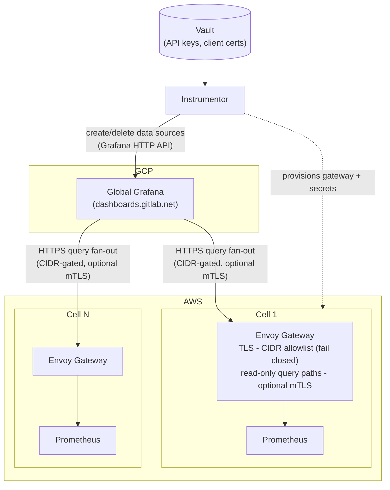



## Summary

Observability 2.0 builds on the foundations established in
[Observability for Cells](observability.md).
Rather than repeating those requirements, this document focuses on the
**aggregation layer** changes needed to achieve a unified, global observability
experience across all Cells.

## Goals

The primary goal is **OBS4: Unified global (cross-cell) view** (Must Have):
a single pane of glass that fans out queries to each Cell, without duplicating
telemetry data storage. Goals OBS1 through OBS3 are covered in
[Observability for Cells](observability.md) and remain unchanged.

## Infrastructure Context

Cells deployments use **Instrumentor**, the same tooling used for GitLab
Dedicated environments. While Instrumentor supports both AWS and GCP, and
an [earlier ADR](observability.md#design-and-implementation-details) explored
GCP support for Cells, **AWS is currently the only relevant target for Cells**.

See the [Deployments](deployments.md) design document for details on how Cell
environments are deployed.

## Design: Unified Global View (OBS4)

### Approach: Grafana Federated Pull

Each Cell retains its own observability stack. Each Cell's observability data
sources are registered to the **global Grafana instance**, providing a single
unified view without centralizing data storage.

See [ADR 028: Observability Federation](../decisions/028_observability_federation.md)
for the details behind the gateway, authentication, and automation layers.

### Why Federated Pull Instead of Centralized Remote Write

A centralized architecture, where every Cell continuously remote writes its
full telemetry stream into a global Mimir cluster, was initial considered
(see [design](https://gitlab.com/gitlab-com/gl-infra/tenant-scale/tenant-services/team/-/work_items/403)).

Each Cell is expected to produce telemetry volumes comparable to a
GitLab.com-scale deployment. Replicating the complete metric set from every
Cell into a shared Mimir cluster would multiply metric cardinality by roughly
`.com x Ntenants`, significantly increasing storage, ingestion, and query load
on the central observability platform. As the number of Cells grows, this
approach scales operational complexity and infrastructure costs linearly,
without a clear understanding of which metrics justify that cost.

Today we have little insight into how many metrics a Cell emits, and our
current baseline is derived largely from GitLab Dedicated. Before shipping
telemetry to central storage, several questions need answers: Do we need to
send all metrics, or should we filter? Which metrics are worth storing
centrally, and which should remain local to the host? Answering these is a
prerequisite to a well-scoped centralized design.

Therefore, Observability 2.0 adopts a federated pull model in the interim.
Each Cell remains the authoritative owner of its telemetry data, while the
global Grafana instance queries individual Cells on demand to provide a
unified cross-Cell view. This buys time to understand the scope of the data
and make informed decisions about what gets stored centrally, while still
providing a centralized query dashboard across all Cells.

This approach:

- avoids duplicating metric storage;
- distributes ingestion and retention costs to each Cell;
- reduces operational pressure on the central observability platform; and
- allows Cells to scale their observability infrastructure independently.

The pull model shifts network egress costs from ingest time under remote write
to query time under federation. It is currently unclear whether query-time
egress is lower or higher than continuously remote writing all metrics, and this
trade-off is accepted for the initial design. To validate this assumption, we
should track per-tenant aggregate network egress so the cost of both approaches
can be compared directly if we transition between models.

This design also leaves room for future optimization. As telemetry
requirements become better understood, a curated subset of high-value metrics
can be selectively remote written from each Cell into a centralized Mimir
cluster for long-term analytics, fleet-wide reporting, or other use cases that
benefit from centralized storage. The initial architecture does not preclude
this evolution; it simply avoids centralizing all telemetry before there is a
demonstrated need.

Alerting follows a different model. Prometheus in each Cell remote writes alert
series to the global Mimir cluster. Unlike raw metrics, alert data has
relatively low volume while providing significant operational value.
Centralizing alerts enables fleet-wide visibility into correlated incidents,
identification of widespread service degradation across multiple Cells, and
coordinated operational response across tenants without requiring the
underlying metrics to be centrally stored.

### Key Design Decisions

- **No central data store**: Data remains in each Cell's observability stack.
  Avoids storage duplication and preserves data sovereignty per Cell.
- **Consistent Cell instrumentation**: Each Cell must expose compatible
  observability endpoints consumable by Grafana as a data source.
- **Query-time aggregation**: When data aggregation is needed across tenants,
  the global Grafana instance queries and aggregates results at query time
  across all registered Cell data sources.

### Resolved Questions

The following design questions are answered in
[ADR 028: Observability Federation](../decisions/028_observability_federation.md)
and the federation rationale above:

- [x] How do we handle a Cell being unreachable during a global query?

  A primary trade-off of the pull-based architecture is the temporary loss of
  access to a tenant's metrics during an outage. Since metrics remain local to
  each tenant, they cannot be queried while the tenant is unavailable.

  Prometheus persists its time-series data on a persistent volume claim (PVC).
  As long as the PVC is preserved during recovery, historical metrics are
  restored when the tenant comes back online, preserving metric continuity
  after recovery.

  Logs are unaffected by this limitation because they continue to be
  centralized and remain accessible independently of the tenant's availability.

- [x] How is authentication/authorization handled between the global Grafana
  instance and each Cell's observability stack?
- [x] Do we need a global alerting layer, or do alerts remain Cell-local?
- [x] How are new Cells automatically registered as data sources in global
  Grafana?
