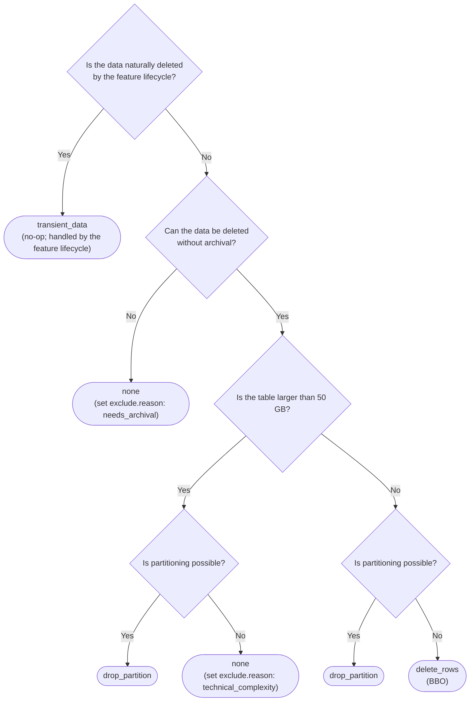



## Motivation

As part of our effort to [Limit Table Sizes](../database_size_limits/_index.md), the database team is developing a data retention policy framework that
other teams will follow in order to actively limit their table sizes.

Today, retention and data lifecycle management on GitLab.com is handled inconsistently. Individual teams solve it per table,
with no shared vocabulary for describing the retention window, no agreed way of enforcing it, and no single place to
record why a given decision was made. The result is that table growth is discovered reactively, and remediation work
is designed from scratch each time.

This document proposes a unified, declarative framework for configuring the data lifecycle of a table, so that a
retention decision is made once, recorded next to the table, and enforced by tooling.

## Recommended framework

A unified, declarative framework for configuring the data lifecycle of a table. The fields below are added as
top-level keys in `db/docs/data_retention/<table_name>.yml`, and validated in CI. Because the configuration lives in
its own dedicated file, the fields do not need to be nested under a wrapping key.

Enforcement tooling will be set in place to verify that retention is actively being applied to all the tables in question.

### Field specification

| Field                   | Description                                                          | Value type                                                     |
|-------------------------|----------------------------------------------------------------------|----------------------------------------------------------------|
| `exclude`               | Excludes the table from data retention, with a reason                | Object with `reason`: `indefinite_retention`, `needs_archival`, `technical_complexity`; unset means not excluded |
| `retention_window`      | How long the data remains in the database since its initial creation | Numeric (days); `-1` only when `exclude` is set                |
| `enforcement_strategy`  | How the retention window is enforced in our systems                  | `drop_partition`, `delete_rows`, `transient_data`; `none` only when `exclude` is set |
| `enforcing`             | Whether the retention policy is actively enforced                    | Boolean                                                        |
| `work_item`             | The issue or epic recording the justification and enforcement plan   | Issue or epic reference                                        |
| `pause_mechanism`       | How retention can be disabled for this table                         | `none`, `application_setting`, `feature_flag`                  |
| `pause_mechanism::name` | The name of the application setting or feature flag                  | String                                                         |

#### Exclude

Excludes the table from data retention. Unset by default, meaning the table is subject to retention. A table is
excluded by setting `exclude.reason` to one of a small, fixed list of values. No database team approval is required —
exclusion is self-served by picking a valid reason and recording the justification in the `work_item`. CI validates
that `reason` is one of the allowed values.

**Allowed reasons:**

1. `indefinite_retention` — the data must remain in Postgres indefinitely because archival does not cover its
  organizational needs, for example a core entity table (for example `organizations`) that does not accumulate
  rows that can be aged out.
1. `needs_archival` — the data cannot be deleted from OLTP because it must first be moved to an archival system.
  The archival needs and justification MUST be recorded in the `work_item`.
1. `technical_complexity` — a table larger than the 50 GB soft limit that cannot be partitioned, so `drop_partition`
  is not achievable. The specific technical constraints that make partitioning impossible MUST be justified in the
  `work_item`.

Being technically difficult to delete from is **not**, on its own, a valid exclusion reason. If a table can remove
data — even if doing so is awkward or requires engineering effort — it is not excluded; it uses `delete_rows` ([Background Operations](https://docs.gitlab.com/development/database/background_operations/)) and
records the reasoning in the `work_item`. The exception is `technical_complexity`, which is reserved specifically for
large tables where partitioning is not possible, with the constraints justified in the `work_item`.

When `exclude.reason` is set, the two coupled fields are fixed:

1. `retention_window` MUST be `-1`.
1. `enforcement_strategy` MUST be `none`.

The coupling is bidirectional: `retention_window: -1` and `enforcement_strategy: none` are valid **only** when
`exclude.reason` is set. In every other case both fields MUST be set to concrete values following the
[decision tree](#enforcement-strategy). CI validation on these fields enforces this coupling.

#### Retention window

How long the data remains in the database since its initial creation.

**Value type:** numeric (days). `-1` is valid only when `exclude.reason` is set (see [Exclude](#exclude)); in all
other cases this field MUST be set to a positive number of days.

#### Enforcement strategy

How the retention window is enforced in our systems.

**Potential values:**

1. `drop_partition` — table is partitioned and partitions are dropped once they age past `retention_window`.
1. `delete_rows` ([Background Operations](https://docs.gitlab.com/development/database/background_operations/)) — data cannot be retrieved after deletion.
1. `transient_data` — data tied to a user or feature lifecycle that is already deleted as part of that lifecycle.
1. `none` — the table is excluded from retention. Valid only when `exclude.reason` is set (see [Exclude](#exclude)).

Outside the excluded case, this field MUST be set to `drop_partition`, `delete_rows`, or `transient_data` following the
decision tree.

##### Caveat: data recovery

The point at which data becomes unrecoverable differs by strategy:

1. `drop_partition` — after the retention period the partition is detached and kept for a grace window before being
  dropped (7 days by default in the current `PartitionManager`, configurable to a lower value). Data remains
  recoverable from the detached partition until it is dropped.
1. `delete_rows` — a hard cutoff: rows are lost immediately on deletion, as no soft-delete system is in place today.
1. `transient_data` — data loss is governed by the owning feature's lifecycle, not by this framework.
1. `none` — no data loss; the table is retained indefinitely.

##### Why deleting rows is a last resort

A `DELETE` is a write, and enforcing a retention window through deletes turns cleanup into a continuous write workload
that scales with volume. To hold a retention window on a growing table, the deletion rate has to keep pace with the
insertion rate — so every row inserted is eventually a row deleted, and the table carries roughly double the write
load it would otherwise. This cost is paid forever, in proportion to how much data flows through the table:

1. **Throughput.** To keep the retention window, the deletion rate must match the insertion rate. Every deleted row is
  itself a write: it dirties the heap page, leaves a dead entry in every index, and generates WAL, all of which
  autovacuum later reads and rewrites to clean up. Enforcing retention through deletes therefore roughly doubles the
  table's write load, and if deletion cannot keep up with insertion the retention window is never enforced.
1. **Connections.** Every batch holds a pooled connection for the length of its transaction, and keeping up with a high
  insertion rate means running many of them in parallel.
1. **I/O load.** Each deleted row writes its heap page and leaves a dead entry in every index, which autovacuum then
  reads and rewrites.
1. **Replication load.** The resulting WAL ships to every replica and to the WAL archive, adding lag.

`drop_partition` is not free either, but its cost is one-time: converting an existing large table to a partitioned
one is an expensive migration (see [Large tables](#large-tables)). After that, `DETACH PARTITION
CONCURRENTLY` is cheap regardless of how many rows the partition held, and tables partitioned from the start avoid the
migration cost entirely. So `delete_rows` pays continuously in proportion to volume, while `drop_partition` pays once.
See PlanetScale's [The only scalable delete](https://planetscale.com/blog/the-only-scalable-delete) for more.

`delete_rows` is still reasonable for narrow, lightly indexed, low-traffic tables with no viable partition key —
record the reasoning in the `work_item`.

##### Large tables

The hard limit for a table on GitLab.com is 100 GB. We use 50 GB as a soft limit — a buffer that leaves room to
partition existing tables or perform actions to consistently reduce the size footprint before the hard limit is
reached. Tables larger than this 50 GB soft limit must use partitioning. Any non-partitioning proposal for a table
over this limit must record its justification in the `work_item`. See
[Large tables limitations](https://docs.gitlab.com/development/database/large_tables_limitations/) for the constraints
that apply to these tables.

#### Enforcing

Defines whether the retention policy enforcement is active.

A retention policy can be selected at table creation time with `enforcing` set to `false`, and switched to `true` once
the retention policy enforcement is actually in place. This separation exists because the policy is declared when the
table is created, while the enforcement implementation often lands later.

#### Work item

An issue or epic that records both the justification for the retention decision and the implementation plan for
enforcing it on the table. Enabling the `enforcing` flag requires this work item to be provided.
The database team will use this work item to track enforcement progress.

#### Pause mechanism

How retention enforcement can be disabled/paused for a table.

**Potential values:** `none`, `application_setting`, `feature_flag`

#### Pause mechanism::Name

The name of the application setting or feature flag responsible for enabling and disabling retention for the specified
table. A single setting or flag can be shared across multiple tables — for example, one setting covering the CI domain.

## Defaults for GitLab.com

Based on the standard requirements for GitLab.com, the defaults are the following. These values are for reference only —
the decision tree above should be followed for optimal decision making.

| Field                | Default                                                       |
|----------------------|---------------------------------------------------------------|
| Exclude              | unset (table is subject to retention)                         |
| Retention window     | 1 month                                                       |
| Enforcement strategy | `drop_partition`                                            |
| Pause mechanism      | `application_setting` (one setting can cover multiple tables) |

## Options for GitLab Self-Managed

Data retention is enabled by default on all new instances. Owning teams are responsible for providing ways to disable
data retention for their domains. They can create application settings or feature flags shared across multiple tables
to cover entire domains.

## Enforcement tooling

### Data retention enforcement checks

A tool that checks whether tables with `enforcing: false` — or with `enforcing: true` while paused via their
`pause_mechanism` (application setting or feature flag) — have had incoming traffic for a given period. Where they have,
the owning team is notified and asked to check in on the retention enforcement progress.

The rationale is that the retention policy is populated when the table is created, while the actual retention
enforcement may be implemented at a later stage. This check closes the gap between declaring a policy and enforcing it.

### Table size checks

A tool that monitors table sizes and flags tables whose average size is higher than the 50 GB soft limit. When a table
is over the limit, an issue is created for the owning team to address it — either by enforcing retention or by planning
the transitionary actions (such as partitioning) needed to bring the table back under the limit before it reaches the
100 GB hard limit.
