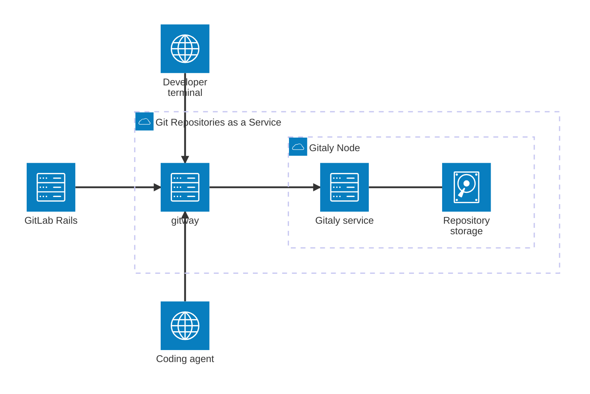
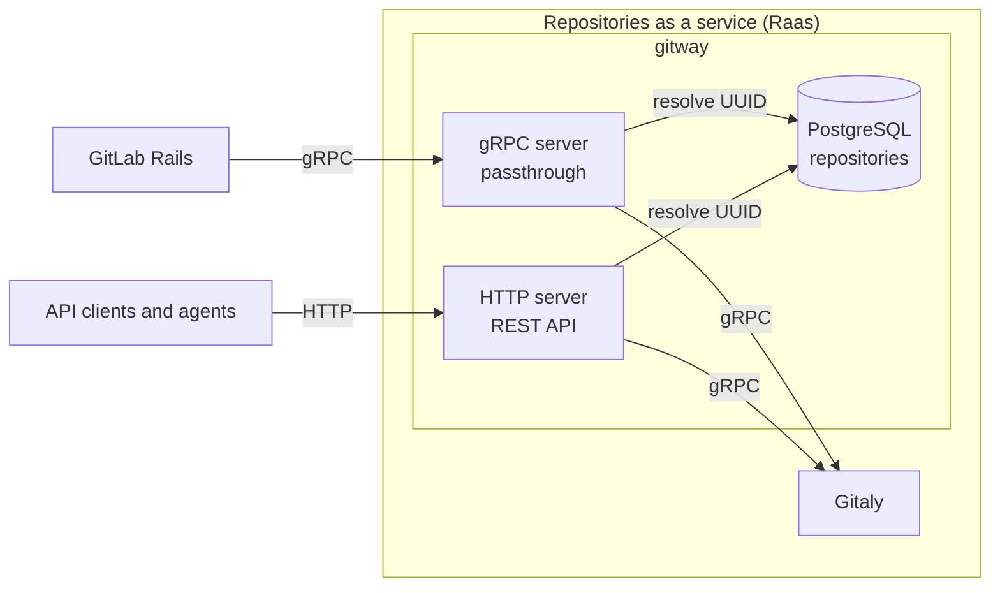
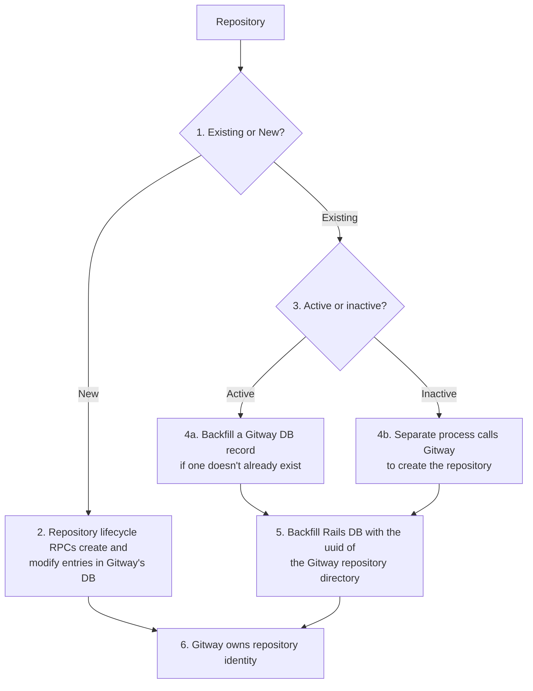
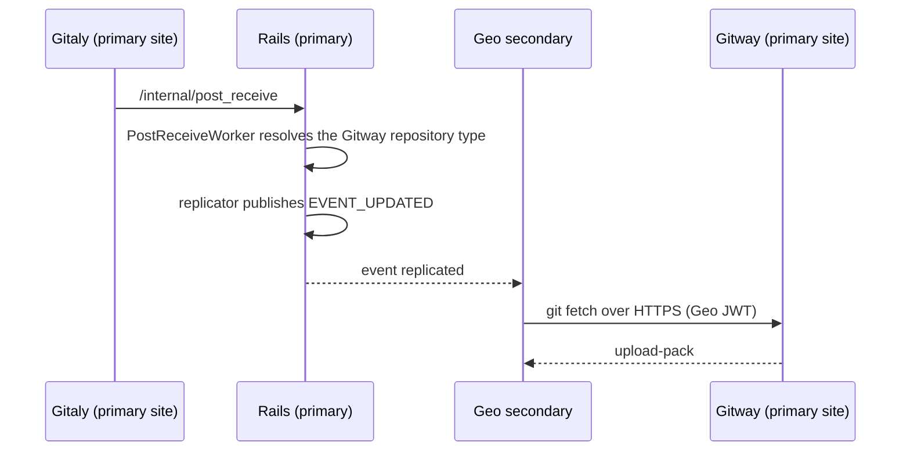



This is a proposal. It is being iterated on and is not yet a committed design.

## Summary

Gitaly and the GitLab Rails monolith are deeply coupled to one another.
Repository data lives in Gitaly, but are accessed through Rails and tied to a
GitLab Project Rails model.

This hampers the development of API-first Git infrastructure and agent-scale
storage.

This blueprint proposes **gitway**, a git gateway that sits between every client
and Gitaly. This turns Git data at GitLab into "repositories as a service". Any
client whether it be internal, like the Rails monolith, or external, such as API
clients or agents will access Git repositories as a service through the Gitway
API surface.

Clients name a repository by UUID and ask for git operations. How the repository
is stored, placed and replicated is an implementation detail behind the service
boundary.



## Motivation: Clean API Boundaries

Today, there are no clean repository API boundaries. The concept of a repository
spans across Rails and Gitaly, leading to brittle split-brain situations. Rails
is effectively the repository directory. Further, it actually *determines* the
disk path that Gitaly uses to store repositories. This makes evolving the Git
backend cumbersome, since changing the storage layout requires both Rails code
changes and possibly a migration.

This leads to coupling that makes it hard to iterate on Git storage. The
contract between Rails and Gitaly leaks internal details, such as the disk path.
This forces us to make awkward design choices, like treating the disk path as an
opaque token and re-writing it for internal purposes.

It also leads to brittleness in cases like object pools, where the lifecycle is
handled by Rails when storage optimization should be handled only by Raas
(Repositories as a service) with Rails none the wiser.

Clean API boundaries allow both sides to iterate and develop features without
having to worry about internal implementation details of either sides of the API
boundary.

## Goals

- A standalone git gateway that exposes repository operations to any client, not
  only to Rails.
- A repository addressable as a first-class resource, independent of `Project`.
- Start with a gRPC pass through so Rails can keep talking to Gitway over gRPC
  to minimize migration work
- Keep existing Rails features working with minimal churn during the migration.

## Proposal

Gitway is a Go service that serves as the API boundary of "Repository as a
service." Rails will continue talking to Gitway over gRPC so as to minimize
migration work. Other clients will talk to Gitway over HTTP. It will serve as
the primary repository directory in GitLab.



## Design and implementation details

### Data model

The primary data model Gitway is concerned with is the repository.

|id|storage_name|name|description|owner_id|metadata|state|
|--|------------|-------------|----|-----------|--------|--------|
|9b2f4c1e-3d5a-4f88-b7c6-1a2e5d90f331|default|gitaly|A gRPC golang service for Git data|21|{"relative_path":"@hashed/ce/ea/ceead675…7b71.git"}|ready|
|1f6a8e77-0c34-4b91-8d52-6e9b4a17c5de|default|packhorse|A high throughput Git cache|21|{"relative_path":"@hashed/73/47/73475cb4…8049.git"}|deleted|
|c47e0d2a-8b19-4e6f-9a03-5f7d1c88b204|default|gitlab|GitLab is the open-source DevSecOps platform that provides a complete software development lifecycle toolchain|21|{"relative_path":"@hashed/5a/3c/5a3ca21d…721d.git"}|deleted|

### Authentication

Gitway will not authenticate. Workhorse will still authenticate with Rails, and
pass on metadata in the headers that reach Gitway, which will then simply pass
on those metadata headers to Gitaly.

In a future iteration, Gitway can integrate with GATE for authentication.

### Transparent gRPC passthrough

Gitway will contain a gRPC server that serves as a transparent gRPC passthrough
for Rails to talk to Gitaly. This minimizes migration to Gitway, since we can
point Rails at Gitway and it will just look like another Gitaly server. Gitway
simply forwards headers and the gRPC protobuf request directly to Gitaly, and
proxies the response back.

### HTTP REST API

Gitway will also contain an HTTP server that opens up an API surface for
repository operations.

#### Repository CRUD operations

```plaintext
POST   /v1/repositories
GET    /v1/repositories/{id}
DELETE /v1/repositories/{id}
```

Listing the collection with `GET /v1/repositories` is deferred past the first
iteration. Each endpoint above acts on a single repository named by `uuid`, so
authorizing the call is a question about that one repository. A collection read
has no such handle: it needs a decision about who may enumerate repositories and
how the result is scoped. Settling that should not block the first iteration.

#### Repository Primitives

```plaintext
GET    /v1/repositories/{id}/refs
PATCH  /v1/repositories/{id}/refs/{name}
GET    /v1/repositories/{id}/blobs/{oid}
GET    /v1/repositories/{id}/trees/{ref}
...
GET    /v1/repositories/{id}/info/refs?service=git-upload-pack
POST   /v1/repositories/{id}/git-upload-pack
POST   /v1/repositories/{id}/git-receive-pack
```

A repository is now a first-class resource — usable for agent workspaces, an
artifact store, per-document repositories, or an internal service's git backing,
with no `Project` row.

From the perspective of the Rails monolith (and any other services or clients),
a repository is uniquely identified by its uuid.

## Development Phases

Here are the envisioned development phases.

### Phase 1: Deploy Gitway as a pure gRPC proxy

The simplest goal is to have Gitway deployed on .com as a pure passthrough proxy
to Gitaly. It will integrate with both Workhorse, Rails, Zoekt, and other
clients but will not do any work.

On existing instances, such as GitLab Saas, the storages will all point to a
gitway load balancer that reverse proxies to a fleet of gitway nodes.

Before:

```ruby

gitlab_rails['repositories_storages'] = {
    'default'  => { 'gitaly_address' => 'tcp://gitaly1.internal:8075' },
    'storage1' => { 'gitaly_address' => 'tcp://gitaly1.internal:8075' },
    'storage2' => { 'gitaly_address' => 'tcp://gitaly2.internal:8075' },
  }

```

After:

```ruby

gitlab_rails['repositories_storages'] = {
    'default'  => { 'gitaly_address' => 'tcp://gitway.internal:8075' },
    'storage1' => { 'gitaly_address' => 'tcp://gitway.internal:8075' },
    'storage2' => { 'gitaly_address' => 'tcp://gitway.internal:8075' },
  }

```

### Phase 2: Gitway becomes the repository directory

Gitway will gain a datasource as it will become the repository directory. The
data that will need to be stored has this [schema](#data-model).

This will require a data migration, but the aim is to lazily migrate as much as
possible.

Let's consider the two sides of the migration. The Rails side and the Gitway
side.

#### Rails side

The Rails database currently contains repository information. Here is the
`project_repositories` table in Rails:

| column | type |
|--------|------|
|id|bigint|
|shard_id|bigint|
|disk_path|character varying|
|project_id|bigint|
|object_format|smallint|

There are other such tables, such as `project_repositories`,
`pool_repositories`, `snippet_repositories`, `group_wiki_repositories`,
`project_wiki_repositories`, and `design_management_repositories`. Each of these
tables contain simliar information about repositories and where they reside on
the Gitaly nodes.

The aim would be to strip the Rails database from any intelligence about
repositories. We could do this by simply adding a `uuid` column to the tables
that contain repository metadata.

| column | type |
|--------|------|
|id|bigint|
|shard_id|bigint|
|disk_path|character varying|
|project_id|bigint|
|object_format|smallint|
|uuid|uuid|

The `uuid` column will get populated through a lazy migration, as well as an
eager migration.

#### Gitway side

On the Gitway side, for active repositories, we can achieve a *lazy*
migration by upserting a row into the `repositories` table in Gitway whenever we
get a read or write gRPC call for a repository from Rails. If this is a "first
registration" call and Gitway ends up inserting a new repository row into its
datastore, Gitway would also insert the `uuid` into the response header
as metadata, and Rails could backfill the `uuid` column(s) on its side.

For inactive repositories, we could simply issue an innocuous read RPC on the
behalf of the project, which would trigger the process described above.

#### Workhorse

Workhorse forwards http requests on to Rails as well as Gitaly. Since we
envision Raas (Repository as a service) to function separately from Rails, an
HTTP request should not need to route through rails en-route to Gitway.

Instead, Workhorse can route HTTP requests based on a URL matching pattern
directly to Gitway, after it authenticates through Rails.

This would be a similar pattern to how it routes git-upload-pack requests for
clones directly to Gitaly.

#### Migration Paths

The below flowchart describes different migration paths.



[4a] To backfill a Gitway DB record for an active repository, we simply check
the database on any call that Rails makes, and create the db record if it does
not already exist. We also need to backfill the Rails DB tables eg:
`project_repositories`. There are different ways to accomplish this. We could:

1. Gitway send a `uuid` field back in a gRPC trailer. Rails will check if this
   `uuid` field exists, and if so it will upsert the `uuid` into
`project_repositories` (and other) tables through a sidekiq job.
2. Gitway has a background process that calls a new internal endpoint in Rails
   with this `uuid` and the repository, kicking off a sidekq job to upsert the
`uuid` into the appropriate table.

[4b] For inactive repositories, we would need a separate process to kick off
[4a]. The easiest thing would probably be to send a read rpc for every
project/repository. This way, we don't need to develop a new code path for the
inactive repos.

## Other Design Considerations

### Geo replication

A repository with no `Project` is invisible to Geo today. Every link in Geo's
replication chain is keyed to a Rails container model:

- **Change events** are raised at the end of `Repositories::PostReceiveWorker`,
  which resolves a container from `gl_repository` and dispatches through
  `Repository#log_geo_updated_event` to the matching replicator. A container
  class it does not recognize raises.
- **Registry rows** in each secondary's tracking database are keyed by
  `model_record_id`, one table per replicable type.
- **Sync** is a `git fetch` over HTTPS from a URL built out of the project's
  `full_path`, authorized by a Geo JWT scoped to that same path, terminating at
  the primary site's git HTTP front door.

#### A new replicable type

Gitway-owned repositories use Geo's self-service framework.

| Piece | Shape |
|-------|-------|
| Rails model | A new thin `gitway_repositories` table: UUID, verification columns, timestamps. No project, no route, no namespace. It exists only so Geo has a record to key a registry row and an event off. |
| Replicator | `Geo::GitwayRepositoryReplicator`, overriding `remote_url` to address Gitway and `jwt_authentication_header` to scope by UUID rather than by path. |
| Change signal | Gitaly's existing post-receive callback, unchanged. See below. |
| Existence signal | Rails issues the `POST /v1/repositories` and `DELETE /v1/repositories/{id}` calls itself, so it upserts or tombstones the replicable row on that path. Once a collection endpoint exists, a reconciler that enumerates it is the intended backstop for drift. |
| Transport | Unchanged. The secondary fetches over HTTPS from the primary, using the `info/refs` and `git-upload-pack` primitives Gitway already exposes. |

Everything else Geo already provides comes along unchanged: registry state,
retry and backoff, the log cursor, the consistency worker, and the sync worker.



Gitaly keeps calling `/internal/post_receive` exactly as it does today, and the Geo
event keeps being raised from the worker that call enqueues.

For copying over new repositories that get created, Gitway will expose an API
endpoint to create a repository with a specified `uuid`, so during moves from
one cell to another, this API can be calledl for Gitway to create the
repository, and to fetch the git data from the originating cell.

### Organization migration (Org Mover)

[Org Mover](../organization-data-migration/decisions/003_org_mover_architecture.md)
moves an organization from one Cell to another. Today it copies the Rails
repository tables row by row, preserving primary keys, and remaps `shard_id` to
a storage that exists on the target cell.

Once Gitway is the repository directory, the row that matters lives in Gitway's
database, so Org Mover has to copy Gitway state too. Gitway is deployed as part
of a cell rather than as a service sitting outside or across cells, so each cell
has its own Gitway and its own Gitway database, and a move copies rows from the
source cell's Gitway to the target cell's Gitway.

To accomplish this, Org Mover can take a similar approach to repository data in
the Rails database, but instead copy over Gitway database rows. If it needs to
remap storages at that point, it can also do so.

The `uuid` of each repository row in the Gitway DB will need to be preserved,
between cells because that is the unique identifier for every repository in the
system, and will be referenced in other datastores like the Rails database.

### Shard Migration for Projects

In the short term, shard migration will work through Rails for Projects. We will
not support shard migration for Gitway Repositories though because long term
with [the new Git backend](/handbook/engineering/architecture/design-documents/scaling-git/), shard migrations will become unnecessary.

The goal of [the new Git backend](/handbook/engineering/architecture/design-documents/scaling-git/) is to make Gitaly stateless, where repositories
could get materialized onto one or more Gitaly nodes without strict assignment
since the source of truth will be object storage. This will make shard migration
unnecessary.
