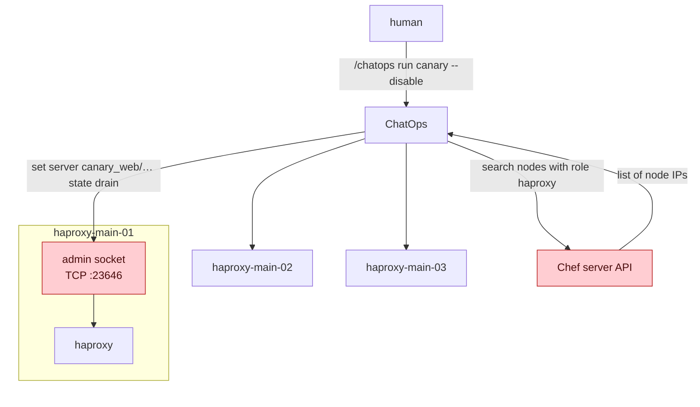
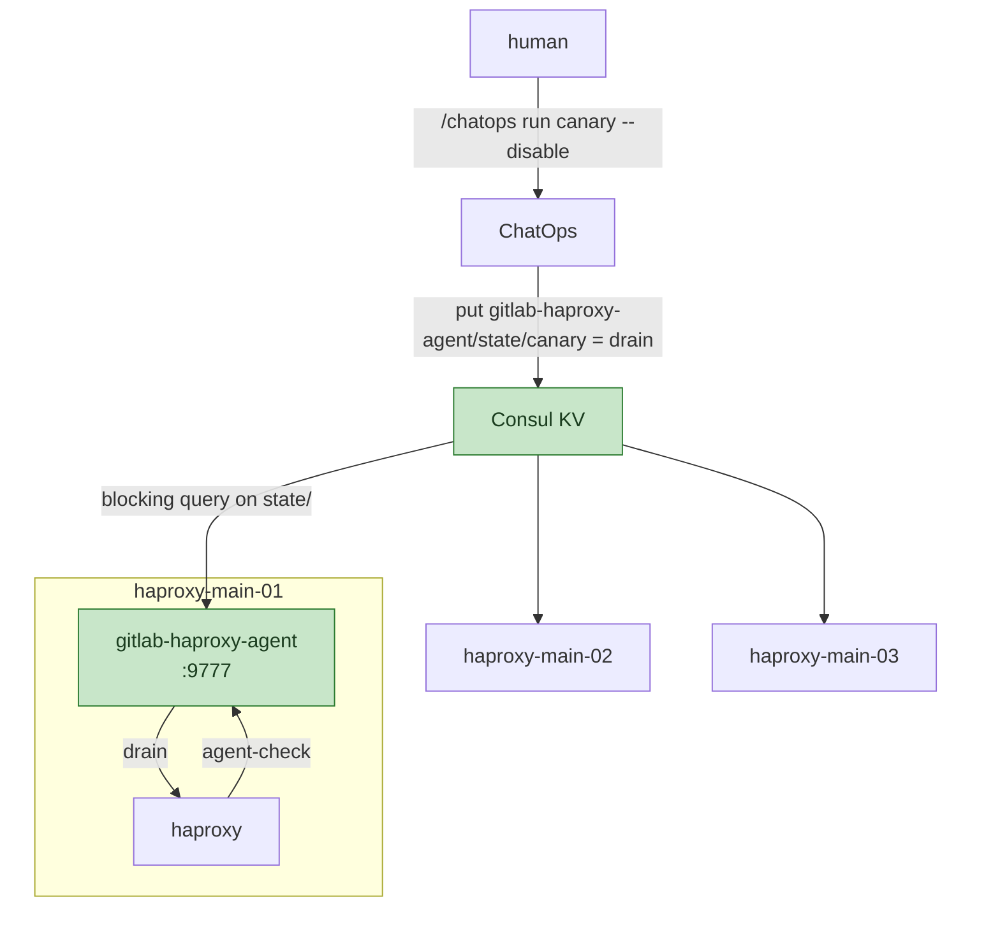

<!-- vale gitlab.FutureTense = NO -->



## Status

Implemented. HAProxy server state on GitLab.com is desired state in Consul
KV, applied on every load balancer by
[gitlab-haproxy-agent](https://gitlab.com/gitlab-com/gl-infra/gitlab-haproxy-agent)
through HAProxy's `agent-check`. ChatOps, the SRE tools, and the deployer
no longer connect to load balancers to change state. The TCP admin
listener and the server-state file are gone from every node in `gstg`,
`gprd` and `pre`. The record of the work is in
[production-engineering#29645](https://gitlab.com/gitlab-com/gl-infra/production-engineering/-/work_items/29645).
Operational documentation lives in the
[agent runbook](https://runbooks.gitlab.com/frontend/agent/).

## Summary

Before this change, canary drains and zonal server drains on the HAProxy
fleet work by connecting to every load balancer from outside. Each node
binds an admin socket on its own IP, ChatOps looks up node addresses
through the Chef server API, opens a TCP connection to each, and issues
`set server ... state`. The state lives only in each HAProxy process's
memory, so reloads reset it, new nodes come up without it, and the
server-state file meant to persist it across reloads has caused incidents
of its own.

The change moves the desired state out of the HAProxy processes into
Consul KV and lets HAProxy pull it through `agent-check`: every server
line points at a small local responder that reads the KV and answers
`ready`, `drain`, or `maint`. Convergence is pull-based, so reloads,
upgrades, and node replacements pick up the current state within one check
interval. A canary drain becomes one KV write applied by 80 load balancers
within two seconds, with no node discovery and no Chef API.

The same agent runs as a sidecar in the
[HAProxy on Kubernetes migration](https://gitlab.com/gitlab-com/gl-infra/production-engineering/-/work_items/29644),
so the control mechanism does not change again when HAProxy leaves the
VMs.

## Motivation

HAProxy on GitLab.com is a Chef-managed VM fleet: 80 load balancers in
`gprd` and 10 in `gstg`, across the main, ci, pages, and registry roles.
Three tools change server state on them, all by talking to the admin
socket:

- **ChatOps `canary`**: `/chatops run canary --gprd --disable|--enable`
  is how a human takes canary out of rotation and puts it back. It
  queries the Chef server API for every node's IP, connects to
  `ipv4@<node-ip>:23646` on each, matches servers by `-cny-` in their
  names, and issues `set server <backend>/<server> state ...`.
- **`set-server-state` in chef-repo**: the SRE tool for zonal backend
  drains during cluster maintenance, driving the same socket over
  `knife ssh`.
- **`ha-ctl` in the deployer**: drains and verifies VM-based backend
  servers around VM deploys, and pre-checks that no server is in DRAIN
  before a deploy starts.

### Pain points

- **State lives only in process memory.** HAProxy dumps it to a
  server-state file so it can be restored after a reload, but the file
  also caches backend addresses, which go stale and have caused incidents
  ([production-engineering#12152](https://gitlab.com/gitlab-com/gl-infra/production-engineering/-/issues/12152),
  [haproxy#3296](https://github.com/haproxy/haproxy/issues/3296),
  [gitlab-haproxy!439](https://gitlab.com/gitlab-cookbooks/gitlab-haproxy/-/merge_requests/439)).
  Where persistence is disabled in response, every reload, including
  unattended package upgrades, resets canary state without anyone
  noticing.
- **New nodes know nothing about an in-progress drain.** A node that boots
  or is replaced during a drain comes up with default state and routes to
  canary ([production-engineering#27563](https://gitlab.com/gitlab-com/gl-infra/production-engineering/-/issues/27563)).
- **Undrain restores full weight at once**, while the canary fleets need
  time to scale back up.
- **The caller has to reach every node.** Every state change is one TCP
  connection per load balancer from the caller. It depends on the Chef API
  to find the nodes and is only partially applied when a node is
  unreachable.
- **An unauthenticated admin listener on the internal network.** The TCP
  socket runs at `level admin` and accepts commands from anything that
  could reach the node.
- **No path to Kubernetes.** Enumerating VMs and connecting to their stats
  ports does not work for pods.

### Goals

- Server state that holds across reloads, upgrades, and node replacements
- One write applies to every load balancer, without node discovery
- The same mechanism on VMs and on Kubernetes
- Remove the TCP admin listener
- Remove the server-state file: with desired state in KV there is nothing
  the process needs to persist across reloads

### Non-Goals

- Changing how HAProxy reports state. `haproxy_backend_up` and the other
  exporter metrics are unaffected. This changes how state is set, not how
  it is observed.
- Upgrading HAProxy. The fleet stays on 2.8, which is supported until April
  2028. Upgrades are tracked separately
  ([production-engineering#27726](https://gitlab.com/gitlab-com/gl-infra/production-engineering/-/work_items/27726)).
- Consul ACLs. See [Risks](#risks).
- Moving the canary decision out of HAProxy. See
  [Alternative Solutions](#alternative-solutions).

## Proposal

Move the desired state out of the HAProxy processes into Consul KV and let
each HAProxy process pull it through `agent-check`.

- **ChatOps writes desired state to Consul KV.** ChatOps already has a
  Consul KV client, and Consul runs in every environment.
- **HAProxy's [`agent-check`](https://docs.haproxy.org/2.8/configuration.html#5.2-agent-check)
  applies it.** Every server we want drainable gets an agent check
  against a small responder that reads the KV and answers `ready`, `drain`,
  `maint`, or a weight percentage. Each server line sets
  [`agent-send`](https://docs.haproxy.org/2.8/configuration.html#5.2-agent-send)
  to its own name, so one responder answers for every server.
- **The responder runs next to each HAProxy process**: a systemd unit on
  the VMs, a sidecar in the pods, answering on localhost and reading
  desired state through the local Consul agent. Small new code: read the
  KV, print one line. If a responder is down, only the HAProxy next to it
  stops receiving updates, and systemd or the kubelet restarts it.
- **Convergence is pull-based.** Every process polls at
  [`agent-inter`](https://docs.haproxy.org/2.8/configuration.html#5.2-agent-inter)
  (2s default), so reloads, unattended upgrades, and node replacements pick
  up the current state within seconds. Failure to connect to the agent is
  documented as not an error: state stays as it was.
- **Undrain goes through `maint`.** ChatOps sets `drain`, waits 60
  seconds for connections to finish, then sets `maint`. Undrain is `maint`
  to `ready`, which triggers HAProxy's
  [`slowstart`](https://docs.haproxy.org/2.8/configuration.html#5.2-slowstart)
  and ramps the weight back up (verified with an integration test,
  [gitlab-haproxy-agent!4](https://gitlab.com/gitlab-com/gl-infra/gitlab-haproxy-agent/-/merge_requests/4)).
  `slowstart` does not fire on leaving DRAIN, since the server stays
  operationally UP throughout, which is why the drain passes through
  `maint`. The agent also accepts a weight percentage, so a KV writer can
  step the weight itself if that is ever needed.

Once agent checks apply the state, the server-state file and the TCP admin
socket can both be removed, and ChatOps drops its Chef API dependency for
this path.

Manual state changes through the stats UI or the unix socket are
overwritten at the next agent check. On servers with agent checks, an
override goes into KV, not into the socket.

This does not depend on the Kubernetes migration. It lands on the Chef VMs
as a cookbook change and fixes problems there. If the Kubernetes migration
proceeds, the pods run the same responder and the control mechanism does
not change again.

### What must keep working

- `/chatops run canary --gprd|--gstg --disable|--enable` stays the same
  for the humans who run it.
- The SRE zonal-drain workflow (`set-server-state -z`) gets an equivalent
  through the KV override namespace.
- The `canary_active_deployment` check in ChatOps keeps working.
- `haproxy_backend_up` and related metrics are unaffected.
- The deployer's `ha-ctl` precheck, that every relevant server is UP or
  MAINT before a deploy, has no server left to check on an enrolled
  backend, so `ha-ctl` is removed rather than converted. See
  [ha-ctl](#ha-ctl).

### Risks

- **Responder outage.** A responder that is down means HAProxy cannot
  reach its agent. HAProxy treats this as not an error and keeps the last
  state. A drain issued during that window does not reach that node. An
  alert fires when an agent has not completed a Consul read in 15
  minutes. There is no alert for HAProxy failing to reach the agent, see
  [Monitoring](#monitoring-and-observability).
- **Unauthenticated KV writes.** Consul accepts KV writes from anywhere on
  the internal network, so anything that can reach it can drain enrolled
  servers. Accepted: the `level admin` TCP listener it replaces has the
  same exposure. The fix is Consul ACLs, an org-wide migration since
  `gprd` Consul is default-allow for every consumer. The agent uses one
  KV prefix and two writer tools, so scoping a token later is a small
  change. On Kubernetes, network policy limits who reaches Consul without
  ACLs.
- **Two control paths during the rollout.** A server set through both the
  socket and KV, then cleared through only one, ends up half-drained.
  Every writer tool routes per server by whether the running HAProxy
  config has `agent-check` on that row, and `ready` clears both origins.
  After full enrollment the socket write paths are removed from the
  tools.
- **Interaction with the server-state file.** The file records the agent
  port for every server and restores it over the configured value on
  reload. The file is turned off, see
  [The server-state file](#the-server-state-file).

## Design and implementation details

### Architecture Overview

#### Before

A human disables canary. ChatOps asks the Chef
server for the addresses of every load balancer, then connects to the
admin socket on each one and sets the state.

#### After

The same command writes one key to Consul KV. On every load balancer,
gitlab-haproxy-agent holds a blocking query on the state prefix and keeps
an in-memory copy. HAProxy asks the agent about every enrolled server
every two seconds and applies the answer.

### The agent

[gitlab-haproxy-agent](https://gitlab.com/gitlab-com/gl-infra/gitlab-haproxy-agent)
is a Go binary that runs next to every HAProxy process and answers its
agent checks from desired state in Consul KV.

**Watcher.** A blocking query on the `gitlab-haproxy-agent/state/` prefix
against the local Consul agent. Every change to the prefix anywhere in the
environment returns the query and the agent replaces its in-memory copy.
This is the only place the agent reads from. If Consul becomes unreachable
while running, the agent keeps answering from the last copy it has and the
staleness metric starts counting. If Consul is unreachable at startup, the
agent exits and systemd or the kubelet restarts it.

**Responder.** A TCP listener on localhost `:9777`. HAProxy connects once
per check, sends the `agent-send` string, and reads one line back. The
string is a space-separated list of keys, the server's own row key first
and then the groups it belongs to, for example
`agent-send "web/gke-cny-web canary\n"`. The responder looks each key up
in the in-memory copy and answers from the first one that has a value:

| Value in KV | Reply | HAProxy state |
| --- | --- | --- |
| no key | `ready` | UP, weight from config |
| `ready` | `ready` | UP, weight from config |
| `drain` | `drain` | DRAIN (agent): finishes existing connections, takes no new ones |
| `maint` | `maint` | MAINT: out of rotation |
| `N%` (0-256) | `N%` | UP with weight scaled to N% of the configured weight |
| anything else | `ready` | as if the key were absent, logged and counted |

Health states (`up`, `down`, `stopped`, `fail`) are not accepted. Server
health belongs to HAProxy's own checks, the control plane only sets admin
state.

The agent does nothing else. It does not step weights, does not write to
Consul, does not persist anything, and does not know which servers exist:
HAProxy tells it which keys to look up on every check. That is what makes
one binary serve every backend on every node with no per-node
configuration, and what lets a group key like `canary` apply to whatever
set of servers the cookbook renders with it.

**Convergence.** HAProxy runs the check at `agent-inter` (2s). A KV write
is visible to every agent within one blocking-query round trip and applied
by every HAProxy within one check interval, so about two seconds fleet-wide.
A fresh process, whether from a reload, a package upgrade, or a new node,
gets the current state on its first check. HAProxy treats a failed
connection to the agent as not an error and keeps the last state, so an
agent that is down or restarting changes nothing on its own node.

**Observability.** Metrics, health, and pprof are served on one HTTP port.
The readiness endpoint returns 503 until the first Consul sync completes,
which is the readiness probe a Kubernetes sidecar needs. Prometheus scrapes
the agent on every node.

**Tests.** The agent has automated integration tests that run against a
real HAProxy and a real Consul.

**Deployment on the VMs.** A systemd unit installed by the gitlab-haproxy
cookbook. The cookbook installs the release archive from the ops.gitlab.net
mirror so that installing the agent does not depend on gitlab.com.

### KV schema

Per-row keys plus group keys:

- `gitlab-haproxy-agent/state/<backend>/<server>`: one server. Used by
  `set-server-state` for zonal drains and as an override for a single
  server.
- `gitlab-haproxy-agent/state/canary`: every server rendered from a canary
  pool. Used by ChatOps.

Every canary server sends both its own row key and `canary`, in that order
([gitlab-haproxy-agent!31](https://gitlab.com/gitlab-com/gl-infra/gitlab-haproxy-agent/-/merge_requests/31)),
so a row key overrides the group for that server (verified in `gstg`:
`web/gke-cny-web = ready` next to `canary = drain` kept that row in
rotation and nothing else). Which servers belong to the canary group is
defined in the cookbook next to the pool definitions
(`agent.groups.canary`,
[gitlab-haproxy!485](https://gitlab.com/gitlab-cookbooks/gitlab-haproxy/-/merge_requests/485)),
not matched from `-cny-` in server names at drain time.

Deleting a key returns the server to `ready` on the next poll. Per-row keys
allow partial updates and a rollout by backend. The alternative, one
document per environment, would make every change atomic, but the group
key already covers the one operation that has to be, and per-row keys
keep a single-server override independent of everything else.

### Enrollment

A server is enrolled when its `server` line has `agent-check`. The cookbook
renders it through one helper, controlled by the `agent.enable` role
attribute, which enrolls every rendered server
([gitlab-haproxy!484](https://gitlab.com/gitlab-cookbooks/gitlab-haproxy/-/merge_requests/484)).

Two backends are not enrolled: `asset_proxy` and `packhorse` write their
single server line inline and point at one external target, so a drain
there has nothing to fail over to. The agent runs in `pre`, `gstg`, and
`gprd`.

### Writer tools

- **ChatOps `canary`** writes `gitlab-haproxy-agent/state/canary` and
  displays state from KV, with the frontend overview dashboard linked for
  traffic. No Chef API lookup, no `show stat`
  ([chatops!768](https://gitlab.com/gitlab-com/chatops/-/merge_requests/768),
  [chatops!777](https://gitlab.com/gitlab-com/chatops/-/merge_requests/777),
  [chatops!780](https://gitlab.com/gitlab-com/chatops/-/merge_requests/780)).
- **`set-server-state`** writes `<backend>/<server>` keys. Servers without
  `agent-check` are reported instead of getting a socket command
  ([chef-repo!7889](https://gitlab.com/gitlab-com/gl-infra/chef-repo/-/merge_requests/7889),
  [chef-repo!7949](https://gitlab.com/gitlab-com/gl-infra/chef-repo/-/merge_requests/7949)).
- **Break glass** is `consul kv put` from a console node.

### ha-ctl

`ha-ctl` does three things: write state, verify a drain by polling
connection counts over `show stat`, and sequence VM deploys (drain, wait,
maint, run command, ready, wait). The agent replaces only the first. It
runs on the VM being deployed, in service of VM deploys, and no enrolled
backend has a VM server left for it to act on in either environment.
Rather than give the agent a way to report observed state back into
Consul just for it, `ha-ctl` is removed from the fleet
([chef-repo!7977](https://gitlab.com/gitlab-com/gl-infra/chef-repo/-/merge_requests/7977),
[gitlab-server!458](https://gitlab.com/gitlab-cookbooks/gitlab-server/-/merge_requests/458))
and from deploy-tooling, with Delivery. Its precheck is not carried into
the deployer either: it could only fire for a VM server behind an
enrolled backend, and that set is empty.

### The server-state file

HAProxy's server-state file exists so that drains set over the socket
survive a reload. It caused the incidents that started this work, and it
interacts badly with enrollment: the file records the agent port for
every server, and on reload that recorded value overrides the configured
`agent-port`. With desired state in KV there is nothing the process needs
to persist. KV state is applied again within one agent interval after any
reload, restart, or fresh node.

The state file is turned off in all environments. What is lost is health
state across a reload: about 9 seconds until a DOWN server fails its
checks again. HAProxy 3.1 has `init-state down` for that, and this work
does not depend on an HAProxy upgrade. The cookbook still supports the
state file, disabled by default. HAProxy on Kubernetes does not use a
state file either.

### Monitoring and Observability

The agent exports its own metrics and Prometheus scrapes it on every node.
HAProxy shows an agent-applied drain as `DRAIN (agent)` in `show stat`,
distinct from CLI or config drains. MAINT has no suffix. Alerts and the operator
runbook are in the
[agent runbook](https://runbooks.gitlab.com/frontend/agent/).

**Accepted gap:** nothing watches whether HAProxy can reach the agent. The
2.8 native exporter has the full health-check metric family and nothing for
the agent check, so `agent_status` exists only in `show stat`. Catching
that class means either the agent tracking which rows HAProxy asks about,
or an external `show stat` collector. Not built.

### Input for the Kubernetes migration

A freshly started HAProxy 2.8 assumes every backend server is UP until the
first health checks complete. There is no `init-state` on 2.8. On the VM
fleet this window occurs only at node boot. Under HPA it occurs on every
scale-up and rolling deploy, and matters when a backend ILB is down, which
is also when HPA is most likely scaling. A startup probe or
`minReadySeconds` spanning one health-check round closes it. Admin state
needs nothing extra: fresh pods get it from the agent within one interval.

### Rollout

The rollout goes by backend. The agent is installed
fleet-wide with no backend enrolled, then backends are enrolled by role
attribute, environment by environment, in the order a lost drain would
hurt most: canary first, then web, api, and kas, where a socket drain can
be lost to a Chef-triggered reload during an incident, then pages and
registry. The writer tools route per server by reading enrollment from
the running config, so on a fleet with half its nodes converged the
same drain command uses KV on enrolled nodes and sockets on the rest.
Migrating by node instead, with a node attribute selecting which nodes
render `agent-check`, needs ChatOps to know the node list,
which is the dependency this work removes.

The record of the rollout, 2026-08-28 to 2026-09-10:

1. `gstg`: agent on one node, then all 10. Enroll `canary_web`, first
   KV-driven drain (2026-08-28). Enroll all canary backends, then the main
   backends. Zonal drain of `web-gke-us-east1-b` as two KV writes.
1. `gprd`: agent on all 80 nodes with nothing enrolled. Enroll canary
   backends, then main backends (2026-09-02). Production canary drain the
   same day: one ChatOps command, 14 KV keys, 80 agents, traffic left
   canary within seconds.
1. Both paths available for five days. Second production drain
   2026-09-04, all 919 server rows to DRAIN, MAINT, and back to UP.
1. Enroll pages and registry in both environments.
1. Remove socket writes from `set-server-state`, ChatOps, and `ha-ctl`.
1. Group key: agent 1.2.0, `agent.enable`, the `canary` key, ChatOps
   writing one key. Production drain through the group key 2026-09-09.
1. Remove `ha-ctl` from the fleet.
1. Turn off the TCP admin listener in `gstg`, then `gprd`
   ([chef-repo!7984](https://gitlab.com/gitlab-com/gl-infra/chef-repo/-/merge_requests/7984),
   [chef-repo!7985](https://gitlab.com/gitlab-com/gl-infra/chef-repo/-/merge_requests/7985)),
   verified by a drain and undrain in each environment afterwards. Remove
   the line from the cookbook
   ([gitlab-haproxy!489](https://gitlab.com/gitlab-cookbooks/gitlab-haproxy/-/merge_requests/489)).
1. Turn off the server-state file in `gstg`, `gprd`, and `pre`.

**Rollback** at every stage is a role edit: remove a backend from the
enrollment list, converge, and the next reload drops its `agent-check`
lines, which also clears any agent-applied state on those rows. While the
listener exists, `set server ... state drain` over `:23646` remains a
manual fallback. The listener is a cookbook attribute until the final
removal.

### Decisions

- KV schema: per-row keys plus group keys, see [KV schema](#kv-schema).
- Consul access from ChatOps CI jobs: the runners reach the
  per-environment Consul endpoints as they are. ACLs deferred, see
  [Risks](#risks).
- Detecting a stuck responder: a staleness alert on the agent's Consul
  sync. Whether HAProxy reaches the agent is an accepted gap.
- Gradual undrain: no weight stepping in the agent. `slowstart` on
  `maint` to `ready`.
- Read path after the socket is gone: ChatOps displays KV state and links
  the Mimir dashboard for traffic. The `ha-ctl` drain wait goes with
  `ha-ctl`.

### Future work

- Consul ACLs, or workload identity plus network policy on Kubernetes, for
  the KV write path.

## Alternative Solutions

### Watcher daemon on each node

A daemon watches the KV and applies state through the local unix socket.
Same store, but custom socket-driving code plus the convergence and
startup handling that `agent-check` provides natively. Rejected in favor
of agent checks.

### Draining by failing health checks

The pattern the GCP LB drain script uses for whole nodes. Marks servers
DOWN instead of DRAIN or MAINT, conflicts with the Kubernetes readiness
handling on the canary backends, and breaks the deployer precheck, which
treats MAINT as deployable and DOWN as a blocker. Rejected.

### Canary decision in the Cloudflare cells http-router

The router already runs on every gitlab.com HTTP request. It would set a
header and HAProxy routes on it statelessly, removing the runtime state
for HTTP canary entirely. A plausible long-term home for that part, but it
covers neither ssh and kas (Spectrum direct apps, no HTTP pipeline) nor
zonal drains, the router is young, and drain propagation across POPs is
unproven. Not pursued now. The KV schema does not preclude moving the HTTP
decision there later.

### Canary at a GCP Application Load Balancer

HTTP only, so no ssh. Inline data processing at gitlab.com volume costs an
order of magnitude more per month than the whole HAProxy fleet, and URL
map changes propagate too slowly for an operator disabling canary.
Rejected.

### Canary weights in config management only

An MR merge plus converge takes minutes to hours. Disabling canary needs
seconds. Rejected as the only mechanism. Config still holds the defaults.

### Other responder placements

The agent protocol is raw TCP (one ASCII line per connection), so
something has to serve it. A central responder per environment behind an
ILB means one deployable and fleet-wide consistency, but needs its own
high availability. consul-template rendering a file served by a
socket-activated unit needs no code at all, but moves any stepping logic
into the KV writer. Both rejected in favor of the local sidecar, which
needs no extra work for high availability and is what a Kubernetes pod
would run anyway.
