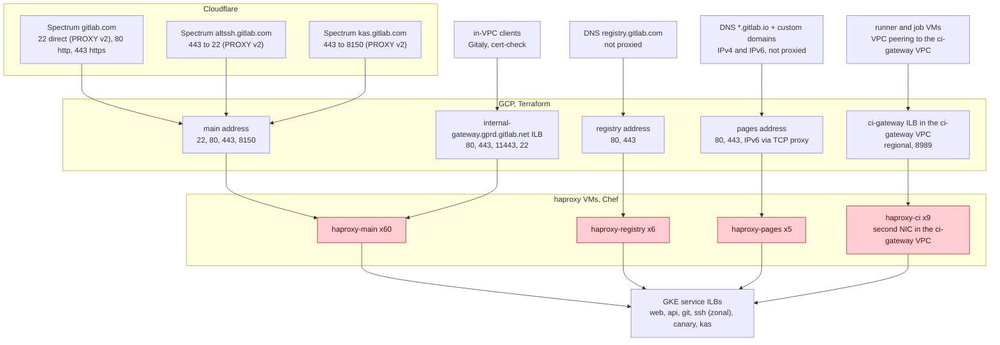
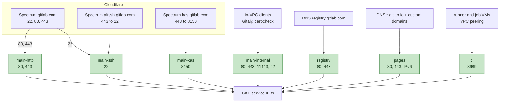

<!-- vale gitlab.FutureTense = NO -->



## Status

Proposed. The tracking issue is
[production-engineering#29644](https://gitlab.com/gitlab-com/gl-infra/production-engineering/-/work_items/29644).
The control plane this design depends on is done and documented in
[A Control Plane for HAProxy](https://gitlab.com/gitlab-com/content-sites/handbook/-/merge_requests/21054).
The cutover depends on GCP behavior that has to be observed on `gstg`
first, see [Open Questions](#open-questions).

## Summary

GitLab.com ingress behind Cloudflare is 80 HAProxy 2.8 VMs in `gprd`, managed by Chef, sized for
peak traffic plus a spare zone's worth of capacity around the clock. This
document proposes to move the same HAProxy configuration into GKE Deployments with
HPA, one Deployment per zone, deployed through argocd/apps, without changing the
proxy technology. Runtime state is already desired state in Consul KV
applied by `gitlab-haproxy-agent`. The pods run the same agent as a
sidecar, so the control mechanism does not change.

The main challenge is moving
traffic from the VM tier to the pod tier without a gap and with a fast
way back, across three different kinds of entry point. For HTTP on `gitlab.com` the cells
http-router already sits in front of us and can split traffic per request.
For raw TCP on ssh and kas nothing programmable sits in front of the GCP
address, so the switch is per port. Customers point DNS at the pages
address, so it has to move as it is. Each needs its own mechanism.

## Motivation

The HAProxy fleet is the last large stateless Chef-managed fleet on
GitLab.com. Postgres, Redis and Gitaly stay on VMs. The application
tier, the runner managers, and most supporting services already run on
Kubernetes. The two problems that make the VM fleet expensive to operate
are the runtime state control path and the VMs themselves. The control
plane work fixed the first, this document addresses the second.

### Why invest in HAProxy at all

The plan to remove HAProxy from GitLab.com has existed for years. A
Kubernetes migration was evaluated in 2022
([production-engineering#15064](https://gitlab.com/gitlab-com/gl-infra/production-engineering/-/work_items/15064)),
and the
[Envoy Gateway migration](https://gitlab.com/groups/gitlab-com/gl-infra/-/epics/1641)
is the current successor. None of these
efforts has been funded through to production, and HAProxy still fronts
every request to gitlab.com. Three things follow:

- Mission-critical infrastructure gets invested in for as long as it is
  in service, including when it is on its way out. Ingress is where a
  reliability problem costs the most, and "it will be replaced" is not a
  reason to leave a Chef-managed fleet of fixed size, upgraded by hand,
  in that position for another unknown number of years.
- The fleet has had incidents and is expensive to change. The
  server-state file cached stale backend addresses
  ([production-engineering#12152](https://gitlab.com/gitlab-com/gl-infra/production-engineering/-/work_items/12152)),
  reloads reset canary state, and rebooted nodes lost their drain state
  ([production-engineering#27563](https://gitlab.com/gitlab-com/gl-infra/production-engineering/-/work_items/27563)).
  The control plane work fixed those. Changes are still a role JSON edit
  and a Chef converge across 80 nodes, with no rendered diff to review,
  no rolling rollout, and no rollback except another converge. That
  makes every blocklist entry, canary weight and version bump rare and
  risky, and it has nothing to do with which proxy is running.
- A modernized fleet is easier to remove. Once the ingress addresses,
  the cutover procedure and the observability wiring exist for pods,
  replacing the proxy inside them is a much smaller change than
  replacing the VM fleet, and Envoy Gateway needs those parts as well.

The same reasoning held for
[GitLab Runner](/handbook/engineering/architecture/design-documents/runner_managers_kubernetes/):
docker-machine was deprecated
and scheduled for removal, and the work to run it well on Kubernetes
after years without investment was still worth it, both for reliability
and for how much simpler the executor migration became.

### Pain points

- **Provisioning is unreliable.** A new node is a Terraform apply
  followed by a Chef bootstrap that installs packages, clones
  repositories and converges the role, with no machine image at any
  point. The bootstrap depends on the Chef server, package mirrors and the ops git
  mirrors being reachable and current at that moment, and it fails often
  enough that adding a node is something people schedule and watch. The
  recorded game day runs put a replacement at 9 to 30 minutes to
  provision plus 13 to 24 minutes to bootstrap when it works
  ([recovery measurements](https://gitlab.com/gitlab-com/runbooks/-/blob/master/docs/disaster-recovery/recovery-measurements.md#haproxytraffic-routing-zonal-outage-dr-process-time)).
- **No autoscaling.** 60 `haproxy-main`, 5 `haproxy-pages`, 6
  `haproxy-registry` and 9 `haproxy-ci` VMs in `gprd`, all
  `t2d-standard-8`, sized for peak plus the loss of one zone, and running
  at that size all day. `gstg` has 10 and `pre` has 3, with no ci fleet.
- **Chef and Ubuntu Pro.** The fleet depends on Chef converges, a Chef
  server, and paid OS support. The stateless services have already been
  moved off all three.
- **Manual upgrades.** The `haproxy` package is excluded from unattended
  upgrades because a binary upgrade needs a coordinated drain, so version
  bumps are done by hand. Node OS patching is recurring manual work
  ([production-engineering#29158](https://gitlab.com/gitlab-com/gl-infra/production-engineering/-/work_items/29158)).
- **Per-VM identity everywhere.** Dashboards, alerts, drain scripts and
  the Terraform instance-group constraints all assume a fixed, named set of
  machines.
- **Configuration from five places.** Role JSON in chef-repo, cookbook
  attributes and templates, two git repositories cloned onto every node
  for the deny and captcha lists, the Cloudflare IP ranges fetched by
  URL, and secrets from Vault. Each has its own update path and cadence.
- **Zonal outage recovery.** Losing a zone
  takes a third of the fleet with it, and the recovery procedure is to
  provision replacement VMs in the other zones. The quarterly game day on
  `gstg` exercises that procedure and nothing else: it measures the
  provisioning path above, which is the weakest part, and never the
  traffic path. It has not been run on `gprd`.

### Goals

- Every HAProxy flavor runs as pods on GKE with HPA, config rendered from
  Helm values that mirror today's role JSON, secrets and lists from Vault
  through External Secrets.
- Traffic moves from VMs to pods per service and per port with a tested
  single-command rollback at every step, and the rollback stays available
  for two weeks after each production switch.
- `haproxy_backend_up` and related metrics keep their names and the
  `type=frontend`, `tier=lb` labels, so release-tools promotion checks
  and dashboards keep working.
- HAProxy request logs keep arriving in Cloud Logging and the BigQuery
  `haproxy_logs` table with the same fields as today.
- Per flavor, the VM fleet, its Chef roles, its Terraform modules and the
  chef-repo helper scripts are removed after the rollback window closes.

### Non-Goals

- Changing the proxy. No Envoy, no Cloudflare Load Balancer, no GCP
  Application Load Balancer. The configuration is ported as it is.
- Changing the control plane. ChatOps and the agent stay as they are.
- Changing what HAProxy does: blocklists, origin-pull verification and
  proxy-protocol handling stay as they are. Building a replacement for
  the two remaining per-process rate limits in the application or
  Cloudflare is out of scope.
- Solving cells routing for ssh. The global gitlab-shell design does that
  behind HAProxy and is independent of this work.

## Proposal

Lift and shift the HAProxy 2.8 configuration into GKE. The points below
are the current thinking. Each becomes a record under
[Decision log](#decision-log) as it is settled, with the alternatives
considered.

- Our own Helm chart in
  [gl-infra/charts](https://gitlab.com/gitlab-com/gl-infra/charts),
  deployed through argocd/apps, rendering `haproxy.cfg` from values that
  mirror today's role JSON. Thin images in ci-images, pulled from
  Artifact Registry.
- One release per protocol group and address, seven per environment:
  `main-http`, `main-ssh`, `main-kas`, `main-internal`, `registry`,
  `pages`, `ci`. Each with its own address and Service, on a dedicated
  node pool in the regional cluster.
- One Deployment per zone per release, each rendering its own zone's
  backends as primary and the other two as `backup`, as the VMs do today.
- Certificates, credentials, deny lists and the Cloudflare IP ranges from
  Vault through External Secrets.
- Metrics matching the VM fleet's labels so both fleets look the same, logs as
  JSON to stdout into the existing Cloud Logging sink.
- Rolling updates with a startup probe as the automated halt, Argo
  Rollouts for bake time and metric checks when needed.
- Ingress through GKE `LoadBalancer` Services on addresses reserved in
  Terraform, with Cloudflare Spectrum in front as today. Traffic moves per
  entry point: the http-router splits HTTP per request, each Spectrum
  app's origin moves per port, pages and registry keep their published
  addresses and hand them over in one step, internal clients move by DNS
  and by config. The two tiers share no GCP object.
- The runner networks peer with `gprd` and the ci-gateway ILB moves in
  front of the `ci` pods there, pending the isolation question. `ci`
  moves last or not in this iteration.

### What must keep working

- `/chatops run canary` and the SRE zonal-drain workflow: unchanged, they
  write KV and the agent applies it. The pods are more nodes running the
  agent.
- The release-tools promotion checks:
  `haproxy_backend_up{backend=~"canary_.*"}` with `type=frontend` and
  `tier=lb`. The native prometheus exporter keeps the metric names and
  the scrape config keeps the labels.
- Zone locality. Each VM routes to the backends in its own zone and
  falls back to the other two, which keeps most traffic inside one zone
  and makes a zonal drain a drain of one zone's load balancers. One
  Deployment per zone, rendering its own zone's servers as primary and
  the other two as `backup`, keeps both.
- Client IP handling: proxy-protocol v2 from Spectrum on 22 and kas 8150,
  `CF-Connecting-IP` on 80 and 443, the Cloudflare-only source ACLs, and
  origin-pull client certificate verification on 443.
- Per-process rate limits. Two are left in HAProxy: the registry
  per-source-IP limit (4000 requests per 10 s) and the ssh
  `rate-limit sessions 110`. The effective limit is the value times the
  instance count, which is fixed today and floats under HPA. Before the
  registry and ssh releases are built, each is reviewed: whether it is
  still needed, and if so, its per-process value is derived from the
  release's replica floor.
- The pages and registry addresses. Customers point custom-domain DNS at
  the pages address, and the registry address is published in the
  GitLab.com settings documentation for allowlists. Both move to the pod
  tier, neither changes. Nothing else has an address anyone outside sees:
  the Spectrum ports show Cloudflare's addresses, and the internal
  gateway and ci-gateway clients use hostnames.
- ci-gateway: runner managers reach `*.ci-gateway.int.gprd.gitlab.net:8989`
  through VPC peering into the `ci-gateway` VPC, with source ranges
  allowlisted in the frontend. Whatever replaces the VMs has to keep the
  peering path and the source addresses.

### What changes

The configuration is ported as it is. What changes around it:

- One process per VM serving every frontend becomes one release per
  protocol group and address, seven per environment. Internal gateway
  clients get their own pods.
- A fixed fleet becomes an HPA per zone and release. A zone loss is a
  scale-up on the other two zones instead of a rebuild.
- A change is an MR with a rendered diff and a rolling deploy, rolled
  back by revert, instead of a role JSON edit and a converge. Version
  bumps are Renovate MRs instead of a manual drain.
- The pipelines of the repositories that own the deny lists, the
  recaptcha list and the Cloudflare IP ranges publish them to Vault, and
  External Secrets mounts them into the pods, instead of git clones and a
  URL fetch on every node.
- The HAProxy binary is the official 2.8 build from Artifact Registry
  instead of the PPA build on Ubuntu Pro.
- HAProxy writes JSON to stdout. The Cloud Logging sink and BigQuery
  table stay.

### Risks

- **Circular dependency on the cluster.** The pods route to ILBs of the
  cluster they run in (canary, kas), so a cluster-wide incident takes
  ingress down with it. Accepted: a dedicated LB cluster would keep
  ingress up for the zonal clusters' backends only, since canary and
  kas are down in that incident either way, and it is one more cluster
  to run against the consolidation direction.
- **HPA and long-lived connections.** CPU tracks TLS load, but
  websockets, kas tunnels and ssh sessions do not release on scale-in.
  Conservative scale-down, a per-pod `maxconn` sized to requests, and the
  same 30 minute cutoff the VMs have through `hard-stop-after`. Checked
  on `gstg` by holding websocket, kas and ssh connections open through a
  forced scale-in and a deploy: they end at the 30 minute cutoff and not
  before.
- **Startup window.** HAProxy 2.8 treats every backend as UP until the
  first health checks complete. On VMs that only happens at boot. Under
  HPA it happens on every scale-up and deploy, and it matters most when
  a backend ILB is down, which is exactly when HPA is likely to be
  scaling. The startup probe's initial delay is one health-check round
  (`inter × fall` plus `spread-checks`), so the pod takes no traffic
  until then. Checked on `pre` by making one backend unreachable and
  scaling up: the new pod's first connections go to the other backends.
- **Instance identity in observability.** Pod names churn and the
  instance count floats. Every dashboard, alert and runbook step that
  names a VM has to be updated. Done for `pre`, before any traffic moves
  on `gstg`: the metrics catalog service for the pods gets
  `provisioning.kubernetes` and `kubeResources` for the Deployments,
  which generates the Kubernetes dashboards next to the HAProxy ones,
  and the HAProxy dashboards split the two tiers so they can be compared
  while both run.
- **Nodes leaving the load balancer.** A cordoned GKE node can stay in
  the load balancer's backend list until it is deleted. New connections
  sent to it find no pod, and open ones hang until they time out. This
  is what caused the hour-long runner manager hangs on the kas ILB in
  [production-engineering#29764](https://gitlab.com/gitlab-com/gl-infra/production-engineering/-/work_items/29764).
  With `externalTrafficPolicy: Local` the health check should remove a
  node as soon as its last pod is gone. Whether that also happens on a
  cordoned node is checked on `gstg` and asked of GCP.

## Design and implementation details

### Architecture Overview

Runtime state (Consul KV, `gitlab-haproxy-agent`, `agent-check`) is left
out of these diagrams. It is the same on VMs and pods.

#### Before

Four fleets, four kinds of entry point. Every GCP address is a Terraform
forwarding rule per port pointing at a target pool of VMs.

#### After

Every address is reserved in Terraform. Every forwarding rule and backend
service is created by GKE for a `LoadBalancer` Service. Spectrum and DNS
point at the new addresses. Pages and registry keep their addresses.

### Operations

- Every change replaces pods, nothing reloads a running process. Config
  changes and image bumps are rolling updates with a startup probe that
  stalls a broken config at the first pod, `pre` and `gstg` before
  `gprd`, rollback by revert. List changes restart the pods that mount
  them through Reloader. Argo Rollouts adds bake time and metric
  checks when that is not enough.
- HPA scale-down is slow (15 minute window, 10 percent per 5 minutes) so
  long-lived connections drain instead of being cut in bulk. A
  PodDisruptionBudget per zone Deployment keeps a node drain from taking
  a zone below its floor.
- GKE node pool upgrades use the default surge strategy. The PDB and the
  30 minute grace period are enough.

### Alignment

Each decision record lists the teams whose review it needs. The GCP account team
reviews the address handover and the load balancer node membership
behavior once the `gstg` observations are in.

### Rollout

1. `pre`, against a fleet of one VM per flavor and no ci fleet, in this
   order: node pool, images, chart, the `main-http` release with the
   rendered config, certificates and lists from Vault, the log sink,
   the metrics catalog and dashboard changes, then the release enabled,
   then its address and the cutover. This is the first place the pods
   run.
2. `gstg`, all fleets, running alongside the Chef fleet: the http-router
   split, the per-port origin switch and its rollback, the address
   handover gap measurement on registry and pages, and
   `/chatops run canary --gstg` against pods.
3. Review of the observed behavior and the plan with the GCP account team.
4. `gprd` main 80 and 443 through the http-router, starting at a small
   share of requests and one service at a time, rolled back by a Worker
   config change.
5. `gprd` registry, then pages: address handover. Each is one step with
   a measured gap, so they follow after the pod tier has served
   production HTTP for a while.
6. `gprd` main 80, 22, 443 and kas 8150: per-port Spectrum origin
   switch. The 443 switch also ends the http-router rule.
7. `gprd` internal gateway to `main-internal` by weighted DNS.
8. `gprd` ci last, per runner shard, once its network placement is
   decided.
9. Decommission per fleet two weeks after its last switch: Chef roles,
   Terraform modules, chef-repo helper scripts, ChatOps Chef-API lookups
   that remain.

The VM fleet stays at full capacity until its rollback window closes, so
both tiers run for two weeks past each fleet's last switch. At list
price the 80 gprd VMs cost about $20k per month, so the overlap is
roughly $10k.

### Open Questions

To observe on `gstg` before any production window:

- How quickly a Spectrum origin change takes effect for new connections,
  and what happens to connections in flight on the old origin.
- The address handover gap distribution and rollback time, on the
  registry and pages fleets.
- Node membership of a backend-service-based L4 load balancer when a
  node is cordoned but Ready, with `externalTrafficPolicy: Local`: does
  the `healthCheckNodePort` check remove it once the pods are gone, and
  how long does that take.

To ask the GCP account team, with the `gstg` observations attached: the
address handover and the node membership behavior, and what they would do
differently for a customer-pinned address.

Not yet decided:

- Sizing: what replaces the divisible-by-three instance-group constraint
  and the rule of running at twice the needed capacity once HPA owns the
  replica count.
- Whether HAProxy logs should also go to Elasticsearch or the
  OTel/ClickHouse pipeline.
- The isolation question for `ci`.
- How the Cloudflare IP ranges are updated: a scheduled job publishing
  to Vault, or a Renovate MR.
- The metrics catalog service for the pods: the existing `frontend`
  service with a label to tell the tiers apart, which is what the runner
  manager migration did and keeps every dashboard working, or a separate
  service during the transition. Decided before traffic moves on `gstg`.

## Decision log

One record per decision.

## Alternative Solutions

### Replace the proxy

The Envoy Gateway migration is the long-term answer, is in its
non-production phase, and is not
blocked by this work. The pain points above are independent of the proxy
technology and are fixed with much smaller scope.

### Kubernetes Ingress or Gateway API

An ingress controller is configured through route resources instead of a
config file. Most of what the config file does today (ACLs, rate
limits, TCP frontends with proxy protocol, origin-pull verification,
the agent checks for the control plane) has no equivalent in Ingress
and only a partial one in Gateway API, so this is a rewrite of the
configuration and a new control plane, not a port. It also puts the
same effort into a second proxy stack while Envoy Gateway is the
long-term answer. Putting an ingress controller in front of HAProxy
instead adds a proxy hop and cost for routing HAProxy already does. The
design keeps one `LoadBalancer` Service per release and HAProxy as the
only proxy.

### Do nothing

Keep the VM fleet as it is until the proxy is replaced. The
[motivation](#why-invest-in-haproxy-at-all) covers why not: the
replacement has been planned for years without reaching production, and
the fleet's provisioning, change process and zonal recovery are
liabilities now.
