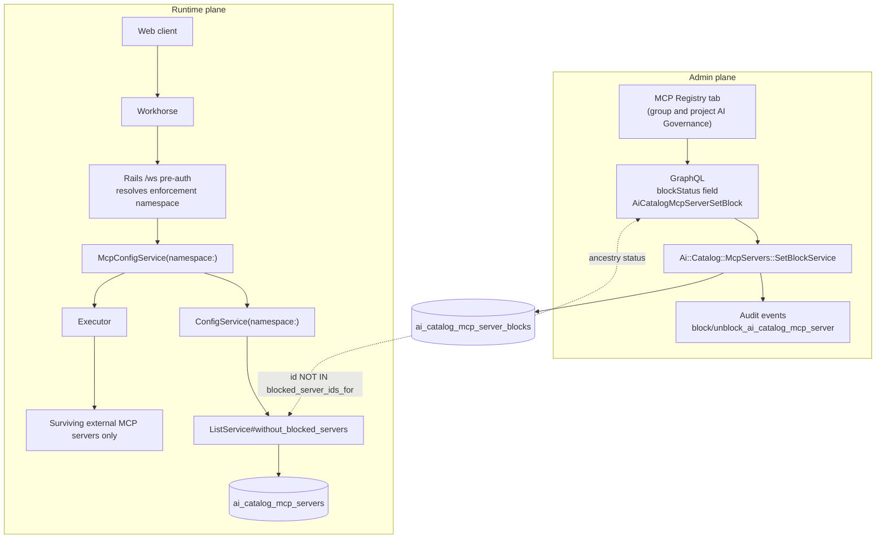
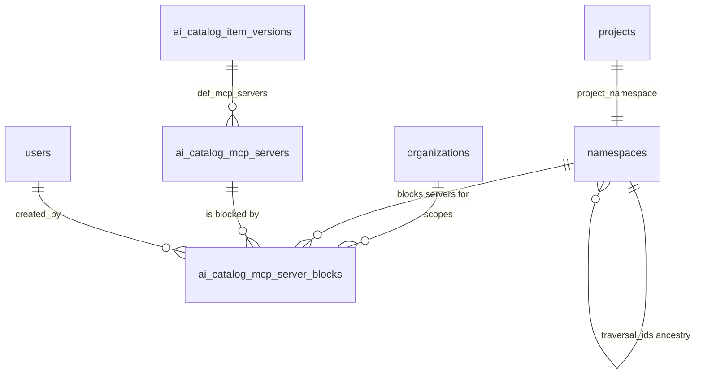

<!-- Design Documents often contain forward-looking statements -->
<!-- vale gitlab.FutureTense = NO -->



## Introduction

Organizations adopting the Duo Agent Platform (DAP) connect external MCP servers - Jira,
ServiceNow, internal APIs - across Agentic Chat, Flows, and IDE/CLI experiences. Those
servers expose tools that agents can invoke on the user's behalf, and until this work
there was no namespace-scoped control over which of them an organization would tolerate.

This document is the design for
[External MCP server blocking (Beta)](https://gitlab.com/groups/gitlab-org/-/work_items/21377) - internal:
the per-namespace block model, its GraphQL API and MCP Registry UI, configuration-time
enforcement for Web Agentic Chat, and the audit trail behind it. Before this work, a
group or project Owner had no way to stop an individual external server from being
reachable by agents in their hierarchy.

The document describes the feature as shipped. Follow-up work - tool classification,
per-tool controls, cross-surface enforcement - is intentionally not designed here; it is
listed under Future Considerations and will get its own design iteration when that work
starts.

## Proposal

Model a block as a `(namespace, MCP server)` row, resolve it through namespace ancestry
via `traversal_ids`, and enforce it by **excluding blocked servers when Rails assembles
the MCP server configuration for the Duo Workflow executor** rather than by checking each
tool call in the AI gateway. Administrators manage blocks from an MCP Registry tab in the
group and project AI Governance area, backed by a GraphQL field and mutation. Block and
unblock actions emit namespace-scoped audit events.

## Goals

1. Precise per-server blocking: blocking server A never affects server B or built-in
   GitLab/Orbit tools.
2. Blocks inherit down the namespace hierarchy; project blocks stay project-scoped and
   cannot loosen an ancestor group's block.
3. Admin-visible, streamable audit trail for governance actions.
4. Consistent behavior across every DAP surface.

## Non-Goals

1. MCP Catalog population. The catalog is consumed as the inventory source, not built here.
2. Replacing the per-tool governance matrix. Server blocking overrides it, but day-to-day
   governance lives in that matrix.
3. The AI Governance SKU extensions listed on the epic: default-deny policies with
   per-agent exceptions, approval workflows, per-tool rate limits, per-user overrides, and
   MCP governance dashboards.

## Scope

### In scope

The shipped foundation: blocks data model, `blockStatus` field, block/allow mutation and
policy, MCP Registry UI, Web Agentic Chat enforcement, and audit events. The item-by-item
breakdown with merge requests lives in the Delivery and Rollout Plan below.

### Out of scope

1. **An instance-level "External MCP servers: Enabled / Disabled" switch.** Decided as
   not required: instance administrators can remove an MCP server from the catalog, which
   removes it for every group and project. Scoped instance-level blocking can be
   revisited if customers request it.
2. Enforcement for Flows, IDE, and CLI, including locally configured `mcp.json` servers.
3. Changes to the MCP Catalog, the per-tool governance matrix, or project-level overrides.

## Terminology/Glossary

1. **DAP**: Duo Agent Platform - GitLab's agent runtime spanning Agentic Chat, Flows, and
   IDE/CLI surfaces.
2. **HITL**: human-in-the-loop - tool calls that pause for user approval.
3. **Kill-switch vs block**: "block" is the per-server, namespace-scoped control; the
   "kill-switch" language on the epic refers to the blast-radius on/off control for
   external MCP usage as a whole.
4. **Enforcement namespace**: the single namespace whose ancestry is walked to decide
   whether a server is blocked for a given request.
5. **Project namespace**: the `Namespaces::ProjectNamespace` record backing a project.
   Project-level blocks are stored against it so group and project blocks resolve
   uniformly.

## Design Overview

### Core approach

1. A block is a row keyed on `(namespace_id, ai_catalog_mcp_server_id)`. There is no
   "allow" row; allowing deletes the namespace's own block.
2. Status resolution walks `namespace.self_and_ancestor_ids`, which comes from
   `traversal_ids` and is therefore an in-memory array, not a query.
3. A block on a group covers the group, its subgroups, and their projects. A block on a
   project namespace covers that project only and never propagates upward.
4. Enforcement is applied where Rails builds the executor's MCP configuration, so a
   blocked server's tools are never offered to the agent rather than being denied at call
   time.
5. Trusted first-party `gitlab` and `orbit` servers are assembled in a separate code path
   in `McpConfigService#execute` and are structurally exempt from the filter.

### Current architecture

Before this work, the `/api/v4/ai/duo_workflows/ws` pre-authorization endpoint built the
executor's MCP configuration from every catalog server attached to the agent version. The
only governance controls in that path were the root-namespace `duo_workflow_mcp_enabled`
setting, which turns catalog MCP off wholesale, and the per-tool governance matrix, which
does not know about servers.

### Proposed architecture

Two additions: an admin plane that writes block rows, and a filter in the existing
configuration build that reads them.



### Enforcement request flow

1. Each user message, tool approval, or new chat session opens a new WebSocket; Workhorse
   pre-authorizes it against the Rails `/api/v4/ai/duo_workflows/ws` endpoint.
2. Rails resolves the enforcement namespace: the project namespace when a project is in
   scope, otherwise the request namespace anchored to the validated root.
3. `Ai::Catalog::McpServers::ListService` excludes blocked servers with one indexed
   subquery (`id NOT IN` blocks for `namespace.self_and_ancestor_ids`).
4. Workhorse builds MCP sessions only for the servers that survive; the agent never sees
   a blocked server's tools.

Implemented in [!251329](https://gitlab.com/gitlab-org/gitlab/-/merge_requests/251329).

### Why configuration-time and not per tool call

The original plan checked each tool call in the AI gateway. That required a stable server
identity on every tool message across four repositories, added a GraphQL round trip per
tool call, and degraded to blocking *all* external tools when clients omitted server
identity. Product accepted next-message enforcement, and the web client reconnects on
every message and every approval, so configuration-time filtering gives fresh enforcement
without invalidation machinery.

One assumption from earlier planning is corrected here for the record: the `/ws`
configuration payload was believed to feed all DAP surfaces, which would have made this
filter inherently cross-surface. Verification during implementation showed only Web
Agentic Chat consumes it - Flows build no MCP configuration from Rails, and IDE/CLI read
local files - which is why cross-surface enforcement is separate follow-up work.

## Data Model

No table is modified. One table is added
([!243019](https://gitlab.com/gitlab-org/gitlab/-/merge_requests/243019)).

### New table

```sql
CREATE TABLE ai_catalog_mcp_server_blocks (
  id                       bigserial PRIMARY KEY,
  created_at               timestamptz NOT NULL,
  updated_at               timestamptz NOT NULL,
  organization_id          bigint NOT NULL REFERENCES organizations(id),
  namespace_id             bigint NOT NULL REFERENCES namespaces(id),
  ai_catalog_mcp_server_id bigint NOT NULL REFERENCES ai_catalog_mcp_servers(id),
  created_by_id            bigint NULL REFERENCES users(id)
);

CREATE UNIQUE INDEX idx_ai_catalog_mcp_server_blocks_on_org_ns_server
  ON ai_catalog_mcp_server_blocks (organization_id, namespace_id, ai_catalog_mcp_server_id);
CREATE INDEX idx_ai_catalog_mcp_server_blocks_on_ns_and_server
  ON ai_catalog_mcp_server_blocks (namespace_id, ai_catalog_mcp_server_id);
CREATE INDEX idx_ai_catalog_mcp_server_blocks_on_mcp_server_id
  ON ai_catalog_mcp_server_blocks (ai_catalog_mcp_server_id);
```

Table metadata (`db/docs/ai_catalog_mcp_server_blocks.yml`): `gitlab_schema: gitlab_main_org`,
`feature_categories: [workflow_catalog]`, `table_size: small`, sharding key
`organization_id`.

The sharding key declaration is wrong: the row is namespace-owned, and `organization_id`
is a denormalized copy taken from the MCP server. The fix to a multi-column
`(namespace_id, organization_id)` sharding key is tracked in
[#627496](https://gitlab.com/gitlab-org/gitlab/-/work_items/627496) - internal. It changes
the declaration only, not the schema.

### Entity relationships



There is no state column. Presence of a row means blocked; absence means allowed. This
keeps allow strictly namespace-local: deleting a project's own row cannot cancel an
ancestor group's row.

## Core Workflows

### Block a server for a group

1. A user with `block_ai_catalog_mcp_server` on the group opens **AI Governance > MCP
   registry** and selects **Block** on a server row.
2. The frontend calls `AiCatalogMcpServerSetBlock` with `groupFullPath` and `blocked: true`.
3. The mutation authorizes the server, resolves and authorizes the group, and delegates to
   `Ai::Catalog::McpServers::SetBlockService`.
4. The service re-checks the ability, verifies the server and container share an
   organization, and calls `McpServerBlock.block!`, which is a `find_or_create_by!` with a
   `RecordNotUnique` rescue so concurrent inserts are race-safe and idempotent.
5. A `block_ai_catalog_mcp_server` audit event is emitted only when a row was actually
   created.
6. The mutation returns the server with its recomputed `blockStatus`; the row renders as
   blocked, and every descendant subgroup and project shows `BLOCKED_BY_ANCESTOR`.

### Block a server for a project

Identical, except the mutation is called with `projectFullPath` and the service stores the
row against `container.project_namespace`. Storing against the project namespace rather
than the project is what lets one ancestry walk cover both group and project blocks.

### Allow a server

1. `AiCatalogMcpServerSetBlock` with `blocked: false` calls `McpServerBlock.unblock!`,
   which is a `delete_all` scoped to that namespace and server.
2. An `unblock_ai_catalog_mcp_server` audit event is emitted only when the delete count is
   non-zero, so a no-op unblock writes no phantom compliance entry.
3. If an ancestor group also blocks the server, the project keeps showing
   `BLOCKED_BY_ANCESTOR` and remains enforced. Allowing at a lower level cannot override a
   higher-level block.

### Resolve block status for display

1. `AiCatalogMcpServer.blockStatus` receives exactly one of `groupFullPath` or
   `projectFullPath`; supplying both raises an argument error, supplying neither returns
   `ACTIVE` so introspection and generated queries do not fail.
2. The container is looked up and authorized (`read_group` / `read_project`), memoized per
   GraphQL request in `context[:mcp_block_status_containers]`.
3. `Ai::Catalog::McpServerBlockStatusBatchLoader` batches every server in the query behind
   one blocks lookup keyed on the container namespace.
4. Status is `BLOCKED` if a returned row's `namespace_id` equals the container namespace,
   `BLOCKED_BY_ANCESTOR` if a row exists on an ancestor, otherwise `ACTIVE`.

### Enforce at session configuration build

1. `ee/lib/api/ai/duo_workflows/workflows.rb` resolves the enforcement namespace and
   passes it into `McpConfigService`, which threads it to `ConfigService` and then
   `ListService`.
2. `ListService#without_blocked_servers` returns unfiltered results when there are no
   attached servers, when no namespace was supplied, or while the
   `mcp_server_block_enforcement` rollout flag is disabled for the namespace's root
   ancestor.
3. Otherwise it applies `id_not_in(McpServerBlock.blocked_server_ids_for(namespace, server_ids))`,
   a subquery over `self_and_ancestor_ids`.

### Namespace resolution

Two rules, both load-bearing:

1. **Project namespace first.** Project-level blocks are stored against the project
   namespace, so when a project is in scope its namespace takes precedence. Resolving only
   the group would silently skip every project-level block.
2. **Anchored to the validated root.** Without a project, the most specific request
   namespace is used only when its `root_ancestor` matches the validated root; otherwise
   enforcement falls back to the root. The request namespace can originate from the
   unvalidated `X-Gitlab-Namespace-Id` header, so this anchoring is a security control -
   see the threat model.

```ruby
enforcement_namespace =
  if most_specific_namespace.root_ancestor.id == root_namespace.id
    most_specific_namespace
  else
    root_namespace
  end

McpConfigService.new(..., namespace: project&.project_namespace || enforcement_namespace)
```

### Enforcement semantics

| Situation | Block applied? |
|---|---|
| New session after block | Yes |
| Existing session, next user message | Yes |
| Tool call awaiting approval when block lands | Yes - the call does not run |
| Tool call already executing | Completes; tools drop on the next action |

Because every external MCP tool call is approval-gated and every approval reconnects,
enforcement is effectively per tool call. Freshness depends on the web client opening a
new socket per message and per approval; a persistent socket would silently degrade
enforcement to per-session, so this client behavior should be guarded by a contract spec
or rollout signal rather than documentation alone.

Blocking is silent by design: tools are removed from the agent's toolset rather than
denied with a policy message, so agents describe the missing tools in their own words, and
after unblocking, an agent in an existing conversation may repeat its earlier "blocked"
explanation. This is
[documented user-facing behavior](https://docs.gitlab.com/user/duo_agent_platform/agents/tool-governance/),
not an enforcement gap.

## API Design

### GraphQL

```graphql
enum AiCatalogMcpServerBlockStatus {
  ACTIVE               # Allowed for the group or project
  BLOCKED              # Blocked directly on the group or project
  BLOCKED_BY_ANCESTOR  # Blocked by an ancestor group; cannot be allowed here
}

extend type AiCatalogMcpServer {
  """Provide exactly one of groupFullPath or projectFullPath."""
  blockStatus(
    groupFullPath: ID
    projectFullPath: ID
  ): AiCatalogMcpServerBlockStatus!
}

extend type Mutation {
  """Blocks or allows an external MCP server for a group or project (kill-switch)."""
  aiCatalogMcpServerSetBlock(input: {
    id: AiCatalogMcpServerID!
    groupFullPath: ID
    projectFullPath: ID
    blocked: Boolean!
  }): AiCatalogMcpServerSetBlockPayload  # { mcpServer, errors }
}
```

Notes:

1. `groupFullPath` and `projectFullPath` are mutually exclusive on both the field and the
   mutation, enforced with an XOR check that raises `ArgumentError`.
2. A container that does not exist and a container the caller cannot read return the same
   error, so the mutation cannot be used to enumerate private groups or projects.
3. The mutation declares `authorize_granular_token permissions: :block_ai_catalog_mcp_server`
   with `group` and `project` boundaries, so it is usable with fine-grained access tokens.

### Removed field

`DuoWorkflow.externalMcpBlocked` was added in 19.3
([!243396](https://gitlab.com/gitlab-org/gitlab/-/merge_requests/243396)) as the Rails half
of the per-call gateway check. The gateway half never merged. The field, its batch loader,
and `McpServerBlock.blocked_namespace_server_pairs` are removed in
[!253156](https://gitlab.com/gitlab-org/gitlab/-/merge_requests/253156)
([#623367](https://gitlab.com/gitlab-org/gitlab/-/work_items/623367) - internal). No
deprecation cycle applies: the field is experiment-status and sits behind a default-off
feature flag.

### REST

No new REST endpoints. The existing `GET /api/v4/ai/duo_workflows/ws` pre-authorization
endpoint gains an internal namespace resolution step; its request and response contracts
are unchanged.

## Authorization Model

### Permission

`block_ai_catalog_mcp_server` - "Block or allow an MCP server in AI Catalog for a group or
project". Declared in `config/authz/permissions/ai_catalog_mcp_server/block.yml` and
exposed as an assignable granular-token permission with `group` and `project` boundaries.

The permission is granted by role definition: `config/authz/roles/owner.yml` grants it at
both group and project scope, `config/authz/roles/maintainer.yml` at project scope only -
see the note below. `GroupPolicy` and
`ProjectPolicy` then withhold it - alongside `read_ai_tool_rule` and `update_ai_tool_rule` -
whenever Duo features are unavailable or the `gitlab_duo_governance_settings` feature flag
is off for the subject:

```ruby
rule { ~(duo_features_enabled & duo_governance_enabled) }.policy do
  prevent :read_ai_tool_rule
  prevent :update_ai_tool_rule
  prevent :block_ai_catalog_mcp_server
end
```

Reading the registry uses the pre-existing `read_ai_catalog_mcp_server` ability, defined in
`Ai::Catalog::McpServers::NamespacePolicy` (requires `read_ai_catalog_item_consumer` and
the namespace's `duo_workflow_mcp_enabled` setting) and
`Ai::Catalog::McpServers::OrganizationPolicy`. Both prevent it when MCP servers are
unavailable.

### Permission matrix

| Role | Read MCP Registry | Block / allow a server |
|---|---|---|
| Guest, Planner, Reporter, Developer | Via `read_ai_catalog_mcp_server` (namespace/organization policy, not a role grant) | No |
| Maintainer | Yes | Project scope only - `maintainer.yml` grants the permission in its project section, not group |
| Owner (group and project) | Yes | Yes |
| Granular access token | Per token scopes | Yes, with `group` or `project` boundary |

Every row is additionally gated on Duo features and `gitlab_duo_governance_settings` being
enabled for the subject.

> **Note:** The user documentation states that blocking requires Owner. For groups the
> role definitions agree; at project scope Maintainer is also granted - likely
> unintentional, tracked in
> [#627667](https://gitlab.com/gitlab-org/gitlab/-/work_items/627667) - internal.

## User Interfaces

Delivered in [!243397](https://gitlab.com/gitlab-org/gitlab/-/merge_requests/243397)
([#604025](https://gitlab.com/gitlab-org/gitlab/-/work_items/604025) - internal).

1. A new **MCP registry** tab (`?tab=mcp-registry`) in the group and project **AI
   Governance** area, lazily loaded alongside the existing tool-governance and audit-event
   tabs.
2. A paginated table of external MCP servers (name, description, connection, type,
   status) with a Block/Allow action, driven by the `aiCatalogMcpServers` connection.
3. Scope is implicit in the page: on a project page the component sends `projectFullPath`,
   otherwise `groupFullPath`. Exactly one is ever sent, matching the API contract.
4. Rows with `BLOCKED_BY_ANCESTOR` render the action as non-interactive with the tooltip
   "Blocked by a parent group and cannot be changed here", so a lower level cannot attempt
   to override an inherited block.

Known usability gap: Description and Connection columns truncate with no way to expand.
Tracked in [#627489](https://gitlab.com/gitlab-org/gitlab/-/work_items/627489) - internal.

## Implementation Notes

1. **Audit event scoping.** The `block_ai_catalog_mcp_server` / `unblock_ai_catalog_mcp_server`
   audit types are `[Group, Project]`-scoped, unlike the `[Instance]`-scoped MCP server CRUD
   events: blocking is a namespace-level action, so the event must land in that namespace's
   own audit log and stream to its destinations. A project block is stored against the
   project namespace internally, but the event is deliberately scoped to the `Project` so it
   appears where a compliance admin looks. Audit is unflagged - `SetBlockService` is live
   and unflagged, and gating compliance visibility behind a flag would defeat its purpose.
2. **Ancestry gotcha.** Status resolution deliberately uses `self_and_ancestor_ids`
   (traversal_ids) rather than the `self_and_ancestors` relation: on a project namespace
   that relation is scoped to `type = 'Project'` and would drop the ancestor groups,
   missing every group-level block.
3. **Spec inversion.** Adding the enforcement filter inverted an existing spec expectation
   that blocked servers stay listed - that expectation encoded the superseded per-call
   design.

## Non-Functional Considerations

### Performance

1. **No added queries.** The filter is inlined as a subquery into a query the `/ws` request
   already runs, served by the `(namespace_id, ai_catalog_mcp_server_id)` index. Request
   query count is unchanged.
2. Ancestry comes from `traversal_ids` in memory; no ancestor query is issued.
3. Agents with no attached external servers skip the filter on a `blank?` check.
4. The `blockStatus` field is batch-loaded per container namespace, so listing N servers
   costs one blocks query, not N. Container lookups are memoized per GraphQL request.

### Scalability

The table is declared `table_size: small` and is written only by explicit admin action.
Read volume scales with `/ws` pre-authorizations, which is one per user message and
approval - the dominant cost in that request is unchanged by this work.

### Security

See the Preliminary Threat Model below.

### Observability

1. The enforcement path is observable under one request context:
   `caller_id: GET /api/:version/ai/duo_workflows/ws` with
   `feature_category: duo_agent_platform`. This scopes log, error, and dashboard filters
   during rollout.
2. Governance actions are visible as audit events in the group or project audit log and on
   its streaming destinations.
3. There is no enforcement-path metric yet - no counter for "servers filtered". Incorrect
   filtering produces a successful response with a wrong server list, so nothing in
   error-rate monitoring would catch it. Tracked in
   [ai-assist#2742](https://gitlab.com/gitlab-org/modelops/applied-ml/code-suggestions/ai-assist/-/work_items/2742) - internal.

### Backward compatibility

1. No schema change to existing tables and no data migration; the new table starts empty,
   so behavior with the flag off is byte-identical to before.
2. `namespace:` is an optional keyword on all three services, so existing callers that do
   not pass it keep the previous behavior.
3. `externalMcpBlocked` is removed without a deprecation cycle, permitted because it is
   experiment-status and behind a default-off flag. No known consumer exists.
4. Self-managed instances below 19.3 cannot store blocks; below 19.4, blocks are stored
   and displayed but not enforced. The user documentation states this explicitly.

## Preliminary Threat Model

1. **Security boundary.** Enforcement is entirely server-side, in the Rails configuration
   build. Clients cannot re-add filtered servers to the tool list for a session the
   executor builds from that configuration.
2. **Attack vector - namespace steering.** The enforcement namespace is partly derived from
   request input (`namespace_id`, `X-Gitlab-Namespace-Id`). An unanchored header pointing
   at a foreign hierarchy would have skipped the caller hierarchy's blocks. The design
   anchors the namespace to the validated root, with a regression spec for the
   split-request case.
3. **Attack vector - resource enumeration.** `blockStatus` and the mutation both return an
   identical "not found or no permission" error for missing and unauthorized containers, so
   neither can be used to probe for private groups or projects.
4. **Attack vector - cross-organization writes.** `SetBlockService` rejects a
   container/server pair whose `organization_id` values differ, so a block cannot be
   written against another organization's server.
5. **Attack vector - privilege escalation by lower namespace.** There is no "allow" row, so
   a project Owner cannot write anything that cancels an ancestor group's block; the UI
   also renders inherited blocks read-only, and the API ignores a local delete for the
   inherited case.
6. **Residual risk.** IDE/CLI local `mcp.json` servers sit outside this boundary entirely
   (tracked in the Delivery and Rollout Plan). Blocking is silent to end users, so a
   missing capability may be misattributed to the model rather than to policy.
   Cross-surface consistency is a stated goal but is not yet true.

### Fail-open behavior

> **Note:** This is a deliberate security posture decision, recorded here so it is not
> missed in future reviews.

Callers that pass no namespace receive **unfiltered** configuration, and so do namespaces
where the `mcp_server_block_enforcement` rollout flag is not yet enabled. This keeps an
enforcement outage from ever breaking tool calls, and is accepted for a beta control. The
flag half of the fail-open disappears when the flag is removed after rollout; the
nil-namespace passthrough remains. Exit criterion: before general availability, either all callers pass a namespace - making
the passthrough dead code to delete - or the fail-open is explicitly re-accepted as a GA
posture with compliance sign-off.

## Delivery and Rollout Plan

### Phases

| Phase | Child item | Merge request | Status |
|---|---|---|---|
| Demo vertical slice | [#599056](https://gitlab.com/gitlab-org/gitlab/-/work_items/599056) - internal | - | Closed |
| Backend plan | [#601159](https://gitlab.com/gitlab-org/gitlab/-/work_items/601159) - internal | [!249704](https://gitlab.com/gitlab-org/gitlab/-/merge_requests/249704) (docs) | Open |
| A1 - schema and model | [#603572](https://gitlab.com/gitlab-org/gitlab/-/work_items/603572) - internal | [!243019](https://gitlab.com/gitlab-org/gitlab/-/merge_requests/243019) | Merged |
| A2 - listing API | [#603573](https://gitlab.com/gitlab-org/gitlab/-/work_items/603573) - internal | [!243395](https://gitlab.com/gitlab-org/gitlab/-/merge_requests/243395) | Merged |
| A3 - `blockStatus` field | [#603574](https://gitlab.com/gitlab-org/gitlab/-/work_items/603574) - internal | [!243395](https://gitlab.com/gitlab-org/gitlab/-/merge_requests/243395) | Merged |
| A4 - mutation, service, policy | [#603575](https://gitlab.com/gitlab-org/gitlab/-/work_items/603575) - internal | [!243396](https://gitlab.com/gitlab-org/gitlab/-/merge_requests/243396) | Merged |
| B1 - runtime enforcement | [#603576](https://gitlab.com/gitlab-org/gitlab/-/work_items/603576) - internal | [!243396](https://gitlab.com/gitlab-org/gitlab/-/merge_requests/243396), [!251329](https://gitlab.com/gitlab-org/gitlab/-/merge_requests/251329) | Merged |
| B2 - frontend | [#604025](https://gitlab.com/gitlab-org/gitlab/-/work_items/604025) - internal | [!243397](https://gitlab.com/gitlab-org/gitlab/-/merge_requests/243397) | Merged |
| B3 - audit events | [ai-assist#2742](https://gitlab.com/gitlab-org/modelops/applied-ml/code-suggestions/ai-assist/-/work_items/2742) - internal | [!251763](https://gitlab.com/gitlab-org/gitlab/-/merge_requests/251763) | Merged |
| C1 - remove `externalMcpBlocked` | [#623367](https://gitlab.com/gitlab-org/gitlab/-/work_items/623367) - internal | [!253156](https://gitlab.com/gitlab-org/gitlab/-/merge_requests/253156) | Open |
| C2 - flag rollout | [#607552](https://gitlab.com/gitlab-org/gitlab/-/work_items/607552) - internal | - | Open |
| C3 - sharding key fix | [#627496](https://gitlab.com/gitlab-org/gitlab/-/work_items/627496) - internal | - | Open |
| C4 - registry usability | [#627489](https://gitlab.com/gitlab-org/gitlab/-/work_items/627489) - internal | - | Open |
| D - cross-surface enforcement | [ai-assist#2741](https://gitlab.com/gitlab-org/modelops/applied-ml/code-suggestions/ai-assist/-/work_items/2741) - internal | - | Open |
| E - classification and re-classification | Tracked on the epic | - | Not started |

### Migrations

Five migrations, all milestone 19.3: one `create_table` and four separate foreign keys.
The table is created empty; there is no backfill and no data migration. The rollback is a
plain table drop.

## Risks and Trade-offs

1. **Enforcement freshness depends on client reconnect behavior.** Configuration-time
   filtering is only per-tool-call because the web client opens a new socket per message
   and approval. A future persistent-socket optimization would silently downgrade
   enforcement to per-session. Mitigation: a contract spec on the reconnect behavior, or
   the Workhorse-side per-call check described under Alternatives.
2. **Silent removal versus an explicit denial.** Removing tools avoids leaking policy
   detail to the model and needs no gateway contract, but users get no explanation and
   agents may confabulate one. Accepted as documented behavior.
3. **Fail-open.** Discussed above. It trades a window of non-enforcement for the guarantee
   that an enforcement outage never breaks tool calls.
4. **A block is not enforced on every surface yet.** The MCP Registry presents a block as
   absolute, but only Web Agentic Chat is enforced: a server blocked in the UI stays
   reachable from IDE and CLI until
   [ai-assist#2741](https://gitlab.com/gitlab-org/modelops/applied-ml/code-suggestions/ai-assist/-/work_items/2741) - internal
   lands. Goal 4 is therefore not met by the shipped design; the gap is also recorded as
   residual risk in the threat model.

## Alternatives Considered

1. **Per-tool-call check in the AI gateway.** Closed unmerged
   ([ai-assist!6445](https://gitlab.com/gitlab-org/modelops/applied-ml/code-suggestions/ai-assist/-/merge_requests/6445) - internal,
   decision recorded in
   [ai-assist#2694](https://gitlab.com/gitlab-org/modelops/applied-ml/code-suggestions/ai-assist/-/work_items/2694) - internal).
   Required coordinated changes across four repositories (gRPC contract, gateway,
   Rails/Workhorse, Language Server), could not identify locally configured servers, added a
   GraphQL round trip per tool call, and degraded to blocking all external tools when
   clients omitted server identity. Its Rails-side artifact, `externalMcpBlocked`, is being
   removed.
2. **Workhorse-side per-call check.** A viable future option for hard mid-session
   enforcement - the executor already maps every tool to its server session - but
   unnecessary while approval-gated reconnects give per-call freshness. Worth revisiting if
   risk 1 materializes.
3. **A boolean `blocked` column on a namespace/server settings row.** Rejected implicitly by
   the row-presence model: an explicit tri-state would allow a descendant to write
   `blocked: false` and cancel an ancestor block, which contradicts goal 2.
4. **Filtering at listing time in the catalog UI only.** Rejected: it hides servers from
   administrators without preventing agents from using them.

## Open Questions

1. **Fail-open at general availability.** Acceptable as a GA posture, or flip to
   fail-closed once all callers pass a namespace? See Fail-open behavior.

## Future Considerations

These are tracked follow-up work and are deliberately not designed in this document; each
will get its own design iteration, proposed in a follow-up merge request, when the work
starts.

1. **Per-tool controls.** The epic's MVC describes allowing or blocking individual tools
   on a server; the shipped unit of control is the whole server, so blocking a server to
   remove one dangerous tool also removes its safe tools. Tool-level control is expected
   to arrive together with classification.
2. **Tool classification pipeline.** Classify each registered server's tools into
   Read/Write/Destroy so role-scoped approval policies can apply to them. Unclassified
   tools default to the most restrictive category (Destroy) so no MCP tool becomes
   silently available under a permissive policy. A Destroy default is a breaking posture
   change for already-attached servers; migration and customer communication are part of
   that work.
3. **Re-classification on server updates.** When an approved server adds a tool or changes
   an existing tool's behavior, the change requires re-classification before the
   capability becomes available; until then the affected tools fall back to the Destroy
   default.
4. **Internal GitLab MCP server governance.** Applying the same controls when an external
   IDE reaches GitLab tools through the GitLab MCP server - tracked in
   [&21113](https://gitlab.com/groups/gitlab-org/-/epics/21113) - internal.

Delivery-tracked follow-ups (cross-surface enforcement, the enforcement-path metric, the
sharding-key fix, registry usability) are listed in the Delivery and Rollout Plan.
