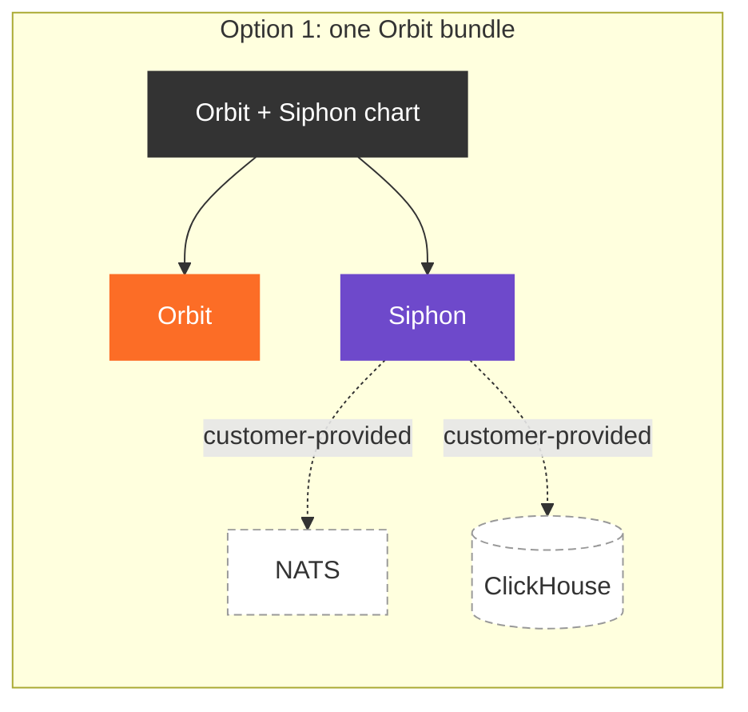
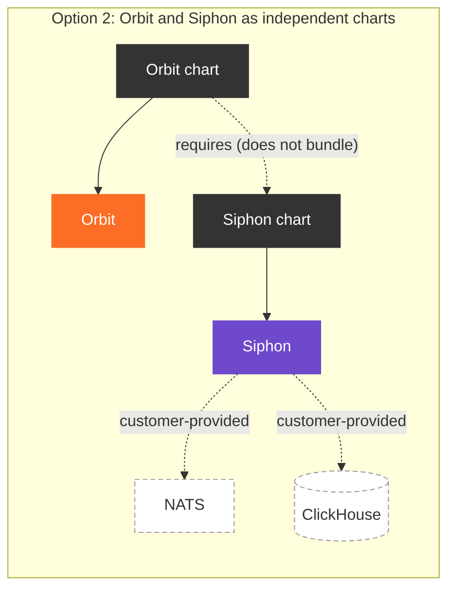
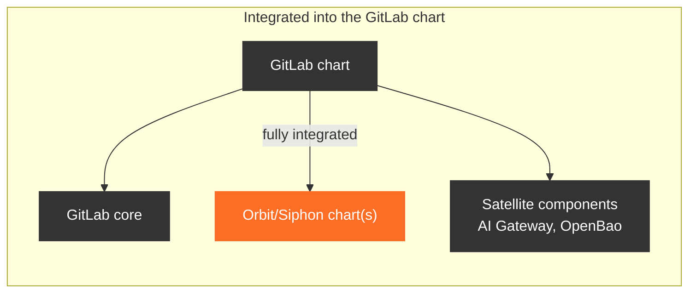
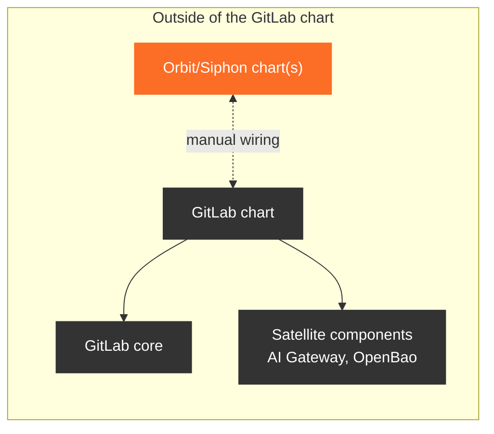

<!-- Design Documents often contain forward-looking statements -->
<!-- vale gitlab.FutureTense = NO -->

## Status

**Proposed.**

## Context

[GitLab Orbit](../) and the [Data Insights Platform](../../data_insights_platform/) (DIP)
are being delivered to GitLab Self-Managed. Orbit depends on DIP, and DIP is made up of three components
that most Self-Managed installations do not run today:

1. [**Siphon**](https://gitlab.com/gitlab-org/analytics-section/siphon): manages replication from GitLab's PostgreSQL data into ClickHouse.
1. [**NATS**](https://docs.nats.io/): the messaging system that carries the replicated change data.
1. [**ClickHouse**](https://clickhouse.com/docs): the column-oriented database management system that stores it.

Several properties of these components shape how they can be delivered:

1. Orbit and DIP are complex to configure.
1. Siphon is ours; NATS and ClickHouse are third-party systems with their own operators, release cadences, and CVE streams.
1. ClickHouse is also an optional GitLab dependency outside of DIP.
1. NATS will become an optional dependency of GitLab core, outside of DIP and Orbit. ([work item #17582](https://gitlab.com/groups/gitlab-org/-/work_items/17582))
1. DIP is coupled to the GitLab Rails PostgreSQL migrations.
1. DIP has upgrade constraints that must be respected when GitLab and DIP are upgraded.
1. Neither DIP nor Orbit uses [Theseus](../../theseus_platform_vision/) as of now.

For Self-Managed customers to install, configure, and upgrade Orbit and DIP without undue effort,
we need to decide three things: what we do about the third-party systems DIP needs, how to shape the packages,
and how those packages are installed.

### Third-party dependencies

Distributing ClickHouse and NATS means becoming their distributor for Self-Managed: tracking upstream releases,
triaging CVEs in software we do not write, and supporting deployment topologies we did not design. That is a
standing commitment that grows with every installation, and it is the same commitment
[Omnibus-Adjacent Kubernetes ADR 001](../../omnibus_adjacent_kubernetes/decisions/001_dont_package_or_bless_kubernetes_distros.md)
declined for Kubernetes itself.

The more immediate problem is that **neither system is DIP-specific**. ClickHouse is already an optional GitLab
dependency outside of DIP, and NATS will soon become an optional dependency of GitLab core. A customer should be
able to run one ClickHouse and one NATS and have every GitLab feature that needs them share it. If either
system ships inside a DIP package, it becomes DIP's: the version, the topology, and the upgrade window are
decided by the DIP release, and the next consumer either shares an instance owned by an unrelated package or
stands up a second one.

The [Theseus platform vision](../../theseus_platform_vision/) has already settled the general shape of this for
Self-Managed. Charts are deliberately
["anemic": they do not have dependencies such as Postgres or Redis wired in](../../theseus_platform_vision/#55-deployment--fairway-and-the-release-framework),
and the [Self-Managed platform binding](../../theseus_platform_vision/#4--one-platform-many-bindings) is
"effectively a no-op — Helm or Helmfile only; customers bring their own databases, Redis/Valkey, and similar
services". ClickHouse and NATS are the DIP equivalent of that sentence. The only binding that provisions data
services in-cluster is Caproni, the developer workstation.

The counterweight is that "bring your own ClickHouse" is not, on its own, a usable instruction. ClickHouse and
NATS both have large configuration surfaces, and only a narrow part of each matters to DIP. A customer who is
handed the upstream documentation and told to work it out will either not get there or will arrive at a
configuration we have never run. The decision is therefore not only whether we distribute these systems, but
what we can do to help customers run them.

### Package sizing

With ClickHouse and NATS established as prerequisites the customer provides, what remains to package is Orbit
and Siphon. The open question is whether they ship as one bundle or two, which means weighing the demand for
DIP outside of the Orbit context against the added complexity of shipping both independently.

Note what has already dropped out of this question. The DIP side of the split has exactly one component left in
it, so there is no DIP bundle to build: DIP's delivery artifact is the Siphon chart.

### Install experience

The [GitLab Helm chart](https://docs.gitlab.com/charts/) is the de facto delivery method for cloud-native
customers today, and it bundles core GitLab together with optional satellite components such as the
AI Gateway and OpenBao. With GitLab moving towards a more modular install experience, we need to decide
whether the Orbit and Siphon charts follow that pattern or stay outside of the GitLab Helm chart.

### Isolation and upgrade constraints

Siphon is designed as a general data processing component that is not bound to GitLab, but the replication
it performs for DIP tracks the GitLab Rails schema. Siphon needs a change data capture (CDC) configuration
that matches that schema, which means DIP and GitLab upgrades must be synchronized.

We publish the CDC table mapping as an independent bundle that Siphon pulls on startup, so the mapping does
not have to ship inside Siphon itself. Delivery still has to guarantee two things: that Siphon references the
CDC bundle matching the installed GitLab version, and that Siphon does not start before the GitLab Rails
migrations have completed.

Siphon's own upgrade story is simpler for the reason given above: because it never ships ClickHouse or NATS,
configuring it against endpoints it does not manage is the only topology rather than one of two. There is no
"bundled or external" branch in the upgrade path, and no question of what happens when an installation already
runs one of the dependencies.

## Decision

Orbit and DIP will be delivered as **two independent charts**, **neither will be integrated into the
GitLab Helm chart**, and **neither chart will distribute ClickHouse or NATS**.

Because ClickHouse and NATS are not distributed, **there is no DIP bundle**: DIP is shipped as the Siphon chart.
The two charts are the Orbit chart and the Siphon chart.

Integrating these components with a GitLab installation will require thorough documentation, and can later be
automated with orchestration tooling such as the
[GitLab Kubernetes Operator](../../theseus_platform_vision/#622-the-gitlab-kubernetes-operator)
and [Bridge](../../theseus_platform_vision/#623-bridge).
Omnibus users will be able to consume the same charts through
[Omnibus-Adjacent Kubernetes](../../omnibus_adjacent_kubernetes/) (OAK).

### ClickHouse and NATS

We will **not distribute ClickHouse or NATS in any form**: not as subcharts, not as bundled deployments, not as
custom resources shipped inside our charts, and not as a blessed operator build. Both are prerequisites the
customer provides, and Siphon is configured against them as external endpoints.

The primary reason is reuse. Both systems have use cases beyond DIP — ClickHouse already serves GitLab features
outside DIP, and NATS is becoming a GitLab core dependency — and a customer should be able to run **one ClickHouse and
one NATS shared across all of them**. Keeping both outside our charts is what makes that possible: no package
owns the instance, its version, or its upgrade window, and every consumer connects to it the same way. The
secondary reason is that distributing them would make us the distributor of the data infrastructure our
components run on, which
[Omnibus-Adjacent Kubernetes ADR 001](../../omnibus_adjacent_kubernetes/decisions/001_dont_package_or_bless_kubernetes_distros.md)
declined for the platform layer and which the Theseus Self-Managed binding declines for data services.

In place of distribution we take on a **tested and documented setup path**:

1. **A minimal reference configuration for each system.** For ClickHouse, a minimal custom resource for a named
   ClickHouse operator; for NATS, a minimal set of values for the upstream NATS Helm chart, covering the
   JetStream configuration DIP requires. Each covers what DIP needs and nothing more — no HA topology, no
   tuning, no opinion on storage — so it is small enough to read and adapt rather than adopt wholesale, and so
   it does not conflict with the requirements of another consumer sharing the same instance. Because it is
   documentation rather than chart payload, naming an operator is a tested example a customer can depart from,
   not a contract their installation has to satisfy.
1. **CI coverage of that reference configuration.** The reference configurations are exercised against Siphon
   in CI, so the setup we document is the setup we test, and drift between the two surfaces as a failing
   pipeline rather than as a support ticket.
1. **A declared version range.** We publish which ClickHouse and NATS versions each Siphon release is tested
   against, and what DIP requires of them, such as the ClickHouse features and the JetStream settings it
   depends on. This is also what lets a customer confirm that an instance they already run is suitable.
1. **End-to-end setup documentation.** Prerequisites, install order relative to GitLab and Siphon, the values
   that wire Siphon to the resulting endpoints, and how to verify the connection before replication starts.

The reference configuration is a starting point, not a supported deployment. Installing and upgrading the
operator and the charts, sizing, storage, HA topology, backups, and CVE response for both systems remain the
customer's responsibility. Customers who already run ClickHouse or NATS, or who use a managed service such as
ClickHouse Cloud, point Siphon at that instance and skip the reference configuration entirely; this is a normal
path, not an exception.

ClickHouse performance also depends on factors that are not in our control. The most prominent one is the
performance of the storage class backing its volumes. The reference configuration aims at a working baseline
rather than a tuned deployment, so sizing and storage tuning stay with the customer.

### Theseus

Both charts will be **hand-written for now, not Theseus-generated**. Neither Orbit nor DIP is onboarded to
Theseus, and waiting for that onboarding would hold up delivery to Self-Managed.

Independent charts keep the swap open. When Orbit and Siphon onboard to Theseus, the generated chart can be
published next to the hand-written one instead of replacing it in place, so customers migrate at their own
pace and no migration has to be coordinated with the GitLab Helm chart release. Each component can also make
the move on its own schedule. When and how the swap happens is a follow-up decision, recorded as its own ADR
once the onboarding is planned.

Leaving ClickHouse and NATS out of the charts shortens that path. A Theseus-generated chart declares abstract
dependencies in a Fairway manifest and leaves provisioning to the platform binding, which is the shape these
charts already have if they never bundled the dependencies in the first place.

## Consequences

### Positive

1. **One ClickHouse and one NATS can serve every consumer.** Neither instance is owned by a GitLab package, so
   DIP, existing ClickHouse-backed features, and a future core NATS share the same deployment rather than each
   bringing their own.
1. **We do not become distributors of third-party data infrastructure.** Upstream releases, CVEs, and
   deployment topologies for ClickHouse and NATS stay with the projects and the customers who run them.
1. **Siphon has one dependency topology, not two.** Everything runs against external endpoints, so there is a
   single configuration surface to document, test, and support.
1. **NATS becoming a GitLab core dependency is not a breaking change.** Because the Siphon chart never ships its
   own NATS, customers point Siphon at the core instance when it arrives instead of migrating off a bundled
   deployment under a deprecation clock.
1. **DIP is available outside of Orbit.** Customers who want replication into ClickHouse without the graph
   install the Siphon chart on its own, which is the demand the split anticipates.
1. **No lock-in on chart internals.** Orbit and Siphon can move to Theseus-generated charts without having to
   migrate users across changes to configuration format and immutable fields such as selector labels.
1. **Upgrades can be sequenced.** DIP's coupling to the GitLab Rails migrations is respected by upgrading the
   charts in order, rather than by holding a bundled release back to the slowest component.
1. **The GitLab Helm chart does not grow.** It keeps moving towards a more modular install experience, where
   customers pick the components they want instead of receiving one bundle that carries everything.

### Negative

1. **The install path is longer.** Customers stand up two third-party systems before Siphon can be installed at
   all, which is more work than enabling a value in a chart they already run.
1. **Documentation and the reference configuration become the deliverable.** If they rot, the install path
   rots with them. CI coverage of the reference configuration is the mitigation, and it has to be maintained
   like product code, not like an example snippet.
1. **A shared instance means shared blast radius.** The reuse this decision enables also means one ClickHouse
   or NATS outage, upgrade, or misconfiguration affects every consumer, and capacity planning has to account
   for all of them rather than for DIP alone.
1. **"Tested" needs a boundary.** A reference configuration exercised in CI invites the reading that we support
   the resulting deployment. Documentation has to be explicit that we test the Siphon integration, not the
   customer's ClickHouse or NATS installation.
1. **A version matrix has to be maintained.** Declaring which ClickHouse and NATS versions each release is
   tested against means tracking upstream releases and widening the CI matrix over time, even though we ship
   neither.
1. **Version skew between the charts becomes possible.** Nothing structural stops a customer from running
   Orbit vN against a Siphon vM whose schema it does not support, which a bundled release would have ruled out
   by construction. We therefore need either a published compatibility matrix, or aligned versioning where
   each GitLab release has exactly one Siphon and one Orbit chart release that carry the GitLab version. Which
   of the two we adopt is a follow-up decision.
1. **Customers wire Orbit and Siphon themselves.** Configuration that a shared bundle would pass along has to
   be supplied by hand until orchestration tooling lands. The most notable example is the GitLab version,
   which DIP needs in order to configure data streaming correctly.
1. **Less initial delight for existing chart users.** Enabling Orbit is not a single value in a chart the
   customer already runs; it is provisioning two dependencies and installing and wiring two more charts.
1. **The charts are maintained by hand until Theseus onboarding.** The current [Orbit](https://gitlab.com/gitlab-org/orbit/orbit-helm-charts)
   and [DIP](https://gitlab.com/gitlab-org/cloud-native/charts/gitlab-deps) charts are not Theseus generated but
   could be swapped once the Theseus alternatives have been established.
1. **ClickHouse performance is partly outside our control.** Because storage class performance and cluster
   sizing belong to the customer, a slow ClickHouse can look like a DIP or Orbit problem in support.

## Alternatives Considered

### Alternative: bundle ClickHouse and NATS into a DIP chart

#### Approach

Ship a DIP chart containing Siphon, ClickHouse, and NATS, deployed by default, with external endpoints
available as an opt-out for installations that already run either dependency.

#### Why not chosen

This is the best first-install experience: one `helm install` and DIP is running. It fails on everything after
the first install.

The decisive problem is reuse. ClickHouse already has GitLab use cases outside DIP and NATS is becoming a core
dependency, so bundling makes the shared instance a DIP-owned one — its version and upgrade window set by the DIP
release, and the next consumer either depending on a package it has nothing to do with or running a second
instance. We would also own the upgrade path, the CVE response, and the support burden for two third-party data
systems across every Self-Managed installation, for as long as they run. It contradicts the Theseus Self-Managed
binding, where customers bring their own data services and charts stay anemic, so a later move to
Theseus-generated charts would mean removing the bundled deployments from installations that depend on them.

The opt-out does not reduce the commitment. Supporting both a bundled and an external topology doubles the
configuration surface and the test matrix while leaving us on the hook for the bundled one, and it makes NATS
moving into GitLab core a migration for every installation running the bundled copy.

### Alternative: ship ClickHouse custom resources and require the customer's operator

#### Approach

Do not ship ClickHouse itself, but ship pre-configured custom resources inside the Siphon chart, which the
customer's ClickHouse operator reconciles into a running instance.

#### Why not chosen

This looks like a middle ground but keeps the parts we want to avoid. Custom resources shipped inside a chart
are ours: their schema is tied to a specific operator and operator version, so we inherit that operator's
upgrade path and breaking changes, and a customer running a different operator, a managed ClickHouse, or an
existing instance cannot use them at all. The chart would also be reconciling an instance other GitLab features
are meant to share, which is the ownership problem bundling has, one layer down. It splits responsibility for a
single ClickHouse deployment between our chart and the customer's operator, leaving it unclear who is
accountable when reconciliation fails.

Publishing the same configuration as tested, documented reference material gives customers the identical
starting point without embedding an operator contract in a chart we then have to version against.

### Alternative: one bundle containing Orbit and Siphon

#### Approach

Ship a single package containing both Orbit and Siphon.

#### Why not chosen

This is the most straightforward delivery option and the best experience for Orbit users, but it makes DIP
reachable only through Orbit. Given the expected demand for DIP outside of the Orbit context, the bundle would
have to be unpicked later, after customers have already installed it.

### Alternative: integrate Orbit and Siphon into the GitLab Helm chart

#### Approach

Add Orbit and Siphon to the GitLab Helm chart as optional components, alongside the AI Gateway and OpenBao,
so existing chart users can enable them without installing anything else.

#### Why not chosen

The integration is attractive on two counts: existing chart users could enable Orbit and DIP without wiring
separate charts, and configuration defined by the GitLab Helm chart, such as the GitLab version DIP needs
for data streaming, would be shared without user interaction.

Both advantages are outweighed by the lock-in effect. Bundling every component into a single chart makes
handling breaking changes, or swapping a component out, difficult. With Orbit and DIP moving towards Theseus,
replacing a hand-written chart with a generated one inside a customer-facing bundle would be a breaking change
in itself, because the generated chart uses a different configuration format.

Keeping the charts independent avoids that. The hand-written and the Theseus-generated chart can coexist while
customers migrate at their own pace, supported by our documentation and guidance.

## References

1. [GitLab Orbit](../): the design document this decision belongs to.
1. [Data Insights Platform](../../data_insights_platform/):
   the platform Orbit depends on, delivered as the Siphon chart.
1. [Siphon](../../siphon/): the replication component and its
   coupling to the GitLab Rails schema.
1. [Omnibus-Adjacent Kubernetes](../../omnibus_adjacent_kubernetes/):
   how Omnibus users consume Kubernetes-only components.
1. [Omnibus-Adjacent Kubernetes ADR 001: Don't package or bless any Kubernetes distributions](../../omnibus_adjacent_kubernetes/decisions/001_dont_package_or_bless_kubernetes_distros.md):
   the precedent for not distributing the platform layer our components run on.
1. [Theseus Platform Vision](../../theseus_platform_vision/):
   the per-component chart model Orbit and DIP move towards, and the source of the GitLab Kubernetes Operator
   and Bridge.
1. [Theseus: Deployment — Fairway, and the Release Framework](../../theseus_platform_vision/#55-deployment--fairway-and-the-release-framework):
   the anemic chart model, where Self-Managed customers bring their own data services.
1. [Theseus ADR 004: Independent per-component deploys for GitLab.com; bundled releases for Self-Managed](../../theseus_platform_vision/decisions/004_independent_vs_bundled_releases.md):
   the release-shape decision this ADR sits under.
