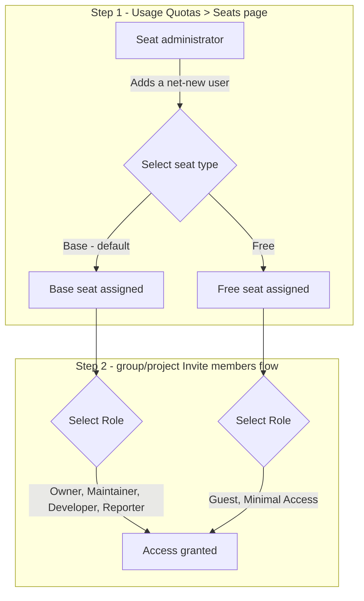

<!-- Design Documents often contain forward-looking statements -->
<!-- vale gitlab.FutureTense = NO -->

<!-- This renders the design document header on the detail page, so don't remove it-->


## Table of Contents

- [Summary](#summary)
- [Motivation](#motivation)
  - [Goals](#goals)
    - [Iteration 1](#iteration-1)
    - [Later iterations](#later-iterations)
  - [Non-Goals](#non-goals)
- [Proposal](#proposal)
- [Design and implementation details](#design-and-implementation-details)
  - [Data model](#data-model)
  - [Rollout mechanism](#rollout-mechanism)
  - [Enforcement of role restrictions](#enforcement-of-role-restrictions)
  - [Net-new users added below the top level](#net-new-users-added-below-the-top-level)
  - [Changing seat type](#changing-seat-type)
  - [Membership lifecycle and seat retention](#membership-lifecycle-and-seat-retention)
  - [Subscription tier transitions](#subscription-tier-transitions)
  - [UI and audit events](#ui-and-audit-events)
  - [Relationship to existing work](#relationship-to-existing-work)
  - [Open questions](#open-questions)
- [Alternative Solutions](#alternative-solutions)

## Summary

The Seat Assignment Model (SAM) replaces GitLab's current "role-first" approach
to determining billable seats with an explicit "seat-first" model. Today, a
member only consumes a seat if the role they are given happens to be billable;
whether that's the case is derived *after the fact* by evaluating tier-specific
rules and, on GitLab.com, traversing the member's entire namespace hierarchy to
find their highest access level. A member with a non-billable role (for
example, a Guest on Ultimate) simply consumes no seat at all today.

With SAM, a **seat administrator** — a namespace Owner on GitLab.com, or an
instance Admin on Self-Managed — explicitly assigns each member a **Seat
Type** (for example `Base`, `Free`, or `Plan`). The seat type determines
which roles a member is allowed to hold anywhere in the namespace hierarchy
(GitLab.com) or on the instance (Self-Managed). Because seat types map
directly to seat cost, cost is known **upstream** of role selection, instead
of being computed downstream by inspecting roles across every group and
project a user belongs to.

SAM is being introduced first as a mandatory, GitLab-controlled part of Flex:
new and existing customers having a Flex subscription get SAM enabled by
GitLab in staged waves, with no customer-facing opt-out in the first
iteration. It builds on backend foundation work already shipped (see
[Relationship to existing work](#relationship-to-existing-work)), and is
designed so that the same data model can eventually work consistently for
both GitLab.com and Self-Managed. A self-service opt-in for existing,
non-Flex customers may be introduced later, once SAM has proven out with
Flex. SAM covers seat classification for named users and service accounts;
it is not a general foundation for all resource consumption.

**Scope of the first iteration.** SAM initially targets GitLab.com, Ultimate,
Flex only. Self-Managed and Dedicated, the Premium tier, and the
Free Tier are explicitly out of scope for the first iteration and will follow in
later iterations.

**EE only.** SAM is implemented exclusively in GitLab Enterprise Edition (EE).
It is not available in the Community Edition (CE) codebase, because seat-type
enforcement depends on subscription and billing infrastructure that exists only
in EE.

## Motivation

GitLab's current billable-member model has reached its scaling and usability
limits.

**Business impact**

1. New seat types are expected soon, and today there is no decent admin-facing
   page to manage seat types at all. Without a proper seat-type management UI,
   each new seat type compounds the ad hoc, duplicated billable-logic problem
   described below instead of being handled through one consistent, extensible
   surface.
1. Enterprise Agile Planning (EAP) seats are currently just added to a
   customer's Ultimate seat count, with no data-level distinction between a
   regular Ultimate seat and an EAP seat. This makes it impossible to
   accurately track, report on, or bill EAP seats separately from Ultimate
   seats.
1. Determining whether a user is billable requires traversing a namespace's
   entire group/subgroup/project hierarchy to find their highest access level.
   This does not scale well and is a known source of performance problems for
   large namespaces.
1. Billable-member logic is duplicated between GitLab.com and Self-Managed, and
   is re-derived independently for related features (for example, determining
   who is eligible for a GitLab Duo add-on seat).
1. Every new role or custom role requires updating billable-logic rules in
   multiple places, adding an ongoing maintenance and correctness burden.
1. Reconciling seat counts generates significant support and debugging load
   (quarterly/annual true-ups, disputed overages).

**Customer impact**

1. Role elevation can have unexpected billing consequences ("our Ultimate
   guests can easily become non-guests, which ends up costing us more money"),
   and role changes can accidentally violate internal compliance/segregation-of
   duties policies.
1. Enterprise Agile Planning (EAP) customers have no reliable way to keep
   members in an EAP-eligible role, or to know how many EAP seats they are
   consuming.
1. Seat usage is generally hard to predict or reason about before a membership
   change is made.
1. Project Maintainers can add net-new members with a billable role without
   going through a namespace Owner, effectively making a billing decision that
   should be reserved for whoever is accountable for the subscription's seat
   cost.

SAM addresses both facets by decoupling "who can do what" (role/permissions)
from "what does this user cost" (seat type), and by making seat assignment an
explicit, queryable, admin-controlled record rather than a derived value.

### Goals

#### Iteration 1

1. Establish an explicit, per-user seat type as the single source of truth for
   seat consumption, replacing namespace-hierarchy traversal for
   billable-member calculation. Once SAM is active for a namespace, billable
   user counts are derived by querying the `subscription_seat_assignments`
   table directly, rather than using the existing billable member queries.
1. Ensure seat cost is determined **upstream** of role assignment: a member's
   seat type constrains which roles they can be granted, anywhere in the
   namespace hierarchy.
1. Give namespace Owners explicit control over assigning and
   changing seat types for a single user at a time, decoupled from day-to-day
   membership changes. Bulk seat type changes are out of scope for iteration
   1 and tracked as a later-iteration goal (see
   [Later iterations](#later-iterations)).
1. Ship first as a **mandatory, GitLab-controlled** part of Flex — new and
   existing customers moving to Flex get SAM enabled automatically, with no
   opt-out in the first iteration.
1. Ensure that introducing a net-new, billable member is always an explicit
   decision made by whoever is accountable for the subscription's seat cost
   (a namespace Owner), not an incidental side effect of a Project Maintainer
   adding a member with a billable role.
1. Backfill seat assignment records for every existing member (including
   bots and blocked/banned users) in a namespace at the point it is opted
   into SAM, mapping current role to seat type. The backfill runs in two
   passes: a first pass executes at provisioning time, before SAM is
   activated, so that seat records exist from the moment enforcement
   begins; a second pass runs after SAM activation to reconcile any
   membership changes that occurred between the two passes.
1. Block external group invites (groups outside the namespace hierarchy) when
   SAM is enabled. Internal group invites (groups within the hierarchy) are
   compatible with SAM: the maximum role mechanic ensures a member keeps the
   lower of their existing role and the invited group's maximum role, so seat
   type is never violated.
1. Change the source for GitLab.com's seat usage data already exposed via the
   REST API so that CustomersDot fetches it from the authoritative SAM table
   (see [Relationship to existing work](#relationship-to-existing-work)).

#### Later iterations

1. Extend seat cost determination, seat-type assignment, and the net-new,
   billable-member decision (goals 2, 3, and 5 above) to Self-Managed and
   Dedicated, where an instance Admin takes on the role a namespace Owner
   plays on GitLab.com, and there is no equivalent of GitLab.com's top-level
   namespace.
1. Bring the Premium tier into scope, including whatever additional seat
   types Premium needs given its different role/billing rules (see
   [Open questions](#open-questions)).
1. Design the seat-type data model and admin UI to be extensible to future
   seat types and tiers and future seat-based pricing/packaging beyond Flex,
   so that adding a new seat type is a matter of extending one consistent,
   admin-facing management surface rather than adding more ad hoc, duplicated
   billable-logic rules.
1. Consider a self-service opt-in for existing, non-Flex customers, once SAM
   has proven out with Flex.
1. Support LDAP/SAML/SCIM-provisioned seat type mapping, which is not
   addressed at all in iteration 1.
1. Support bulk seat type changes in the UI, in addition to iteration 1's
   single-user assignment and change flow (see
   [Changing seat type](#changing-seat-type)).
1. Expose full seat type management (assigning and changing seat types,
   single and bulk) through the REST/GraphQL APIs, so seat administrators can
   manage seat types by using automation, not just the UI. In iteration 1, the
   APIs only inherit role-restriction *enforcement* for free from the shared
   model/service layer (see
   [Enforcement of role restrictions](#enforcement-of-role-restrictions));
   dedicated API endpoints for seat type management itself are a later
   iteration.
1. Allow a seat administrator to define the seat type as part of the same step
   as defining a member, rather than as a strictly separate, prior step (see
   [Proposal](#proposal)). This includes extending the group and project
   members pages so that seat administrators (TLG Owners on GitLab.com,
   instance Admins on Self-Managed) can assign a seat type inline when
   inviting a user, without having to go through Usage Quotas > Seats first.
1. Replace the iteration 1 hard block on net-new users added below the top
   level (or invited by email) with a pending-approval bucket: the membership
   is created with no role/access and no active seat until a seat
   administrator reviews and approves it and assigns a seat type (see
   [Net-new users added below the top level](#net-new-users-added-below-the-top-level)).
1. Handle subscription tier transitions (upgrade/downgrade), including
   members "bringing their role" to the new tier and having their seat type
   recomputed accordingly, once cross-tier scenarios exist to handle (see
   [Subscription tier transitions](#subscription-tier-transitions)).
1. Emit an audit event for every seat type change, recording who made the
   change, for whom, the old and new seat type, and a timestamp (see
   [UI and audit events](#ui-and-audit-events)).
1. Add seat type summary statistics to Usage Quotas > Seats (usage vs.
   purchased seats per type, overage indicator) (see
   [UI and audit events](#ui-and-audit-events)).
1. Add in-app and email notifications on seat type change, sorting and CSV
   export by seat type, dormant-seat automation, and admin approval workflows
   for seat type requests. Add broader GTM communication (in-app banners and
   pre-enforcement notices) for when SAM transitions beyond Flex customers.
1. Extend SAM to the Free Tier with a simplified seat type model (for example,
   an unpaid-billable seat type capped at 5 users and a bot/system seat type),
   replacing the current hierarchy-traversal-based user count with a unified,
   SAM-based count consistent across all tiers.
1. Define seat type handling for automation identities, including the full set
   of automation identity types that should be assigned the `system` seat type.
1. Tier changes, such as a namespace downgrading from Ultimate to Premium or
   upgrading from Premium to Ultimate, must also be reflected in seat
   assignments. When a tier change occurs, the available Seat Types and their
   associated feature entitlements may shift, requiring a reconciliation pass
   over existing assignments to ensure no member holds a Seat Type that is
   invalid or unsupported under the new tier. This includes handling gracefully
   cases where a previously valid Plan seat type becomes unavailable,
   potentially falling back to a Base or Free seat.
1. Assign and enforce the `plan` seat type for Enterprise Agile Planning
   (EAP) seats, so that EAP seats can be tracked, reported on, and billed
   separately from regular Ultimate seats. The `plan` seat type itself
   already exists in the backend model/enum as shipped foundation work.

### Non-Goals

1. SAM does not replace the roles/permissions (RBAC) system. It constrains
   which roles are available to a member; it does not change what a role can
   do.
1. In iteration 1, SAM does not automatically reconcile or adjust existing
   memberships that become incompatible with a newly assigned, lower seat
   type. Downgrades are blocked with an informative error until the admin
   resolves the conflicting memberships themselves. Automatically adjusting
   memberships on downgrade is a candidate future enhancement, once we have
   real usage data.
1. Seat type is never updated automatically as a result of a role-only change
   or a membership deletion.
1. SAM does not immediately change billing for existing subscriptions. Billing
   enforcement based on seat type activates when GitLab opts the customer's
   subscription into the staged Flex rollout (see
   [Rollout mechanism](#rollout-mechanism)), not retroactively, and not as a
   customer self-service action in the first iteration.
1. Agent-based or credit-pool resource consumption. SAM is scoped to named
   human users and service accounts. AI agents and other automation that consume
   resources from a shared pool (credits, compute) are a separate commercial
   concept and are not covered by SAM.

## Proposal

Today, adding a member is a single step: a seat administrator selects a role,
and whether that role is billable (and thus what it costs) is a side effect
determined by tier-specific rules.

With SAM, adding or promoting a member becomes a two-step decision — **seat first, role second**:

1. Select a **seat type** — this determines cost and the set of roles
   available. This is always done by a seat administrator (a namespace Owner
   on GitLab.com, or an instance Admin on Self-Managed), not by Maintainers,
   removing billing decisions from day-to-day membership management.
1. Select a **role** from within the set of roles permitted by that seat type.

This is the chosen approach (Option 1: seat-first assignment). The alternative
of syncing seat type from the role at invitation time (Option 2) was considered
but rejected: as long as Maintainers can add members with roles, they implicitly
make billing decisions. The only way Option 2 could work would be to restrict
billable decisions from Maintainers — which effectively converges with Option 1.
Option 1 is also aligned with the direction the Organizations team has been
taking.

Later iterations may allow a seat administrator to define the seat type as
part of the same step as defining a member (rather than as a strictly separate,
prior step). This is not part of iteration 1; it is tracked as a later
iteration.

For example, a customer on an Ultimate subscription would choose from:

1. **Base seat** (Ultimate) — any role above Guest, including Developer,
   Maintainer, and Owner.
1. **Free seat** — Guest or Minimal Access only (no additional cost, mirroring
   today's free Ultimate guest behavior).

A **Plan seat**, for Enterprise Agile Planning (EAP) roles up to `Planner`,
is planned for iteration 2.

In iteration 1, these two steps happen on two different pages, not in a single
combined flow:

Seat type assignment and role selection remain connected but distinct
concerns: an admin can change a member's role at any time as long as it stays
within their current seat type, and can change a member's seat type
independently, which in turn changes the set of roles available to them going
forward.

**Where this happens in iteration 1.** The two-step decision above is only
available on the Usage Quotas > Seats page in iteration 1: this is the sole
place where a net-new user (someone with no existing seat in the namespace)
can be added and given an initial seat type. The group/project "Invite
members" flow keeps working as today, but is restricted to users who already
hold a seat somewhere in the namespace; it cannot be used to introduce a
net-new user. Service accounts are unaffected because they hold `system` seats,
so they already satisfy the seat-holder restriction. Extending the
group/project member pages themselves to support
the full seat type + role decision directly is planned for a later iteration;
see [Net-new users added below the top level](#net-new-users-added-below-the-top-level).

## Design and implementation details

### Data model

SAM builds on the `subscription_seat_assignments` table and
`GitlabSubscriptions::SeatAssignment` model already introduced as backend
foundation work (namespace + user + organization, unique per
`(namespace_id, user_id)`, with a `seat_type` enum: `base`, `free`, `plan`,
`system`). SAM's job is to make this table the **authoritative** source for
seat consumption and to add the enforcement and admin-facing layers on top of
it, rather than treating it as a read model that is kept in sync with
membership state after the fact.

1. `base` — allows all roles.
1. `free` — maximum Guest; no cost.
1. `plan` — Enterprise Agile Planning seat; roles up to `Planner`.
1. `system` — bots and other service accounts; always assigned, never billed.

Iteration 1 only assigns and uses the `base`, `free`, and `system` seat
types. The `plan` seat type already exists in the backend model/enum as
shipped foundation work, but is reserved for iteration 2.

Note that user add-on seat assignments (for example, GitLab Duo) work
differently today: when a membership is removed, the add-on seat
assignment is deleted rather than retained. SAM does not change this
behavior for add-on seats.

The following tables define which user and member states require a seat
record and whether they are billable.

**User states** (`app/models/user.rb` state machine):

| User state | Needs seat record? | Billable? |
|---|---|---|
| `active` | ✅ Yes | ✅ Depends on seat type |
| `blocked`, `ldap_blocked`, `deactivated`, `banned`, `blocked_pending_approval` | ✅ Yes | ❌ No |

**Member states** (`app/models/member.rb` + `ee/app/models/ee/member.rb`):

| Member state | Needs seat record? | Billable? |
|---|---|---|
| `active` | ✅ Yes | ✅ Depends on seat type |
| `awaiting`, invited, access request pending | ⏳ Later iteration | ❌ No |
| Bot / service account | ✅ Yes | ❌ No |
| Guest, Minimal Access | ✅ Yes | ✅ Depends on seat type |

### Rollout mechanism

**Scope.** The first iteration of SAM covers GitLab.com, Ultimate, Flex
only. Self-Managed, Dedicated, and Premium are excluded from
the first iteration and are planned for later work; the Free Tier is out of
scope for the first iteration and is planned for a later iteration (see
[Later iterations](#later-iterations)).

**Flex (first iteration).** SAM is enabled automatically, by GitLab, as an
inherent part of Flex activation — for both new Flex subscriptions and
existing customers transitioning to Flex. There is no customer-facing toggle
and **no opt-out** in the first iteration; a Flex subscription implies SAM.

Within that, the initial rollout itself is staged: rather than enabling SAM
for all Flex customers (new and existing) at once, GitLab enables it
**customer by customer**, at a time of GitLab's choosing, rather than enabling
every customer simultaneously. This is a GitLab-side opt-in (an internal
decision, not a customer-facing setting), so it does not contradict the "no
opt-out" framing above — customers cannot choose to delay or skip SAM once
GitLab has opted their subscription in, but GitLab controls the pace at which
subscriptions are brought in. For a customer with an existing subscription,
this GitLab-initiated opt-in is also the point at which billing enforcement
based on seat type actually takes effect for that subscription (see
[Non-Goals](#non-goals)).

**Customer communication.** For Flex customers in iteration 1, SAM context is
included in purchase and onboarding emails, giving customers a guided
introduction to seat assignment alongside other Flex capabilities. In-app
banners, pre-enforcement notices, and broader GTM communication are planned for
later iterations when SAM rolls out more widely (see
[Later iterations](#later-iterations)).

On Flex activation, for a customer that has been opted in:

1. A backfill job maps every existing member's current role to a seat type
   (extending the existing `GitlabSubscriptions::SeatTypeCalculator`) and
   creates a seat assignment record for **every** user in the namespace,
   including bots and blocked/banned users.
1. Enforcement begins immediately after SAM is activated. The backfill runs
   before activation so that seat records exist for all existing members
   from the start; a second pass runs after activation to catch any
   membership changes that occurred in between. The only expected change in
   experience is that net-new users must be added to the user base and
   assigned a seat type before they can be granted membership anywhere in
   the namespace.

**Existing, non-Flex customers, Premium, Self-Managed, and Dedicated (future
consideration).** A self-service opt-in may be introduced later for
GitLab.com customers who are not on Flex, once SAM has proven out. Whether
the opt-in needs to be toggleable still needs to be discussed; if opt-out is
allowed, the backfill would be re-executed on every opt-in. If the setting is
toggleable, the design must guard against abuse — for example, repeated
toggling on large namespaces could queue enough backfill (and potentially
cleanup) jobs to overwhelm existing resources. Extending SAM to Self-Managed and
Dedicated is a separate, later effort with its own open questions (see below).

Assigning a seat to every user, including automation identities and
blocked/banned accounts, is a deliberate choice: it keeps "find all users
in this namespace" queries simple, and makes unblocking/unbanning a user
trivial because their seat record already exists.

The `system` seat type covers every identity GitLab never bills. It is
defined by "never billed" rather than by "is a bot", so that it stays
stable as new automation identity types are introduced. It covers bot
accounts (the support bot, project and group access token bots, and the
alert, security, security policy, automation, admin, visual review, and
Duo Code Review bots), service accounts, and internal or system accounts
(the Ghost User, placeholder users, and the import user).

All identities other than human users, service users, and service
accounts are not inviteable and always receive a `system` seat type,
making them non-billable independent of their role. Service users and
service accounts are two distinct `user_type` values (`service_user`
and `service_account`); both are inviteable and can hold flexible
roles, but they too always receive a `system` seat type and remain
non-billable.

Automation identities continue to be filtered out of admin-facing UI
(Usage Quotas > Seats, User list), consistent with how they are filtered
today; inactive users remain visible in the list so that on reactivation
they can reclaim their seats if needed.

Identity type is only one of the reasons a user is non-billable today.
Role is covered by the `free` seat type (Guest on Ultimate, Minimal
Access), but two further cases still need a defined seat type: a user
whose account is blocked, deactivated, or banned retains the seat type
they held, even though such users are non-billable today; and a user who
holds no seat-relevant membership has no role from which to derive a seat
type. Both are tracked in [Open questions](#open-questions).

### Enforcement of role restrictions

Once SAM is enabled for a namespace/instance, any operation that would grant a
member a role outside the set permitted by their current seat type is
rejected, with an informative error (for example, *"This user has a Free
seat. To assign the Developer role, change their seat type to Base
first."*). This needs to be enforced consistently across every code path that
can create or change a membership: the members UI, the REST/GraphQL APIs,
group/project invitation flows, and identity protocol integrations
(LDAP/SAML/SCIM group sync).

The simplest way to guarantee this consistency may be a **model-level
validation** on `Member` itself — rather than patching each service, API, or
protocol integration individually — since every one of those paths
ultimately has to save or update a `Member` record. A validation error
raised at that level would then surface naturally to whichever layer
(service object, API, or protocol sync) attempted the change, without each
of them needing its own enforcement logic. Whether this single validation
point is sufficient on its own, or whether some entry points still need
additional, path-specific handling (for example, to produce a friendlier UI
error rather than a raw validation failure), remains an open design
question.

### Net-new users added below the top level

In iteration 1, this is not possible: without it, Project Maintainers and
subgroup Owners could add net-new users directly to a group or project without
going through a seat administrator, pulling a user into the billable universe
outside of that control. Rather than mitigating this after the fact, it is
prevented outright — a net-new user (no existing seat in the namespace) can
only be added through the Usage Quotas > Seats page (see [Proposal](#proposal)),
and the group/project invite flow is restricted to users who already hold a seat.

When a Maintainer or subgroup Owner attempts to assign a role that is
incompatible with the invitee's seat type, a clear warning message must be
shown explaining that the role is restricted by the member's seat type, and
directing them to a TLG Owner or instance Admin to change it. This is tracked
in https://gitlab.com/gitlab-org/gitlab/-/work_items/614257.

**Pending-approval bucket (later iteration).** Rather than iteration 1's hard
block, a later iteration is expected to allow a net-new user to be added
below the top level (or invited by email, see below), but hold that
membership in a pending state — no role/access and no active seat — until a
seat administrator reviews and approves it and assigns a seat type. Only
approval activates the membership and the seat. This replaces the simpler
"auto-assign a Base seat and notify the seat administrator" safety net
considered earlier; it is not part of iteration 1 and is tracked as a
[later iteration](#later-iterations).

**Email-invited, unregistered users (later iteration, same mechanism).** A
related bucket is users invited by email who have not yet registered a
GitLab account. Whether invited by username or by email, an invited user who
does not already hold a seat lands in the same pending-approval bucket: for
the email case, the user first needs to register and accept the invite, and
either before or after that, a seat administrator still needs to approve the
seat assignment before the membership and seat become active. Like the
general pending-approval bucket, this is deferred to a later iteration, not
iteration 1.

### Changing seat type

Seat type changes are always an explicit, seat-administrator-initiated
action, decoupled from membership CRUD:

1. Single-user seat type change through the UI in iteration 1. Bulk seat type
   change through the UI and API-based seat type management are both out of
   scope for iteration 1 and tracked as later-iteration goals (see
   [Later iterations](#later-iterations)).
1. **Downgrade protection**: if a user holds any membership incompatible with
   the target seat type, the downgrade is blocked with a generic, actionable
   error pointing the admin to where they can review the user's memberships.
   Automatically adjusting or removing the incompatible memberships is
   intentionally deferred; we start with the simplest, safest behavior and
   revisit once we have usage data on how often downgrades are blocked, and
   why.
1. Billable user count semantics when a seat type changes mid-period are a
   known limitation of iteration 1. Using a per-seat-type high-watermark, an
   accurate overall total can be produced by summing concurrent seat-type
   counts per day and taking the high-watermark over that sum. However,
   accurate per-seat-type high-watermarks without double-counting require
   tracking user IDs per seat type per day rather than just counts, which is
   feasible for smaller namespaces but potentially expensive at scale. This
   is deferred to a later iteration.

### Membership lifecycle and seat retention

Seat assignment records are **retained**, not deleted or automatically
downgraded, when:

1. a membership is removed,
1. a user is blocked, deactivated, or banned.

Seat type is only ever changed by an explicit seat-administrator action. This
is a deliberate trade-off: it avoids surprising side effects (for example, a
seat administrator removing someone from one project intending to re-add them
to another should not silently lose or downgrade their seat in between), and
keeps unblock/unban flows simple, since the seat record is already present.
The practical cost is that seat type and current memberships can diverge over
time (a user may hold a `Base` seat with no remaining memberships above
Guest); this is treated as an explicit lever for the seat administrator to
reclaim seats, not something SAM manages automatically on their behalf.

### Subscription tier transitions

This is a later-iteration concern, not part of iteration 1: since Premium,
Self-Managed, and Dedicated are out of scope for the first iteration, there
is no cross-tier transition for SAM to handle yet within Flex/Ultimate
alone.

On subscription upgrade or downgrade, once tier transitions are in scope, memberships are left unchanged. Instead, each member's seat type is recomputed to
accommodate their existing roles under the new tier. For example, if a member held
a Free seat with Guest roles on an Ultimate subscription, their seat type would be
transitioned to Base when the namespace moves to a Premium subscription.
Downgrading from a SAM-enabled Ultimate namespace to Premium is not yet supported,
as Premium will not support SAM initially; this transition may effectively equate
to opting out of SAM and is called out as an open question below.
In the interim, upgrades and downgrades between Ultimate and Premium are blocked
via internal policies. Once Premium is brought into SAM scope, SAM support for
Premium will be implemented, followed by smooth upgrade and downgrade transitions
between tiers.

### UI and audit events

1. Usage Quotas > Seats on GitLab.com gains: a seat type column, a seat type
   filter, and a single-user "Change seat" action, alongside the existing
   "Remove user" action (single and bulk). Bulk "Change seat" is a
   later-iteration goal (see [Later iterations](#later-iterations)). The
   equivalent Self-Managed Admin Area / Subscription pages follow in the later
   iteration that brings Self-Managed into scope.
1. Seat type summary statistics (usage vs. purchased seats per type, overage
   indicator) are not part of iteration 1 and are tracked as a
   later-iteration goal.
1. Audit events for seat type changes (recording who made the change, for
   whom, the old and new seat type, and a timestamp) are not part of iteration
   1 and are tracked as a later-iteration goal.

### Relationship to existing work

SAM consolidates and builds on prior investments rather than starting from
scratch:

1. The `subscription_seat_assignments` table and
   `GitlabSubscriptions::SeatAssignment` / `SeatTypeCalculator` models, shipped
   as backend foundation work to begin populating accurate seat data for
   GitLab.com namespaces.
1. The existing billable-member concept in `Member.seat_assignable` and
   related scopes, used as the basis for the role → seat type mapping during
   backfill.
1. `Gitlab::SeatLinkData` / Seat Link, the current Self-Managed
   license-reporting mechanism. The expected direction is to expose
   GitLab.com's seat usage data and have CustomersDot fetch it for billing;
   `SeatLinkData` itself is expected to be extended at some point to make
   detailed seat usage available to CustomersDot for Self-Managed as well.
1. The existing `GitlabSubscriptions::Members::ActivityService` writes
   `last_activity_on` to `SeatAssignment` records. This is used for the existing
   dormant group members feature. Before using this for dormant seat
   automation, call site coverage across all activity types (API, Git, CI, SSH)
   should be audited.

### Open questions

1. Do we ever want to support a self-service opt-out (or opt-in for non-Flex
   customers) at all? If so, what would it look like, and what happens to
   seat data across enable/disable cycles?
1. What is the performance profile of the backfill job for bigger namespaces
   on GitLab.com, or bigger instances on Self-Managed (where the backfill runs
   at the instance level rather than per namespace), and does it need to be
   chunked, throttled, or resumable?
1. Given a model-level validation on `Member` as the likely shared enforcement
   point, do any entry points (UI, API, LDAP/SAML/SCIM sync) still need
   additional, path-specific handling — for example, to surface a friendlier
   error message instead of a raw validation failure?
1. How should custom roles map to seat type, given most custom roles are
   billable (`base`) but some (for example, Guest + `read_code` on Ultimate)
   are not?
1. What changes are needed to `Gitlab::SeatLinkData` / Seat Link so that
   Self-Managed instances can report seat type at renewal once SAM becomes
   authoritative for billing? CustomersDot needs to stay backward compatible
   with older Self-Managed versions that do not yet have SAM; GitLab does not
   need to worry about instances running old versions in any other way.
1. How does SAM work with related seat-cost-management features such as Block
   Seat Overages and non-billable promotion approval queues?
1. How does LDAP/SAML/SCIM group sync interact with seat type, given these
   mechanisms today map directly to roles? Identity protocol integrations are
   deferred and tracked as a later-iteration goal (see
   [Later iterations](#later-iterations)).
1. Are SAM and SAML/LDAP/SCIM mutually exclusive in iteration 1, or can they
   coexist? Deferring IdP-provisioned seat type mapping does not by itself
   disable these integrations on a namespace: customers may have pre-existing
   SAML, LDAP, or SCIM configurations (including SSO enforcement) that remain
   active when SAM is enabled, and provisioning or role sync through them
   could conflict with seat-type enforcement. If they coexist, behavior needs
   to be defined for unlinked SAML users who hold seat assignments — for
   example, SSO enforcement filters unlinked users out of invite search,
   while the SAM seat-holder filter alone would not.
   See the [discussion that raised this question](https://gitlab.com/gitlab-org/gitlab/-/merge_requests/249867#note_3753264450).
1. Are `base`, `free`, `plan`, and `system` the right seat type names and
   should the customer-facing names be decoupled from the internal identifier?
   Tracked in https://gitlab.com/gitlab-org/gitlab/-/work_items/611488
1. What seat types does Premium need, and how do they map to Premium's role
   set? The current thinking is a `free` seat type restricted to the Minimal
   Access role only (no Guest, unlike Ultimate's `free` seat), so that users
   can be added to a Premium namespace's user base without consuming a
   billable seat, and later a `Builder` seat type. This still needs to be
   validated against Premium's actual role/billing rules before Premium is
   brought into scope.
1. What seat types does the Free Tier need?
1. How can downgrade protection checks be implemented efficiently? Single-user
   scoped membership traversals may be acceptable in practice, but need
   validation on large namespaces. A possible alternative is a join table
   between `subscription_seat_assignments` and `members`, associating each seat
   assignment directly with its membership records to avoid traversal entirely —
   though this has not yet been validated.
1. Should admins be informed when a user's seat type could be downgraded
   without conflict — for example, a user holding a `base` seat with no
   memberships above Guest who could move to `free`? This is effectively the
   same query problem as downgrade protection.
1. Should incompatible memberships be automatically set to Minimal Access on
   seat type downgrade, rather than blocking the downgrade outright? This still
   requires membership traversal to find the incompatible memberships, and
   Minimal Access is only available at the root group level.
1. Are only **active** users billable under SAM? If so, holding a billable seat
   type does not by itself make a user billable — blocked, deactivated, and
   banned users would be excluded from the billable count even though they
   retain their seat type. Several related questions follow: What happens to a
   deactivated user who is reactivated on login when no billable seat is
   available? Do deactivated users retain their permissions while deactivated,
   and do they regain all memberships on reactivation? Should a reactivated
   user automatically receive a billable or non-billable seat?
1. What happens to seat assignment records when a group is transferred to a
   new top-level group? The current thinking is to retain them in the original
   namespace rather than transfer them, consistent with how seat records are
   handled when a user's last membership is removed — but this needs an
   explicit decision.
1. Should SAM be explicitly scoped to named-user platform seat classification
   only, with agent-based and automation resource consumption (compute credits,
   agent-hours) tracked by a separate mechanism? If so, how does SAM relate to
   a future entitlement layer that would sit above it and govern both seat and
   non-seat resources? Agents do not consume seats and credit consumption is
   already handled separately, but the design doc does not yet define the
   boundary between SAM (human platform access) and future commercial
   primitives for agentic workloads.
1. How should the Owner membership that is auto-created when a user creates a
   subgroup or project inside a SAM-enabled namespace be handled? This
   membership is created as a side effect of `Groups::CreateService` /
   `Projects::CreateService`, not through an invite flow, so a seat-type
   conflict would surface as a raw validation failure in the middle of group
   or project creation.
1. How do access requests interact with SAM? A user can request access to a
   group or project, and a Maintainer can approve the request and pick a role
   — a billing decision made outside the seat administrator flow, similar to
   the net-new-user case that iteration 1 blocks. The member states table
   defers seat records for pending access requests to a later iteration, but
   the approval flow itself is not yet defined.
1. How does the user cap's auto-approval interact with SAM? When a group
   settings update disables or raises the user cap, all `awaiting` members
   are activated in bulk by `Groups::UpdateService`. Pending members have no
   seat record in iteration 1, so a bulk activation would create or update
   memberships without seat assignments and without a seat administrator
   decision per user.
1. How are memberships created by imports and migrations handled — for
   example, group/project import and Direct Transfer, including
   placeholder-user reassignment to real users? The import user itself holds
   a `system` seat, but imported memberships are created for real users
   outside any invite flow.
1. What happens to members that arrive in a SAM-enabled namespace through a
   group or project transfer? The group-transfer question above covers
   retaining seat records in the source namespace, but the receiving
   namespace gains members that hold no seat assignment there.
1. How does a `system` seat assignment record get created for automation
   identities that are created after SAM activation? The backfill covers
   existing users, but creating a new project or group access token
   (`ResourceAccessTokens::CreateService`) or a new service account creates a
   bot user and its membership on the fly, outside any seat administrator
   flow. These identities are never billed, but under SAM they still need a
   seat record for their membership to be valid.

For the iteration 1 implementation plan (workstreams, sync points, and a
weight/milestone-capacity estimate), see
[Seat Assignment Model (SAM): Iteration 1 implementation plan](https://gitlab.com/gitlab-org/gitlab/-/work_items/607598)
and
[Seat Assignment Model (SAM): Iteration 1 weight and milestone estimation](https://gitlab.com/gitlab-org/gitlab/-/work_items/607536)
(both confidential).

## Alternative Solutions

1. **Do nothing / continue traversal-based billable-member calculation.**
   Cheapest in the short term, but does not address the scaling, duplication,
   or customer-confusion problems that motivated this proposal. Rejected.
1. **Seat/membership data synchronization** — automatically creating,
   updating, and deleting a seat assignment row for every membership event,
   so that seat data always mirrors membership state. This was considered as
   an alternative to the one-time backfill job (see
   [Rollout mechanism](#rollout-mechanism)). It is being intentionally
   avoided here because it introduces significant complexity around
   concurrent membership changes and deletion edge cases.
1. **Feature-flag-controlled opt-in** for the future, non-Flex enablement path,
   instead of a UI setting. Simpler to ship initially, but there is no
   reliable hook to trigger the backfill job on a feature-flag state change,
   and it does not give customers self-service control over enabling SAM the
   way a UI setting does. Rejected in favor of a (future) UI setting.
1. **Customer-controlled opt-in for Flex customers** (for example, a setting
   Flex customers could toggle themselves), rather than GitLab enabling SAM
   automatically as part of Flex activation. Rejected for the first
   iteration: SAM is foundational to how Flex seats are recorded and priced,
   so making it optional would mean supporting two billing models for Flex
   from day one. GitLab-controlled, mandatory activation keeps the initial
   rollout scoped and consistent across all Flex customers.
1. **Auto-adjust incompatible memberships automatically on seat type
   downgrade** (for example, changing a Developer role to Guest, or removing
   sub-group memberships) instead of blocking the downgrade. This would be a
   smoother admin experience, but risks silently changing or removing a
   user's access in ways that could break workflows unexpectedly. Deferred as
   a possible future enhancement, once we have real usage data on how often
   downgrades are blocked and why.
1. **Remove or downgrade seat assignment records automatically** when a
   membership is removed or a user is blocked/deactivated/banned. This
   mirrors an intuitive "no membership, no seat" rule, but reintroduces
   synchronization complexity and produces surprising side effects (for
   example, an admin removing a member from one project to re-add them to
   another could unintentionally trigger a seat downgrade in between).
   Rejected in favor of retaining seat assignment records until an explicit
   admin action changes them.
