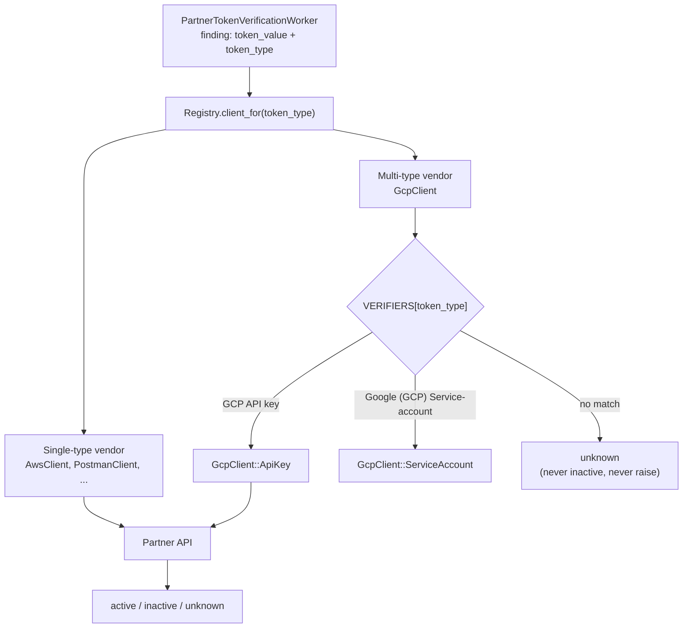

## Status

**SUPERSEDED** - This decision has been superseded by [ADR 006: Map token types directly to verifier classes](006_map_token_types_directly_to_verifiers.md)

## Summary

We propose passing the token type (which is already known from the detection rule) down to the verifier, and using it to pick the right API call. This makes adding a vendor repeatable: one client class and one registry entry, following a fixed pattern. This would let us grow validity checks from today's 3 vendors to the 60+ token types across 39 vendors in scope ([vendor expansion epic 20343](https://gitlab.com/groups/gitlab-org/-/work_items/20343)).

## Context

Validity checks call partner APIs to find out whether a detected secret is live. The current code assumes one vendor = one endpoint = one way to check; each vendor is a single `BaseClient` subclass with one `verify_partner_token` method.

However, several vendors issue more than one kind of token, and each kind needs a different API endpoint. For example, GitHub PATs and App tokens go to different endpoints and return different response shapes. Today, each vendor has one verifier class that performs regex matching on the token string to determine what kind of token it received.

The token type is not actually unknown -- the verifier layer throws it away. Every finding stores the detection rule that matched it (for example `GCP API key`), and the registry already uses that rule id to pick which client class to call. But the rule id is not passed into the client, so the client has to work out from the raw string what kind of token it is holding -- something the rest of the pipeline already knew.

```ruby
# token_type picks the client class, then is never passed in
PartnerTokens::Registry.client_for(token_type).verify_token(token_value)
```

So each client has to guess the token type again from the token's shape using regexes. This guessing causes bugs: a token is sent to an endpoint that does not understand it, the endpoint rejects it, and the client can mistake that rejection for a revoked token. An active leaked credential then shows up as inactive, telling the customer they can deprioritize fixing it.

## Proposal

1. Add a `token_type:` argument to the verifier methods (`BaseClient#verify_token`, `#valid_format?`, `#verify_partner_token`) and pass it in from `PartnerTokensClient`. The type the detection rule matched is what picks the check, not the client guessing it from the token value.
2. A vendor with several token types gets one main class that looks up the right verifier for the type, plus one small verifier class per token type in a subdirectory. Each verifier looks just like a single-type vendor's client, so there is only one pattern to learn.
3. Vendors with a single token type keep their current one-class, one-method shape; the only change is accepting the new argument.
4. If a client gets a token type it does not handle, or a response it cannot read, it returns `unknown`. It never returns `inactive` without a clear "this token is revoked" signal from the vendor: a response the vendor documents as meaning the credential is invalid, for example a `401` from an endpoint the token authenticates against -- not just any rejection.
5. The shared `BaseClient` code (timing, error handling, Prometheus metrics) runs once per verification, at the vendor level, so metric labels stay per-vendor (e.g. `gcp`, not one label per verifier).

This is only a change in how the code is organized. No new infrastructure, queues, or services. The existing workers, registry, and rate limiting are untouched.



## How we arrived here

The [decision spike, issue 598278](https://gitlab.com/gitlab-org/gitlab/-/issues/598278) compared the options and settled on the shape proposed here: one main class per vendor, with one verifier per token type in a subdirectory.

For token types from a multi-type vendor, we add one verifier file per token type, plus one entry in the vendor's verifier map and one in the registry:

```ruby
# gcp_client.rb -- vendor class that picks the verifier
VERIFIERS = {
  'GCP API key'                  => GcpClient::ApiKey,
  'Google (GCP) Service-account' => GcpClient::ServiceAccount
}.freeze

def verify_partner_token(token_value, token_type:)
  verifier = VERIFIERS[token_type.to_s]
  return token_response(:unknown) unless verifier # type we don't handle: unknown, not inactive

  verifier.new.verify_partner_token(token_value)
end
```

## Why this was superseded

Review of the first implementation merge requests ([implementation review comment proposing this shape](https://gitlab.com/gitlab-org/gitlab/-/merge_requests/245758#note_3559670985)) pointed out that the registry is already keyed per token type, so the dispatcher's verifier map and the `token_type:` argument threaded through the client methods duplicated routing the registry had already done.

## Consequences

### Benefits

1. Multi-type vendors now fit cleanly. All 7 known ones follow the same pattern.
1. Prevents the class of bug behind [GCP validity check bug 588454](https://gitlab.com/gitlab-org/gitlab/-/issues/588454): nothing is reported inactive without a clear signal from the vendor.
1. Adding a vendor or a token type stays cheap (one file plus one map entry), which matters across the remaining 60+ token types.
1. Every check passes through one place per vendor and token type: the registry. Likely product asks -- turning vendors off per customer, per-customer usage limits, usage counting for pricing -- would all plug in there. The registry already has an `enabled:` flag per token type.
1. Format regexes get stricter per token type, so we waste fewer API calls on strings that only looked like tokens.
1. Nothing here blocks a later move. The verifier classes are plain HTTP calls with no ties to models, workers, or other monolith state, so the `partner_tokens/` directory moves as-is if validity checks are ever event-driven, behind an internal API, or a separate service. A config-driven (YAML) verifier would need the same interface, so none of this work would be thrown away.

### Drawbacks

1. Two lookup tables have to agree (the registry keys and each vendor's verifier map); a spec asserts they match.
1. More files per multi-type vendor, and one extra hop through the vendor class.
1. Token types we route but cannot verify yet (for example GCP OAuth client secrets, which need their paired client id) show `unknown` until a real check exists. This is intentional, but it can read as a coverage gap. The vendor class always knows why a result is `unknown`, so splitting the customer-facing statuses later only means a new enum -- the verifier already has the information.

## References

1. [Implementation issue 604596](https://gitlab.com/gitlab-org/gitlab/-/issues/604596)
1. [Decision spike issue 598278](https://gitlab.com/gitlab-org/gitlab/-/issues/598278)
1. [GCP validity check bug 588454](https://gitlab.com/gitlab-org/gitlab/-/issues/588454)
1. [Vendor expansion epic 20343](https://gitlab.com/groups/gitlab-org/-/work_items/20343)
1. [Rollout strategy for vendors we cannot test in advance, issue 596643](https://gitlab.com/gitlab-org/gitlab/-/issues/596643)
1. [Current end-to-end flow documentation, issue 604600](https://gitlab.com/gitlab-org/gitlab/-/issues/604600)
