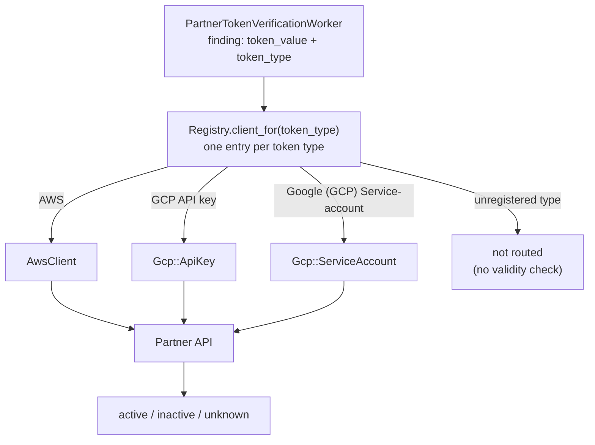

## Status

**Accepted**

## Summary

We propose using the token type (which is already known from the detection rule) to pick the right API call: the registry maps each token type directly to the class that verifies it. This makes adding a vendor repeatable: one verifier class and one registry entry per token type, following a fixed pattern. This would let us grow validity checks from today's 3 vendors to the 60+ token types across 39 vendors in scope ([vendor expansion epic 20343](https://gitlab.com/groups/gitlab-org/-/work_items/20343)).

This ADR supersedes [ADR 005](005_use_token_type_for_verification_flow.md). The goal is unchanged; the lookup moves from a per-vendor dispatcher into the registry.

## Context

Validity checks call partner APIs to find out whether a detected secret is live. The current code assumes one vendor = one endpoint = one way to check; each vendor is a single `BaseClient` subclass with one `verify_partner_token` method.

However, several vendors issue more than one kind of token, and each kind needs a different API endpoint. For example, GitHub PATs and App tokens go to different endpoints and return different response shapes. Today, each vendor has one verifier class that performs regex matching on the token string to determine what kind of token it received.

The token type is not actually unknown -- the verifier layer throws it away. Every finding stores the detection rule that matched it (for example `GCP API key`), and the registry already uses that rule id to pick which client class to call. But the rule id is not passed into the client, so the client has to work out from the raw string what kind of token it is holding -- something the rest of the pipeline already knew.

```ruby
# token_type picks the client class, then is never passed in
PartnerTokens::Registry.client_for(token_type).verify_token(token_value)
```

So each client has to guess the token type again from the token's shape using regexes. This guessing causes bugs: a token is sent to an endpoint that does not understand it, the endpoint rejects it, and the client can mistake that rejection for a revoked token. An active leaked credential then shows up as inactive, telling the customer they can deprioritize fixing it.

## Proposal

1. The registry maps each token type (detection rule id) directly to the class that verifies it. The registry is already keyed by token type for rate limiting and enablement, so routing is a single lookup, and no client re-derives the type from the token value.
1. A vendor with several token types gets one small verifier class per token type in a vendor subdirectory (for example `gcp/api_key.rb`), plus a shared per-vendor base class for common code and the vendor's metric label. Each verifier looks just like a single-type vendor's client, so there is only one pattern to learn.
1. Vendors with a single token type keep their current one-class, one-method shape, unchanged.
1. Every token type has exactly one class, and a class is never told its type: the registry entry that picked it is the pairing. Vendors whose token types share verification logic (for example GitHub, where several token kinds verify against the same endpoint) put the shared logic in the vendor base class; each type's class carries little more than its own format pattern. Client constructors and method signatures stay as they are today.
1. If a verifier gets a response it cannot read, it returns `unknown`. It never returns `inactive` without a clear "this token is revoked" signal from the vendor: a response the vendor documents as meaning the credential is invalid, for example a `401` from an endpoint the token authenticates against -- not just any rejection.
1. The shared `BaseClient` code (timing, error handling, Prometheus metrics) runs once per verification, on the class the registry resolved, so metric labels stay per-vendor (e.g. `gcp`, set once in the vendor base class).

This is only a change in how the code is organized. No new infrastructure, queues, or services. The existing workers, registry, and rate limiting are untouched.



## How we arrived here

The [decision spike, issue 598278](https://gitlab.com/gitlab-org/gitlab/-/issues/598278) compared two shapes: a case dispatch inside one vendor class, and a per-vendor dispatcher class owning a second token-type-to-verifier map, with a `token_type:` argument added to the client methods. [ADR 005](005_use_token_type_for_verification_flow.md) chose the dispatcher. Review of the first implementation merge requests ([implementation review discussion where this shape was proposed](https://gitlab.com/gitlab-org/gitlab/-/merge_requests/245758#note_3559670985)) surfaced a third shape: because the registry is already keyed per token type, it can map each type straight to its verifier class, removing the dispatcher's second map and the signature change. This ADR proposes that third shape.

For token types from a multi-type vendor, we add one verifier file per token type and one registry entry:

```ruby
# registry.rb -- one entry per token type, straight to its verifier
'GCP API key'                  => { client_class: Gcp::ApiKey, rate_limit_key: :partner_gcp_api, enabled: true },
'GCP OAuth client secret'      => { client_class: Gcp::ClientSecret, rate_limit_key: :partner_gcp_api, enabled: true },
'Google (GCP) Service-account' => { client_class: Gcp::ServiceAccount, rate_limit_key: :partner_gcp_api, enabled: true },
```

`Registry.client_for(token_type)` stays as it is today: look up the entry, instantiate the class.

## Consequences

### Benefits

1. Multi-type vendors now fit cleanly. All 7 known ones follow the same pattern.
1. Prevents the class of bug behind [GCP validity check bug 588454](https://gitlab.com/gitlab-org/gitlab/-/issues/588454): nothing is reported inactive without a clear signal from the vendor.
1. Adding a vendor or a token type stays cheap (one file plus one registry entry), which matters across the remaining 60+ token types.
1. The registry is the only routing table: one page answers which class verifies every token type.
1. Every check passes through one place: the registry. Likely product asks -- turning vendors off per customer, per-customer usage limits, usage counting for pricing -- would all plug in there. The registry already has an `enabled:` flag per token type.
1. Format regexes get stricter per token type, so we waste fewer API calls on strings that only looked like tokens.
1. Nothing here blocks a later move. The verifier classes are plain HTTP calls with no ties to models, workers, or other monolith state, so the `partner_tokens/` directory moves as-is if validity checks are ever event-driven, behind an internal API, or a separate service. A config-driven (YAML) verifier would serve many token types from one engine and would need a way to learn which type it is verifying; that mechanism arrives with that work if it happens, and none of this work would be thrown away.

### Drawbacks

1. The registry grows by one entry per token type (60+ entries at full scope), so it becomes a long file.
1. A vendor is a namespace and a shared base class rather than a single named class; vendor-wide behavior (shared response parsing, the metric label) lives in the base class by convention.
1. Vendors whose token types share verification logic still get one class per type. The shared logic lives in the vendor base class, so the duplication per type is roughly its format pattern -- accepted in exchange for a rule with no exceptions.
1. Token types we route but cannot verify yet (for example GCP OAuth client secrets, which need their paired client id) show `unknown` until a real check exists. This is intentional, but it can read as a coverage gap. The verifier always knows why a result is `unknown`, so splitting the customer-facing statuses later only means a new enum -- the verifier already has the information.

## References

1. [ADR 005: Use token type for verification flow (superseded)](005_use_token_type_for_verification_flow.md)
1. [Implementation issue 604596](https://gitlab.com/gitlab-org/gitlab/-/issues/604596)
1. [Decision spike issue 598278](https://gitlab.com/gitlab-org/gitlab/-/issues/598278)
1. [Implementation review discussion where this shape was proposed](https://gitlab.com/gitlab-org/gitlab/-/merge_requests/245758#note_3559670985)
1. [Registry-direct implementation merge requests](https://gitlab.com/gitlab-org/gitlab/-/merge_requests/245937)
1. [GCP validity check bug 588454](https://gitlab.com/gitlab-org/gitlab/-/issues/588454)
1. [Vendor expansion epic 20343](https://gitlab.com/groups/gitlab-org/-/work_items/20343)
1. [Rollout strategy for vendors we cannot test in advance, issue 596643](https://gitlab.com/gitlab-org/gitlab/-/issues/596643)
1. [Current end-to-end flow documentation, issue 604600](https://gitlab.com/gitlab-org/gitlab/-/issues/604600)
