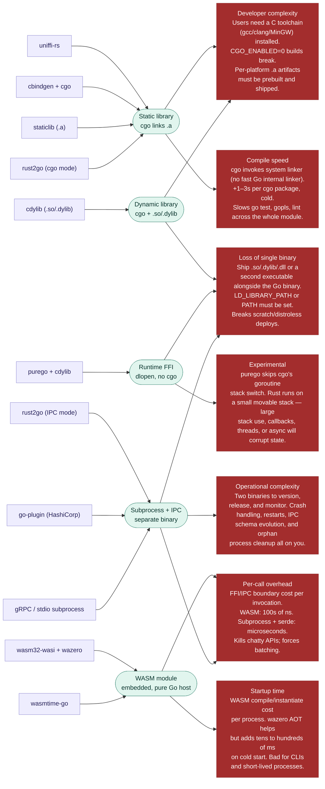

<!-- Design Documents often contain forward-looking statements -->
<!-- vale gitlab.FutureTense = NO -->

## Status

**Proposed.**

## Context

LabKit Go has been implemented as a native Go library for roughly six years.
It is in production across the majority of GitLab's Go components,
its API surface is mature,
and the cost of changing the implementation language is not free.

The Developer Experience team owns LabKit across languages
(see the [LabKit North Star strategy](/handbook/engineering/architecture/design-documents/labkit_north_star_strategy/)),
and the team's expertise is concentrated in Go.
Maintenance, support, and architectural evolution of LabKit Go
land on engineers whose strongest tool is Go.

Theseus's reliance on LabKit raises the stakes of any change to how LabKit is built and shipped.

The downside for every non-native alternative
would impact the productivity of every GitLab engineer.

Periodic conversations float the idea of sharing implementation
with a non-Go core (typically Rust)
on the basis that a single core would deduplicate work across language bindings.
This ADR records why that path is not chosen for LabKit Go.

## Decision

**LabKit Go is implemented as a native Go library.**
The reference implementation is pure Go (`go.mod`, idiomatic Go packages),
with `cgo` reserved for unavoidable system bindings only.

A non-Go LabKit runtime consumed via FFI, dynamic linking, subprocess+IPC, or WASM
is explicitly **out of scope** for LabKit Go.

This decision is scoped to LabKit Go.
It does not constrain LabKit Ruby
or any future LabKit implementation for another language.
For these languages, there may well be a better case for
a single shared runtime component.

## Consequences

### Positive

1. **Maintained on the team's existing skill set.**
   LabKit Go evolves on the language the Developer Experience team already operates in,
   without a parallel investment in a second core ecosystem.
1. **No toolchain regressions for consumers.**
   `go build`, `go test`, `go mod`, `CGO_ENABLED=0`,
   and `go install` semantics keep working unmodified for every component that depends on LabKit.
1. **Single-file binaries remain possible.**
   Components depending on LabKit can still produce static, scratch-image-compatible Go binaries
   without shipping shared objects, plugin processes, or WASM runtimes alongside them.
1. **Predictable runtime behaviour.**
   No FFI stack-switch surprises, no subprocess lifecycle to manage,
   no per-invocation WASM cold-start cost.

### Negative

1. **LabKit-Go and LabKit-Ruby implementations evolve in parallel.**
   Behavioural parity across languages is a coordination problem,
   not something the compiler can enforce.
1. **Capabilities that genuinely require a non-Go implementation
   must be justified case-by-case.**
   For example, a FIPS-validated cryptographic primitive
   that is only available in a non-Go form
   would need its own narrow exception with explicit ownership,
   rather than dragging LabKit's whole core across the boundary.
1. **Cross-language deduplication is not a compile-time gain.**
   Sharing a single core across Go and Ruby via FFI is permanently off the table for LabKit Go;
   shared specifications, test suites, and conformance harnesses are the substitute.

## This is a two-way door decision

If we decide that this is important, we can, at a later stage, move to a single
binary.

## Alternatives Considered

Each possible alternative brings with it several downsides.

## References

- [Section 3.2 — Platform-as-a-product commitments](../#32-platform-as-a-product-commitments) —
  Principle 6, which treats LabKit as the platform's standard-library commitment.
- [Theseus ADR 001 — Protobuf as the Preferred Schema Language](001_protobuf_as_preferred_schema_language.md) —
  the typed-configuration surface that depends on LabKit Go.
- [LabKit North Star strategy](/handbook/engineering/architecture/design-documents/labkit_north_star_strategy/) —
  governance model and per-language ownership.
- [LabKit repository](https://gitlab.com/gitlab-org/labkit) —
  the canonical implementation.
- [`purego`](https://github.com/ebitengine/purego),
  [`wazero`](https://wazero.io/),
  [`go-plugin`](https://github.com/hashicorp/go-plugin),
  [`uniffi-rs`](https://github.com/mozilla/uniffi-rs) —
  the binding technologies surveyed above.
