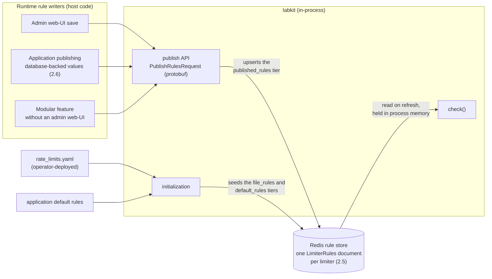

<!-- vale gitlab.FutureTense = NO -->



## Summary

Application-level rate limiting in GitLab needs a single configuration model
that works across all implementations (RackAttack, ApplicationRateLimiter, and
future services). This document describes how we get there in three phases,
using [labkit](https://gitlab.com/gitlab-org/labkit) as the shared SDK:

1. Route existing rate limiting (RackAttack, ApplicationRateLimiter) through
   labkit without breaking changes. Configuration still comes from the database
   or is passed in by the application.
2. Add a config file that labkit loads. Rules from the file override the
   application defaults. The format follows the protobuf schema from
   [LabKit Configuration Management](../labkit_configuration/).
3. Add an external service that returns rules per-request, based on the
   identifier. This is what allows per-customer and per-tier customization.

This builds on the [Next Rate Limiting Architecture](../rate_limiting/) blueprint and the [Simplifying Rate Limiting Configuration](../rate_limiting_simplification/) design document. Implementation is tracked in [the Phase 2 epic](https://gitlab.com/groups/gitlab-com/gl-infra/-/work_items/2021).

## Motivation

Rate limiting in the GitLab application is spread across RackAttack,
ApplicationRateLimiter, and several smaller implementations. Each has its own
configuration mechanism, its own counting, and its own observability story. In
practice this means you can't configure all rate limits the same way, dry-run
and bypass behavior varies, new endpoints ship without limits, and during
incidents nobody can quickly tell what's throttled and why.

The [Simplifying Rate Limiting Configuration](../rate_limiting_simplification/)
document describes the phased approach. Phase 1 (edge network) is complete.
This document covers the technical design for Phase 2 (application-level
unification) and outlines Phase 3 (externalized configuration and dynamic
service).

## Phase 1: Application-Level Unification

All application rate limiting goes through a single API in `labkit-ruby`. The
caller (rack middleware or application code) constructs an identifier, passes it
to labkit with a set of rules, and gets back a result. Existing configuration
(ApplicationSettings, env vars, hardcoded defaults) keeps working. The caller
resolves its own configuration and passes it in.

*Unlocks:* one consistent way to define and observe limits across the
application. Adding or changing a rule still takes a code change and a
deployment, but every limit now behaves and is instrumented in the same way.
Old limits are migrated, new limits automatically get the same benefit.

### 1.1 The labkit rate limiting API

`Labkit::RateLimit::Limiter` is the main entry point. Build one per rate
limiting checkpoint (at boot, not per-request) and reuse it. The internal
`Evaluator` is cached.

```ruby
limiter = Labkit::RateLimit::Limiter.new(
  name: "rack_request",
  rules: [...]
)

result = limiter.check(identifier)
```

Three operations make up the surface: `check` counts and returns a decision,
`peek` returns the same decision without counting, and `clear` discards a
limiter's state for one identifier (see [1.5](#15-action-semantics)).

The `name` is prepended to all Redis counter keys, so different limiters within
a service never share counters. Limiter names are static per-application
configuration, declared in that service's `available_limiters` (Phase 2), so two
limiters in the same service cannot accidentally collide.

Names can repeat across services: `rack_request` may exist in several, and that
is harmless. Each service counts in its own Redis storage (for GitLab Rails,
the dedicated rate-limiting Redis), so a shared name never means a shared
counter.

### 1.2 Language SDKs

The SDK is not Ruby-specific. Each supported language gets a native SDK with the
same model: build a limiter once, construct an identifier per request, call
`check`, then act on the result. The examples in this document use Ruby for
brevity, but the Go API should mirror them. Both SDKs read the same
configuration files (Phase 2) and talk to the same external service (Phase 3),
so a rule defined once does the same thing whichever language calls it.

<table>
<thead>
<tr><th width="50%">Ruby (<code>labkit-ruby</code>)</th><th width="50%">Go (<code>labkit/v2/ratelimit</code>)</th></tr>
</thead>
<tbody>
<tr>
<td>

```ruby
limiter = Labkit::RateLimit::Limiter.new(
  name: "rack_request",
  rules: [
    Labkit::RateLimit::Rule.new(
      name: "authenticated_api",
      characteristics: [:user],
      limit: 200,
      period_s: 60,
      action: :limit
    )
  ]
)

result = limiter.check(
  user: "user:123",
  request_type: "api"
)

case result.action
when :block then render_429
when :allow then # proceed
end
```

The Ruby SDKs also offer a `check!` convenience that raises for call sites that prefer to
let a middleware at the edge of the application render the `429`. For the first
Rails iteration we handle the result and the response codes ourselves at the
call site (see [1.6](#16-result-object)), and adopt `check!` where the call
sites allow it.

</td>
<td>

```go
limiter := ratelimit.New(ratelimit.Config{
    Name: "rack_request",
    Rules: []ratelimit.Rule{
        {
            Name:            "authenticated_api",
            Characteristics: []string{"user"},
            Limit:           200,
            Period:          60 * time.Second,
            Action:          ratelimit.ActionLimit,
        },
    },
})

result, err := limiter.Check(ctx, ratelimit.Identifier{
    "user":         "user:123",
    "request_type": "api",
})

switch result.Action {
case ratelimit.ActionBlock:
    renderTooManyRequests(w)
case ratelimit.ActionAllow:
    // proceed
}
```

</td>
</tr>
</tbody>
</table>

Defining rules programatically rather than through configuration should be the exception, not the rule. But we have to support this in order not to break self-managed configurations that might have config in the database for this.

### 1.3 Identifier

The identifier is a key-value hash built by the caller with whatever it knows
about the request. Different limiters have different shapes:

**Rack middleware:**

```ruby
{
  request_type: "api",
  user: "user:123",        # or "<anonymous>" for unauthenticated
  ip: "203.0.113.42",
  path: "/api/v4/projects/1/merge_requests",
  namespace: 345,
  namespace_plan: "premium",
  endpoint: "GET /api/v4/:id/merge_requests"
}
```

**ApplicationRateLimiter:**

```ruby
{
  user_id: 42,
  project_id: 789,
  namespace_id: 345
}
```

`<anonymous>` uses angle brackets so it can't collide with a real username.
Unauthenticated rules match on `user: "<anonymous>"` and count by `[:ip]`.
Authenticated rules don't match that value, so they act as a fallback and count
by `[:user]`.

### 1.4 Rules and matching

Each rule has:

- **`name`** — stable identifier used in Redis keys, logs, and metrics
- **`match`** — key-value pairs that must all be present in the identifier for
  the rule to apply. Supports equality matching and regex matching via a
  `Matcher` object
  ([#28855](https://gitlab.com/gitlab-com/gl-infra/production-engineering/-/work_items/28855)).
  The Matcher design uses explicit type markers (`{ regex: "..." }`) to ensure
  YAML-round-trippability across languages.
- **`characteristics`** — identifier keys used to derive the Redis counter key.
  The limiter name is always prepended.
- **`limit`** — the threshold. Can be a static integer or a callable (resolved
  at check time) for database-backed values.
- **`period_s`** — the time window in seconds. Can also be a callable.
- **`action`** — what the rule does, `limit`, `log` or `skip` (see
  [1.5](#15-action-semantics)).
- **`ban_for_s`** — optional. On a counting rule, how long to keep blocking once
  the limit is crossed (see [1.5](#15-action-semantics)).

### 1.5 Action semantics

Each rule has an `action` that describes what it does. The result returned to
the caller describes the outcome: what the caller should do.

| Rule action | What it does | Exceeded? | Result action | Terminating? |
|---|---|---|---|---|
| `limit` | Count against the limit | No | `allow` | No — continue to next rule |
| `limit` | Count against the limit | Yes | `block` | Yes — stop evaluation |
| `log` | Count against the limit (observability only) | No | `allow` | No — continue |
| `log` | Count against the limit (observability only) | Yes | `allow` | No — continue |
| `skip` | Don't count (bypass) | N/A | `allow` | Yes — stop evaluation |

A terminating action stops rule evaluation. Non-terminating actions continue
to the next matching rule.

Multiple `:limit` rules in a single limiter means all of them must pass for the
request to go through (e.g., a per-org limit and a per-user limit). A `:log`
rule can shadow-test a lower threshold without affecting the `:limit` rules
after it. A `:skip` rule at the top of the list handles bypasses.

Rules are evaluated in order. Put more specific rules before less specific ones.

#### Bans: blocking for longer than the window

Some limits need to cost more than a window. Repeated failed authentication is
the motivating case: ten bad passwords in a minute should not buy a fresh
allowance the minute after.

A rule may carry `ban_for_s` alongside its `limit` and `period_s`. It is a
modifier on the counting actions rather than an action of its own, so it
composes with `limit` and `log` the way everything else does:

| Rule action | With `ban_for_s` | Exceeded? | Result action | Terminating? |
|---|---|---|---|---|
| `limit` | Count, unless a ban is already in force; on crossing the limit, start a ban | Yes, or a ban is in force | `block` | Yes — stop evaluation |
| `log` | Same accounting as `limit`, including writing the ban | Yes | `allow` | No — continue |

A ban is separate state from the counter, with its own lifetime. Once started,
the caller is blocked for `ban_for_s` seconds even after the counting window has
expired and the counter is gone. That is the point of it: the counter answers
"how many in the last minute", the ban answers "and you are out for the next
fifteen".

Three consequences worth stating:

- **A ban suppresses counting.** While a ban is in force the rule blocks without
  incrementing, so a caller cannot extend its own ban by continuing to retry and
  the ban lifts at a predictable time.
- **`reset_at` reports the ban expiry, not the window.** While banned, that is
  when the caller may usefully retry.
- **The count can sit below the limit while the ban holds.** Once the window
  expires the counter is gone but the ban is not, so `exceeded` follows the ban
  rather than the count.

Bans are the first state a limiter holds that a caller may need to end early: a
successful login should discard the failures before it. Counters otherwise only
disappear when their window expires, so the SDK exposes `clear(identifier)`,
which drops a limiter's counters and any ban for one identifier, shadow bans
included. It is scoped to the limiter and the identifier rather than to a
single rule, because a caller clearing state after a success knows who
succeeded, not which rules matched on the way in.

**A shadow does the real accounting.** A `log` rule with `ban_for_s` counts,
writes its own ban, and stops counting while that ban holds, exactly as the
`limit` version would. The only thing it skips is the blocking. So the numbers
it produces are what enforcement would have produced, rather than an
approximation of them.

One divergence is worth knowing when reading shadow data. A success calls
`clear`, which drops the shadow ban, where under enforcement that success could
not have happened because the caller would have been refused. Shadow bans
therefore end early whenever anyone behind that identifier authenticates
successfully, which matters most on shared addresses: enforcement would lock
out the legitimate user, and the shadow quietly clears itself instead. A shadow
understates impact rather than overstating it.

### 1.6 Result object

The result carries the outcome and the resolved values:

```ruby
result = limiter.check(identifier)

result.action               # :allow or :block — what the caller should do
result.exceeded?            # whether the count exceeded the limit
result.rule                 # the most constraining evaluated Rule
result.error?               # true if Redis was unavailable (fail-open)
result.info.resolved_limit  # the resolved limit as Integer
result.info.resolved_period # the resolved period in seconds as Integer
result.info.reset_at        # when the caller may retry
```

The resolved values hang off `info`, which is `nil` on a result that carries no
counters, such as a `skip` or an error.

`reset_at` is the end of the counting window, except while a ban is in force,
where it is the ban expiry. That is the time a caller should wait for, so it is
what a `Retry-After` header should be built from.

The caller is responsible for handling the result. For example:

```ruby
result = limiter.check(identifier)
case result.action
when :block then render_429
when :allow then # proceed
end
```

Eventually, labkit should ship default handlers for the common cases: a rack
middleware that returns 429 with `RateLimit-*` headers, a gRPC interceptor, and
a Sidekiq middleware. These are also natural places for generic resource-scoped
limits (e.g., db_duration_s per user, gitaly score per user) that guard against
runaway consumption without per-endpoint tuning. Until then, callers handle the
result themselves.

### 1.7 Configuration passthrough

We cannot break self-managed installations. So configuration is passed at the
call site: the caller resolves limits from existing sources (ApplicationSettings,
env vars, hardcoded defaults) and passes them to labkit as rules.

`limit` and `period_s` on a rule can be callables. This lets database-backed
settings resolve at check time without rebuilding rule objects:

```ruby
Rule.new(
  name: "authenticated_api",
  limit: -> { ApplicationSetting.current.throttle_authenticated_api_requests_per_period },
  period_s: -> { ApplicationSetting.current.throttle_authenticated_api_period_in_seconds },
  characteristics: [:user],
  action: :limit
)
```

Self-managed and GitLab.com keep working: the callables read from the same
settings they always did. No limits change unless someone explicitly
reconfigures them.

Callables are Phase 1 compatibility scaffolding, not the end state. They
require labkit to invoke host code on the hot path and to have a notion of
"callable" in each language it ships in, which does not port cleanly beyond
Ruby. [2.6](#26-dynamic-limits) describes what
replaces them and how the existing ones are retired.

The plan is to replace the current `rate_limits` hash in
`ApplicationRateLimiter` with static labkit `Limiter` objects as the single
source of truth
([#29054](https://gitlab.com/gitlab-com/gl-infra/production-engineering/-/work_items/29054)).

The end state takes the database out of the rate-limiting hot path, but it does
not take away the admin web-UI. Admins who prefer click-ops keep it. What
changes is where the UI writes: instead of `ApplicationSettings` rows that the
limiter reads on every request, the UI publishes rule objects to labkit, which
stores them in its Redis rule store (see [2.4](#24-redis-backed-rules-web-ui-configuration)).
GitLab.com leans on the config file and the external service; self-managed gets
the UI-over-Redis path, with a migration that moves existing database values
into the Redis store.

The broader configuration evolution is tracked in
[#28853](https://gitlab.com/gitlab-com/gl-infra/production-engineering/-/work_items/28853).

### 1.8 Migration: ApplicationRateLimiter (Stage 2a)

Behind a feature flag, `ApplicationRateLimiter.throttled?` delegates to a labkit
`Limiter` instead of its internal counting strategies. The public API doesn't
change. Controllers and services keep calling `.throttled?` as before.

We migrate in cohorts of 5-10 rate limit keys. Each key gets two feature flags:
`_use_labkit_<key>` (shadow mode) and `_<key>_enforce` (enforcement). Shadow
validation needs <0.5% decision divergence over 24 hours before we flip to
enforcement.

- [#28808](https://gitlab.com/gitlab-com/gl-infra/production-engineering/-/work_items/28808) — overarching migration issue with repeatable process
- [#28803](https://gitlab.com/gitlab-com/gl-infra/production-engineering/-/work_items/28803) — Cohort 1 (5 keys: `pipelines_create`, `notes_create`, `search_rate_limit`, `users_get_by_id`, `user_sign_in`)
- [#28809](https://gitlab.com/gitlab-com/gl-infra/production-engineering/-/work_items/28809) — Cohort 2 (remaining IncrementPerAction keys)
- [#28810](https://gitlab.com/gitlab-com/gl-infra/production-engineering/-/work_items/28810) — Cohort 3 (`.peek` callers, blocked on `Limiter#peek` in labkit)
- [#28811](https://gitlab.com/gitlab-com/gl-infra/production-engineering/-/work_items/28811) — Cohort 4 (IncrementPerActionedResource, blocked on Set strategy)
- [#28812](https://gitlab.com/gitlab-com/gl-infra/production-engineering/-/work_items/28812) — Cohort 5 (IncrementResourceUsagePerAction, blocked on float-cost strategy)
- [#28876](https://gitlab.com/gitlab-com/gl-infra/production-engineering/-/work_items/28876) — Feature flag cleanup after rollout
- [#29054](https://gitlab.com/gitlab-com/gl-infra/production-engineering/-/work_items/29054) — Replace `rate_limits` hash with static labkit Limiter objects

### 1.9 Migration: RackAttack (Stage 2b)

A new middleware runs alongside the existing RackAttack middleware. RackAttack
keeps enforcing. The new middleware runs in parallel, starting in log mode.

Two limiters:

1. **`rack_request`** — all general throttles (API, web, git, packages). Authenticated vs unauthenticated is handled within rules via the `<anonymous>` sentinel and different characteristics (`[:ip]` vs `[:user]`).
2. **`rack_request_protected_paths`** — protected-path throttles only. These overlap with general throttles (a POST to a protected API path fires both), so they need independent counters via a separate limiter.

Two limiters instead of four because:

- The auth/unauth distinction is a characteristic (what you count by), not a limiter boundary
- Git throttles are mutually exclusive with API/web throttles
- Fewer feature flags (4 instead of 8)
- Generic limiters with rich identifiers make it easy to inject external configuration later ([#28853](https://gitlab.com/gitlab-com/gl-infra/production-engineering/-/work_items/28853))

Tracked in [#28852](https://gitlab.com/gitlab-com/gl-infra/production-engineering/-/work_items/28852).

### 1.10 Observability

**Prometheus metrics** — counter metrics are split across two granularities to
cover non-terminating rule chains:

| Metric | Type | Labels | Purpose |
|---|---|---|---|
| `gitlab_labkit_rate_limiter_checks_total` | Counter | `rate_limiter`, `action`, `matched`, `error` | Exactly one increment per `check` call, including calls that fail open. `action` is the caller-facing decision (`allow`\|`block`); `matched` and `error` are boolean flags. Low cardinality; overall rate limiting health. |
| `gitlab_labkit_rate_limiter_rule_evaluations_total` | Counter | `rate_limiter`, `rule`, `action`, `result` | One increment per rule evaluated. Captures every rule in non-terminating chains. `action` is the configured rule action (`limit`\|`log`\|`skip`); `result` is what the evaluation decided (`allow`\|`block`\|`log`\|`skip`\|`banned` — an exceeded `log` rule reports `result="log"`, and a rule whose ban is in force reports `result="banned"` whatever action it carries, so no separate `exceeded` label is needed). |
| `gitlab_labkit_rate_limiter_peeks_total` | Counter | `rate_limiter`, `error` | Exactly one increment per `peek` call, including calls that fail open. `error` is a boolean flag. |
| `gitlab_labkit_rate_limiter_limit` | Gauge (`:max`) | `rate_limiter`, `rule` | Configured threshold. |
| `gitlab_labkit_rate_limiter_period_seconds` | Gauge (`:max`) | `rate_limiter`, `rule` | Configured period. |

> **Implementation note:** The metric split is implemented via
> [#29519](https://gitlab.com/gitlab-com/gl-infra/production-engineering/-/work_items/29519),
> refining the proposal from
> [#29052](https://gitlab.com/gitlab-com/gl-infra/production-engineering/-/work_items/29052):
> the per-check counter is a new metric (`checks_total`) rather than a
> reshaped `calls_total`, because prometheus-client-mmap allows only one
> label signature per metric name — the old and new shapes cannot be emitted
> side by side, so the new name keeps the rollout additive. The pre-split
> counters `calls_total` and `errors_total` (from
> [#28798](https://gitlab.com/gitlab-com/gl-infra/production-engineering/-/work_items/28798))
> were emitted alongside the new ones for one release, then removed in a
> breaking labkit release once the runbooks migration (SLI, dashboards,
> alerts) had landed and was verified working.
> `peeks_total` was added in the same release: a `peek` emits no
> `checks_total`, so removing `errors_total` would have left `peek` with no
> error metric. `clear` remains logs-only.

**Additional observability work:**

- [#28799](https://gitlab.com/gitlab-com/gl-infra/production-engineering/-/work_items/28799) — Include rate limit state in existing per-request log messages
- [#28831](https://gitlab.com/gitlab-com/gl-infra/production-engineering/-/work_items/28831) — Update Rate Limiting Overview dashboard
- [#28832](https://gitlab.com/gitlab-com/gl-infra/production-engineering/-/work_items/28832) — Register in metrics catalog for default SLI alerts
- [#28807](https://gitlab.com/gitlab-com/gl-infra/production-engineering/-/work_items/28807) — Redis cluster headroom investigation for migration
- [#28827](https://gitlab.com/gitlab-com/gl-infra/production-engineering/-/work_items/28827) — Consolidate Redis operations into a single Lua EVAL call

### 1.11 Cost-aware rate limiting

A `GET /api/v4/user` and a complex GraphQL query are not the same thing, but a
simple request counter treats them equally. The `cost:` parameter on `check`
lets you count by actual resource consumption instead:

```ruby
result = limiter.check(identifier)                         # default cost: 1
result = limiter.check(identifier, cost: db_duration_s)    # cost = actual DB time
```

A rack middleware could use this to limit database time per root namespace.
After each request completes, charge whatever it actually cost:

```ruby
limiter = RESOURCE_LIMITERS[:db_utilization]
result = limiter.check(
  { root_namespace: request.root_namespace, user: request.user },
  cost: request.db_duration_s
)
```

With rules like:

```ruby
Rule.new(
  name: "db_seconds_per_namespace",
  characteristics: [:root_namespace],
  limit: 300,      # 300 seconds of DB time per period
  period_s: 60,
  action: :limit
)
```

The characteristic picks the scope (per user, per project, per namespace). The
cost picks what you're measuring. The same pattern applies to gitaly call
duration, object storage bytes, or sidekiq job weight.

When the cost isn't known before doing the work, `peek` first:

```ruby
result = limiter.peek(identifier)
if result.action == :block
  return error("rate limited, retry after #{result.reset_at}")
end

cost = do_expensive_work

limiter.check(identifier, cost: cost)
```

This can let one extra operation through (peek said "ok", but the cost turned
out to be more than expected). The next request after that will be blocked.

Take care combining `cost:` with `ban_for_s`. A single expensive call can cross
the limit on its own, and with a ban attached that earns the caller the full ban
duration rather than one rejected request. The peek-then-check pattern above has
the same edge: the operation it deliberately lets through is enough to start a
ban. Bans suit counting discrete failures, such as bad credentials, better than
they suit variable-cost resource limits.

Under the hood, `cost:` uses `INCRBYFLOAT` in the Lua EVAL
([#28827](https://gitlab.com/gitlab-com/gl-infra/production-engineering/-/work_items/28827)).
`INCRBYFLOAT` with `1` behaves the same as `INCR`, so there is no separate
counting strategy for integer vs float costs.

## Phase 2: Externalized Configuration

Labkit loads configuration that overrides the application-provided defaults.
The format follows the [LabKit Configuration Management](../labkit_configuration/)
design document: a protobuf schema defines the structure, with YAML as the
serialization format. Because the schema is shared, the same files load the same
way in `labkit-ruby`, `labkit-go`, and the services that consume them.

*Unlocks:* adding and changing rules through configuration. A rule change rolls
out without a full build and deploy of the application.

### 2.1 Two kinds of configuration

There are two configuration documents:

1. **Available limiters** is the contract, owned by operators (Production
   Engineering). It lists which rate limiters exist, which identifier properties
   you can match and count on, and the default rule each limiter ships with.
   Application developers contribute to it: they declare the limiters their code
   exposes and propose the defaults, but the contract is reviewed and owned on
   the operator side. It ships with the application and other tooling can read
   it.
2. **Rate limits** holds the rules that override or add to the defaults. It can
   change without an application release.

Labkit validates the rate-limits document against the available-limiters
document: a rule can only match or count on properties the application actually
exposes, and can only target limiters that exist.

The rate-limits document is written at two levels. Operators set global
rules: defaults that apply across all requests, and platform-wide protections. These default rules are defined for limiters that are shared across applications (Rack middlewares, gRPC interceptors, ...).

Service owners add rules scoped to limiters, to raise or lower the
limits for the service they are on-call for. Teams have the freedom to manage
the limits for their own service. Infrastructure gives input when a change has
cross-cutting impact, such as added pressure on shared Redis or on downstream
services.

One thing teams cannot do freely is bypass a limiter. The framework allows a
`skip` rule because Phase 1 has to keep the existing bypasses working, but a
bypass affects more than the team that adds it. We will guardrail who can add
`skip` rules so they cannot be introduced unchecked. What the guardrail looks
like (review, an allowlist, a validation step) is a decision for implementation
time.

### 2.2 Available limiters

This document declares what each limiter enforces, when, and what its default
rules are.

```yaml
# available_limiters.yaml — shipped with the application
available_limiters:
  pipelines_create:
    description: "Rate limit enforced before a pipeline is allowed to be created"
    available_properties: # values the identifier can carry, usable in match/characteristics
      - project_path
      - username
      - root_namespace_path
      - root_namespace_plan
      - sha
    default_rules: # optional: documents the in-application defaults
      - name: limit_pipelines_created_by_project_user_sha
        characteristics: [username, project_path, sha]
        limit: 10
        period_s: 60
        action: limit
  user_sign_in:
    description: "Enforced before a session is created for a specific user"
    available_properties:
      - ip
      - username
    default_rules:
      - name: limit_user_sign_ins_by_username
        characteristics: [username]
        limit: 5
        period_s: 600
        action: limit
        ban_for_s: 900      # the shipped default is itself a ban
  rack_request:
    description: "Enforced in the Rack middleware, for every web, API and Git request"
    available_properties:
      - ip
      - path
      - request_type
    default_rules:
      - name: limit_sign_in_attempts_by_ip
        characteristics: [ip]
        limit: 20
        period_s: 60
        action: limit
        match:
          path: /users/sign_in
      - name: limit_rack_requests_by_ip # no match: every request the middleware sees
        characteristics: [ip]
        limit: 1000
        period_s: 60
        action: limit
```

`default_rules` documents what the application enforces by default. Each rule's
schema is a subset of the fields in a rate-limit rule (below), `match`
included. A default rule with no `match` applies to every request the limiter
sees, which is the whole story for a limiter guarding a single checkpoint such
as `user_sign_in`. A generic limiter needs more: `rack_request` sees every
request the service handles, so a single blanket number is the wrong default
for it, and its defaults carry a `match` to scope themselves to the traffic
they are about — a tighter limit on `/users/sign_in` than on everything else.

`name` is required as it is the identity of
the rule: labkit uses it as a segment of the Redis counter key, and a
higher-precedence rule reusing the same name replaces this one
([2.5](#25-rule-sources-and-precedence)). Renaming a rule abandons its counters, and the name is what an
override targets.

When we implement generic limiters in Labkit, the default configuration for these can live in the copier template, so when we change them we ship a
[copier migration](https://copier.readthedocs.io) that updates every consuming
service on its next `copier update`. A new shared limiter, such as one in a Rack
middleware or a gRPC interceptor, gets its defaults from the template instead of
each service writing its own, and later changes to those defaults roll out the
same way. The `rate_limits` file is generated from the template too.

Here is the matching proto. The validation rules live in the schema, but I have
only added a couple here so the example stays readable. These `.proto` files would live in [`labkit-spec`](https://gitlab.com/gitlab-org/quality/tooling/labkit-spec/).

```proto
edition = "2026";
package gitlab.ratelimit.config.v1;

import "buf/validate/validate.proto";

message AvailableLimiters {
  map<string, LimiterSpec> available_limiters = 1
    [(buf.validate.field).map.min_pairs = 1];
}

message LimiterSpec {
  string description = 1 [(buf.validate.field).string.min_len = 1];
  repeated string available_properties = 2;
  repeated DefaultRule default_rules = 3;
}

message DefaultRule {
  repeated string characteristics = 1;
  uint32 limit = 2;
  uint32 period_s = 3;                   // seconds
  Action action = 4;
  optional uint32 ban_for_s = 5;         // see 1.5; the default itself may be a ban
  string name = 6 [(buf.validate.field).string.pattern = "^[a-z0-9_]{1,64}$"];
  map<string, MatchValue> match = 7;     // optional; empty matches every request
}

enum Action {
  ACTION_UNSPECIFIED = 0;
  ACTION_LIMIT = 1;
  ACTION_LOG = 2;
  ACTION_SKIP = 3;
}
```

### 2.3 Rate limits

This is where operators and service owners configure the rules. Each rule names
the limiter it applies to, a `match` that selects which requests it covers, and
the action to take.

```yaml
# rate_limits.yaml — global rules from operators, service-scoped rules from service owners
rate_limits:
  pipelines_create:
    - name: pipelines_create_free_plan
      description: "pipelines per project per 10 minutes for free users"
      limit: 100
      period_s: 600
      action: limit
      characteristics: [project_path]
      match:
        root_namespace_plan: free
    - name: pipelines_create_ultimate_plan
      description: "pipelines per project per 10 minutes for ultimate users"
      limit: 1000
      period_s: 600
      action: limit
      characteristics: [project_path]
      match:
        root_namespace_plan: ultimate
    - name: pipelines_create_per_user_hourly
      description: "limit pipelines a single user can create per hour"
      limit: 60
      period_s: 3600
      action: limit
      characteristics: [username]
      match: {}
    - name: pipelines_create_skip_app_defaults
      description: "skip any application-defined rules"
      action: skip
      match: {}
  user_sign_in:
    - name: user_sign_in_distinct_users_per_ip
      description: "distinct users attempting to sign in from a single IP"
      limit: 10
      period_s: 3600
      characteristics: [ip]
      count_distinct: username
      match: {}
    - name: user_sign_in_ban_ip_after_failures
      description: "ban an IP for 15 minutes after 10 failed sign-ins in a minute"
      limit: 10
      period_s: 60
      ban_for_s: 900
      action: limit
      characteristics: [ip]
      match: {}
```

The rules in the file are evaluated **before** the rules the application
provides. Combined with a trailing terminating `skip` rule (which matches
everything via `match: {}`), this lets the file become the single source of
truth for a limiter: any request that reaches the `skip` bypasses the
application defaults entirely. In Phase 3, rules returned by the external
service come before the file's rules.

`name` must be unique within a limiter. Naming a rule after one the application
already defines is how you *replace* it rather than add to it; the two outcomes
are distinguished only by the name you choose
([2.5](#25-rule-sources-and-precedence)). The rule above all use fresh names, 
so they layer on top of whatever the application ships.

Which fields are required depends on the `action`: a `limit`/`log` rule needs
`limit` and `period_s`, a `skip` rule needs neither, and `ban_for_s` is optional
on the first two and rejected on the last. One CEL constraint in the
proto enforces that:

```proto
message RateLimits {
  map<string, RuleList> rate_limits = 1;
}

message RuleList {
  repeated Rule rules = 1;
}

message Rule {
  string description = 1;
  Action action = 2 [(buf.validate.field).required = true];
  repeated string characteristics = 3;
  map<string, MatchValue> match = 4;     // equality or { regex: "..." } markers
  optional uint32 limit = 5;
  optional uint32 period_s = 6;          // seconds
  string count_distinct = 7;             // count unique values of this property
  optional uint32 ban_for_s = 8;         // keep blocking this long once the limit is crossed

  // Rule identity: part of the Redis counter key, and what an override targets.
  string name = 9 [(buf.validate.field).string.pattern = "^[a-z0-9_]{1,64}$"];

  // limit and period_s are required unless the rule only skips (ACTION_SKIP = 3).
  option (buf.validate.message).cel = {
    id: "limit_requires_threshold"
    message: "limit and log rules require limit and period_s"
    expression: "this.action == 3 || (has(this.limit) && has(this.period_s))"
  };

  // Banning on a distinct-value counter is not defined, so the two do not mix.
  option (buf.validate.message).cel = {
    id: "ban_excludes_count_distinct"
    message: "ban_for_s cannot be combined with count_distinct"
    expression: "!has(this.ban_for_s) || this.count_distinct == ''"
  };

  // ban_for_s needs a limit to cross, so it is not valid on skip rules.
  option (buf.validate.message).cel = {
    id: "ban_requires_threshold"
    message: "ban_for_s is not valid on skip rules"
    expression: "!has(this.ban_for_s) || this.action != 3"
  };
}
```

`match` values use the same explicit type markers as the labkit `Matcher`
object, so equality and regex matching round-trip across YAML and both SDKs:

```yaml
match:
  root_namespace_plan: free                  # equality
  path:
    regex: "^/api/v\\d+/projects"            # regex
```

When `rate_limits.yaml` above is loaded, the per-plan `pipelines_create` rules
are evaluated before the application's default rule. Free-plan projects get
100/10min, Ultimate 1000/10min; the trailing `skip` ensures the application
default never applies once the file is present.

### 2.4 Redis-backed rules (web-UI configuration)

Some self-managed admins want to keep editing rate limits from the admin
web-UI rather than from a file on disk. We can support that without putting the
database back on the hot path: store the UI-managed rules in Redis, using the
same rule schema from [2.3](#23-rate-limits).

The UI does not talk to Redis; it hands labkit a publish protobuf defined in [2.6](#26-dynamic-limits),
and labkit serializes it into
the per-limiter key in the rule store ([2.5](#25-rule-sources-and-precedence)),
the same Redis instance labkit already uses for counters.

Labkit does not read that key on every check. Rules change on a human timescale 
(an admin saves a form, an operator deploys a file) so a read per request
spends a round-trip re-learning what last changed hours ago. Each process holds
the deserialized document in memory and refreshes it once its copy is older than
a short interval. That is one read per limiter per process per interval
instead of one per request.

The admin web-UI is one writer among several, and not a privileged one — every
writer goes through the same labkit publish API, and only labkit touches the
Redis keys:



A new modular feature that has no admin web-UI uses this the same way the UI
does: it calls the publish API from wherever its configuration changes — a
settings model callback, a background job, a migration.
[2.6](#26-dynamic-limits) defines the `register`/`publish_all!` pattern that
packages this up for the host. A feature with no runtime configuration at all
publishes nothing: it ships its defaults, and operators can still override
them through the config file ([2.3](#23-rate-limits)).

These rules take the place of the application defaults rather than stacking on
top of them. A published  rule sharing a name with an application default overrides it, and a limiter
nobody has published rules for keeps its defaults, both through the tier
ordering in [2.5](#25-rule-sources-and-precedence). Every limiter stays
configurable from the app, and the defaults are the fallback when nothing is
configured.

To disable a rate-limiter entirely, a skip rule can be added at a level taking higher precedence than the defaults.

This is a local version of the Phase 3 external service: the same "return the
rules for this request" idea, backed by a Redis key instead of a remote service.
We want to offer it to self-managed, but it does not block Phase 3 and the two
can ship independently.

**Migrating off the database.** Operators should not have to re-enter limits
they have already configured. The rollout backfill is the first run of the
idempotent `publish_all!` reconcile job ([2.6](#26-dynamic-limits)), not a
schema migration: it reads every registered `ApplicationSetting`-backed value,
converts each into a `Rule`, and publishes it through the same contract. A
migration writing to Redis would put Redis in the upgrade path, where a failure
is neither transactional with Postgres nor rollback-able. Once a limiter's
values are in the store, the call-site callables from
[1.7](#17-configuration-passthrough) can be retired for that limiter, and the
store keeps the values current ([2.6](#26-dynamic-limits)).

### 2.5 Rule sources and precedence

Rules originate in four places: the application ships defaults, an operator
deploys a config file, an admin UI saves changes, and (in Phase 3) a remote
service returns rules per request. Only the Phase 3 service stays a separate
consultation at check time ([3.1](#31-service-design)). Everything else
converges on one runtime store: labkit reads rules from Redis, and every other
mechanism is a *writer* into that store.

- **At initialization**, labkit loads the config file (when present) and the
  application defaults into the store.
- **At runtime**, the host calls labkit's publish API. The admin UI
  ([2.4](#24-redis-backed-rules-web-ui-configuration)) and the application
  publishing database-backed values ([2.6](#26-dynamic-limits)) are the same
  call.

The publish contract is a protobuf message, defined in
[2.6](#26-dynamic-limits). Redis itself is never the API: the key layout is
labkit's private detail, and nothing except labkit writes the keys. Labkit also
keeps an index of which limiters have documents, so the store can be enumerated
and limiters removed from the application can be garbage-collected
([2.6](#26-dynamic-limits)).

Precedence is decided by where in the stored document a rule sits, not by which
code path loaded it. The per-limiter value keeps one slot per tier, and a
writer replaces only its own tier:

```proto
// The per-limiter document labkit keeps in the rule store.
message LimiterRules {
  RuleList file_rules = 1;       // init: from rate_limits.yaml
  RuleList published_rules = 2;  // runtime: via the publish API
  RuleList default_rules = 3;    // init: from the application defaults
}
```

```plaintext
┌─────────────────────────────────┐
│ file_rules (highest)            │  ← Written at init from the YAML config file
├─────────────────────────────────┤
│ published_rules                 │  ← Admin web-UI, or published by the app (2.6)
├─────────────────────────────────┤
│ default_rules (fallback)        │  ← Written at init from the application
└─────────────────────────────────┘
```

At check time labkit takes the limiter's document from the in-process copy
described in [2.4](#24-redis-backed-rules-web-ui-configuration) — refreshed from
Redis on a short interval, not read per request — and concatenates the tiers in
order, so a higher tier's rules are evaluated first.

When two tiers contribute a rule with the same `name`, the higher tier's wins
and the other is dropped. Because the name is part of the Redis counter key, an
override inherits that counter: lowering a limit does not reset the window
requests are already counted against. A rule published under a different name
is added alongside the lower tier rather than replacing it.

Because each writer owns one tier, writes cannot clobber each other: a boot
re-seeds the file and defaults tiers without touching what the UI or the
application published, and a UI save cannot displace an operator's file rule.
Within the published tier, a publish upserts by rule `name`; removing a rule is
an explicit operation, not an omission from a later publish.

If a refresh fails, labkit keeps serving the copy it already has, past its
refresh deadline, rather than nothing. Serving nothing would drop every
configured rule, turning a brief Redis problem into a silent, fleet-wide limit
change. A process that has never managed to read (booted while Redis was down),
or a limiter with no document (a flushed store before the reconcile job in
[2.6](#26-dynamic-limits) repopulates it), falls back to the application
defaults compiled into the process.

This means:

- GitLab.com can have platform-level rules (from the config file) that override application defaults
- Self-managed admins can manage rules from the web-UI; those rules replace the application defaults for the limiters they cover
- Self-managed installations that deploy no file and publish nothing keep the application defaults, so behavior is unchanged
- A platform rule matching a request wins over the default, enabling per-customer or per-tier overrides without code changes
- A more specific service-owner rule is ordered before the operators' global rules, so a team can tune the limits for its own service without touching the global defaults
- A `skip` rule lets the higher tiers bypass the lower ones, which is why adding one is guardrailed (see [2.1](#21-two-kinds-of-configuration))

### 2.6 Dynamic limits

A static YAML file can hold a number. It cannot hold "300, unless an admin
changed it", and a large share of the monolith's limits are exactly that: of
the 140 rules in the labkit rate-limit registry, 61 resolve their limit from an
`ApplicationSetting` column, in a uniform shape:

```ruby
limit: -> { Gitlab::CurrentSettings.current_application_settings.autocomplete_users_limit }
```

Labkit supports this today by accepting a callable and invoking it on every
check ([1.7](#17-configuration-passthrough)). That works, but it does not scale to other labkit implementations and 
non-monolith shaped applications.

1. **It is Ruby-shaped.** `labkit-ruby` resolves these by duck-typing: it asks
   whether the value responds to `call`. Go has no arity introspection, so the
   equivalent feature is a different API in every language.
2. **It assumes the host's shape.** The monolith is the first consumer of this,
   not the only one. Anything that carves out `CurrentSettings`, or a named
   registry of database columns, is a mechanism the next consumer cannot use.

When the configuration changes, the application resolves the number and
publishes a rule. Labkit reads plain integers out of the store it already has,
and learns nothing about where they came from. What the host sends is defined
entirely in protobuf, labkit stores it and the same bytes mean the
same thing to every SDK:

```proto
message PublishRulesRequest {
  map<string, RuleList> rate_limits = 1 [
    (buf.validate.field).map.keys.string.pattern = "^[a-z0-9_]{1,64}$"
  ];
}
```

Keeping the payload a map of limiter to rules means a single change and a
whole-fleet `publish_all!` are the same message with one entry or sixty-one.
A limiter *absent* from a batch is untouched, not cleared:
the [2.5](#25-rule-sources-and-precedence) rule that removal is explicit rather
than an omission applies at the limiter level too. Otherwise a boot-time
`publish_all!` would wipe every rule the admin UI
([2.4](#24-redis-backed-rules-web-ui-configuration)) published for limiters the
application does not register. Labkit applies a batch as one operation; the
per-limiter key layout behind it stays labkit's private detail.

In Ruby, `Labkit::RateLimit::Rule` and the request are the generated proto
classes, so building the message looks like ordinary host code:

```ruby
class ApplicationSetting < ApplicationRecord
  after_commit :publish_rate_limits

  def publish_rate_limits
    Labkit::RateLimit.rule_store.publish(
      Labkit::RateLimit::PublishRulesRequest.new(
        rate_limits: {
          "autocomplete_users" => Labkit::RateLimit::RuleList.new(rules: [
            Labkit::RateLimit::Rule.new(
              name: "limit_user_autocompletes_by_user",
              characteristics: [:user],
              limit: autocomplete_users_limit,
              period_s: 60,
              action: :limit
            )
          ])
        }
      )
    )
  end
end
```

Because the published rule reuses the application default's rule name, it takes
that default's place through the override behaviour in
[2.5](#25-rule-sources-and-precedence), and the callable becomes unreachable.
That is the retirement path for the 61 callables: publish, verify, then delete
the lambda.

**What gets written.** One Redis key per limiter, holding the `LimiterRules`
document from [2.5](#25-rule-sources-and-precedence) and nothing else. The
limiter name is the key. The publish above upserts into the document's
published tier:

```yaml
# key:  labkit:ratelimit:rules:autocomplete_users <= this is the limiter name
# the stored LimiterRules document, shown as YAML for readability
default_rules:                                   # seeded at init from the application
  rules:
    - name: limit_user_autocompletes_by_user
      characteristics: [user]
      limit: 300
      period_s: 60
      action: limit
      match: {}
published_rules:                                 # written by the publish above
  rules:
    - name: limit_user_autocompletes_by_user     # same name → shadows the default
      characteristics: [user]
      limit: 25
      period_s: 60
      action: limit
      match: {}
```

Stored as JSON, because it is machine-written and machine-read:

```json
{"default_rules":{"rules":[{"name":"limit_user_autocompletes_by_user","limit":300,"period_s":60,"action":"limit","characteristics":["user"],"match":{}}]},"published_rules":{"rules":[{"name":"limit_user_autocompletes_by_user","limit":25,"period_s":60,"action":"limit","characteristics":["user"],"match":{}}]}}
```

The config file, the publish payload, and the stored document are
serializations of the single schema. The file and a `PublishRulesRequest` are
both a map of limiter to rules, and each tier of a `LimiterRules` is exactly a
`RuleList`. The only new message is that stored envelope; the `Rule` itself is
shared. That is what lets a rule
written by the admin UI, a rule published by the application, and a rule
deployed in a file all deserialize through one code path in every SDK.

**Retiring limiters.** Rules keys carry no expiry, so a limiter deleted from
the application leaves its document behind forever. Labkit therefore keeps an
index of the limiter names it has documents for, written in the same operation
as the document itself.

At boot labkit diffs that index against `available_limiters.yaml`
([2.2](#22-available-limiters)) — the authoritative list of what the
application has, and the only correct basis for the comparison. What labkit
seeded at init is not: `default_rules` is optional there, so a limiter that
ships no defaults and has no file rules gets no seed while still having a
document the admin UI published.

Deleting a document destroys configuration that cannot be recovered, so the
sweep is deliberately timid:

- If the limiter list is missing or unreadable, GC does not run at all.
- Orphans are marked with a first-seen timestamp and swept only after a window
  longer than a deploy plus a rollback.

**Labkit owns the publishing, not each consumer.** What a
host cannot delegate is the mapping. Labkit has no way to know that
`autocomplete_users_limit` is the limit for a particular rule. So the host
declares that once, and labkit does the rest:

```ruby
Labkit::RateLimit.publisher.register(
  limiter: "autocomplete_users",
  name: "limit_user_autocompletes_by_user",
  characteristics: [:user],
  period_s: 60,
  action: :limit,
  limit: -> { ApplicationSetting.current.autocomplete_users_limit }
)

Labkit::RateLimit.publisher.publish_all!
```

`publish_all!` should be implemented idempotently.

**What this costs:**

- **The host has to remember to trigger a publish.** A model callback is easy
  to miss on bulk updates or direct SQL, so a periodic reconcile job that calls
  `publish_all!` belongs alongside the write hook, not instead of it. Its first
  run is also the rollout backfill described in
  [2.4](#24-redis-backed-rules-web-ui-configuration): operators keep the limits
  they already configured without re-entering them.
- **The application settings stay the durable record.** The reconcile job
  resolves the registered callables on every run, even though labkit never
  calls them at check time. That is what repopulates a flushed store, and why
  this phase takes Postgres off the hot path rather than out of the system
  ([2.4](#24-redis-backed-rules-web-ui-configuration)).
- **The Redis key holds configuration, so it carries no expiry.** An expiring
  rules key would silently revert a limiter to its application defaults with
  nothing in the logs to say a limit had changed. This works because the
  rate-limiting Redis is operated as a persistent store, not a cache. The
  process-local copy of the document does expire
  ([2.4](#24-redis-backed-rules-web-ui-configuration)), but expiring there only
  triggers a re-read; the stored document is the thing that must not vanish.

### 2.7 Deployment

- **Self-managed:** Config file is optional. If absent, existing behavior is unchanged. Admins can provide a config file for custom rate limits, or manage rules from the web-UI (stored in Redis).
- **GitLab.com:** Config file deployed via Helm chart or ops configuration. Platform-level rules managed by Production Engineering.
- **Dedicated:** Config file managed by the Dedicated operator. Per-tenant customization technically possible through the file, but discouraged.
- **Cells:** Per-cell configuration possible through separate config files.

### 2.8 GitLab Monolith Flow

- The first consumer, and our initial implementation, of phase 2 of the rate limiting capability will be the GitLab Rails monolith, via the `labkit-ruby` dependency, which is already included.
- `protos` will contain protobuf definitions for both available limiters, and rate limits. It is the SSoT for the definitions.
  - `protos` will have a new script that runs `buf generate`, and then opens MRs on downstream labkit libraries.
  - The GitLab monolith contains a CI job that checks the new protobuf definitions against the `available_limiters.yaml` in the monolith. **Invalidity is a CI fail and blocks merge.**
    - Is the YAML well formed?
    - Is it valid against `protovalidate`? **Ruby has no support for this right now - so we may need to skip it.**
  - `rate_limits.yaml` is not stored within the application, but likely injected via a `ConfigMap` via Helm or similar. *(It is not in the GitLab monolith source control.)*
    - For GitLab.com this can be stored in `gl-infra/{somewhere}` and deployed via helm.
    - For omnibus self-managed installations this is an optional configuration file which is ignored, if it doesn't exist. We ship an example `rate_limits.example.yaml` and instructions on how to use it.
- `labkit`  (of all languages) will need a new validation script to check, at runtime, if any defined `rate_limits.yaml` file is valid against the application's `available_limiters.yaml` file. 

#### 2.8.1 Generation and publishing

```text
protos (or labkit-spec?)  (single source of truth)
|
+-- rate_limit/proto/gitlab/ratelimit/config/v1/config.proto [maybe we split this in to two?]
|                                                    
+-- cmd/<cli>        [PROPOSED]  generate + open MRs, mirrors `labkit fields`
        |
        |   buf generate  ->  open MRs
        |
        +------------------>  gitlab-org/labkit    (Go)
        |
        +------------------>  labkit-ruby          (Ruby)

```

#### 2.8.2 Validation

```text
    available_limiters.yaml                   rate_limits.yaml
    ships WITH the application                deployed via Helm / ops config
    operators own, app devs contribute        changes with NO app release (redeploy probably necessary)
             |                                         |
             v                                         |
 +=====================================+               |   never passes
 |  APP CI                             |               |   through app CI
 |  Go binary, language-agnostic       |               |
 |   * YAML well-formed?               |               |
 |   * protojson parse   (structural)  |               |
 |   * protovalidate     (rules + CEL) |               |
 |                                     |               |
 |   FAIL -> red pipeline              |               |
 +=====================================+               |
             |                                         |
             |   publish available_limiters as an      |
             |   artifact -> the pipeline holding      |
             |   rate_limits.yaml can fetch it and     |
             |   run the cross-document check here     |
             |                                         |
             +------------------+----------------------+
                                |
                                v
    +---------------------------------------------------------+
    |  RUNTIME  -  labkit, in-process                         |
    |                                Go app      Ruby app     |
    |                                                         |
    |  1. YAML -> proto                ok          ok         |
    |  2. protovalidate rules          ok          CEL FAILS  |
    |                                              OPEN       |
    |  3. cross-document check       labkit       labkit      |
    |     rules may only reference limiters and               |
    |     available_properties the app exposes                |
    |     -> NOT expressible in protovalidate,                |
    |        hand-written in each SDK                         |
    |                                                         |
    |  violation -> raise -> catch -> log                     |
    +---------------------------------------------------------+
                                ^
                                |
     same rule schema feeds in:   Redis web-UI rules (2.4)
                                  Phase 3 external service
```

## Phase 3: Dynamic External Service

An external service provides rate limit rules dynamically, based on the request
identifier. This is how we get per-customer, per-tier, and per-namespace
customization without maintaining static configuration files for each case.

*Unlocks:* different rules for different customers, and near-instant rollout of
a change without a deployment.

### 3.1 Service design

The service receives the identifier from Phase 1 and returns rules for that
request. These are evaluated ahead of every tier in the local rule store
([2.5](#25-rule-sources-and-precedence)):

```plaintext
┌─────────────────────────────────────┐
│ External service rules (highest)    │  ← Dynamic, per-request
├─────────────────────────────────────┤
│ Redis rule store (one doc/limiter)  │
│   file_rules                        │  ← Written at init from the config file
│   published_rules                   │  ← Admin web-UI / published by the app
│   default_rules (fallback)          │  ← Written at init from the application
└─────────────────────────────────────┘
```

The service receives the rate limiter name and the identifier. Between them,
these carry everything the service needs to make a decision: the rate limiting
checkpoint, request type, user, namespace, plan, endpoint.

Because the service keys on the limiter name, it has to account for the same
name meaning different things in different services. This matters most for the
generic limiters (Rack middleware, gRPC interceptors), where `rack_request` is
reused everywhere on purpose. The service scopes rules by the calling service as
well as the limiter name, so a dynamic rule meant for one service does not leak
into another that happens to share the name.

### 3.2 Capabilities

Per-namespace and per-plan thresholds are already possible in Phase 2 through
the config file (rules matching on `namespace_plan` or `root_namespace`). The
external service adds capabilities that static configuration can't provide:

- Dynamic adjustment based on current load or abuse patterns
- Per-customer limits tied to contracts or entitlements managed outside GitLab
- Rules that change without redeploying the config file
- Configurable through terraform, keeping application rate limits in the same repository as Cloudflare and other edge rules

### 3.3 Fail-open and caching

If the service is unreachable, labkit falls back to the local rule store: the
file tier, then the published tier, then the application defaults (fail-open).
Caching (per-identifier, per-namespace, per-plan) reduces the per-request
overhead.

Because responses from the service are cached in memory, a change propagates
within the cache duration rather than the moment it is made. That duration is
the practical limit on how fast a new rule rolls out: minutes, not hours. The
exact value is a tuning decision for implementation time.

The local rule store is cached in memory too
([2.4](#24-redis-backed-rules-web-ui-configuration)); what differs is
granularity. The service cache is keyed by request shape — per identifier, per
namespace, per plan — so it holds an entry for every shape a process has seen.
The local store is one document per limiter, a handful of entries per process
refreshed on a timer. Neither is instant, but the local interval is the shorter
and the fixed one, so an urgent change still belongs in the file or a publish
rather than in the service.

### 3.4 Relationship to GATE

The identifier is extensible. [GATE](../new_auth_stack/) introduces `workload_identity` and
`ambient_credential` identity types, which are just new keys in the identifier.
The external service can use them without changes to labkit itself.

## Key Design Decisions

| Decision | Rationale | Reference |
|---|---|---|
| Rule evaluation with non-terminating `:log` | Shadow-testing new thresholds without disrupting enforcement | [#28890](https://gitlab.com/gitlab-com/gl-infra/production-engineering/-/work_items/28890) |
| Action model: `limit`/`log`/`skip` | Clean separation of enforcement, observability, and bypass semantics | [#29052](https://gitlab.com/gitlab-com/gl-infra/production-engineering/-/work_items/29052) |
| Result `action` is the outcome; caller handles it | Labkit is a library, not a framework — callers decide how to respond | — |
| `<anonymous>` sentinel for unauthenticated requests | Avoid angle-bracket-free sentinel colliding with real usernames; enables rule-level auth/unauth distinction | [#28852](https://gitlab.com/gitlab-com/gl-infra/production-engineering/-/work_items/28852) |
| TTL-based fixed windows (vs. divmod clock-aligned) | Pending decision — TTL is simpler and avoids boundary-burst, divmod matches current ApplicationRateLimiter | [#28830](https://gitlab.com/gitlab-com/gl-infra/production-engineering/-/work_items/28830) |
| Redis pool `.with` interface | Proper connection pool usage under Puma multi-threaded workers | — |
| 2 limiters for RackAttack (not 4) | Auth/unauth is a characteristic, not a limiter boundary; fewer flags; future-proof for external config | [#28852](https://gitlab.com/gitlab-com/gl-infra/production-engineering/-/work_items/28852) |
| Lua EVAL for Redis operations | Single round-trip for INCR + EXPIRE + TTL; atomic; less Ruby overhead | [#28827](https://gitlab.com/gitlab-com/gl-infra/production-engineering/-/work_items/28827) |
| Matcher object for pattern matching | YAML-compatible (explicit `{ regex: "..." }` type markers); cross-language | [#28855](https://gitlab.com/gitlab-com/gl-infra/production-engineering/-/work_items/28855) |
| Static Limiter objects replacing `rate_limits` hash | Single source of truth; no per-request allocation. Callables carry DB-backed values through Phase 1 only (see below) | [#29054](https://gitlab.com/gitlab-com/gl-infra/production-engineering/-/work_items/29054) |
| Redis is the single runtime rule store; every other source writes into it | One read path per SDK instead of one per source: the file and application defaults are seeded at init, the UI and the host publish at runtime; only the Phase 3 service is consulted separately at check time | — |
| The publish contract is a protobuf message, not a language API | The host sends a `PublishRulesRequest`; labkit owns the Redis layout, so Redis never becomes the API. Per-tier slots in the stored `LimiterRules` keep writers from clobbering each other | — |
| Higher-precedence rules override by rule name | Reuses the rule's Redis counter key, so changing a limit does not reset the in-flight window; adding under a new name layers instead. Removes the need for replace-vs-append loader semantics | — |
| `name` is a required, stable field on every rule | It is the rule's identity: a segment of the Redis counter key and the thing an override targets. Renaming abandons in-flight counters, so it cannot be derived from position or description | — |
| One rule schema for the file, the publish payload, and the store | The file is a `RateLimits` (limiter → rules); a publish carries a `RuleList`; each tier of the stored `LimiterRules` is a `RuleList`. Rules from a file, the admin UI, and the application deserialize through one code path per SDK | — |
| DB-backed limits are pushed by the host, not pulled by labkit | Labkit cannot assume any consumer's configuration shape, and callable resolution does not port beyond Ruby. The host resolves on write and publishes inert rules; labkit reads integers | — |
| Per-request values arrive via `rule_context`, not a rule source | Values that differ per request (PlanLimits-derived webhook limits) have no single value to configure; a plain map at the call site is language-neutral where a callback is not | — |
| Prometheus gauge multiprocess mode `:max` | Avoids N duplicate copies under Puma workers; all workers set the same configured value | [#28798](https://gitlab.com/gitlab-com/gl-infra/production-engineering/-/work_items/28798) |
| Configuration evolution: callables → config file → external service | Backwards-compatible migration path; no breaking changes for self-managed at any phase | [#28853](https://gitlab.com/gitlab-com/gl-infra/production-engineering/-/work_items/28853) |
| Rules held in process memory on a short refresh interval | Rules change on a human timescale, so a Redis read per check buys nothing: one read per limiter per process per interval instead, propagation bounded by that interval. Counters are untouched and still hit Redis on every check | — |
| Web-UI rules stored in Redis, not the database | Keeps click-ops for self-managed while taking the database off the hot path; reuses the Redis instance already used for counters; written through the same publish contract as every other runtime change | — |
| Operators own the contract and global rules; service owners tune their own limiters | Teams get autonomy to manage limits for the services they are on-call for, with infrastructure input on cross-cutting changes; bypasses stay guardrailed | — |

## References

### Design documents

- [Next Rate Limiting Architecture](../rate_limiting/) — the original 2022 blueprint for a framework to define and enforce limits
- [Simplifying Rate Limiting Configuration](../rate_limiting_simplification/) — the phased roadmap (Phase 1: edge network, Phase 2: application, Phase 3: interface)
- [LabKit Configuration Management](../labkit_configuration/) — protobuf-first configuration schema for labkit services

### External references

- [Cloudflare rate limiting rules — supported actions](https://developers.cloudflare.com/ruleset-engine/rules-language/actions/#supported-actions) — inspiration for the action semantics model

### Tracking

- [Phase 2 epic](https://gitlab.com/groups/gitlab-com/gl-infra/-/work_items/2021) — the parent epic for all implementation work
- [Configuration evolution](https://gitlab.com/gitlab-com/gl-infra/production-engineering/-/work_items/28853) — design discussion for callables, precedence, and static config
