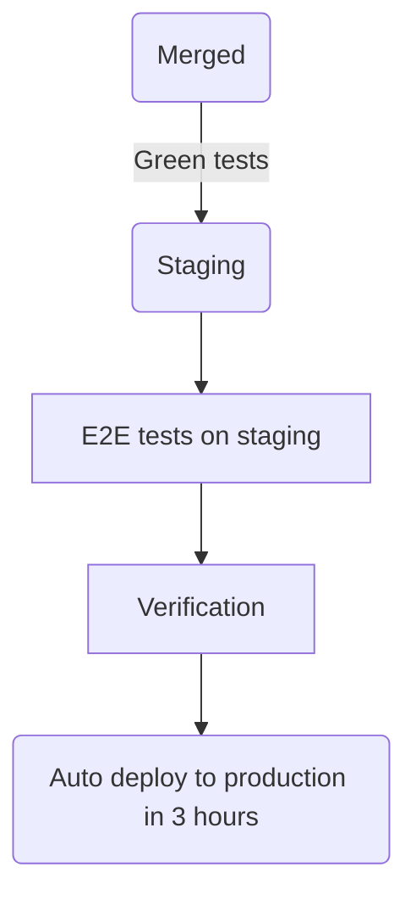

## Mission

Enable customers to evaluate, buy, and manage GitLab offerings through a scalable monetization platform spanning purchase flows, billing engines, and the infrastructure, integrations, and compliance capabilities required to support them.

The Monetization and Fulfillment sections were split from a single Fulfillment section in August 2026. Monetization owns [CustomersDot](https://gitlab.com/gitlab-org/customers-gitlab-com) and its operations. The [Fulfillment section](/handbook/engineering/development/fulfillment/) owns entitlements, seats, and usage. Both sections share one [way of working](/handbook/engineering/development/fulfillment-monetization/).

## Teams

| Team | Charter | EM | PM | Label |
|------|---------|----|----|-------|
| Section | See mission above | James Lopez | Courtney Meddaugh | `devops::monetization` |
| Purchase | End to end purchase experience for all GitLab products: new purchases, add-ons, upgrades, self-service promotional discounts, Flex annual commitment purchase, and the unified purchase flow that underpins all transaction types. | Diana Zubova | Tatyana Golubeva | `group::purchase` |
| Subscription Lifecycle | Post-purchase subscription experience: manual renewal, auto-renewal, QSR, billing account management, subscription visibility, in-product renewal CTAs, and Flex budget and reservation management. | Diana Zubova | Tatyana Golubeva | `group::subscription lifecycle` |
| Billing Engine | Core usage billing capabilities that translate product consumption into accurate, auditable, and scalable billing outcomes for existing and emerging monetized offerings. | Bishwa Hang Rai | TBH | `group::billing engine` |
| Monetization Platform | Platform foundations, abstractions, and reliability improvements that modernize GitLab's monetization systems, reduce operational risk, and accelerate delivery across billing and fulfillment. | Bishwa Hang Rai | TBH | `group::monetization platform` |
| Observability, Monitoring, and Integrations | Monitoring, alerting, diagnostics, and integration capabilities that keep monetization systems operable, debuggable, and extensible as product, billing, and partner needs grow. | Sinclair Machado | TBH | `group::monetization observability` |
| Compliance | Audit, reporting, and control requirements for monetization and fulfillment systems: compliant workflows, automated evidence and reporting, and sustained trust as the platform evolves. | James Lopez | TBH | `group::monetization compliance` |

Vitaly Slobodin (Senior Staff Fullstack Engineer) works across the section.

Stable counterparts are listed on the [shared ways of working page](/handbook/engineering/development/fulfillment-monetization/#stable-counterparts).

## CustomersDot engineering

### Approving and merging

Every MR targeting `main` in CustomersDot needs at least one approval from someone other than the author.

- At least two reviewers, one of them a maintainer. Trivial MRs with no logic change (dependency bumps, test fixes, plain reverts) need one reviewer.
- A maintainer review is required.
- Follow the [Danger bot](https://docs.gitlab.com/ee/development/dangerbot.html) suggestions. Database changes need database review, security sensitive changes need a [Security review](/handbook/security/product-security/security-platforms-architecture/application-security/appsec-reviews/#adding-features-to-the-queue--requesting-a-security-review), Salesforce API changes need [Sales Systems](/handbook/sales/field-operations/sales-systems/), Zuora API changes need [Enterprise Applications](/handbook/business-technology/enterprise-applications/), and user experience changes need a [UX review](/handbook/upstream-studios/product-design/workflow/mr-reviews/).

### Testing

CustomersDot runs linting, unit, integration, frontend, and E2E tests. The `VCR` flag mocks Zuora calls by default, and a [daily scheduled pipeline](https://gitlab.com/gitlab-org/customers-gitlab-com/pipeline_schedules) runs against the Zuora sandbox to catch API changes. Failures block deployment to staging and production.

End-to-end tests live in [GitLab](https://gitlab.com/gitlab-org/gitlab/-/tree/master/qa/qa/specs/features/ee/browser_ui/11_fulfillment) and [CustomersDot](https://gitlab.com/gitlab-org/customers-gitlab-com/-/tree/main/qa). Use CustomersDot only when the test needs the CustomersDot portal. See the [CustomersDot E2E guide](https://gitlab.com/gitlab-org/customers-gitlab-com/-/blob/main/qa/doc/beginners_guide.md).

### Deployment

CustomersDot uses continuous deployment. Merges to `staging` deploy to staging, run E2E tests, and auto deploy to production after 3 hours.

- To stop a production deploy, open a non-confidential issue with the `production::blocker` label.
- To expedite a fix while a blocker is in place, unschedule the production job and trigger it manually after removing the label.
- Use [feature flags](https://gitlab.com/gitlab-org/customers-gitlab-com/#feature-flags-unleash) for significant changes.
- Feature freeze matches the rest of GitLab, from the Friday the milestone ends to release day.
- During a [Production Change Lock](/handbook/engineering/infrastructure-platforms/change-management/#production-change-lock-pcl), open an issue with the [PCL template](https://gitlab.com/gitlab-org/customers-gitlab-com/-/tree/main/.gitlab/issue_templates/Pcl.md) listing DRIs and times for adding and removing `production::blocker`.
- Zuora has [blocked periods](/handbook/business-technology/enterprise-applications/pmo/#release-calendar) where change requests need extra approval.

### Revenue impacting changes

Our changes can directly impact revenue. PM is the DRI for high risk changes and takes input from Sales, Enterprise Applications, Marketing, Finance, and Support.

High risk examples: pricing, billing, launching or deprecating a paid feature, terms of service changes, and changes to how consumption is calculated or displayed. Low risk examples: backend changes not yet used by the frontend, and changes behind a feature flag or labeled beta or experimental.

For high risk changes:

- Update feature documentation and share it with stakeholders.
- Use confidential issues and the regular MR process.
- Ship behind a feature flag and create a [rollout issue](https://gitlab.com/gitlab-org/gitlab/-/issues/299068) for the release date.
- Consider enabling for a subset of customers first.

### Access review

EMs and section leadership review CustomersDot access quarterly following the [access review process](/handbook/security/security-assurance/security-compliance/access-reviews/), based on role and department. Sales keeps read-only access. AppSec, Billing, Monetization and Fulfillment team members, IT Helpdesk, and Support keep write access. When in doubt, reject: access can be restored through an [access request](/handbook/eta/corporate-it/end-user-services/access-requests/access-requests/).

### Operational monitoring

Recurring monitoring work is assigned to DRIs in each milestone planning issue and counts against capacity:

- [Provision Tracking System failure monitoring](https://gitlab.com/gitlab-org/customers-gitlab-com/-/blob/main/doc/provision_tracking_system/failure_monitoring.md)
- [Salesforce and Zuora Sentry monitoring](https://gitlab.com/gitlab-org/customers-gitlab-com/-/blob/main/doc/process/salesforce_and_zuora_sentry_issue_monitor.md)

### Trials

Growth owns trial entry points. Monetization and Fulfillment own the deeper trial codebase and all CustomersDot operational support. See the [Trials Ownership and Collaboration Framework](/handbook/engineering/development/growth/trials-ownership/).

### Architecture review

A weekly architecture review covers cross-group projects, CustomersDot architecture, and the Zuora integration. Everyone is welcome. Add topics to the [agenda](https://docs.google.com/document/d/1_YbxNCo3KXK1-KdIZTgSvmU9kIslYjQnFZAmmu1DSqQ/edit#heading=h.jfvrioc0vg6) at least one day ahead. The meeting is cancelled if the agenda is empty.

## Incident management

### Escalation process for incidents or outages

Monetization runs a [Tier 2 SME on-call rotation](/handbook/engineering/infrastructure-platforms/incident-management/on-call/tier-2/). The Engineer on Call escalates through incident.io:

1. **Level 1**: current SME on call (EMEA, AMER, or APAC).
1. **Level 2**: round robin to all rotation members if Level 1 does not acknowledge within 15 minutes.
1. **Level 3**: [James Lopez](https://gitlab.com/jameslopez).

On an outage, [#customersdot_errors](https://gitlab.slack.com/app_redirect?channel=customersdot_errors) is notified and James Lopez and [Vitaly Slobodin](https://gitlab.com/vitallium) are paged automatically. The SRE on call can ping `@fulfillment-engineering` in Slack for help.

### Urgent fixes

When production is broken, check whether [Rapid Engineering Response](/handbook/engineering/workflow/#rapid-engineering-response) applies. A maintainer can bypass the 3 hour staging to production wait with a manual deploy. Open an issue describing the escalation and announce it in [#fulfillment_monetization_engineering](https://gitlab.slack.com/app_redirect?channel=fulfillment_monetization_engineering).

### Investigation

- Exceptions: [Sentry](https://sentry.gitlab.net/gitlab/customersdot/)
- Logs: [Kibana](https://log.gprd.gitlab.net/)
- Health checks: [CustomersDot health](https://customersdot.us.to/dashboard), credentials in the _Subscription portal_ 1Password vault
- [Declare an incident](/handbook/engineering/infrastructure-platforms/incident-management/#report-an-incident-via-slack) for production outages or failed deploys.

### Customer escalations

Licensing escalations from Support or Sales go through the [support internal request process](/handbook/support/internal-support/#internal-requests), not Slack. Leaders subscribe to the `License Issue High ARR` label.

## Slack

| Channel | Purpose |
|---------|---------|
| [#s_monetization](https://gitlab.slack.com/app_redirect?channel=s_monetization) | Section home |
| [#g_purchase](https://gitlab.slack.com/app_redirect?channel=g_purchase), [#g_subscription_lifecycle](https://gitlab.slack.com/app_redirect?channel=g_subscription_lifecycle), [#g_billing_engine](https://gitlab.slack.com/app_redirect?channel=g_billing_engine), [#g_monetization_platform](https://gitlab.slack.com/app_redirect?channel=g_monetization_platform) | Group channels |
| [#customersdot_errors](https://gitlab.slack.com/app_redirect?channel=customersdot_errors), [#customersdot_health](https://gitlab.slack.com/app_redirect?channel=customersdot_health), [#customersdot_job_alerts](https://gitlab.slack.com/app_redirect?channel=customersdot_job_alerts), [#customersdot_nonprod](https://gitlab.slack.com/app_redirect?channel=customersdot_nonprod) | CustomersDot alerts |

Shared channels are listed on the [ways of working page](/handbook/engineering/development/fulfillment-monetization/#shared-slack-channels).

## Links

- [Shared ways of working](/handbook/engineering/development/fulfillment-monetization/)
- [Fulfillment Guide](/handbook/product/groups/fulfillment/) (CustomersDot admin and process docs)
- [CustomersDot resource videos](https://gitlab.com/gitlab-org/customers-gitlab-com/-/blob/staging/doc/resource_videos.md)
- [Performance indicators](https://internal.gitlab.com/handbook/company/performance-indicators/product/fulfillment-section/) and [engineering dashboards](/handbook/product/groups/product-analysis/engineering/dashboards/)
