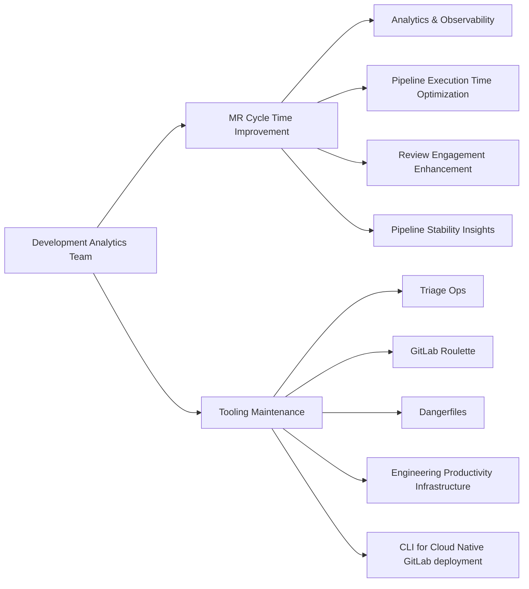

## Strategy

### Vision

Every GitLab project gets a development health score out of the box: real-time, self-service visibility into SDLC friction, potential bottlenecks, and actionable signals, without any custom instrumentation. The patterns we prove on GitLab's own engineering become the default telemetry available to every team using GitLab.

### Mission

We surface development health signals across the SDLC and make them visible to the teams that own them. We are customer zero: we prove patterns on GitLab's own Engineering first, then influence and collaborate with product teams to ship them to every customer. We work with both the GitLab monolith and Modular Components as first-class targets — each initiative focuses on whichever platform makes sense, but we keep both in mind.

### Strategic Pillars

#### Development Health Signal Platform

Own the full SDLC signal layer for GitLab engineering, covering both the monolith and Modular Components. Push development health data into the product so it is available to users, AI agents, and dashboards. Deliver scorecards from engineer to VP level.

#### Customer Zero -> Product Influence

We operate as an internal lab embedded in GitLab Engineering. We identify development health gaps, build lightweight signals and/or instrumentation to surface them, and validate their value on real Engineering work — across both the monolith and Modular Components. Then we partner with product teams to bring those signals natively into GitLab — so every customer gets them without custom instrumentation.

#### Tooling Stewardship

Maintain the tools GitLab engineering depends on: Triage Ops, Roulette, Dangerfiles, EP Infrastructure. Progressively migrate custom tooling into the product rather than running it in parallel. AI agents take over L1 automation work currently done by humans or scripts.

## FY27 Roadmap

Whatever we build internally, we build with the product in mind. Customer zero means we validate signal patterns inside GitLab first, then push them into the product so every GitLab customer benefits.

### Q2

See the [Q2 Planning issue](https://gitlab.com/gitlab-org/quality/analytics/team/-/work_items/573) for the most up to date view of what the team is working on at the moment.

### Q3

| Initiative | Capacity | Engineers |
| :---- | :---- | :---- |
| [CI Health Incidents — Operations, Feedback & Evolution](https://gitlab.com/groups/gitlab-org/quality/analytics/-/work_items/47) | Primary (full team) | All 3 |
| [Theseus — CI/CD & Test Observability for Modular Features](https://gitlab.com/groups/gitlab-org/quality/analytics/-/work_items/49) | Best effort | 1-2 |
| [Test Health Index](https://gitlab.com/groups/gitlab-org/quality/analytics/-/work_items/46) | Best effort, completes Q3 | 1 |

#### CI Health Incidents — Operations, Feedback & Evolution

CI Health Incidents detection is live, cutting noise by ~91% versus the old master-broken system. We are well-positioned to help Engineers and EMs quantify the impact of master-broken incidents, improve time to resolution, and add guardrails to prevent them.

There is also a direct product opportunity: GitLab is prototyping [in-product flaky test detection](https://gitlab.com/gitlab-org/gitlab/-/work_items/606069), and DA's historical test signal — our statistical flakiness definition, failure signatures, and blast radius data — is exactly what that product initiative needs to be robust.

*Epic: [CI Health Incidents — Operations, Feedback & Evolution](https://gitlab.com/groups/gitlab-org/quality/analytics/-/work_items/47)*

- **Q3:** All three engineers focused here. Signal quality improvements (traceless job/pipeline failure detection), master-broken deprecation audit, ownership/response process.
- **Q4:** Decide the fate of legacy master-broken incidents (deprecate, redirect, or merge) and update handbook/docs accordingly.
- **Beyond:** Advanced automation (AI-assisted MR identification, auto-created revert MRs). Learn from incidents to prevent recurrence.

---

#### Theseus — CI/CD & Test Observability for Modular Features *(best effort)*

Theseus is the future development platform for GitLab. Every new Modular Component will build on it. DA has a chance to get involved early and establish what good observability looks like for Modular Components. Nobody in DA has validated the end-to-end CI/CD and test signal flow for a Theseus-based component yet. If we do it on a pet project first and validate it on Artifact Registry, we give every future Modular team a paved path to follow.

*Epic: [Theseus Test & CI Observability](https://gitlab.com/groups/gitlab-org/quality/analytics/-/work_items/49)*

- **Q3 (best effort):** Instrument a small project (with Ruby/Go/Jest tests) and push to our ClickHouse: test results, test duration, job duration, pipeline duration, failure categories, and failure signatures. Validate existing dashboards. Apply the same approach to Artifact Registry. File gaps as issues.
- **Q4 (primary):** Full focus. Add more metrics along the SDLC lifecycle, expand to more Modular Components, refine the epic.
- **Beyond:** The observability standard we define becomes the default for new GitLab projects. Every project exports its CI/CD and test metrics across the full SDLC without custom instrumentation work.

---

#### Test Health Index *(best effort, completes Q3)*

GitLab's test suite carries real, growing debt across three pillars: quarantined tests, flaky tests, and slow tests. No view aggregates these into a per-group health picture today. Phase 1 (Visibility) is nearly done and Phase 2 (Calibration) is already underway.

*Epic: [Introduce Test Health Index](https://gitlab.com/groups/gitlab-org/quality/analytics/-/work_items/46)*

- **Q3 (best effort):** Complete Phase 1 (Visibility) and Phase 2 (Calibration). Test Health Index dashboard, per-group detail generator, Investigation bucket workflow, triage-ops integration, calibrated RAG band cutoffs. Done.
- **Beyond:** Phase 3 (alerting) and Phase 4 (enforcement) contingent on engineering leadership endorsement.

---

### Q4

| Initiative | Capacity | Engineers |
| :---- | :---- | :---- |
| [Theseus — CI/CD & Test Observability for Modular Features](https://gitlab.com/groups/gitlab-org/quality/analytics/-/work_items/49) | Primary | 1-2 |
| [Orbit Integration — Bringing CI Signal Into the Knowledge Graph](https://gitlab.com/groups/gitlab-org/quality/analytics/-/work_items/52) | Research spike | 1 |
| [Expand Flaky Test Detection to Jest, Go, and Rust](https://gitlab.com/groups/gitlab-org/quality/analytics/-/work_items/53) | Research spike | 1 |
| [CI Health Incidents — Operations, Feedback & Evolution](https://gitlab.com/groups/gitlab-org/quality/analytics/-/work_items/47) | Maintenance | As needed |

#### Orbit Integration — Bringing CI Signal Into the Knowledge Graph

Today, agents can follow a trail all the way to the CI job, but what happens inside that job is invisible. DA's ClickHouse data (flaky tests, failure categories, CI health incidents, failure signatures, code coverage) would let agents zoom one level deeper, making them meaningfully better at answering CI health questions. A hackathon prototype ([repo](https://gitlab.com/gitlab-ai-hackathon/transcend/8043245), [write-up](https://dev.to/arek_h/finding-the-root-cause-of-production-incidents-in-seconds-with-gitlab-orbit-ai-244i)) already proves the incident-to-MR traversal pattern via Orbit. DA's CI signal layer is the missing piece.

*Epic: [Orbit Integration — Bringing CI Signal Into the Knowledge Graph](https://gitlab.com/groups/gitlab-org/quality/analytics/-/work_items/52)*

- **Q4:** Research spike. What does it take to move our data from team ClickHouse to production ClickHouse? What would Orbit integration require technically? What does this look like for GitLab internally vs. for the product? Begin migration and integration where possible.
- **Beyond:** DA's CI signal becomes a first-class data source in Orbit, available to GitLab customers.

---

#### Expand Flaky Test Detection to Jest, Go, and Rust

Flaky test detection today only works for RSpec. Jest, Go, and Rust tests have no way to participate, even though flakiness is just as real a problem for them. Expanding this directly supports the in-product flaky test detection initiative GitLab is building.

*Epic: [Expand flaky test detection to Jest, Go, and Rust](https://gitlab.com/groups/gitlab-org/quality/analytics/-/work_items/53)*

- **Q4:** Wire real retry-confirmation for Jest and Go. Build a Rust exporter including for Orbit's own test suite. Gate each framework behind an explicit allowlist to avoid flooding existing dashboards and alerts.
- **Beyond:** Flaky signal parity across all major frameworks DA supports.

---

### Future Work / Candidates

*Not committed this cycle. Listed so reviewers can see the value and re-prioritize if needed.*

#### Systematic Production Incident Root Cause Analysis

Link test coverage, quarantine state, and CI signal to production incidents to answer "why was the pipeline green?" A hackathon prototype ([repo](https://gitlab.com/gitlab-ai-hackathon/transcend/8043245), [write-up](https://dev.to/arek_h/finding-the-root-cause-of-production-incidents-in-seconds-with-gitlab-orbit-ai-244i)) already proves the incident-to-MR traversal pattern via Orbit. DA's CI signal layer is the missing piece for a systematic, repeatable root cause analysis.

*Epic: [Systematic Incident Root Cause Analysis](https://gitlab.com/gitlab-org/quality/analytics/team/-/work_items/39)*

---

#### Tier-1 Agents for Development Analytics

Blueprint research for running tier-1 agents responsibly in DA: where they run, guardrails, what a good/bad outcome looks like. DA becomes a reference implementation other DevEx and company teams can follow. No common pattern for this exists at GitLab today.

*Epic: [Tier-1 Agents for Development Analytics](https://gitlab.com/groups/gitlab-org/quality/analytics/-/work_items/51)*

---

#### Expand Engineering Data Coverage in ClickHouse

Add more missing data sources into ClickHouse: factory profiling, MR review metadata, CI/CD cost telemetry. Each data gap closed is a signal category we can validate, offer to product teams, and eventually ship to customers.

*Epic: [Expand Engineering Data Coverage in ClickHouse](https://gitlab.com/groups/gitlab-org/quality/analytics/-/work_items/54)*

Candidate sub-projects:

- **MR Process Visibility** — surfaces reviewer roulette pool size, approval reset frequency, and review timeline. Needs a quick investigation issue first to confirm the product hasn't already solved this. [Epic](https://gitlab.com/groups/gitlab-org/quality/analytics/-/work_items/45)
- **Factory-heavy RSpec test observability, guardrails, and remediation** — profiles factory time cost in CI (previously ~11.7 CI-hours/run for a single factory), then adds RuboCop guardrails and remediation. [Epic](https://gitlab.com/groups/gitlab-org/quality/-/work_items/403)
- **Track CI/CD Pipeline Costs in ClickHouse and Grafana** — cost breakdown by project, job type, and resource category. [Epic](https://gitlab.com/groups/gitlab-org/quality/analytics/-/work_items/34)

## How we work

### Internal Rotation & Support Requests

#### Internal Rotation

We use [an internal rotation](https://gitlab.com/gitlab-org/quality/analytics/internal-rotation#process) for support requests and other team maintenance tasks. This frees up time for other Engineers in the team to work on planned work.

#### Support Requests

- If one finds a bug, needs assistance, or identifies an improvement opportunity then raise support requests using the `~"group::Development Analytics"` and `~"development-analytics::support-request"` labels. If the issue is urgent, escalate to the designated Slack channel - [`#g_development_analytics`](https://gitlab.enterprise.slack.com/archives/C064M4D2V37).
- If a request first comes through Slack, either the requester or a `group::Development Analytics` member should open an issue with the correct labels to ensure proper tracking and triage.
- The team reviews the [support request board](https://gitlab.com/groups/gitlab-org/-/boards/9098093?label_name%5B%5D=development-analytics%3A%3Asupport-request) and prioritizes accordingly. Generally, the team reserves ~20% of weekly time for support tasks, though this may vary based on current priorities.

### Tools/Repository Maintenance

- Team does not automatically watch every new issue created in each group-owned repository—use the group labels or escalate in Slack to ensure visibility.
- We highly promote self-served Merge Requests. If one already identified a fix or improvement, we request opening an MR for faster turnaround. The `~group::development analytics` maintainers will review and merge as appropriate.
- Feature work and bug fixes follow the team's current priorities.
- Find the version management rituals for `~group::development analytics` owned repositories:

| Repository                             | Release Process                                                                                 |
|----------------------------------------|-------------------------------------------------------------------------------------------------|
| **gitlab-roulette**                    | Version updates are not scheduled on a set cadence. A release can be cut whenever a version-update MR is submitted. |
| **gitlab-dangerfiles**                 | Same as above—no regular cadence; release triggered by a version-update MR.                     |
| **triage-ops**                         | A new release is initiated after merging a new commit into the default branch.                            |
| **engineering-productivity-infrastructure** | Dependency update MRs are generated by Renovate bot.                                            |

## Team members



## Core Responsibilities

## Dashboards

Development Analytics dashboards are listed on [Developer Experience Dashboards page](/handbook/engineering/infrastructure-platforms/developer-experience/dashboards)

The [Test Health](/handbook/engineering/infrastructure-platforms/developer-experience/development-analytics/test-health) page explains the per-group test-suite health scores (Flaky, Quarantine, and Slow pillars) and how to act on them.

## Common Links

| **Category**            | **Handle**                                                                                                                 |
|-------------------------|----------------------------------------------------------------------------------------------------------------------------|
| **GitLab Group Handle** | [`@gl-dx/development-analytics`](https://gitlab.com/gl-dx/development-analytics)                                           |
| **Slack Channel**       | [`#g_development_analytics`](https://gitlab.enterprise.slack.com/archives/C064M4D2V37)                                     |
| **Slack Handle**        | `@dx-development-analytics`                                                                                                |
| **Team Boards**         | [`Team Issues Board`](https://gitlab.com/groups/gitlab-org/-/boards/8966549?label_name%5B%5D=group::development%20analytics), [`Team Epics Board`](https://gitlab.com/groups/gitlab-org/-/epic_boards/2068920?label_name[]=group%3A%3Adevelopment%20analytics), [`Support Requests`](https://gitlab.com/groups/gitlab-org/-/boards/9098093?label_name%5B%5D=development-analytics::support-request)                                           |
| **Issue Tracker**       | [`Development Analytics Issues`](https://gitlab.com/groups/gitlab-org/quality/dx/analytics/-/issues)                       |
| **Team Repositories** | [development-analytics](https://gitlab.com/gitlab-org/quality/analytics)                                                   |
