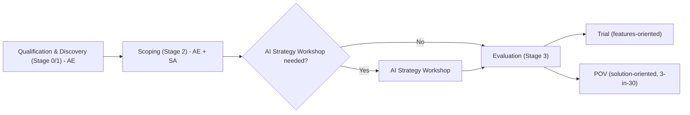
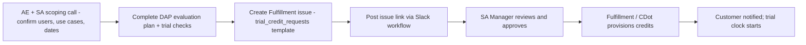

## 1\. DAP trials {#dap-customer-trial}

DAP trials are **usage-aware POV motions**. They require stronger qualification, readiness, enablement, credit governance, usage monitoring, and post-trial decision hygiene than a standard feature trial.

Distinguish DAP "trial" from DAP "POV" the way the sales-stage flow does: Qualification & Discovery (Stage 0/1, AE-led business-case discovery) → Scoping (Stage 2, AE \+ SA collaborate on solution discovery, success criteria, and an initial Customer Success Plan) → Evaluation (Stage 3), which forks into a Trial (features-oriented, 3-in-30 not required) or a POV (solution-oriented, 3-in-30 applied). An AI Strategy Workshop between Scoping and Evaluation is optional but recommended when the customer's use cases, sizing, or success criteria aren't yet clear.

### 1.1 DAP trial eligibility and entry criteria

| Customer Type | Trial Path | Key Constraints |
| :---- | :---- | :---- |
| Prospect, free SaaS  | Self-serve trial  | 100-user cap, 30 days, credits included automatically |
| Prospect, free self-managed  | Self-serve trial  | GitLab 18.9+, no user cap, credits included automatically |
| Existing paid Premium/Ultimate  | SA-assisted Fulfillment request  | One-time credit allocation; must not have on-demand billing enabled; cloud licensing required |
| Dedicated | SA-assisted Fulfillment request | GitLab 18.8.4+ required |
| Air-gapped / offline  | Not eligible for credits  | Seat-based evaluation using a $0 Deal Desk order instead |
| OSS / Education / Startup program | Not eligible |  |
| Dedicated for Government | Not eligible |  |
| GitLab Duo with Amazon Q | Not eligible |  |

### 1.2 DAP trial entry criteria

Before requesting evaluation credits, the AE and SA must confirm:

* The customer has an active paid Premium or Ultimate subscription and provide the subscription identifier in the request.
* The customer has an open opportunity that will track the evaluation and commercial outcome.
* An SA scoping conversation has occurred.
* The customer has named evaluators, teams, an owner, and decision-makers.
* The customer has selected clear use cases and success metrics.
* The customer is ready to execute during the trial window.
* The evaluation plan is stored in the customer folder and linked from the request.
* The deployment model and version are eligible.
* The customer does not have a conflicting monthly commitment or enabled on-demand billing when evaluation credits are intended to be the only usage source.
* Self-Managed customers meet the current version, cloud licensing, connectivity, runner, and DAP prerequisites.
* Self-hosted or offline DAP has a separate architecture, model, licensing, network, and support plan.

Do not start the DAP clock until the customer can execute at least one representative DAP flow successfully with existing credits or a validated readiness path.

### 1.3 How AEs and Reps request a DAP trial

The AE/Rep owns the request; the SA owns the technical plan.

1. Complete the customer and SA scoping conversation.
2. Create or update the DAP evaluation plan with customer-specific goals, use cases, participants, dates, prerequisites, and success criteria. Do not send an unmodified generic template as the customer plan.
3. Verify: active paid Ultimate/Premium subscription (A-S\#\#\#\#\#\# ID), no monthly-commit SKU or on-demand billing enabled, cloud licensing confirmed (self-managed), version 18.9+ (self-managed) or 18.8.4+ (Dedicated).
4. Create the trial credit request using the current Fulfillment template.
5. Create a GitLab issue from the `trial_credit_requests` template in `gitlab-org/fulfillment/meta`, titled `[A-XXXXXX] [Subscription Name], [Customer Name], [Total Credits Requested], [Date Requested For]` and include:
   * Subscription name and ID; customer name; AE and SA; Salesforce Account link; Salesforce DAP Opportunity link; sold-to contact email; subscription type; total seats; total credits requested; offline flag; and the customer-specific evaluation document.
   * For a retrial or extension: prior trial issue link, reason code, remaining credits, and validating SA name.
   * Users, use cases, duration, deployment model, GitLab version, prerequisites, success criteria, start/end dates, and the reason the requested credits are sufficient.
6. Submit the request to the current trial-request workflow and post the link in the designated Slack channel: **`#dap-trial-request`.**
7. Attach or record the approval evidence in the request.
8. Do not promise a start date until the approval and provisioning status are confirmed.

### 1.5 SA manager evaluation and approval guidelines

SA Leadership approval is required before credits or extensions are processed. All must be checked, or an explicit exception must be documented by the appropriate approver.

* The subscription is active, paid, Premium or Ultimate, with no conflicting on-demand billing enabled.
* Self-managed customers are on cloud licensing; Dedicated customers are on 18.8.4+.
* The SA has filed the evaluation plan (use cases and success criteria) in the customer's Drive folder and is committed to executing it.
* The AE and SA have scoped the user count to fewer than 50 users before submission.
* Offline/air-gapped customers are routed to Deal Desk for a $0 order instead of a credit request.

For a retrial or extension, SA Manager (or SA Director/VP) approval is required regardless of amount, and the SA must validate a legitimate cause — a DAP bug, an outage, a customer-side blocker, or insufficient evaluation time — and confirm the prior trial's post-evaluation survey and feedback form are complete before approving.

SA managers should approve only when the request represents a credible, executable evaluation—not simply a request for free usage. **All mandatory rows below must be Yes, or have an explicitly documented exception approved by the appropriate leader.**

#### 1.5.1 SA manager approval checklist

| Category | Checklist item | Remediation action / evidence |
| :---- | :---- | :---- |
| Salesforce | \[ \] POV Object is created in Salesforce under the DAP opportunity. | SA creates the POV Object and links it to the opportunity; include the record link in the request. |
|  | \[ \] Correct subscription is included in the request and tied to the POV Object. | Add the active Premium or Ultimate subscription ID and verify the subscription is the one receiving credits. |
| | \[ \] Open DAP opportunity and credible commercial path are recorded; the opportunity is not renewal-only. | Add the Salesforce Account and DAP Opportunity links, buyer/approver, champion, decision date, and next commercial step. |
| Evaluation Plan | \[ \] Evaluation plan is customer-specific and is not a generic copy of the DAP template. | Add customer goals, stakeholders, risks, scope, timeline, use cases, prerequisites, and evidence. Link the plan from the request and store it in the customer folder. |
|  | \[ \] Number of trial users is specified and is fewer than 50\. | Correct the participant list and user count before submission. The maximum is 50 users per trial. |
| | \[ \] Requested credits match the number of trial users. | Use `number of trial users × 40 credits per user`; document duration, use cases, activity assumptions, and any exception. |
| | \[ \] Success metrics are defined and agreed with the customer. | State what value is being proven and make every metric clear, measurable, and tied to a decision. |
| | \[ \] Baseline is captured. | Record current-state measures such as timings, merge-request volume, pipeline-fix time, vulnerability-resolution time, or other relevant starting metrics. |
| | \[ \] Use cases are documented and evidence-ready. | Name the workflows, owners, prerequisites, steps, success signals, and expected evidence. |
| | \[ \] Customer owner, evaluators, technical owner, decision-makers, and required access are committed. | Add the participant list, owners, availability, environment, projects, and administrator support. |
| Four weekly cadences | \[ \] Customer commitment to engage for four weeks is documented. | Capture a customer email, Slack confirmation, or equivalent evidence; name the stakeholder and establish a standing cadence. Attach the evidence to the request. |
| | \[ \] Kickoff, progress cadence, midpoint check, final survey, and readout dates are scheduled. | Add calendar invites and align the customer-facing plan, evaluation document, and Salesforce dates. |
| Ready to execute | \[ \] Kickoff date is set and the provision date will support that kickoff date. | Do not promise a start date until approval and provisioning are confirmed; start the DAP clock only when the customer can execute. |
| | \[ \] Environment and configuration are validated. | Confirm deployment model, eligible version, cloud licensing where applicable, connectivity, runners, namespace/group, roles, and integrations. |
| | \[ \] Smoke test is complete. | Demonstrate at least one representative DAP flow or record a dated readiness plan that will complete before the clock starts. |
| | \[ \] Provisioning requirements are confirmed. | Verify subscription eligibility, no conflicting monthly commitment or enabled on-demand billing, requested population, expiration, and approval path. |
| | \[ \] Measurement and recording locations are ready. | Link the POV Object, Evaluation Plan, collaboration project, POV Report, request issue, dashboards, surveys, and system-of-record fields. |
| Retrial or extension | \[ \] Previous trial's post-evaluation is complete. | Confirm the survey was sent, evaluation report was created, and DAP feedback was submitted before approval. |
| | \[ \] SA validated a legitimate issue prevented proper evaluation. | Select and document the reason: DAP bug, outage, customer-side blocker, insufficient evaluation time, or another approved reason. Explain what changed. |
| | \[ \] Request type is explicit. | Select top-up credits or extend days only. For day-only extensions, specify 7, 14, or 30 days and do not add credits. |
| | \[ \] Required leadership approval is recorded. | SA Manager, SA Director, or VP of Solutions Architecture approves regardless of amount; attach the approval evidence to the issue. |
| Risk and exceptions | \[ \] No unmanaged security, legal, data, offline, or operational risk remains. | Return the request, route offline/air-gapped customers to the $0 Deal Desk path, or document an approved exception and owner. |

A request should be returned when it is a generic demo, discovery substitute, renewal-only motion, unqualified evaluation, copied template, unsupported environment, duplicative request, unjustified credit amount, missing customer commitment, or an extension caused only by failure to execute the agreed plan.

For approval routing, first-time requests up to 2,000 credits and requests up to 5,000 credits including subsequent retrials use SA Manager, SA Director, or VP of Solutions Architecture approval. Requests above 5,000 credits require CPMO's approval; requests above 100,000 require CEO/CFO/CPMO-level approval as defined in the Fulfillment template. Retrials and extensions require SA Leadership approval regardless of amount.

Return or reject when:

* The request is a generic demo, discovery substitute, renewal, or unqualified early-stage evaluation.
* There is no POV Object, credible decision path, clear customer owner, champion, decision-maker, or decision date.
* The evaluation document is an unmodified template or the use cases and success criteria are missing or not measurable.
* The customer cannot provide the stated users, environment, projects, time, access, or admin support needed to execute.
* The request is duplicative, lacks a legitimate retrial reason, or seeks an extension because the team did not execute the agreed plan.
* The credit amount is not justified by the user count, plan, duration, or requested population.
* The trial introduces unmanaged security, legal, data, offline, or operational risk.

For retrials and extensions, require SA leadership approval and documented validation that a legitimate DAP issue, outage, customer-side blocker, or insufficient evaluation time prevented a proper evaluation. Require the prior post-evaluation before approving a retrial.

### 1.6 Credit provisioning guidelines

#### 1.6.1 Approval thresholds and trial sizing

For approval routing, first-time requests up to 2,000 credits and requests up to 5,000 credits including subsequent retrials use SA Manager, SA Director, or VP of Solutions Architecture approval. Requests above 5,000 credits require CPMO's approval; requests above 100,000 require CEO/CFO/CPMO-level approval as defined in the Fulfillment template. Retrials and extensions require SA Leadership approval regardless of amount.

##### Credit sizing and provisioning

| Control | Rule |
| :---- | :---- |
| First-time requests | Up to 2,000 credits for initial issuance with approval from the SA Manager, SA Director, or VP of Solutions Architecture |
| Combined ceiling | Up to 5,000 credits across initial issuance and subsequent retrials/extensions with SA Leadership approval |
| Escalation above 5,000 | Requires CPMO approval |
| Escalation above 100,000 | Requires CEO/CFO/CPMO-level approval as defined in the Fulfillment template |
| Users | Maximum 50 users per trial |
| Default sizing | `number of trial users × 40 credits per user` |
| Top-up credits | New credits automatically extend non-expired credit expiration according to the current provisioning workflow |
| Extend days only | Use CustomersDot Admin to extend existing credits by 7, 14, or 30 days; do not add credits; SA Leadership approval is still required |
| Exceptions | Record user count, duration, use cases, activity assumptions, and the reason for any deviation from the formula |
| Usage controls | Use credits only for the defined customer scope and evaluation window; keep on-demand billing disabled unless the customer explicitly accepts the commercial exposure |
| Verification | Confirm subscription eligibility, balance, expiration, and intended population before kickoff; monitor usage weekly by evaluation group, user where available, and feature |
| Closeout | Record approval and provisioning evidence in the POV Object; complete the post-trial survey, evaluation report, and DAP feedback before any retrial request |

### 1.7 CustomersDot access for trial-credit provisioning

Managers who are authorized to provision credits need CustomersDot Admin access with the sales role and membership in the Okta group `okta-cdot-prod-sales-admins`.

Access path:

1. Request or confirm membership in the required Okta group through the standard access-request process.
2. Sign in to CustomersDot Admin with Okta.
3. Use **Bonus trial wallets** to add credits or extend active credits.
4. Enter the subscription name, approval issue link, credit amount or extension days, expiration choice, and notes.
5. Confirm the success message, wallet record, customer notification, and audit event.

The Handbook should link to the authoritative access-request and CustomersDot runbooks rather than duplicating admin-only implementation details. If a manager does not have the required role, the request should go through an authorized provisioning owner or the approved Fulfillment workflow.

### 1.8 DAP readiness checklist

Before the 30-day clock begins, confirm:

* **Subscription and credits:** active Premium or Ultimate subscription; eligible credit pool; correct dates and balance; no unintended on-demand billing.
* **Deployment:** GitLab.com, Self-Managed online, Self-Hosted, or Offline path selected; supported version and patch level confirmed.
* **Namespace and access:** dedicated evaluation group or equivalent; pilot users and projects identified; roles and access verified; AI-native features enabled only where intended.
* **Execution:** runner is online and appropriately tagged for DAP flows; network and image access work; at least one representative DAP flow completes.
* **Use cases:** three to five use cases selected; customer-specific playbook created; prerequisites and evidence defined.
* **Measurement:** baseline and targets defined; usage and value dashboards identified; midpoint and final surveys scheduled.
* **Support:** customer support contacts, account-team route, and Request for Help escalation route agreed.
* **Governance:** collaboration project exists; POV record is linked; kickoff, cadence, and final readout are on calendars.

### 1.9 DAP execution checklist — from request to scope and through close

The table below preserves the evaluation-plan checklist sequence and adds the standard POV governance fields. The SA should mark each row complete before moving to the next gate; the customer-facing plan should use the same dates and commitments.

| Countdown | Task | Participants | Completed? |
| :---- | :---- | :---- | :---- |
| T \- 14 days | DAP Evaluation Request | Customer | ☐ |
| T \- 12 days | Plan for DAP Workshop | SA, AE, Customer | ☐ |
| T \- 10 days | Complete DAP workshop | SA, AE | ☐ |
| T \- 8 days | Determine if AI Strategy Workshop is Needed | SA, AE, Customer | ☐ |
| T \- 8 days | Scope DAP Evaluation w/Customer (DO NOT Just copy DAP template). Determine Goals/Top 5 Use Cases; Timeline; Stakeholders/Roles; Number of People Involved; Risks; In Scope/Out of Scope. | SA, AE, Customer | ☐ |
| T \- 6 days | Present POV Plan Slides, Get Customer Agreement on Use Cases | SA, AE, Customer | ☐ |
| T \- 4 days | Schedule and Complete AI Strategy Workshop (Optional) | SA, AE, Customer | ☐ |
| T \- 4 days | 1\. Create DAP Use Cases Playbook. 2\. Schedule POV Use Cases Dry Run / Determine Credits. | SA, AE, Customer | ☐ |
| T \- 4 days | Schedule POV Kick Off, Configuration, Weekly Cadences and Readout Date | SA, AE, Customer | ☐ |
| T \- 2 days | 1\. Create POV Collaboration Project to record Issues, Issue Board. 2\. SA to Create POV Object on SalesForce \- Add Collaboration Project (Optional) in Success Criteria and the DAP Evaluation Doc in General Notes. 3\. Send updated DAP Use Cases Playbook, DAP Scope Plan. 4\. Set up Slack or Teams communication channel. 5\. Create and follow up on DAP Trial Credit Request, with link to DAP Evaluation Plan. 6\. Send email on DAP Trial credits, include goals, use cases, survey links. | SA, AE | ☐ |
| T \+ 0 days | POV KickOff Call / Follow DAP Enablement Checklist and configure DAP on customer instance | SA, AE, Customer | ☐ |
| Daily | Review Slack or Teams Communications from Customer | SA, AE, Customer | ☐ |
| Twice Weekly | 1\. Conduct Weekly Cadences. 2\. Copy Gong Notes to Meeting Notes. 3\. Create or Update Issues with Customer in comment based on Feedback. 4\. Update POV Use Cases Report \- Add all Issues and Feedback in Collaboration Project or DAP Evaluation Plan. 5\. Send weekly emails to account team and customer on POV Progress. | SA, AE, Customer | ☐ |
| Once a Week | Conduct 4 DAP Sessions (30-45 minutes) | SA, AE, Customer | ☐ |
| T \+ 15 days | Conduct Mid Survey | SA, AE, Customer | ☐ |
| T \+ 30 days | Conduct Final Survey | SA, AE | ☐ |
| T \+ 30 days | Conduct POV Readout Call | SA, AE, Customer | ☐ |
| Weekly Email Updates to Executive Buyers | Send weekly emails to account team and customer on POV progress. For each use case include: Status \- X% Complete; Tasks Completed; Still to Complete; Any Challenges. | SA, AE | ☐ |
| Close | Record technical result, commercial next step, feedback, credit usage, and any product/RFH issues in the POV Object, opportunity, collaboration project, and evaluation plan. | SA, AE | ☐ |

### 1.10 DAP responsibilities

| Role | Before trial | During trial | Closeout |
| :---- | :---- | :---- | :---- |
| AE / Rep | Qualify opportunity; align commercial decision; coordinate request; provide account and subscription details; secure customer commitment | Maintain executive and commercial alignment; remove account blockers; keep opportunity and decision date current; **send a weekly email or Slack report to the executive buyer on trial progress using the weekly update template below** | Lead commercial next step, procurement, expansion, or close-lost process |
| SA | Qualify technical fit; define use cases and success criteria; validate readiness; create plan; recommend credits and execution mode | Run kickoff/cadence; enable and guide use cases; track evidence, issues, usage, and risks; escalate blockers | Deliver technical readout; call win/loss/inconclusive; submit feedback and update POV record |
| SA manager | Review qualification, scope, risk, capacity, and credit request; approve or return request; ensure governance | Inspect progress, usage, blockers, and resource load; approve exceptions and retrials; coach account team | Inspect result hygiene, conversion, feedback quality, and repeatability |
| Customer owner/champion | Commit participants, access, time, data, projects, and decision process | Coordinate evaluators; execute workflows; capture evidence and feedback; attend cadence | Confirm results, decision, rollout plan, and remaining gaps |
| Customer admin/platform owner | Validate version, licensing, groups, permissions, runners, network, and DAP settings | Maintain access and environment; monitor credits and technical health | Transition configuration and operating ownership into production/paid use |
| Partner / PS, when involved | Define delivery boundary, roles, and handoffs | Execute agreed implementation or enablement work; track acceptance | Handoff implementation, services, support, and commercial scope |

#### 1.11 Weekly executive-buyer email or Slack update template

The AE/Rep owns sending this update weekly during the trial. The SA and customer champion provide the technical content, but the AE/Rep is accountable for executive-buyer communication. Use the same structure in email or Slack; keep the content concise, factual, and tied to the agreed POV plan.

| Update field | Template content |
| :---- | :---- |
| Subject / headline | `POV Weekly Update — <Customer> — <Week of Date> — <Overall Status>` |
| Overall status | `Overall status: <Green / Yellow / Red> — <one-sentence summary of progress against the decision and success criteria>.` |
| Use-case status | For each use case: `Status — X% Complete; Tasks Completed; Still to Complete; Any Challenges.` |
| Tasks completed | List the material workflows, configurations, enablement sessions, evidence, and milestones completed this week. |
| Still to complete | List the remaining tasks, owners, and due dates needed to complete the evaluation. |
| Challenges and risks | Describe blockers, bugs, required enhancements, security or access issues, support needs, and the mitigation or escalation owner. |
| Feedback and issues | Summarize survey or customer feedback and link new issues recorded in the POV report, evaluation document, or collaboration project. Identify whether each item is routed to Product Management, Engineering, or Customer Support. |
| Executive asks | State any decision, resource, access, timeline, or escalation needed from the executive buyer. |
| Next milestone | State the next cadence, midpoint, readout, or decision milestone and its date. |
