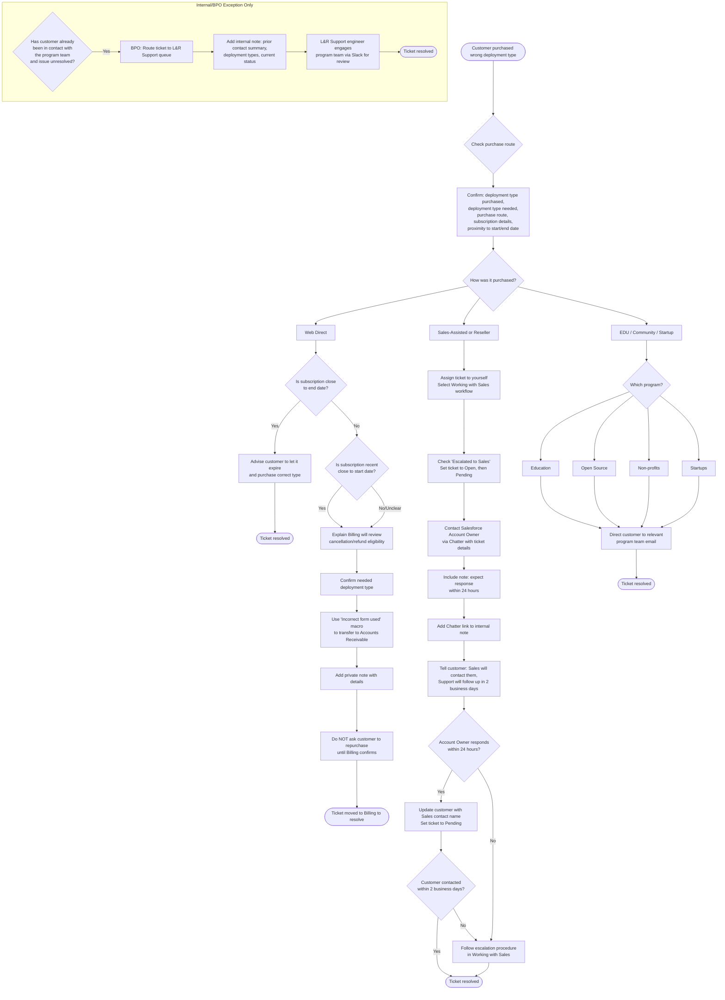

## Overview

This guide explains how to route requests where a customer purchased the wrong deployment type: GitLab.com SaaS instead of Self-Managed, or Self-Managed instead of GitLab.com SaaS.

**Short answer: Support does not directly transfer a subscription between SaaS and Self-Managed. Route the request according to how the customer purchased the subscription.**

## Check the purchase route

For guidance on identifying web-direct versus sales-assisted purchases, see [Cloud licensing and the support exemption process explained](self-managed/cloud-licensing.md) and [Working with Sales](working_with_sales.md). If the indicators are unavailable or conflict, use the escalation guidance there rather than guessing. You may also clarify with the customer how they made their purchase.

When checking Salesforce, note that the **Initial Source** field alone is not reliable for determining the purchase route. A sales-assisted renewal or add-on may still show "Web Direct" as the Initial Source. Confirm by checking the Quote status (`Sent to Z-Billing` indicates sales-assisted) and the Zuora invoice `Created By` field as described in the [Cloud licensing FAQ](self-managed/cloud-licensing.md#4-how-do-i-tell-if-a-purchase-was-web-direct).

**Reseller purchases follow the sales-assisted route.** If the customer purchased through a reseller, route the request to the Account Owner and Sales, not to Billing.

Before routing the ticket, confirm:

1. The deployment type purchased.
1. The deployment type the customer needs.
1. Whether the purchase was web direct, sales-assisted, or through a Community Program.
1. The subscription number, customer account, namespace or instance details, and purchase date.
1. How close the subscription is to its start or end date (this affects the routing path).

## Web direct purchase

For a confirmed web-direct purchase, the routing depends on how close the subscription is to its start or end date.

### Subscription close to end date

If the current subscription is close to its end date, advise the customer to let it expire and purchase a new subscription with the correct deployment type. This avoids the need for cancellation or refund processing.

### Recent purchase or mid-term subscription

If the purchase is recent (close to the start date), route the request to Billing/Accounts Receivable for cancellation and refund review.

Billing decides whether a refund is appropriate. Do not promise that a refund will be approved. Annual subscriptions are generally not eligible for cancellation or refund for convenience, and a refund request normally involves canceling and refunding the whole subscription rather than issuing a partial refund.

1. Explain to the customer that Billing will review whether cancellation and a refund are possible.
1. Confirm which deployment type the customer needs.
1. Use the `General::Forms::Incorrect form used` macro to request transfer to Accounts Receivable through Support Readiness.
1. Add a private note with the incorrect deployment type, the requested deployment type, subscription details, and the reason for the refund request.
1. Do not ask the customer to purchase the replacement subscription until Billing confirms the cancellation/refund path, unless Billing advises otherwise.

If the subscription is mid-term and neither close to the start nor end date, still route to Billing for review. Billing will determine the appropriate path, which may involve Sales for a quote-based transfer.

## Sales-assisted or reseller purchase

For a sales-assisted purchase or a reseller purchase, route the request back to the Account Owner and Sales/Deal Desk. Support should not attempt to correct the opportunity or subscription directly.

To move the Support ticket forward:

1. Assign the ticket to yourself and select the [Working with Sales](working_with_sales.md) workflow.
1. Check **Escalated to sales** and set the ticket to `Open`, then `Pending`. (A Zendesk trigger may revert to `Open` if you only made an internal note; saving again as `Pending` will work.)
1. Contact the Salesforce Account Owner through Chatter with the ticket link, the incorrect and requested deployment types, the number of seats, and the relevant subscription or opportunity details.
1. Include in the Chatter message that you expect a response within 24 hours (excluding weekends, Family and Friends Day, and global holidays) stating when or if they will contact the customer.
1. Add the Chatter link to an internal note on the Zendesk ticket.
1. Tell the customer who will contact them and set the expectation that Support will follow up in 2 business days if Sales has not contacted them.

When someone from Sales confirms they will contact the customer:

1. Post an update to the ticket with the name of the person who will be in touch.
1. Mention that Support will follow up in 2 business days to check whether the customer has been contacted, and will escalate if necessary.
1. Set the ticket status to `Pending`.

If the Account Owner does not respond within 24 hours, or if the customer has not been contacted within 2 business days, follow the escalation procedure in [Working with Sales](working_with_sales.md).

## EDU and Community Program purchase

Community Program subscriptions require a separate program workflow. Do not route these requests to Accounts Receivable, Sales, or Support for a subscription-type change.

Direct the customer to the relevant program email using the same email address used when applying for the program:

- Education: [education@gitlab.com](mailto:education@gitlab.com)
- Open Source: [opensource@gitlab.com](mailto:opensource@gitlab.com)
- Non-profits: [nonprofits@gitlab.com](mailto:nonprofits@gitlab.com)
- Startups: [startups@gitlab.com](mailto:startups@gitlab.com)

### Internal/BPO exception: customer already contacted program team

This section applies only to internal routing by BPO or L&R Support when a customer has already contacted the program team and the issue remains unresolved. Do not direct customers to follow this path; it is for internal ticket handling only.

If the customer has already been in contact with the program team and the issue remains unresolved, do not route the ticket back to the program team directly. Instead:

1. (If BPO team) Route the ticket to the L&R Support queue.
1. Add an internal note summarising the customer's prior contact with the program team, the deployment types involved, and the current status.
1. The L&R Support engineer handling the ticket should engage the relevant program team via Slack to review and coordinate next steps.

- Education & Open Source: [#ask-community-programs](https://gitlab.enterprise.slack.com/archives/CB21NTDJQ)
- Non-profits: [#gitlab-for-nonprofits](https://gitlab.enterprise.slack.com/archives/C08JCGNCAG2)
- Startups: [#startup-program](https://gitlab.enterprise.slack.com/archives/C04SS1ERWP9)

The GitLab Support team cannot process changes to Community Program subscriptions. See [Making changes to Community programs subscriptions](https://support.gitlab.com/hc/en-us/articles/22725476432028-Making-changes-to-Community-programs-EDU-OSS-Non-profits-or-Startups-subscriptions).

## How to move the ticket forward

Before choosing a route, use the [purchase-source checks in Cloud licensing](self-managed/cloud-licensing.md#4-how-do-i-tell-if-a-purchase-was-web-direct) and the [CustomersDot account-association workflow](customersdot/associating_purchases.md). Check Salesforce first for Opportunity/Quote indicators, then use CustomersDot and Zuora to confirm the subscription and billing account. If the purchase source is unclear, ask in the Licensing & Renewals support channel before routing the ticket.

Include the following information in the internal handoff:

- Zendesk ticket link.
- Customer and account information.
- Current deployment type and requested deployment type.
- Subscription number and purchase date.
- Number of seats.
- Whether the customer has already activated or used the subscription.
- How close the subscription is to its start or end date.
- Any deadline or business impact.
- The action requested from the receiving team.

Do not:

- Promise a refund or cancellation.
- Manually transfer a subscription between SaaS and Self-Managed.
- Tell a Community Program customer to contact general Billing or Sales.
- Ask a sales-assisted or reseller customer to repurchase without first involving the Account Owner/Sales team.
- Rely solely on Salesforce Initial Source to determine the purchase route.

## Customer-facing response example

> We can help route this request, but subscriptions cannot be directly transferred between GitLab.com SaaS and Self-Managed. Because your purchase was made through **[web direct / Sales / a reseller / a Community Program]**, we are sending you to **[Accounts Receivable / your GitLab Account Owner / the relevant program team]** for the appropriate next steps. Please do not purchase the replacement subscription until that team confirms how to proceed.

## Related workflows

- [Billing, invoice and payments requests](billing_contact_change_payments.md)
- [Working with Sales](working_with_sales.md)
- [Cloud licensing and the support exemption process explained](self-managed/cloud-licensing.md)
- [Making changes to Community programs subscriptions](https://support.gitlab.com/hc/en-us/articles/22725476432028-Making-changes-to-Community-programs-EDU-OSS-Non-profits-or-Startups-subscriptions)
