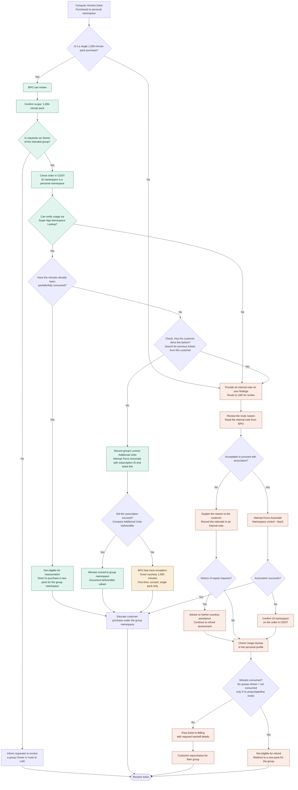

## Adding additional compute minutes

From time to time, you may need to grant additional compute minutes to a namespace
*without* affecting the namespace's usual monthly quota.

<details>
<summary>Using GitLab.com ChatOps</summary>

View the <a href="/handbook/support/workflows/chatops/#setting-additional-minutes-quota-for-a-namespace">
Support ChatOps documentation</a> for more information.
</details>

<details>
<summary>CustomersDot Support Admin Tools</summary>

Use the CustomersDot Support Admin Tools / [Set extra CI minutes](/handbook/support/license-and-renewals/workflows/customersdot/support_tools#set-extra-ci-minutes) workflow.

</details>

## Adding storage

<details>
<summary>CustomersDot Support Admin Tools</summary>

Use the CustomersDot Support Admin Tools / [Set additional storage](/handbook/support/license-and-renewals/workflows/customersdot/support_tools#set-additional-storage) workflow.

</details>

Adding storage using this tool should be used as a temporary solution. Please create an [Internal Request / Repo size change](https://gitlab.com/gitlab-com/support/internal-requests/-/issues/new?issuable_template=Repo%2520Size%2520Limit%2520Change#) to remove the storage once a permanent solution is in place. Please verify the amount the namespace should have and the actual amount on the namespace before actually reverting the change.

### Process for authorising additional compute minutes for customers as an act of goodwill

- For an existing customer, Support is able to issue compute minutes as an act of goodwill in the following scenarios:
  - requests from Sales AE during procurement delays as [per the Channel Ops handbook](/handbook/sales/field-operations/channel-operations/partner-faq/#post-sale).
  - customer has encountered a product bug related to compute minutes
  - customer experienced an unplanned GitLab.com downtime.

- If the request falls outside of the examples above, any additional compute minutes should be paid for. If you are unsure, verify in
the [#support_leadership](https://gitlab.slack.com/archives/C01F9S37AKT) channel in Slack.

#### Requests from sales during procurement delays

- In the event that a customer is in the procurement process to purchase additional minutes, but are currently out of usable quota and blocked from working, their sales account manager may file an internal request for support team to add minutes
- the request should be for a reasonable amount to unblock the customer. Reasonable in this case will vary in amount based on customer usage. Reviewing their usage page and checking historic usage is a good way to gauge their needs.
- there must be an in-progress opportunity in SFDC

#### Customer impacted by product bug or unplanned downtime

- Confirm the bug or recent downtime event, referring to the [GitLab Status page](https://status.gitlab.com/) as necessary
- Document the issue or incident ID in the ticket
- Request from the customer a list of impacted projects, and:
  1. Post an internal note on the ticket denoting the number of compute minutes to be applied, using the following formula:
  - `Total compute minutes = Their current compute minutes + (2 x sum of compute minutes for all failed jobs)`
  1. **Determine if manager approval is needed:**
     - **Approval NOT required:** If the minute usage clearly results from a product issue outside the customer's control (e.g., confirmed bug, documented outage on the [GitLab Status page](https://status.gitlab.com/)), you may proceed and leave an internal note for reference.
     - **Approval required:** If the circumstances are unclear or the root cause is difficult to determine (e.g., possible customer misconfiguration, unclear if issue is product-related, or unusual usage patterns), request Manager Approval to `Restore Compute Minutes as an act of goodwill` in the [#support_leadership](https://gitlab.slack.com/archives/C01F9S37AKT) channel in Slack.
       - MANAGERS: Acknowledge in Slack and post approval via internal note in the ticket.
  1. Restore the compute minutes using the [CustomersDot Support Admin Tools / Set extra CI minutes](/handbook/support/license-and-renewals/workflows/customersdot/support_tools#set-extra-ci-minutes)
- This will provide recovery of the compute minutes lost, with an additional amount in recognition of the inconvenience caused to the customer.

- ([Example Ticket 1](https://gitlab.zendesk.com/agent/tickets/294974)
| [Example Ticket 2](https://gitlab.zendesk.com/agent/tickets/391109))

### Process for authorizing additional compute minutes for GitLab Trial customers

- All GitLab trial plans default to 400 minutes.  If a trial user reaches out to the support team requesting additional minutes, please refer them to their sales representative for further discussion.

- GitLab Sales team members may open an internal request for `Change Existing Trial Plan` to request quota increases. These requests are limited to the standard allotments of compute minutes for paid plans: 10,000 minutes for a Premium trial, and 50,000 minutes for an Ultimate trial.
  - Note: extra minutes are not automatically removed when the trial ends. The customer can use them until they are all used up.

- In any other cases, additional compute minutes or storage should be paid for. If you have any questions, ask in the `#support_leadership` Slack channel.

### Purchased compute minutes are not associated with customer's group

Customers will sometimes incorrectly purchase compute minutes for their personal namespace instead of a group namespace. Follow these instructions to verify their incorrect purchase and how to resolve the situation:



#### BPO "Fast Track" Process

This workflow is designed to cover a majority of incorrect compute minute purchase tickets, and provide the knowledge and tools to handle this by the BPO team without needing further assistance.

**Eligibility criteria for BPO fast-track:** This process applies only to a **first-time, unused, single 1,000-minute pack purchase**. Larger purchases, repeat requests, or partially consumed minutes must be routed to L&R for review.

1. **Confirm purchase scope:** Verify the purchase was for a single "pack" of 1,000 compute minutes.
   - This can be verified via reviewing the customer's DOT account, or reviewing the order.
   - If this was for a larger amount of minutes, route to L&R Support for review.
1. **Verify Owner membership:** Confirm that the requester has `Owner` level membership in the intended group namespace.
   - If they are not an Owner, inform them that we cannot proceed with reassociating the minutes and ask them to involve a group Owner, or route the ticket to L&R.
1. **Check usage in personal namespace:** Verify if the customer has used any of the purchased minutes.
   - Using the **GitLab Super App** -> *Namespace Lookup*, verify:
     - `Extra minutes` should be `1000`.
     - `Purchased minutes used` should be `0`.
   - **If the Super App check is unavailable** (pending [this MR](https://gitlab.com/gitlab-org/gitlab/-/merge_requests/247465)), route the ticket to L&R rather than assuming the minutes were unused.
   - If minutes have been partially or fully consumed, notify the customer that the minutes cannot be moved and direct them to purchase a new pack for the group namespace.
1. **Check for previous requests:** Search for previous tickets from this customer for similar requests. Repeated incorrect purchases should be routed to L&R to review further.
1. **Attempt Force Associate:**
   - Before proceeding, record the group namespace's current `Additional Units` value from the Super App.
   - Use the [Force Associate](/handbook/support/license-and-renewals/workflows/customersdot/support_tools/#force-associate) tool to apply the purchase to the customer's group namespace.
   - **Required inputs:** Subscription ID/name and Zendesk ticket link.
1. **Verify association result:** Check if the group namespace now has additional minutes associated.
   - Compare the `Additional Units` value before and after the Force Associate action.
   - Due to some unresolved technical bugs, it is possible that the minutes will not be present.
   - If the minutes have been updated, make an internal note documenting the before/after values, then notify the customer that future purchases should be made against their group namespace. Resolve the ticket.
1. **Courtesy minutes (BPO fast-track exception only):** If Force Associate fails, grant 1,000 compute minutes as a courtesy on the group namespace.
   - **This courtesy applies only to first-time, unused, single 1,000-minute pack purchases.** Larger or repeat requests must be routed to L&R.
   - Use the [Set extra CI minutes](/handbook/support/license-and-renewals/workflows/customersdot/support_tools/#set-extra-ci-minutes) tool.
   - **Important:** This tool sets a **total** value, not an increment. Calculate the new total as follows:
     1. Record the existing `Additional Units` value from the Super App.
     1. Add 1,000 to the existing value.
     1. Enter the new total in the tool.
   - Record via an internal note the **before** and **after** values of the group namespace's `Additional Units`.
1. **Educate and resolve:** Inform the customer that future purchases should be made under their group namespace. Resolve the ticket.

#### L&R Team Standard Process

To transfer compute minutes from a user's personal namespace to a group namespace, use the [CustomersDot Support Admin Tools / Namespace control (SaaS) / Force Associate](/handbook/support/license-and-renewals/workflows/customersdot/support_tools/#force-associate).

**Force Associate requirements:**

- **Required inputs:** Subscription ID/name and Zendesk ticket link.
- **Before proceeding:** Record the group's current `Additional Units` value from the Super App.
- **After completion:** Verify the group's `Additional Units` value has increased and document the before/after values.

**If the force association does not work**, you will need to request a refund for the customer. In this case:

- Confirm that the compute minutes *are* associated with the user's personal namespace by checking the "Gl namespace" of the [order in CDOT](https://customers.gitlab.com/admin/order).
- Verify that the compute minutes associated with the personal namespace have not been consumed. You can check this under Usage Quotas in the user's personal profile.
  - **Note:** If compute minutes are assigned to a personal namespace **with no project or pipeline**, no Usage Quotas will show. Only in this case can you conclude the minutes have not been consumed.
  - **If they have not been consumed**, inform the customer that they've selected their personal namespace instead of their group when they purchased the compute minutes and pass the ticket to the [billing team](/handbook/support/license-and-renewals/workflows/billing_contact_change_payments#refunds) to process the refund. The customer can then repurchase the compute minutes for their group.
  - **If they have been consumed**, the customer is not eligible for a refund. Inform the customer that they are already using the purchased compute minutes, and redirect the customer to purchase a new compute minutes pack corresponding to their group.

**Required handoff details for L&R/Billing:**

When routing a ticket to L&R or Billing, include the following information in an internal note:

- Invoice number or order/subscription ID
- Incorrect personal namespace (username or URL)
- Intended group namespace path
- Purchase quantity (number of minute packs)
- Owner verification result (is requester an Owner of the intended group?)
- Usage verification result (consumed or unused, and how verified)
- Previous ticket check result (first-time or repeat request)
- Routing reason (why this ticket requires L&R/Billing review)

### GitLab.com group is not visible during the purchase

- While purchasing the compute minutes, the billing page shows a drop-down menu to choose the namespace to be associated with the compute minutes. If the user is unable to view or choose the required group during the purchase, it is probable that the GitLab user is not an owner of that group.  Reply to the user stating that they need to either get their permissions updated to owner to be able to choose the group on the billing page, or request an existing owner of the group to purchase the compute minutes using their own customer portal account.

## Enable compute minutes

### Manual credit card validation for community contributors

Qualifying requirements:

1. Requester has [filed an internal request](https://support-super-form-gitlab-com-support-support-op-651f22e90ce6d7.gitlab.io/) or ZenDesk ticket to track request.
1. Request is approved or created by a [Developer Advocacy](/handbook/marketing/product-and-technical-marketing/developer-advocacy/#team-members-and-focus-areas) or [Developer Relations Engineering](/handbook/marketing/developer-relations/engineering/#team-members) team member.
1. GitLab.com admin account

Once verified, use the following steps:

1. Edit the user account `https://gitlab.com/admin/users/USERNAME/edit`.
1. Select the `Validate user account` checkbox.
1. Add an [Admin note](/handbook/support/workflows/admin_note/).
1. `Save changes`.

### Enabling compute minutes for sales assisted trials

The following process will remove the restrictions for using compute minutes for groups who are part of a sales assisted trial.

### Steps

#### Using CustomersDot Support Admin Tools

Use the [Bypassing credit card validation for pipeline execution via CustomersDot Support Admin Tools](/handbook/support/license-and-renewals/workflows/customersdot/support_tools#bypassing-credit-card-validation-for-pipeline-execution).

#### Using customerDot Console

From the customerDot Console run the following function:

##### For sales assisted Trials

```ruby
irb(main) enable_ci_minutes_trial('namespace')

=> "{\"status\":\"success\",\"message\":\"namespace members are now enabled to run compute minutes\"}"
```

### Handling failed credit card verifications

To use compute minutes on shared runners, customers might need to verify their identity. Some customers might need to use a credit card for that purpose. If a customer contacts Support to report that they received an error when they tried to use their credit card for verification, then you should follow the steps below. Please note that the verification process does not place any charge on the credit card. Instead uses a one-dollar authorization transaction.

1. Respond to the ticket by using the Zendesk Macro `Support::L&R::Credit Card Authorisation Failed'
1. If the customer comes back after 24 hours and confirms they are still unable to proceed, but they have verified their credit card works outside of GitLab.com, then refer them to Trust and Safety for further guidance. The Trust and Safety Team contact details can be found in the handbook: [Working with the GitLab Trust and Safety Team](/handbook/security/security-operations/trustandsafety/#working-with-gitlab-trust-and-safety-team).
