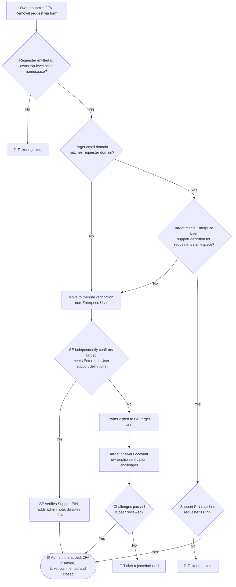

## Overview
 
This workflow focuses on disabling [Two-factor Authentication](https://docs.gitlab.com/ee/user/profile/account/two_factor_authentication.html) (2FA) on a GitLab.com account. The general principles for authenticating a request are covered in our [account verification workflow](account_verification.html).
 
2FA removal can only be completed if the workflow below is successful.
 
{}
**As of September 15, 2026, 2FA removal requests are automated for Enterprise Users.** Requests for users who do not meet the [Enterprise User support definition](/handbook/support/workflows/gitlab-com_overview/#enterprise-users) fall back to [manual verification](/handbook/support/workflows/2fa-removal/#manual-verification-fallback). See [2FA Removal Request Changes](https://support.gitlab.com/hc/en-us/articles/30223695893660-2FA-Removal-Request-Changes) for the announcement.

**A top-level group owner must submit the ticket on behalf of the locked-out user. GitLab Support no longer accepts 2FA removal tickets filed directly by the locked-out user.** This applies to all users, including non-Enterprise Users who fall back to manual verification. An owner must still file on their behalf; only the verification method (automated vs. manual challenge questions) differs.

{}
 
## Self-Service Recovery Options

Before a ticket is needed, users can review the [Recovery options and 2FA reset](https://docs.gitlab.com/user/profile/account/two_factor_authentication_troubleshooting/#recovery-options-and-2fa-reset) in the GitLab docs. These self-service options don't require Support involvement and apply regardless of the ownership requirement below.

If none of these apply, the user must ask their top-level group owner to file a 2FA removal ticket on their behalf, see below.

## Related topics
 
### GitLab Team Members
 
If the user is a GitLab team member, have them [contact IT Ops](/handbook/eta/corporate-it/end-user-services/).
 
## Conditions for GitLab.com users
 
A GitLab.com user must meet **one of** the following conditions to be eligible for a 2FA reset.
 
1. The user occupies a seat in a paid group on GitLab.com, or a top-level group owner intends to add the user to the paid group.
1. The user is claimed as an [Enterprise User](https://docs.gitlab.com/user/enterprise_user/#automatic-claims-of-enterprise-users).
1. The user meets the support definition for an [Enterprise User](/handbook/support/workflows/gitlab-com_overview/#enterprise-users).
1. The user is the primary billing contact on a current invoice for a GitLab.com purchase.
1. A GitLab team member (account managers, CSMs, or others) collaborates with the holder of this account in an account management project.
1. The user account is required for SSO access to Customers Portal to manage a paid subscription - see: [Conditions for 2FA Reset when account is used to access Customers Portal](#conditions-when-account-is-used-to-access-customers-portal).

More succinctly: they're paid, they use the account to pay, or we use the account to communicate with them.
 
*Note that GitLab Support does [not assist with 2FA resets for free users](https://about.gitlab.com/blog/gitlab-support-no-longer-processing-mfa-resets-for-free-users/)*
 
### Conditions when account is used to access Customers Portal
 
[Customers Portal](https://customers.gitlab.com) requires all customers to access through a [Linked GitLab Account](https://docs.gitlab.com/ee/subscriptions/customers_portal.html#link-a-gitlabcom-account).
 
The user is eligible and 2FA can be reset when **one** of following conditions are met:
 
1. The request is made by the primary billing contact on the latest invoice for a GitLab subscription.
1. The GitLab account is linked to the customers portal account for the primary billing contact on the latest invoice for a subscription purchase.

If an invoice can not be provided, suggest [sign in with legacy email/password](https://customers.gitlab.com/customers/sign_in?legacy=true), where an invoice can be downloaded.
 
## Keep the Ticket simple and accurate
 
Because 2FA removal tickets **are a matter of record**, the ticket must be simple, accurate, and tightly focused on the access issue.
**Do not allow the customer to bring up unrelated topics.**
 
## Disable 2FA: Automated Owner-Initiated Workflow
 
{}
**This workflow is automated for Enterprise Users only.** Zendesk performs the checks below without Support intervention when the target user meets the [Enterprise User support definition](/handbook/support/workflows/gitlab-com_overview/#enterprise-users). Requests targeting non-Enterprise Users cannot be resolved by automation and always fall back to [manual verification](/handbook/support/workflows/2fa-removal/#manual-verification-fallback).
{}
 
A top-level group owner submits the request using the target user's email address and a Support PIN generated from the owner's own account.
 
Zendesk automatically:
 
1. Confirms the requester is entitled to make the request and is an owner of a top-level paid namespace. If not, the ticket is rejected.
1. Confirms the target user's email domain matches the requester's domain (excluding known generic/free domains). If it doesn't match, the ticket moves to support for [manual verification](#manual-verification-fallback).
1. Confirms the target meets the [Enterprise User support definition](/handbook/support/workflows/gitlab-com_overview/#enterprise-users) relative to the requester's namespace. If the target does not meet this definition, the ticket moves to support for [manual verification](#manual-verification-fallback).
1. Verifies the provided Support PIN matches the one generated by the requesting owner. If it doesn't match, **the ticket is rejected**. There is no fallback or alternate verification at this step.
1. If all checks pass: adds an Admin Note to the target's account, disables 2FA, comments on the ticket, and closes it.

### Manual verification (fallback)

This path applies when the automated checks fail. Start here regardless of why automation failed.

1. **Step 1**: Check manually whether the target user meets the [Enterprise User support definition](/handbook/support/workflows/gitlab-com_overview/#enterprise-users).
1. **Step 2**: If yes, follow the [enterprise user workflow](#enterprise-user-workflow).
1. **Step 3**: If no, follow the [non-enterprise user workflow](/handbook/support/workflows/2fa-removal/#non-enterprise-user-workflow).

#### Enterprise user workflow

Use this when the target fails automation but you've independently confirmed they meet the Enterprise User support definition.

1. Verify the requesting owner's support pin via the admin: `https://gitlab.com/admin/users/USERNAME`. The support pin is provided by the owner in the ticket metadata.
1. Use the ZenDesk [GitLab Super App's](/handbook/eta/css/zendesk/apps/global#gitlab-super-app) `2FA Helper` to determine the [risk factor](https://internal.gitlab.com/handbook/support/#risk-factors-for-account-ownership-verification) (GitLab internal).
1. If verification is successful: Request that your decision be peer-reviewed by another member of the team through Slack #support_gitlab-com.
1. If the verification failed:
   1. Inform them that without verification we will not be able to take any action on the account. For 2FA, use the [Support::SaaS::GitLab.com::2FA::2FA Removal Verification - GitLab.com - Failed - Final Response](https://gitlab.com/gitlab-com/support/zendesk-global/macros/-/blob/master/active/Support/SaaS/GitLab.com/2FA/2FA%20Removal%20Verification%20-%20GitLab.com%20-%20Failed%20-%20Final%20Response.md?ref_type=heads) macro.
   1. Mark the ticket as "Solved".

#### Non-enterprise user workflow

Use this when the target does not meet the Enterprise User support definition, whether
determined automatically or by manual check.

1. Ask the requesting owner to CC the target user on the ticket and send the [Support::SaaS::GitLab.com::Account Ownership Verification - GitLab.com](https://gitlab.com/gitlab-com/support/zendesk-global/macros/-/blob/master/active/Support/SaaS/GitLab.com/Account%20Ownership%20Verification%20-%20GitLab.com.md?ref_type=heads) macro.
1. The target user must answer the [account ownership verification](account_verification.html) challenge questions directly. The owner cannot answer on the target's behalf.
1. Proceed per the standard [account verification workflow](/handbook/support/workflows/account_verification/#step-2-checking-challenge-answers). Include the Support PIN provided by the owner in the Zendesk form to calculate the risk factors.
1. If verification is successful: Request that your decision be peer-reviewed by another member of the team through Slack #support_gitlab-com.
1. If the user is unable to pass the available challenges:
   1. Inform them that without verification we will not be able to take any action on the account. For 2FA, use the [Support::SaaS::GitLab.com::2FA::2FA Removal Verification - GitLab.com - Failed - Final Response](https://gitlab.com/gitlab-com/support/zendesk-global/macros/-/blob/master/active/Support/SaaS/GitLab.com/2FA/2FA%20Removal%20Verification%20-%20GitLab.com%20-%20Failed%20-%20Final%20Response.md?ref_type=heads) macro.
   1. Mark the ticket as "Solved".
 
## Request for 2FA removal for a user who is a member of an Account Management Project
 
Support sometimes receives requests to reset 2FA for GitLab.com users who are members of Account Management Projects (as outlined in item 5 of the [Conditions for GitLab.com users](#conditions-for-gitlabcom-users)).
 
To proceed with 2FA reset in this scenario, verify the following:
 
1. Is the user a member or owner of any other GitLab.com groups?
   - If so, do not proceed with this method and instead refer to the above automated workflow.
   - If not, continue.
1. Locate the CSM, AM or ASE (for customers that have one) for the user's organization in Zendesk.
1. CC the located GitLab team member on the ticket and mention them in an internal note. This note should contain the following:
   - Ask them to reach out to their contact at the customer's organization to confirm that the request is valid.
   - Ask them to generate a Support PIN.
   - They should provide both the PIN and the confirmation that the request is valid in another internal note on the ticket.
   - Note: In addition to the above, feel free to reach out to the GitLab team member via Slack.
1. Once the GitLab team member above has vouched and the PIN is verified, sign into your admin account, add an [Admin Note](/handbook/support/workflows/admin_note.md), and disable 2FA.

## Flowchart
 
Below is a flowchart that can help you to visualize the automated workflow and its manual fallback above.
 

## Email One-Time Password (OTP) Enforcement

### Overview

On GitLab.com, MFA will be mandatory\* for users signing in with a password. Users can satisfy this requirement with App-based TOTP or WebAuthn devices. When neither is configured, users must enter a one-time password sent via email to complete sign-in.

\* GitLab Team Members can refer to the [Mandatory MFA Rollout Plan](https://gitlab.com/gitlab-org/gitlab/-/issues/566615) for timing.

**Intended Side effect:** Password authentication for APIs, Git over HTTPS and Container Registry will fail; an alternative authentication mechanism must be used instead:

- [Authenticate API requests with an access token](https://docs.gitlab.com/api/rest/authentication/#personal-project-and-group-access-tokens)
- [Clone using a token](https://docs.gitlab.com/topics/git/clone/#clone-using-a-token)
- [Authenticate with Container Registry](https://docs.gitlab.com/user/packages/container_registry/authenticate_with_container_registry/#authenticate-with-a-token)

### Self-Service Options

Users can send an Email OTP code to their primary email address or any verified [secondary email address](https://docs.gitlab.com/user/profile/#add-emails-to-your-user-profile) they have configured on their account.

### Support Intervention for Paid accounts

See the Email One-Time Passwords (Email OTP) development guide's
[section on logging](https://docs.gitlab.com/development/email_one_time_passwords/)
to assist when triaging and debugging issues raised by Email OTP.

#### Lost Email Accounts

If a user has lost access to their email address(es) and cannot receive their Email OTP, follow the [Lost Email Account workflow](/handbook/support/workflows/lost_emails/).

#### Support Intervention for missing Email OTP code emails

If a user has access to their email address(es) but is not receiving the Email OTP codes, follow the steps in [Checking Mailgun logs](/handbook/support/workflows/confirmation_emails/#checking-mailgun-logs) and [How to see or resend emails in Mailgun](/handbook/support/workflows/confirmation_emails/#how-to-see-or-resend-emails-in-mailgun).

#### Investigating blocked API endpoints

Support can use ElasticSearch logs to find which endpoints and/or user(s) are attempting to use password authentication on now-blocked API endpoints.

##### Workflow

1. Verify the user meets [eligibility conditions](#conditions-for-gitlabcom-users)
1. Complete identity verification using the [account verification matrix](/handbook/support/workflows/account_verification.md#account-verification-matrix)
1. Gather the customer's top level path(s) and/or username(s)
1. Visit https://log.gprd.gitlab.net/ and search the `pubsub-rails-inf-gprd-*` index, or use the below searches:
   - View Git over HTTPs operations with password authentication for projects in a customer's namespace - [link](https://log.gprd.gitlab.net/app/r/s/mRCq0)
      - Replace `json.path`'s value with the customer's namespace, such as `/gitlab-org/*`.
   - View Git over HTTPs operations with password authentication for a single user - [link](https://log.gprd.gitlab.net/app/r/s/XPMwu)
      - Replace `json.username`'s value with the username you wish to check for.
   - View all password authentication events for a single user - [link](https://log.gprd.gitlab.net/app/r/s/ZKEYX)
      - Replace `json.username`'s value with the username you wish to check for.
1. Increase the search window's lookback period if required.

See also <https://docs.gitlab.com/development/email_one_time_passwords/#password-api-authentication-failures>.

#### Support Intervention for Delaying Email OTP

Support can delay Email OTP enforcement for paid users when we receive the request from a top-level namespace owner.

##### Delay enforcement for enterprise users

To delay email OTP enforcement for **enterprise users**, the request must originate from an enterprise owner of the top-level namespace. Refer to the [account ownership verification eligibility matrix](/handbook/support/workflows/account_verification/#account-verification-matrix) to check eligibility for each request. This also applies to users who meet [support's definition for enterprise users](/handbook/support/workflows/gitlab-com_overview/#enterprise-users).

##### Delay enforcement for non-enterprise users

To delay email OTP enforcement for **paid (non-enterprise) users**, the request must originate from a top-level namespace owner **targeting a single user**, but account ownership verification answers must be submitted by the target user as per the [account ownership verification eligibility matrix](/handbook/support/workflows/account_verification/#account-verification-matrix).

> One user per ticket. Communication is direct from the target user who must be CC’d on ticket.

Potential scenarios where enforcement delay may be requested:

- API endpoints are blocked by the Email OTP requirement (see above) and they need time to switch to alternative authentication.
- A customer requests an organization-wide delay for migration planning.

##### Workflow

1. Verify the requestor is eligible to request the changes based on the [account ownership verification eligibility matrix](/handbook/support/workflows/account_verification.md#account-verification-matrix)
2. Complete account ownership verification by issuing the [challenge questions](/handbook/support/workflows/account_verification/#step-1-sending-challenges)
3. Request peer review in #support_gitlab-com
4. Determine delay duration - 1 to 90 days is acceptable.
5. Collect user ID(s) based on request type:
   - **Enterprise owner targeting enterprise users**: Collect all user IDs. Ensure these IDs all belong to the paid account and they are enterprise users (or meet [support's definition](/handbook/support/workflows/gitlab-com_overview/#enterprise-users)). Ensure all target users already had `email_otp_required_after` set. A GitLab.com admin can check this by visiting `/admin/users/<username>` and checking for the `Email OTP` field.
   - **Top-level group owner targeting non-enterprise users**: We can only delay enforcement for one target user. Collect the target user's ID and ensure it belongs to the paid account. Ensure the target user already had `email_otp_required_after` set. A GitLab.com admin can check this by visiting `/admin/users/<username>` and checking for the `Email OTP` field.
6. For a small number of users, use the GitLab Admin area:
   1. In Admin > Users, click "Edit" on each user
   2. Scroll to the "Access" section and locate "Email OTP"
   3. Use the datepicker to select a date reflecting the chosen delay. (Note: a blank date may be overriden as part of account security logic).
   4. Add an [Admin Note](/handbook/support/workflows/admin_note.md) on the account describing the change e.g. `<date> | Email OTP required set to <value> | <ticket link>`
   5. Click save
   6. Check the updated `Email OTP` field. The UI reflects the saved value, respecting validation rules, for example:
      1. Cannot be `nil` if MFA is mandatory (`Gitlab::CurrentSettings.require_minimum_email_based_otp_for_users_with_passwords?`) and user lacks alternative MFA
      2. Cannot be present if the user has MFA enabled AND is part of a namespace/top-level group that enforces 2FA
7. For a large number of users, file a [console escalation internal request](https://gitlab.com/gitlab-com/support/internal-requests/-/issues/new?description_template=GitLab.com%20Console%20Escalation%20%28Read-write%29) to set `email_otp_required_after` to the agreed future date for all applicable users.

<!--template sourced from https://gitlab.com/gitlab-org/gitlab/-/blob/master/.gitlab/issue_templates/Default.md-->
