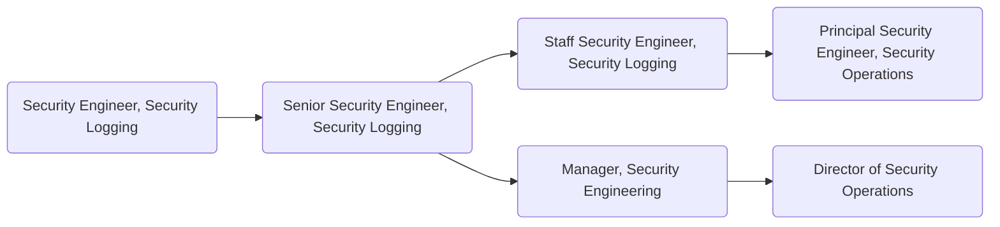

The [Security Logging team](/handbook/security/security-operations/security-logging/) is part of GitLab's [Security Operations](/handbook/security/security-operations/) sub-department. Engineers own GitLab's SIEM platform and security log ingestion infrastructure, ensuring comprehensive logging coverage to protect the company and its customers. They work closely with the [Security Incident Response Team (SIRT)](/handbook/security/security-operations/sirt/) and share findings proactively.

## Responsibilities

- Be part of the architectural direction, administration, maintenance, documentation, and oversight of the Security information and event management [[SIEM](https://en.wikipedia.org/wiki/Security_information_and_event_management)] solution
- Create and maintain integrations and solutions for log collection, aggregation, indexing, search, and alerting
- Manage implementation, enhancement, and adoption of the solutions built by the team into operations
- Utilize the log ingestion platform for security analytics and identification of tactics, techniques, and patterns of attackers
- Conduct incident response investigations
- Collect and review security logs from all systems (Cloud Providers, GitLab, OS, G-Suite, OKTA, IDS, etc.)
- Ensure compliance with internal policies, standards, and regulatory requirements
- Contribute to the creation of runbooks
- Own and maintain the [Security Logging Standard](/handbook/security/policies_and_standards/security-logging-standard/) that defines GitLab's requirements for security logging, monitoring, and alerting
- Coordinate and execute product-log onboarding, including structured event schemas and ECS normalization
- Maintain a library of logging profiles supporting security operations workflows
- Support internal and external audit processes through data extraction and reporting from the SIEM
- Partner with GRC teams to ensure logging infrastructure meets compliance and regulatory requirements

## Requirements

- Ability to use GitLab
- Good written and verbal communication skills
- Experience working in site-reliability engineering, cloud security, system engineering, or similar positions
- Experience with Google Cloud Platform (preferred) or Amazon Web Services
- Substantial knowledge of the Linux operating system
- Experience with one or more programming languages (Python and either Ruby, Go, or PHP)
- Demonstrated experience with running systems at scale
- Proficiency to communicate over a text-based medium (Slack, GitLab Issues, Email) and can succinctly document technical details
- Share our [values](/handbook/values/), and work in accordance with those values

## Levels

### Security Engineer, Security Logging (Intermediate)

This position reports to the [Manager, Security Engineering](#manager-security-engineering).

#### Security Engineer, Security Logging (Intermediate) Job Level

The Security Engineer, Security Logging is outlined in the [Job Levels](https://docs.google.com/spreadsheets/d/1kcDb-A2uwchPtTNSJON65BdqS9P0KQmNz0fbNMZMt_M/edit?gid=819074618#gid=819074618) resource.

#### Security Engineer, Security Logging (Intermediate) Responsibilities

- Includes responsibilities listed [here](#responsibilities)

#### Security Engineer, Security Logging (Intermediate) Requirements

- Includes requirements listed [here](#requirements)

### Senior Security Engineer, Security Logging

This position reports to the [Manager, Security Engineering](#manager-security-engineering).

#### Senior Security Engineer, Security Logging Job Level

The Senior Security Engineer, Security Logging is outlined in the [Job Levels](https://docs.google.com/spreadsheets/d/1kcDb-A2uwchPtTNSJON65BdqS9P0KQmNz0fbNMZMt_M/edit?gid=819074618#gid=819074618) resource.

#### Senior Security Engineer, Security Logging Responsibilities

- Includes responsibilities listed [here](#responsibilities)
- Create and provide oversight for rule creation to generate actionable security alerts
- Be a subject-matter expert (SME) of at least one technical area impacting the security of the product
- Identify inconsistencies in logs and work with development, infrastructure, and security teams to standardize them
- Assist on root cause analysis (RCA) and security incident reviews
- Guarantee the availability and recoverability of the SIEM ecosystem
- Assist on actions to mitigate any threats based on findings
- Mentor other members of the Security team
- Ownership and delivery on complex projects

#### Senior Security Engineer, Security Logging Requirements

- Includes requirements listed [here](#requirements)
- Experience working with incident response
- Experience with logging systems and log analysis
- Experience using and administrating SIEM and log analysis platforms such as Elastic (preferred), Splunk, BigQuery, etc.
- Experience with orchestration technologies such as Chef, Puppet, or Ansible
- Experience with infrastructure-as-code
- Working experience with Kubernetes and Docker
- Capability to build working relationships with key stakeholders

### Staff Security Engineer, Security Logging

This position reports to the [Manager, Security Engineering](#manager-security-engineering).

#### Staff Security Engineer, Security Logging Job Level

The Staff Security Engineer, Security Logging is outlined in the [Job Levels](https://docs.google.com/spreadsheets/d/1kcDb-A2uwchPtTNSJON65BdqS9P0KQmNz0fbNMZMt_M/edit?gid=819074618#gid=819074618) resource.

#### Staff Security Engineer, Security Logging Responsibilities

- Includes senior responsibilities listed [here](#senior-security-engineer-security-logging-responsibilities)
- Lead the design, evaluation, implementation, and deployment of new security technologies
- Identify new, and ensure availability of existing GitLab.com data sources and logs used by various GitLab Security teams
- Have significant ownership in and evangelize security training with development teams
- Solid understanding and interest in recognized information security related standards and analysis frameworks (MITRE ATT&CK, Kill Chain, NIST Incident Response, etc.)
- Develop, evangelize, and monitor the adoption of sound security practices
- Develop new, and review/update existing security-related configurations of GitLab's infrastructure

#### Staff Security Engineer, Security Logging Requirements

- Includes requirements listed [here](#senior-security-engineer-security-logging-requirements)
- Deep expertise with Elastic or equivalent enterprise SIEM platforms; experience with platform migrations and cost optimization
- Experience with secure network design, firewalls, authentication, and authorization systems
- Deep technical knowledge of systems in a multi-tenant, cloud environment
- Profound knowledge of the Linux operating system and common OS monitoring practices
- Excellent written and verbal communication skills

### Manager, Security Engineering

This position reports to the [Director of Security Operations](/job-description-library/security/security-leadership/#director-security).

#### Manager, Security Engineering Job Level

The Manager, Security Engineering is outlined in the [Job Levels](https://docs.google.com/spreadsheets/d/1kcDb-A2uwchPtTNSJON65BdqS9P0KQmNz0fbNMZMt_M/edit?gid=819074618#gid=819074618) resource.

#### Manager, Security Engineering Responsibilities

- Hire a world-class team of security engineers to work on their team
- Help their team grow their skills and experience
- Provide input on security logging architecture, tooling, and strategy
- Hold regular 1:1s with all members of their team
- Create a sense of psychological safety on their team
- Be your team's role model in terms of positive thinking, de-escalating conflict, and taking time off
- Identify the need to, and drive the implementation of security-related technical and process improvements
- Author project plans for security logging initiatives
- Draft and successfully deliver on quarterly OKRs
- Train team members to screen candidates and conduct engineering interviews
- Build collaborative partnerships with Legal, Infrastructure, GRC, Development, and Product departments

#### Manager, Security Engineering Requirements

- Proven track record as an experienced member of security engineering or security operations teams — either as an Individual Contributor or as a Manager
- Experience leading security or security-focused engineering teams
- Experience working at a SaaS or product company
- Excellent written and verbal communication skills, especially experience with executive-level communications
- Capability to make concrete progress in the face of ambiguity and imperfect knowledge
- Robust understanding of SIEM platforms, log management, and the current global threat landscape
- First-hand experience with major cloud providers — GCP, AWS, or Azure
- Alignment with Manager responsibilities as outlined in [Leadership at GitLab](/handbook/company/structure/#management-group)

## Performance Indicators

- Support the organisation by [ensuring that the Security Engineer On-Call meets SLAs](/handbook/security/performance-indicators/).

### Career Ladder

## Hiring Process

Candidates for this position can expect the hiring process to follow the order below. Please keep in mind that candidates can be declined from the position at any stage of the process.

- Qualified candidates will be invited to schedule a 30-minute [screening call](/handbook/hiring/candidate-faq/#screening-call) with one of our Global Recruiters.
- Then, candidates will be invited to schedule a 50-minute interview with the team hiring manager.
- Candidates will be invited to schedule 2 separate 50-minute interviews with Security Logging team peers.
- Candidates will then be invited to schedule an interview with the VP of Security Operations.
- Successful candidates will subsequently be made an offer via email.

Additional details about our process can be found on our [hiring page](/handbook/hiring/).
